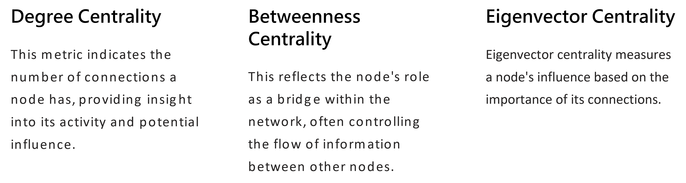
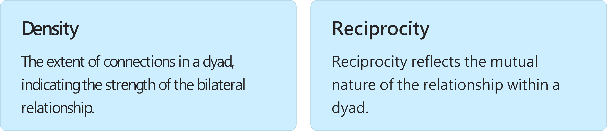
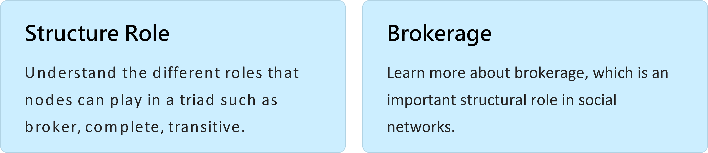
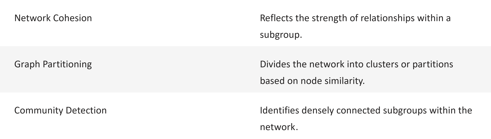
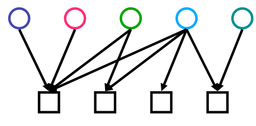

<!-- _class: lead -->

# Big Data and Society
**國企 Wen-Bin Chuang**
**2026-02-14**

---
## What is Social Network

A social network is a structure composed of a set of actors, some of which are connected by a set of one or more relations. SNA work at describing underlying patterns of social structure, explaining the impact of such patterns in behavior and attitudes. 社會網路是由⼀組 ⾏動者組成的結構，其中⼀些 ⾏動者通過⼀組或多組關係連接在⼀起。SNA 致⼒於描述社會結構的基本模式，解釋這種模式對⾏為和態度的影響。

SNA看關係-- 雙元關係, 三元關係, ⼩集團關係, 特定節點關係, 整個網絡

----

---

#### Build a Network

The rapid construction of a `network` implies the ability to quickly identify and foster relationships that can contribute to the growth and effectiveness of social connectivity. 

Building a robust network often involves engaging with key influencers, participating in relevant conversations, and providing value to others. 

---

#### Network Visualization

Visualizing networks is a method to graphically represent the various elements of a network and the connections between them. It helps to succinctly convey the complexities of social interactions and can be invaluable for `recognizing patterns`, `identifying clusters` or `communities`, and facilitating the understanding of large-scale structures.

---

#### Vertex Characteristics

The vertices or nodes of a network represent individual actors within the network, and they can have numerous characteristics. Their attributes could include the number of `connections` they have (`degree`), their ability to bring disparate nodes together (`betweenness`), and their overall influence within the network (`centrality`).

---

#### Actor Prominence: power, influence, visibility, or prestige

`Actor prominence` within a social network can be determined through various `centrality` measures such as `degree centrality`, `closeness centrality`, `betweenness centrality`, and `Eigenvector centrality`, and so on. Each of these measures gives a different perspective on an actor's position and influence within the network.

An actor’s power, `influence`, visibility, or prestige can shape the flow and spread of information within a network. These metrics are not only essential for theoretical study but also have practical implications in fields like marketing and urban planning.

---

---

#### Network Relation

In social network analysis, the term `network relation` refers to the type of connection between nodes within the network. The nature of these relations can be diverse, ranging from friendships, kinship, and professional ties to communication channels or data exchange routes.

Understanding the relationships within a network can provide crucial insights into its structure and functionality, impacting the diffusion of information and the spread of social phenomena.

---

##### Dyads 雙元關係: Density and Reciprocity

Dyads are the simplest possible social networks consisting of just two nodes and their mutual relationship. The study of dyads involves assessing aspects such as density and reciprocity, which can lead to understanding the bilateral dynamics in a network.

---

###### Triad Relation 三元關係: Structure Role and Brokerage

---

#### Network Segmentation

Segmenting a network involves identifying and categorizing distinct groups or communities within the network. This process can help understand how groups are formed, how they interact with one another, and can reveal the underlying structure of the network.

---

#### Affiliation Networks

Affiliation networks are a specific form of social network where the connections between actors are not based on direct interactions but rather on shared attributes or affiliations. The primary actors, or nodes, might consist of individuals, but they are linked together through common membership in groups, events, or organizations.

---

## Why Python!!!

#### 社會科學需要大數據

資料導入、資料規整、資料處理、**視覺化**、建模以及形成可重複性報告，整個分析和探索過程都在一個程式碼中完成，這種方式對訓練我們的資料思維非常有説明。

---
事實上在（新文科建設、跨學科研究）背景下，社會科學（包括心理學、語言學）都在交叉融合，都需要用**數學**和**電腦**。所以，我們不是學大數據的，但需要用大數據。一個更殘酷的現實，**用大數據的，往往不是學統計的**。

---

## Getting Started with COLAB

To start working with `Colab` we first need to log in to your Google account, then go to this link 

https://colab.research.google.com. Since Colab implicitly uses Google Drive for storing your notebooks, ensure that you are logged in to your Google Drive account before proceeding further.

---

## Executing Code

<small>

To execute the code, click on the arrow on the left side of the code window.

</small>

---

## Clearing Output

We can clear the output anytime by clicking the icon on the left side of the output display.

---

## Adding New Cells

To add more code to your notebook, select the following menu options.

---

## Changing Runtime Environment:

Click the **Runtime** dropdown menu. Select **Change runtime type**. Select python2 or 3 from **Runtime type** dropdown menu.</small>

--------------------

# What is GPU?

`Graphics processing unit` (GPU), a specialized processor originally designed to accelerate graphics rendering. GPUs can process many pieces of data simultaneously, making them useful for machine learning, video editing, and gaming applications. Select ‘Change runtime type’. Colab provides the Tesla K80 GPU. 

