<!-- _class: lead -->


# Big Data and Society
**Class01 Introduction**

**國企 Wen-Bin Chuang**
**2026-02-14**


---
## What is Social Network

A social network is a structure composed of a set of actors, some of which are connected by a set of one or more relations. SNA **work at** describing underlying patterns of social structure, explaining the impact of such patterns in behavior and attitudes.  社會網路是由一組 行動者組成的結構，其中一些 行動者 通過一組或多組關係連接在一起。SNA **致力於**描述社會結構的基本模式，解釋這種模式對行為和態度的影響。Social network analysis focuses on the relations among actors, and not individual actors and their attributes.社會網路分析的重點是參與者之間的關係，而不是單個參與者及其屬性。

---
**Network**s are complex systems of inter-connected components. **Graph**s are mathematical representations of these systems ⇒ Formal language we use to talk about networks. A graph metaphor for studying the relationships/interactions among a group of people.

SNA看關係--  雙元關係, 三元關係, 小集團關係, 特定節點關係, 整個網絡


--------

## Network Theory

A network is a collection of objects where some pairs of these objects are connected by links.  A graph can be defined as `$G(V,E)$` where V denotes the set of all **vertices** of G and E denotes the set of **edges** of G.  If an edge exists between u and v then they are considered as `neighbours`. The number of vertices in G is denoted as $|V|$and the number of edges is denoted by $|E|$.

----
A social network contains individuals as **nodes** and **links** representing the **relationship** between these individuals. The study of social networks is of particular interest because it focuses on this abstract view of human relationships which gives insight into various kinds of social relationships ranging all the way from bargaining power to psychological health.


People/Components: vertices/nodes------ V
Relationship/Inter-connections: edges  --------- E
System: network, graph ----G(V,E)

-----

##### What are networks?

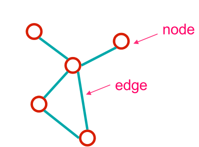


-----

##### Network = Graph?

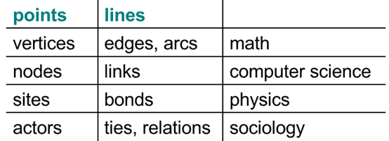

---

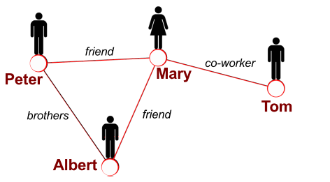


-----------------

## Types of graphs

##### 1. Undirected vs Directed:

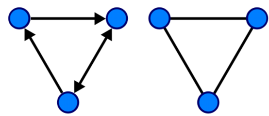

-------

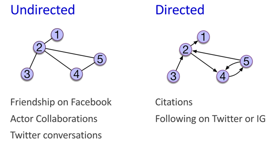

- Directed graphs often called **digraphs**

------

##### 2. Unweighted vs Weighted

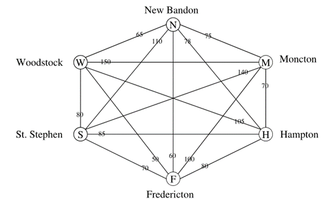


-----

##### 3. Bipartite graphs

A graph $G (V , E )$ is called **bipartite** when ⇒ V can be partitioned in two disjoint sets, say V1 and V2; and ⇒ Each edge in E has one endpoint in V1, the other in V2

Useful to represent e.g., membership or affiliation networks
⇒ Nodes in V1 could be people, nodes in V2 clubs
⇒ Induced graph G (V1, E1) joins members of same club

---

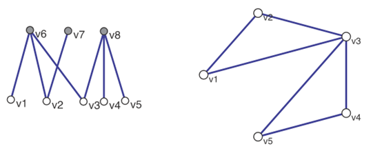


-----

## Representation of Graphs

Networks, because of their need to depict more complicated relational structures, require a different type of data storage. That is, in rectangular data structures the fundamental piece of information is an attribute (column) of a case (row). When analyzing a set of relationships, we will generally use one of two different **data structure**s: **edge lists or adjacency matrices**.

-----

There are **three** basic data formats that can be used to describe networks: **adjacency matrix**, **edge list**, and **adjacency list**. Each format has its pros and cons. There are other variations on these (e.g., The **biadjacency matrix** for bipartite networks).

- Adjacency matrix

- Edge list
- Adjacency list (not common)

---

An **adjacency matrix** is a matrix in which the rows and columns represent different nodes that defined as a matrix where 1 indicates the respective column actor and row actor should be tied and 0 indicates that they are not tied. 鄰接矩陣 一個很重要的作用是得到每個節點指定標籤的鄰居數量，比如，客戶流失的標籤為1，如果我們想得到每個節點的客戶的流失客戶鄰居的數量，就可以用鄰接矩陣乘這個標籤的向量. 

If the network is **non-directed**, then the adjacency matrix would be symmetric around the diagonal. 

------

##### Adjacency matrix: undirected graph

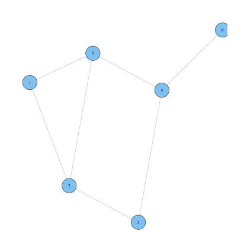

------

##### Adjacency matrix: Aij = 1 iff there is a link between i and j.

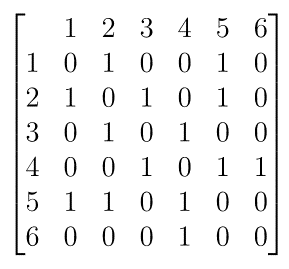


---

The adjacency is symmetric for undirected graph.

```R
# pip install networkx matplotlib
import networkx as nx
import matplotlib.pyplot as plt
import numpy as np  

# Generate adjacency matrix
adjm_u = [
    [0, 1, 0, 0, 1, 0],
    [1, 0, 1, 0, 1, 0],
    [0, 1, 0, 1, 0, 0],
    [0, 0, 1, 0, 1, 1],
    [1, 1, 0, 1, 0, 0],
    [0, 0, 0, 1, 0, 0]
]

# Convert to NumPy array
adjm_u = np.array(adjm_u)

# Create undirected graph from adjacency matrix
G = nx.from_numpy_array(adjm_u)

# Visualize the graph

nx.draw(G, pos, with_labels=True, node_color='lightblue',
        node_size=500, font_size=16, font_weight='bold',
        edge_color='gray', linewidths=1, font_color='black')
plt.title("Graph Visualization")
plt.show()

# Visualize graph
plt.figure(figsize=(8, 6))
pos = nx.spring_layout(G, seed=42)
nx.draw(G, pos, with_labels=True, node_color='lightblue', node_size=500, font_size=12)
plt.title("Graph Visualization")
plt.show()
# font_weight='bold',edge_color='gray', linewidths=1, font_color='black'
```

------

##### Adjacency matrix: directed graph

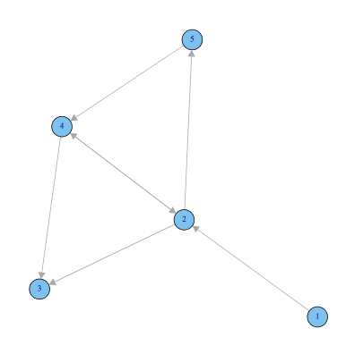

-------

##### Adjacency matrix: Aij = 1 iff there is a link from j to i

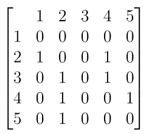

-------

Note the direction of the edge runs from the second index to the first: counter-intuitive, but convenient mathematically!

```R
import networkx as nx
import matplotlib.pyplot as plt
import numpy as np

# Define directed adjacency matrix
adjm_d = [
    [0, 1, 0, 0, 0],
    [0, 0, 1, 1, 1],
    [0, 0, 0, 0, 0],
    [0, 1, 1, 0, 0],
    [0, 0, 0, 1, 0]
]

# Convert to NumPy array (required for from_numpy_array)
adjm_d = np.array(adjm_d)

# Create a *directed* graph
G = nx.from_numpy_array(adjm_d, create_using=nx.DiGraph)

# Optional: Relabel nodes to start from 1 (like R igraph often does)
G = nx.relabel_nodes(G, {i: i+1 for i in range(len(adjm_d))})

# Visualize the directed graph
plt.figure(figsize=(8, 6))
pos = nx.spring_layout(G, seed=42)  # seed for reproducibility
nx.draw(G, pos,
        with_labels=True,
        node_color='lightblue',
        node_size=600,
        font_size=16,
        font_weight='bold',
        edge_color='gray',
        arrows=True,           # Show arrows for directed edges
        arrowsize=20,          # Make arrows more visible
        connectionstyle='arc3,rad=0.1'  # Curved edges to avoid overlap
       )
plt.title("Directed Graph Visualization")
plt.show()
```
---

```py
# pip install networkx matplotlib numpy
import networkx as nx
import matplotlib.pyplot as plt

# Directed adjacency matrix
adj_matrix = [
    [0, 1, 0, 0, 0],
    [0, 0, 1, 1, 1],
    [0, 0, 0, 0, 0],
    [0, 1, 1, 0, 0],
    [0, 0, 0, 1, 0]
]
# Convert to NumPy array (required for from_numpy_array)
adjm_d = np.array(adj_matrix)

# Create directed graph
G = nx.from_numpy_array(adjm_d, create_using=nx.DiGraph)

# Relabel nodes to start from 1
G = nx.relabel_nodes(G, {i: i+1 for i in range(len(adj_matrix))})

# Visualize graph
plt.figure(figsize=(8, 6))
pos = nx.spring_layout(G, seed=42)  # seed for reproducibility
nx.draw(G, pos, with_labels=True, node_color='lightblue', node_size=500, font_size=12, arrows=True)
plt.show()
# arrows=True, Show arrows for directed edges
# arrowsize=20,          # Make arrows more visible
# connectionstyle='arc3,rad=0.1'  # Curved edges to avoid overlap
```


```R
import networkx as nx
import matplotlib.pyplot as plt

# Create a directed graph
G = nx.DiGraph()

# Add directed edges: A→B→C→A
G.add_edges_from([
    ('A', 'B'),
    ('B', 'C'),
    ('C', 'A')
])

# Add directed edges: D→E→F→D
G.add_edges_from([
    ('D', 'E'),
    ('E', 'F'),
    ('F', 'D')
])

# Add bidirectional edge: A↔F (A→F and F→A)
G.add_edges_from([
    ('A', 'F'),
    ('F', 'A')
])

# --- Optional: Visualize the graph ---
plt.figure(figsize=(10, 8))
pos = nx.spring_layout(G, seed=42)  # positions for nodes

# Draw nodes and edges
nx.draw(G, pos,
        with_labels=True,
        node_color='lightblue',
        node_size=800,
        font_size=16,
        font_weight='bold',
        edge_color='gray',
        arrows=True,
        arrowsize=20,
        connectionstyle='arc3,rad=0.1'  # helps curved edges for bidirectional
       )

plt.title("Directed Graph: Two Cycles + Bidirectional Edge")
plt.show()

# --- Convert to adjacency matrix (as in R's as_adjacency_matrix(..., sparse=F)) ---
# Get node ordering (alphabetical to match R's default)
nodes = sorted(G.nodes())  # ['A', 'B', 'C', 'D', 'E', 'F']
adj_matrix = nx.to_numpy_array(G, nodelist=nodes)

print("Adjacency Matrix (dense, as in R):")
print(adj_matrix)
```

-------

#### Edge Lists

An **edge list** is a two-column list of the two nodes that are connected in a network.  For each edge, we just list who that edge is incident on. Edge lists are therefore **two column matrices** that directly tell the computer which actors are tied for each edge. 

---

In the case of a **directed network**, the actors in **column A are the sources of edges**, and the actors in **column B receive the tie**. In an **undirected network**, the order of the vertices don’t matter. If the tie goes in both directions in a directed network, then make sure that you reverse the order of the names on the next row down. 

  For **weighted** networks, you may have a `third column` that indicates the edge weight. You can get the edgelist of any igraph object as well:

----------

##### Edge list: undirected graph

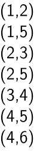

-------

```py
# pip install networkx matplotlib
import networkx as nx
import matplotlib.pyplot as plt

# Edge list (1-based node indices)
edge_list = [
    (1, 2),
    (1, 5),
    (2, 3),
    (2, 5),
    (3, 4),
    (4, 5),
    (4, 6)
]

# Create undirected graph
G = nx.Graph(edge_list)

# Visualize graph
plt.figure(figsize=(8, 6))
pos = nx.spring_layout(G, seed=42)  # seed for reproducibility
nx.draw(G, pos,with_labels=True, node_color='lightblue', node_size=500, font_size=12)
plt.show()
# edge_color='gray',linewidths=1,font_color='black'
```


--------

##### Edge list: directed graph

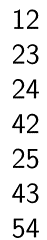

-------

```py
# pip install networkx matplotlib
import networkx as nx
import matplotlib.pyplot as plt

# Directed edge list (1-based node indices)
edge_list = [
    (1, 2),  # 1 → 2
    (2, 3),  # 2 → 3
    (2, 4),  # 2 → 4
    (4, 2),  # 4 → 2
    (2, 5),  # 2 → 5
    (4, 3),  # 4 → 3
    (5, 4)   # 5 → 4
]

# Create directed graph
G = nx.DiGraph(edge_list)

# Visualize graph
plt.figure(figsize=(8, 6))
pos = nx.spring_layout(G, seed=42)  # seed for reproducibility
nx.draw(G, pos, with_labels=True, node_color='lightblue', node_size=500, font_size=12, arrows=True)
plt.show()
# arrows=True, Show arrows for directed edges
# arrowsize=20,          # Make arrows more visible
# connectionstyle='arc3,rad=0.1'  # Curved edges to avoid overlap
```


--------

#### Weighted networks

In an **unweighted** adjacency matrix, the edges (i.e., lines) are represented by 0 or 1, with 1 indicating that these two nodes are connected. If two nodes are connected, they are said to be adjacent (hence the name, adjacency matrix). 

In a **weighted** adjacency matrix, however, you can have different values, indicating different edge qualities (or tie strengths). Let’s start by loading the igraph package and setting up a network.

---

```py
# pip install networkx matplotlib
import networkx as nx
import matplotlib.pyplot as plt

# Create undirected graph with edge list
edges = [
    ('A', 'B'), ('B', 'C'), ('C', 'A'),  # Triangle 1
    ('D', 'E'), ('E', 'F'), ('F', 'D'),  # Triangle 2
    ('A', 'F')                           # Connecting edge
]
G = nx.Graph(edges)

# Assign node colors
node_colors = {'A': 'white', 'B': 'red', 'C': 'green', 'D': 'blue', 'E': 'orange', 'F': 'yellow'}

# Assign edge weights (1 to 7)
weights = list(range(1, 8))  # [1, 2, 3, 4, 5, 6, 7]
for i, edge in enumerate(G.edges()):
    G[edge[0]][edge[1]]['weight'] = weights[i]

# Assign rainbow edge colors
edge_colors = plt.cm.rainbow([i/7 for i in range(7)])

# Visualize graph
plt.figure(figsize=(10, 8))
pos = nx.spring_layout(G, seed=42)
nx.draw(G, pos,
        with_labels=True,
        node_color=[node_colors[node] for node in G.nodes()],
        node_size=500,
        font_size=12,
        edge_color=edge_colors,
        width=[G[u][v]['weight'] * 0.8 for u, v in G.edges()], #<---
        edgecolors='black')
plt.axis('off')
plt.show()
```


------

Let’s go back to our original network, g. Let’s say that the **edge widths** that we added represent edge **weights or values**.  Weighted graphs are graphs where the edges are associated with a certain weight.
$$
\left[\begin{array}{cccc}
0 & 1 & 2.5 & 13.74\\
1 & 0 & 0.3 & 100\\
2.5 & 0.3 & 0 & 0\\
12.55 & 70 & 0 & 0
\end{array}\right]
$$

-------

Then, the adjacency matrix for this network can be shown by using the attr= argument within the function to call the adjacency matrix to specify the edge weights: 

```{r}
import networkx as nx
import numpy as np

# Assuming 'G' is your existing networkx.Graph() object with 'weight' edge attributes
# (as created in the previous conversion)

# Get node ordering (to match R's default alphabetical order)
nodes = sorted(G.nodes())  # ['A', 'B', 'C', 'D', 'E', 'F']

# Generate weighted adjacency matrix
adj_matrix_weighted = nx.to_numpy_array(G, nodelist=nodes, weight='weight')

print("Weighted Adjacency Matrix (attr='weight'):")
print(adj_matrix_weighted)
```

You can display the edge weights as an edgelist as well. In fact, igraph has a convenient function that will display all of the edge attributes together as a **data frame**:

```{r}
import pandas as pd

# Convert graph edges + attributes to DataFrame
edge_list = []

for u, v, data in G.edges(data=True):
    row = {'from': u, 'to': v}
    row.update(data)  # Add all edge attributes (weight, color, etc.)
    edge_list.append(row)

df_edges = pd.DataFrame(edge_list)

print(df_edges)
```

------


## From Data to Networks

#### 1. Creating a network from your edge list

Creating a network from an `edgelist` that you have created is easy. For example, `import the .csv file` called “sample_edgelist.csv”.


```{r}
import pandas as pd

# Read edge list from CSV
edge_df = pd.read_csv("sample_edgelist.csv")

# Display it (equivalent to just typing `edge.dat` in R)
print(edge_df)

import networkx as nx
G = nx.from_pandas_edgelist(edge_df, source='from', target='to')

# If you have edge attributes (e.g., 'weight', 'color'), they are auto-included!
# Example: access weight of edge A-B
# G['A']['B']['weight']
```

---

This data frame has three columns: the first two columns represent the edge list (source and target nodes), and the third column is an edge attribute we called "weight". If the data is organized this way, we can use the **networkx.from_pandas_edgelist()** function to create a network, which we will call G.


In NetworkX, you can achieve the same using **networkx.from_pandas_edgelist()** for `edges` and **networkx.set_node_attributes()** for `vertex attributes`. The edge data frame is mapped directly to edges, and node attributes can be added separately.

```py
# pip install pandas networkx matplotlib
import pandas as pd
import networkx as nx
import matplotlib.pyplot as plt

# Read edge list from CSV (expects 'from', 'to', 'weight' columns)
edge_df = pd.read_csv("sample_edgelist.csv") # V1, V2, weight

# Create undirected graph from DataFrame
G = nx.from_pandas_edgelist(edge_df, source='V1', target='V2', edge_attr=True)

# Print graph info
print("Nodes:", G.nodes)
print("Edges:", G.edges(data=True))

# Visualize graph
nx.draw(G,
        with_labels=True,
        node_color='lightblue',
        node_size=500,
        font_size=12,
        edge_color='gray',
        width=[G[u][v]['weight'] for u, v in G.edges()])
plt.axis('off')
plt.show()
```


--------

#### 2. Creating a network from your adjacency matrix

Importing an adjacency matrix written in `.csv format` is just slightly trickier. This is because you want R to know that first row is a header AND the first row contains row names rather than data. You also want R to recognize this data as a “matrix object”. We can use just one line of code to do this:

```{r}
import pandas as pd
import numpy as np

# Read CSV with first column as index (row names) and headers (column names)
df = pd.read_csv("sample_adjmatrix.csv", header=0, index_col=0)

# Convert to NumPy matrix (equivalent to R's as.matrix())
am = df.values  # or np.array(df) — same thing

# Display the matrix
print("Adjacency Matrix (NumPy array):")
print(am)

# Optional: Show row and column labels (like R's dimnames)
print("\nRow labels (nodes):", df.index.tolist())
print("Column labels (nodes):", df.columns.tolist())

# Get node labels (should be same for rows and columns in adjacency matrix)
nodes = df.index.tolist()

# Create graph from adjacency matrix
import networkx as nx
G = nx.from_numpy_array(am, create_using=nx.Graph)  # or DiGraph

# Relabel nodes from 0,1,2... to A,B,C...
G = nx.relabel_nodes(G, dict(enumerate(nodes)))

print("Graph nodes:", list(G.nodes))
print("Graph edges:", list(G.edges))
```

------

Note that this is a **weighted** adjacency matrix. Note that we are going to add an argument **weighted=T** to indicate that the edges have **weights**. We’ll call this new network g, which will overwrite the previous graph object of the same name.

```{r}
import pandas as pd
import numpy as np
import networkx as nx
import matplotlib.pyplot as plt

# Step 1: Read adjacency matrix from CSV (as in your previous step)
df = pd.read_csv("sample_adjmatrix.csv", header=0, index_col=0)
am = df.values
nodes = df.index.tolist()  # preserve node labels (A, B, C, ...)

# Step 2: Create UNDIRECTED, WEIGHTED graph from adjacency matrix
# (equivalent to graph_from_adjacency_matrix(..., mode="undirected", weighted=T))
G = nx.from_numpy_array(am, create_using=nx.Graph)  # undirected
G = nx.relabel_nodes(G, dict(enumerate(nodes)))     # restore node names: 0→A, 1→B, etc.

# Step 3: Plot with edge widths proportional to weight
# (equivalent to plot(g, edge.width=E(g)$weight))

plt.figure(figsize=(10, 8))
pos = nx.spring_layout(G, seed=42)  # fixed layout for reproducibility

# Extract edge weights for plotting
edge_weights = [G[u][v]['weight'] for u, v in G.edges()]

nx.draw(G, pos,
        with_labels=True,
        node_color='lightblue',
        node_size=700,
        font_size=16,
        font_weight='bold',
        edge_color='gray',
        width=edge_weights,    # edge.width equivalent
        alpha=0.9)

plt.title("Graph from Adjacency Matrix — Edge Width = Weight")
plt.axis('off')
plt.show()
```

----

## Our First Network!

`Nextworkx` is a powerful Python library for creating, manipulating, and visualizing graphs and networks. It supports undirected and directed graphs, along with attributes for nodes and edges (e.g., weights, colors).

- Generating networks
  - Undirected graph and Directed graph, weight graph 

- Adding Attributes with nx.set_node_attributes() or nx.set_edge_attributes()
  - Node attributes and Edge attributes

- Visualizing networks
  - basic, Common Parameters for Customization, Layouts


NetworkX allows you to create different types of graphs:

- **Undirected Graph**: Edges have no direction.
- **Directed Graph (DiGraph)**: Edges have direction.
- **Weighted Graph**: Edges (or nodes) carry a numeric weight or label.

###### Undirected Graph

```py
import networkx as nx
import numpy as np

G_undir = nx.Graph()
G_undir.add_edges_from([(1, 2), (2, 3), (3, 4)])

# Adjacency matrix (symmetric, 0/1)
A = np.array([
    [0, 1, 1],
    [1, 0, 0],
    [1, 0, 0]
])

G = nx.from_numpy_array(A, create_using=nx.Graph())  # Undirected
print("Nodes:", G.nodes())
print("Edges:", G.edges())
# Output: Nodes: [0, 1, 2], Edges: [(0, 1), (0, 2)]
```

###### Directed Graph

```py
import networkx as nx
import numpy as np

G_dir = nx.DiGraph()
G_dir.add_edges_from([(1, 2), (2, 3), (3, 4)])  # 1 → 2 → 3 → 4

A = np.array([
    [0, 1, 0],
    [0, 0, 1],
    [1, 0, 0]
])  # 0 → 1 → 2 → 0

G = nx.from_numpy_array(A, create_using=nx.DiGraph())  # Directed
print("Edges:", G.edges())
# Output: Edges: [(0, 1), (1, 2), (2, 0)]
```


```py
import networkx as nx
import numpy as np

G_weighted = nx.Graph()
G_weighted.add_edge(1, 2, weight=0.5)
G_weighted.add_edge(2, 3, weight=1.2)

# Or add multiple weighted edges:
edges_with_weights = [(1, 2, 0.5), (2, 3, 1.2), (3, 4, 0.8)]
G_weighted.add_weighted_edges_from(edges_with_weights)

# Weighted undirected
A = np.array([
    [0, 2.5, 0],
    [2.5, 0, 1.0],
    [0, 1.0, 0]
])
G = nx.from_numpy_array(A, create_using=nx.Graph())
# Edge weights are automatically added as 'weight' attribute
print("Edge weights:")
for u, v, data in G.edges(data=True):
    print(f"({u}, {v}): weight = {data['weight']}")
    

weighted_edges = [(0, 1, 3.0), (1, 2, 4.5), (2, 0, 2.1)]
G = nx.Graph()
G.add_weighted_edges_from(weighted_edges)

print("Weighted edges:")
for u, v, w in G.edges(data='weight'):
    print(f"({u}, {v}): {w}")
    
G = nx.DiGraph()
G.add_weighted_edges_from(weighted_edges)  
```


###### **Adding Attributes**

NetworkX supports **node attributes** (e.g., age, type) and **edge attributes** (e.g., distance, relationship type). Use `set_node_attributes()` and `set_edge_attributes()`.

```py
# Create graph
G = nx.Graph()
G.add_nodes_from([1, 2, 3])

# Assign attributes (e.g., 'color' and 'size')
node_attrs = {
    1: {"color": "red", "size": 100},
    2: {"color": "blue", "size": 200},
    3: {"color": "green", "size": 150}
}
nx.set_node_attributes(G, node_attrs)

# Access
print(G.nodes[1])  # {'color': 'red', 'size': 100}
```

```py
G.add_edges_from([(1, 2), (2, 3)])

# Assign edge attributes (e.g., 'relationship' or 'strength')
edge_attrs = {
    (1, 2): {"relationship": "friend", "strength": 0.9},
    (2, 3): {"relationship": "colleague", "strength": 0.6}
}
nx.set_edge_attributes(G, edge_attrs)

# Access
print(G[1][2])  # {'relationship': 'friend', 'strength': 0.9}
```


Visualizing Networks
NetworkX uses Matplotlib for basic visualization. You can customize appearance and layout.

```py
import matplotlib.pyplot as plt

G = nx.karate_club_graph()  # Built-in example graph
nx.draw(G, with_labels=True)
plt.show()
```

###### Common Customization Parameters

You can control node color, size, edge width, labels, etc.:

```py
nx.draw(
    G,
    with_labels=True,
    node_color='lightblue',
    node_size=500,
    edge_color='gray',
    font_size=10,
    font_weight='bold'
)
plt.show()
```


### Layouts

NetworkX provides several layout algorithms to position nodes:


| Layout                      | Purpose                             |
| --------------------------- | ----------------------------------- |
| `nx.spring_layout(G)`       | Force-directed (default in `draw`)  |
| `nx.circular_layout(G)`     | Nodes on a circle                   |
| `nx.random_layout(G)`       | Random positions                    |
| `nx.shell_layout(G)`        | Nodes in concentric circles         |
| `nx.kamada_kawai_layout(G)` | Energy-based, good for small graphs |
| `nx.planar_layout(G)`       | For planar graphs                   |

```py
pos = nx.spring_layout(G)  # Compute positions once
nx.draw(G, pos=pos, with_labels=True, node_color='orange')
plt.show()
```


-------

#### Creating a Network Using nx.Graph()

- **Undirected graph**: Use `nx.Graph()` — edges have no direction.
  - Edges have no direction — a connection between A and B implies the relationship is bidirectional and mutual (A ↔ B).
    - Relationships are inherently reciprocal or symmetric.
    - Common examples:
      - Friendship on Facebook (mutual friends required).
      - Co-authorship in academic papers (both authors share credit equally).
      - Family ties or kinship networks.
      - Physical proximity or co-attendance (e.g., people who work in the same office).
    - **Advantages**: Simpler metrics (e.g., degree centrality is straightforward), easier visualization, and suitable for detecting clusters/communities where mutuality matters.

```{r}
import networkx as nx
import matplotlib.pyplot as plt

# Create undirected graph
G = nx.Graph()

# Add edges equivalent to: ~A-B-C-A, D-E-F-D, A-F
G.add_edges_from([
    ('A', 'B'),
    ('B', 'C'),
    ('C', 'A'),  # Triangle A-B-C-A
    ('D', 'E'),
    ('E', 'F'),
    ('F', 'D'),  # Triangle D-E-F-D
    ('A', 'F')   # Connecting edge A-F
])

# Plot the graph
plt.figure(figsize=(10, 8))
pos = nx.spring_layout(G, seed=42)  # Fixed layout for reproducibility

nx.draw(G, pos,
        with_labels=True,
        node_color='lightblue',
        node_size=800,
        font_size=16,
        font_weight='bold',
        edge_color='gray',
        linewidths=1.5,
        alpha=0.95)

plt.title("Graph: Two Triangles + Connecting Edge (A-F)")
plt.axis('off')
plt.show()
```

-------

**Directed graph**: Use `nx.DiGraph()` — edges have direction (arrows).

- Edges have direction (arrows) — a connection from A to B (A → B) does not imply B → A.

  - Relationships are asymmetric or one-directional.
  - Common examples:
    - Followers on X (Twitter) or Instagram (A follows B, but B may not follow back).
    - Mentions, replies, or retweets in online discussions.
    - Advice-seeking or information flow (e.g., "who do employees go to for advice?").
    - Power dynamics or influence (e.g., citations in academia, one-way endorsements).
    - Email or message sending (sender → receiver).
  - **Advantages**: Captures reciprocity (mutual edges), in/out-degree (popularity vs. activity), prestige (in-degree centrality), and hierarchical structures.

  ```py
  ```

  

---

#### Key Decision Guidelines

- Ask: **Is the relationship naturally mutual?** → Use undirected.
- Ask: **Does direction matter (e.g., influence, flow, asymmetry)?** → Use directed.

- A **weighted graph** in NetworkX includes edges with a **weight attribute**, typically specified in the edge list or DataFrame. A bipartite graph includes nodes with a bipartite attribute (e.g., 0 or 1 to indicate the node set), which can be set using nx.set_node_attributes().


---

- In NetworkX, G.nodes(data=True) or **nx.get_node_attributes()** reveals a node attribute called name. The attribute is a vertex attribute and is a character (string) type, as opposed to numeric or integer types.

- The edges of the graph, totaling 7, are listed when inspecting G.edges() or G.edges(data=True) if edge attributes are included..


```{r}
import networkx as nx

# Recreate your graph
G = nx.Graph()
G.add_edges_from([
    ('A', 'B'),
    ('B', 'C'),
    ('C', 'A'),
    ('D', 'E'),
    ('E', 'F'),
    ('F', 'D'),
    ('A', 'F')
])

# V(g) equivalent
print("V(g) → Nodes:", list(G.nodes()))

# E(g) equivalent
print("E(g) → Edges:", list(G.edges()))

# gorder(g) equivalent
print("gorder(g) → Number of nodes:", G.number_of_nodes())

# gsize(g) equivalent
print("gsize(g) → Number of edges:", G.number_of_edges())
```

-------

##### Add and Visualizing attributes

- Vertices and edges can have attributes in NetworkX.
  - **nx.set_node_attributes(**): Adds attributes to nodes (vertices).
  - **nx.set_edge_attributes()**: Adds attributes to edges.

---

At the heart of a network-based representation of data from a complex system will be a graph. But frequently there are other relevant data to be had as well. From a network-centric perspective, these other data can be thought of as attributes, i.e., values associated with the corresponding network graph. Vertex attributes are variables indexed by vertices, and may be of `discrete` or `continuous` type.

------

Here we can **add vertex attributes**. We currently only have one vertex attribute, called ‘name’:

```py
# pip install networkx matplotlib
import networkx as nx
import matplotlib.pyplot as plt

# Create undirected graph
G = nx.Graph([
    ('A', 'B'), ('B', 'C'), ('C', 'A'),
    ('D', 'E'), ('E', 'F'), ('F', 'D'), ('A', 'F')
])

# Assign node colors
node_colors = {'A': 'white', 'B': 'red', 'C': 'green', 'D': 'blue', 'E': 'orange', 'F': 'yellow'}
nx.set_node_attributes(G, node_colors, 'color')

# Print node attributes
print("Nodes and attributes:")
for node, data in G.nodes(data=True):
    print(f"{node}: {data}")

# Visualize graph
nx.draw(G,
        with_labels=True,
        node_color=[node_colors[node] for node in G.nodes()],
        node_size=500,
        font_size=12,
        edge_color='gray',
        edgecolors='black')
plt.axis('off')
plt.show()
```

--------

Edge attributes similarly are values of variables indexed by adjacent vertex pairs and, as with vertex attributes, they may be of both discrete or continuous type. Examples of discrete edge attributes include whether one gene regulates another in an inhibitory or excitatory fashion, or whether two countries have a friendly or antagonistic political relationship. 

---

We can also **add edge attributes**. Let’s try adding two edge attributes, width and color.

```py
# pip install networkx matplotlib numpy
import networkx as nx
import matplotlib.pyplot as plt
import numpy as np

# Create undirected graph
G = nx.Graph([
    ('A', 'B'), ('B', 'C'), ('C', 'A'),
    ('D', 'E'), ('E', 'F'), ('F', 'D'), ('A', 'F')
])

# Assign edge widths and colors
for i, (u, v) in enumerate(G.edges, 1):
    G[u][v]['width'] = i  # Widths 1 to 7
    G[u][v]['color'] = plt.cm.rainbow(i / 7)  # Rainbow colors

# Print edge attributes
print("Edge attributes:")
for u, v, data in G.edges(data=True):
    print(f"({u}, {v}): {data}")

# Visualize graph
nx.draw(G,
        with_labels=True,
        node_color='lightblue',
        node_size=500,
        font_size=12,
        
        edge_color=[G[u][v]['color'] for u, v in G.edges()],
        width=[G[u][v]['width'] for u, v in G.edges()])
plt.axis('off')
plt.show()
```


-----

#### Case: Zachary 空手道俱樂部網路

```R
import networkx as nx
import matplotlib.pyplot as plt
import numpy as np

# Load Zachary's Karate Club graph (built into networkx)
G = nx.karate_club_graph()

#  Set seed for reproducible layout (equivalent to set.seed + layout.kamada.kawai)
np.random.seed(4321)
pos = nx.kamada_kawai_layout(G)  # equivalent to layout.kamada.kawai()

#  Node attributes: Extract 'club' (equivalent to Faction in R igraph)
# In nx.karate_club_graph(), node attribute 'club' = 'Mr. Hi' or 'Officer'
clubs = nx.get_node_attributes(G, 'club')

# Create 'Faction' mapping: 1 for 'Mr. Hi', 2 for 'Officer'
faction = {node: 1 if club == 'Mr. Hi' else 2 for node, club in clubs.items()}
nx.set_node_attributes(G, faction, 'Faction')

#  V(karate)$label <- sub("Actor","",V(karate)$name)
# In networkx, nodes are numbered 0-33. We'll use "1", "2", ... as labels
labels = {i: str(i+1) for i in G.nodes()}  # "Actor 1" → "1", etc.
nx.set_node_attributes(G, labels, 'label')

#  Node color by faction
node_color_map = {1: 'red', 2: 'dodgerblue'}
node_colors = [node_color_map[faction[node]] for node in G.nodes()]

#  Node shape: circle for members, rectangle for leaders
# In matplotlib, shapes are set per plot, not per node — so we split plotting
# Leaders: Mr. Hi = node 0, Officer (John A) = node 33
leaders = [0, 33]
non_leaders = [n for n in G.nodes() if n not in leaders]

#  Node size: proportional to strength (weighted degree)
# If no weight, assume weight=1
strength = {node: sum(data.get('weight', 1) for _, _, data in G.edges(node, data=True))
            for node in G.nodes()}
max_strength = max(strength.values())
# Scale size: V(karate)$size <- 4 * sqrt(strength)
node_sizes = [4 * np.sqrt(strength[node]) * 30 for node in G.nodes()]  # *30 for visibility in matplotlib

#  Label distance: if size >= 10 → 0, else 0.75
# Matplotlib doesn't support per-node label distance directly.
# Workaround: manually adjust position for small nodes
label_pos = {}
for node in G.nodes():
    s = 4 * np.sqrt(strength[node])
    offset = 0.0 if s >= 10 else 0.15  # adjust offset as needed
    x, y = pos[node]
    # Shift label slightly outward — simple heuristic
    if offset > 0:
        # Move label away from center of graph
        center = np.array([0, 0])  # kamada_kawai tends to center at origin
        direction = np.array([x, y]) - center
        if np.linalg.norm(direction) > 0:
            direction = direction / np.linalg.norm(direction)
        label_pos[node] = (x + direction[0]*offset, y + direction[1]*offset)
    else:
        label_pos[node] = (x, y)

#  Edge styling: width by weight, color by faction group
edge_widths = [data.get('weight', 1) for _, _, data in G.edges(data=True)]

# Precompute faction per node
factions = nx.get_node_attributes(G, 'Faction')

# Edge colors: within F1=pink, within F2=lightblue, between=yellow
edge_colors = []
for u, v in G.edges():
    fu = factions[u]
    fv = factions[v]
    if fu == 1 and fv == 1:
        edge_colors.append('pink')
    elif fu == 2 and fv == 2:
        edge_colors.append('lightblue')
    else:
        edge_colors.append('yellow')

#  PLOT 1: Unstyled (equivalent to first plot in R)
plt.figure(figsize=(8, 6))
nx.draw(G, pos, with_labels=True, node_size=100, node_color='lightgray', font_size=8)
plt.title("Unstyled Karate Club Graph")
plt.axis('off')
plt.show()

#  PLOT 2: Fully Styled (equivalent to final plot in R)
plt.figure(figsize=(12, 10))

# Draw edges
nx.draw_networkx_edges(G, pos, width=edge_widths, edge_color=edge_colors, alpha=0.8)

# Draw non-leader nodes (circles)
nx.draw_networkx_nodes(G, pos, nodelist=non_leaders,
                       node_color=[node_colors[i] for i in non_leaders],
                       node_size=[node_sizes[i] for i in non_leaders],
                       node_shape='o')  # circle

# Draw leader nodes (squares)
nx.draw_networkx_nodes(G, pos, nodelist=leaders,
                       node_color=[node_colors[i] for i in leaders],
                       node_size=[node_sizes[i] for i in leaders],
                       node_shape='s')  # square

# Draw labels with adjusted positions
nx.draw_networkx_labels(G, label_pos, labels=labels, font_size=10, font_weight='bold')

plt.title("Styled Karate Club Graph — Leaders, Factions, Strength, Edge Types")
plt.axis('off')
plt.tight_layout()
plt.show()
```


