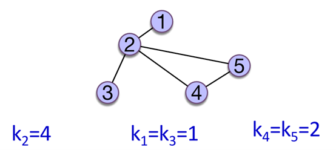
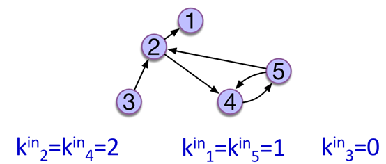
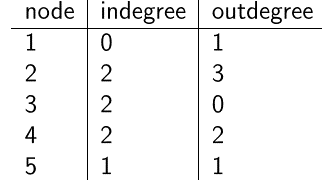
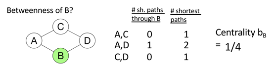
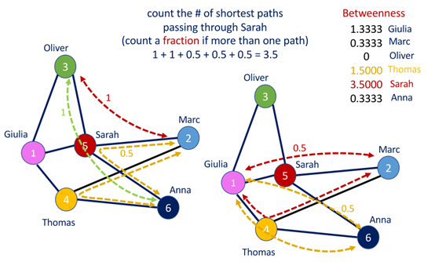
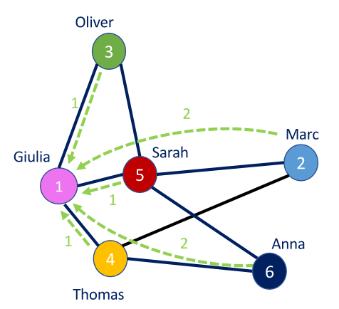
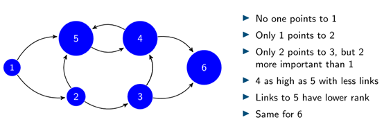
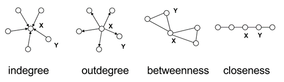
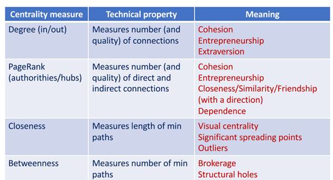

<!-- _class: lead -->

# Big Data and Society

**Class 02 Network Characteristic I**

**國企 Wen-Bin Chuang**
**2026-02-14**


---
## Basic for (whole) Graph-Level

**Size**
<style scoped>
section {
    font-size: 25px;
}
</style>

- The `number of nodes` in a network 網路中的節點數量. 
- For a single node, the number of `dyads` = 0 對於單個節點，**二元組** (`dyads`) 的數量 = 0. 
  - For two nodes, only one dyad exists; Three nodes have 3 dyads 對於兩個節點，僅存在一個二元組；三個節點有 3 個二元組; 
  - Four nodes have 6 dyads; for 10 nodes, 45 dyads must be analyzed; and so on 四個節點有 6 個二元組；對於 10 個節點，必須分析 45 個二元組；依此類推。. 

- For networks with hundreds of thousands of nodes, `dyadic ties` become astronomical, requiring fast algorithms and efficient statistical processing. 對於擁有數十萬個節點的網路，**二元連接** (`dyadic ties`) 的數量會變得天文數字般巨大，因此需要快速的演算法和高效的統計處理。

---
**Density**
<style scoped>
section {
    font-size: 25px;
}
</style>

- The extent to which a network’s `dyadic ties` materialize among the maximum `possible` number of dyads指網路的**二元連接**實際存在的程度，相對於最大**可能**的二元組數量而言。.

  - Undirected graphs and directed networks 無向圖和有向網路

- Density ranges from 0.00 to 1.00, indicating two extreme situations: 0.00 means no one in the network is connected to anyone else; 1.00 means everyone is connected to everyone else. 密度範圍從 0.00 到 1.00，表示兩種極端情況：0.00 意味著網路中沒有任何人相互連接；1.00 意味著每個人都與其他所有人相連。

---
 **Centralization**.
<style scoped>
section {
    font-size: 25px;
}
</style>

- `Centralization`  differs  from  `centrality`**集中化** (`Centralization`) 不同於 **中心性** (`centrality`)。. 

- Degree centrality is a **nodel-level measure**, the extent a node is connected with other network nodes. 度中心性 (Degree centrality) 是一種**節點層面**的度量，衡量一個節點與網路中其他節點的連接程度。

- Centralization calculates the extent to `which the nodal degree centrality` differs among all nodes. 集中化計算的是所有節點的**節點度中心性**之間的差異程度。

---
<style scoped>
section {
    font-size: 25px;
}
</style>

- The  index  of  **network  degree  centralization**  ranges  between  0.00  and 1.00. **網路度集中化**指數範圍在 0.00 到 1.00 之間。
  - Degree centrality is 1 when one node has the highest possible centrality (N – 1) and all other nodes have degree centrality 1.  當一個節點擁有最高可能的中心性 (N – 1)，而所有其他節點的度中心性均為 1 時，度中心性為 1。
    - star graph 有一個中心star
  - If a network has nodes with the same number of degrees. the network’s degree centralization is 0.00. 如果一個網路中所有節點的度數相同，則該網路的度集中化為 0.00。
    - wheel graph 無中心點

- The closer that network degree centralization is to 1.00, the more uneven or hierarchical are the nodes’ degree centrality scores. 網路度集中化越接近 1.00，節點的度中心性得分就越不均勻或層級化。

---
<style scoped>
section {
    font-size: 25px;
}
</style>
**Size** measures the `magnitude of a network`衡量網路的**量級**；; Density shows `the level of saturation ` in a network, ranging from 0.00 (totally isolated  network)  to  1.00  (everybody  is  directly  connected  with  everybody else); **密度** (Density) 顯示網路的**飽和度** (`level of saturation`)，範圍從 0.00（完全孤立的網路）到 1.00（每個人都直接與其他所有人相連）

Centralization divulges the `inequality among nodes` in their **degree centralities**. Although 1.00 indicates the greatest `hierarchy or inequality` in degree  centralities,  0.00  denotes  an  `egalitarian  or  democratic`  structure. **集中化** (Centralization) 揭示節點間在**度中心性**上的**不平等性**。雖然 1.00 表示度中心性中最大的**層級或不平等**，但 0.00 則表示一種**平等或民主**的結構。


---
<style scoped>
section {
    font-size: 25px;
}
</style>
**Network size** is the **number of nodes** in a network. To find this, we use the `vcount() function`. We can also find the number of edges using `ecount()`. **網路規模**是網路中的**節點數量**。要找到這一點，我們使用 `vcount()` 函數。我們也可以使用 `ecount()` 找到邊的數量。

<style scoped>
  pre {
    max-height: 400px; /* Adjust height as needed */
    overflow-y: auto;
    font-size: 2.8rem; /* Optional: adjust font size to fit more lines */
  }
</style>
```py
import networkx as nx
import numpy as np
import matplotlib.pyplot as plt

# Create a directed graph from the adjacency matrix
adj = np.array([
    [0, 1, 0, 1],
    [0, 0, 0, 1],
    [1, 1, 0, 0],
    [0, 0, 1, 0]
])

# Create a directed graph from the adjacency matrix
G = nx.DiGraph(adj.T)  

# Network Size
n = G.number_of_nodes()  # Number of nodes
m = G.number_of_edges()  # Number of edges
print(f"Number of nodes: {n}")
print(f"Number of edges: {m}")
```
---
<style scoped>
section {
    font-size: 25px;
}
</style>
The **network density** is: density = [# edges that exist] / [# edges that are possible].  In an **undirected** network with **no loops**, the number of edges that are possible is exactly the number of `dyads` that exist in the network. The number of `dyads` is $\frac{n(n−1)}{2}$, where n = number of nodes. With this information, we can calculate the density with the following:  **網路密度**計算公式為：密度 = [存在的邊數] / [可能的邊數]。在一個**無向**且**無自環**的網路中，可能的邊數正好等於網路中存在的**二元組** (`dyads`) 數量。**二元組**的數量為 $\frac{n(n−1)}{2}$，其中 n = 節點數量。有了這些資訊，我們可以計算密度：

---
<style scoped>
  pre {
    max-height: 400px; /* Adjust height as needed */
    overflow-y: auto;
    font-size: 2.4rem; /* Optional: adjust font size to fit more lines */
  }
</style>
```py
# Network Density
dyads = n * (n - 1) / 2  # Number of possible directed edges
density = m / dyads
print(f"Network density (manual): {density}")

# NetworkX built-in density function
nx_density = nx.density(G)
print(f"Network density (NetworkX): {nx_density}")
```

-------------------------

## Vertex Characteristics
<style scoped>
section {
    font-size: 25px;
}
</style>
We can measure network properties at **the level of nodes (aka, ‘centrality measures’)** or at **the level of the network (aka, ‘global measures’)**. 我們可以在**節點層面**（即“中心性度量”）或**網路層面**（即“全域度量”）測量網路屬性。

That is, if we are interested in the **position** of nodes within a system, then you are measuring something at the **node-level**. 也就是說，如果我們感興趣的是節點在系統中的**位置**，那麼我們就是在**節點層面**進行測量。

Conversely, if you want to understand the **structure** of the system as a whole, you are measuring something at the **network-level**. 相反，如果我們想瞭解整個系統的**結構**，那麼我們就是在**網路層面**進行測量。


---
### Actor Prominence - Node Centrality
<style scoped>
section {
    font-size: 25px;
}
</style>

Which actors in a social network seem to hold the ‘reins of power’? "Who is the `most important` or central person in this network?" 在社會網路中，哪些行動者似乎掌握著“權力的韁繩”？“誰是這個網路中**最重要**或最中心的人？”
- There are many answers to this question, depending on what we mean by `importance`. 這個問題的答案有很多，取決於我們要定義的 `重要性` 是什麼。
  - How authoritative does a particular page in the World Wide Web seem to be considered? 某個頁面被認為有多權威？
  - The deletion of which genes in a gene regulatory network is likely to be lethal to the corresponding organism? 在基因調控網路中，刪除哪個基因可能導致相應生物體死亡？
  - How critical is a given router in an Internet network to the flow of traffic? 給定路由器對交通流的關鍵程度如何？
  
  Measures of centrality are designed to quantify such notions of `importance` and thereby facilitate the answering of such questions. 中心性度量旨在量化這種 `重要性` 的概念，從而有助於回答此類問題。

---
<style scoped>
section {
    font-size: 25px;
}
</style>

By examining the location of **individual network members**, we can assess the `prominence` of those members. An actor is prominent if the ties of the actor make that actor visible to the other members in the network. 通過檢查**個別網路成員**的位置，我們可以評估這些成員的**顯著性** (`prominence`)。如果一個行動者的連接使其在網路的其他成員面前可見，那麼該行動者就是顯著的。

  - We will cover a number of the most common ways to assess network member `prominence`. 我們將介紹幾種評估網路成員**顯著性**的最常用方法。
  - For `non-directed networks` we will look at `centrality`; where we view a central actor as one who is involved in many (direct or indirect) ties. 對於**無向網路**，我們將關注**中心性** (`centrality`)；我們將中心行動者視為參與了許多（直接或間接）連接的行動者。
  - For `directed networks`, prominence is usually referred to as `prestige`; a prestigious actor is one who is the object of extensive ties. 對於**有向網路**，顯著性通常被稱為**聲望** (`prestige`)；有聲望的行動者是大量連接指向的物件。

---
<style scoped>
section {
    font-size: 30px;
}
</style>
To identify the important and prominent entities in a network. Often node centrality reveals actors’ **power, influence, visibility, or prestige**. 為了識別網路中重要且顯著實體。通常，節點中心性揭示了行動者的**權力、影響力、可見性或聲望**
- To quantify node centrality, these fundamental measures are available:   
  - `Degree centrality`, **度中心性**
  - `Closeness centrality`,  **接近中心性**
  - `Betweenness centrality`, **介數中心性** 
  - `Eigenvector centrality.`**特徵向量中心性**

---

#### Degree Centrality 
<style scoped>
section {
    font-size: 25px;
}
</style>
-  **Degree centrality**, which examines the extent to which a specific node is connected with other nodes in the network.**度中心性**：考察特定節點與網路中其他節點的連接程度。
   - In an  **undirected** network, the degree centrality of node i is its row margin (or column margin). 在**無向**網路中，節點 i 的度中心性是其行邊緣和（或列邊緣和）。
   - Binary **directed** graphs and matrices, every node has two distinct degree centralities: one is **in-degree** centrality and **out-degree** centrality. 在二元**有向**圖和矩陣中，每個節點有兩個不同的度中心性：一個是**入度**中心性，另一個是**出度**中心性。

-  Prestige as the extent to which a social actor in a network “receives” and “serves as the object” of relations sent by others in the network.  Focus on the separting of sender  from  receiver,  or  source  from  target. **聲望** (Prestige) 指網路中的社會行動者“接收”並作為網路中其他人發送關係的“物件”的程度。重點在於區分發送者與接收者，或源與目標。

---

$$
C_D (n_i) =d(n_i)
$$

<style scoped>
section {
    font-size: 25px;
}
</style>
The simplest measure of centrality is that a node that has more direct ties is more prominent than nodes with fewer or no ties. It’s just **how many ties that a node has**. 最簡單的中心性。它只是**一個節點有多少聯繫**。

- The calculation for directed and undirected are kinda different but it has the same idea: how many nodes are connected to a node. 其中`有向`和`無向`的計算方法有點不同，但思路是一樣的：一個節點連接了多少個節點。

- Degree centrality is simply the **number of edges** connected to a given node. In a social network, this might mean the number of **friends** an individual has.

---



The sum of the degree sequence is twice the size of the graph. We can calculate degree centrality with a simple function:

---
<style scoped>
  pre {
    max-height: 400px; /* Adjust height as needed */
    overflow-y: auto;
    font-size: 2.8rem; /* Optional: adjust font size to fit more lines */
  }
</style>
```py
# Compute degree centrality (in-degree for directed graph)
degree_centrality = nx.in_degree_centrality(G)
print("Degree Centrality (In-Degree):", degree_centrality)

# Plot 1: Node size based on degree centrality
plt.figure(figsize=(8, 6))
vertex_size = [degree_centrality[node] * 1000 for node in G.nodes()]  
               # Scale for visibility
nx.draw(G,with_labels=False, node_color='gold',
    edge_color='slateblue', node_size=vertex_size, #<-----
    arrows=True, arrowsize=10
)
plt.title("Directed Graph (Node Size: Degree Centrality)")
plt.show()

# Plot 2: Node size based on degree centrality * 3
vertex_size = [degree_centrality[node] * 3 * 1000 for node in G.nodes()] 
               
# Plot 3: Node size based on degree centrality / max(degree centrality) * 20
max_degree = max(degree_centrality.values())
vertex_size = [degree_centrality[node] / max_degree * 20 * 100 for node in G.nodes()] 
```
<style scoped>
section {
    font-size: 25px;
}
</style>
- For comparison purpose, we can standardize the degree by dividing by the maximum possible value n − 1.

---
<style scoped>
section {
    font-size: 24px;
}
</style>
In **weighted** networks, we can also `node strength`, which is the `sum `of the weights of edges connected to the node. Let’s calculate node strength and plot the node sizes as proportional to these values. 在**加權**網路中，我們還可以計算**節點強度** (`node strength`)，即連接到該節點的邊的權重之**和**。我們可以計算節點強度並將節點大小繪製為與這些值成比例。

<style scoped>
  pre {
    max-height: 400px; /* Adjust height as needed */
    overflow-y: auto;
    font-size: 2.8rem; /* Optional: adjust font size to fit more lines */
  }
</style>
```py
import networkx as nx
import numpy as np
import matplotlib.pyplot as plt

# Create a weighted adjacency matrix
# Replacing 1s in the original matrix with sample weights
adj = np.array([
    [0.0, 0.5, 0.0, 1.2],  # Weights for edges (0->1, 0->3)
    [0.0, 0.0, 0.0, 0.8],  # Weight for edge (1->3)
    [1.5, 0.9, 0.0, 0.0],  # Weights for edges (2->0, 2->1)
    [0.0, 0.0, 0.7, 0.0]   # Weight for edge (3->2)
])

# Create a directed graph from the weighted adjacency matrix
G = nx.DiGraph(adj.T)  # Transpose to match igraph's graph.adjacency behavior

# Print edge weights for reference
edge_weights = {(u, v): data['weight'] for u, v, data in G.edges(data=True)}
print("Edge Weights:", edge_weights)

# Compute node strength (sum of in-edge weights for directed graph)
strength = {node: sum(data['weight'] for _, n, data in G.in_edges(node, data=True)) 
           for node in G.nodes()}
print("Node Strength (In-Degree Weights):", strength)

# Plot 1: Edge width based on target node's strength
plt.figure(figsize=(8, 6))
edge_width = [strength[v] * 2 for u, v in G.edges()]  # Scale for visibility
              
nx.draw(G, with_labels=False,node_color='gold',
    edge_color='slateblue',node_size=500, width=edge_width, #<----
    arrows=True, arrowsize=10
)
plt.title("Weighted Directed Graph (Edge Width: Target Node Strength)")
plt.show()

# Plot 2: Edge width based on target node's strength * 3
edge_width = [strength[v] * 3 * 2 for u, v in G.edges()]  # Scale for visibility

# Plot 3: Edge width based on target node's strength / max(strength) * 20
max_strength = max(strength.values())
edge_width = [strength[v] / max_strength * 20 for u, v in G.edges()]  
```

---
<style scoped>
section {
    font-size: 25px;
}
</style>
With `directed `data, however, it can be important to distinguish centrality based on `in-degree` from centrality based on `out-degree`. 然而，對於有向資料，區分基於內向度的中心性和基於外向度的中心性可能很重要。

- `Indegree` of node i: the number of nodes destined to i, while `Outdegree` of node i: the number of nodes originated at i. 

- If an actor receives many ties, they are often said to be `prominent`, or to have `high prestige`. That is, many other actors seek to direct ties to them, and this may indicate their importance. 如果一個行為體獲得了很多聯繫，那麼他們通常被認為是`出眾`的，或者說是`高聲望`的。也就是說，許多其他參與者都想與他們建立聯繫，這可能表明了他們的重要性。


---
<style scoped>
section {
    font-size: 25px;
}
</style>
- `In-degree` = importance as an **Authority**, while `Out-degree` = importance as a **Hub**  **入度** (`In-degree`) = 作為**權威** (`Authority`) 的重要性，而 **出度** (`Out-degree`) = 作為**樞紐** (`Hub`) 的重要性。
  
  - In www:
    - `Authorities` (quality as a content provider) **權威**（作為內容提供者的品質）
      
       nodes that contain useful information, or having a high number of edges pointing to them (e.g., course homepages) 包含有用資訊的節點，或擁有大量指向它們的邊的節點（例如：課程主頁）
    - `Hubs` (quality as an expert) **樞紐** (Hubs)（作為專家的品質）
      trustworthy nodes, or nodes that link to many authorities (e.g., course bulletin) 可信賴的節點，或連結到許多權威的節點（例如：課程公告板）。
---
<style scoped>
section {
    font-size: 27px;
}
</style>
- `High out-degree` are actors who are able to exchange with many others, or make many others aware of their views. Actors who display high out-degree centrality are often said to be `influential` actors. 高外延度是指能夠與許多人交流，或讓許多人瞭解其觀點的行為者。表現出高外度中心性的行為者通常被稱為*有影響力*的行為者。




---
<style scoped>
section {
    font-size: 25px;
}
</style>
We can see `centrality` as an attribute of individual actors as a consequence of their position. 我們可以將 "中心度 "視為個體行動者的屬性，是其地位的結果。




---

```py
# Degree calculations
degrees = dict(G.degree())  # Total degree (in + out for directed graph)
in_degrees = dict(G.in_degree())
out_degrees = dict(G.out_degree())
print(f"Total degrees: {degrees}")
print(f"In-degrees: {in_degrees}")
print(f"Out-degrees: {out_degrees}")
```

---
#### Betweenness Centrality

<style scoped>
section {
    font-size: 25px;
}
</style>

**Betweenness centrality** measures the extent to which node i is on the geodesic paths of all other pairs of nodes in a network.衡量節點 i 位於網路中所有其他節點對的測地路徑上的程度。

Betweenness centrality captures which nodes are important in the **flow** of the network. 介數中心性捕捉了哪些節點在網路**流** (`flow`) 中很重要。The measures the extent that a node sits ‘between’ pairs of other nodes in the network, such that a path between the other nodes has to go through that node.   它衡量一個節點在網路中位於其他節點對“之間”的程度，使得其他節點之間的路徑必須經過該節點。

- If a node C is on a shortest path between A and B, then it means C is important to the efficient flow of goods between A and B. Without C, flows would have to take a longer route to get from A to B. 如果節點 C 位於 A 和 B 之間的最短路徑上，這意味著 C 對於 A 和 B 之間的高效貨物流動很重要。如果沒有 C，流動將不得不繞更長的路線從 A 到 B。

介數中心度量化了一個節點**在兩個其他節點/組之間的最短路徑上充當橋樑的次數**。

---
<style scoped>
section {
    font-size: 25px;
}
</style>

Betweenness centrality quantifies the number of times a node acts as a `bridge` along the shortest path between two other nodes. 介數中心性量化了一個節點作為兩個其他節點之間最短路徑上的**橋樑** (`bridge`) 的次數。

Betweenness effectively counts how many shortest paths each node is. A node with `high betweenness` is `prominent`, then, because that node is in the position to `observe or control` the **flow of information** in the network. 介數有效地統計了每個節點位於多少條最短路徑上。因此，具有**高介數**的節點是**顯著**的，因為該節點處於能夠**觀察或控制**網路中**資訊流**的位置。
$$
C_B(n_i)=\sum_{j<k}\frac{g_{jk}(n_i)}{g_{jk}}
$$

---
<style scoped>
section {
    font-size: 25px;
}
</style>

where $g_{jk}$ is the geodesic between nodes j and k. (A **geodesic** is the shortest path between two nodes.) 節點 j 和 k 之間的測地線。（**測地線**是兩個節點之間的最短路徑。）
- $g_{jk}(n_i)$ is the number of **geodesics** between nodes j and k that contain node i. 節點 j 和 k 之間包含節點 i 的**測地線**數量
- This centrality measure can be restricted to the unit interval through division by a factor of $(N_v − 1 )( N_v − 2 )/ 2$.該中心性度量可以通過除以因數 $(N_v − 1 )( N_v − 2 )/ 2$ 限制在單位區間內。



---
<style scoped>
section {
    font-size: 25px;
}
</style>
- Count the # of shortest paths passing through Sarah (count a fraction if more than one path)統計經過 Sarah 的最短路徑數量（如果有多條路徑則計算分數） 1 + 1 + 0.5 + 0.5 + 0.5 = 3.5



---
<style scoped>
  pre {
    max-height: 400px; /* Adjust height as needed */
    overflow-y: auto;
    font-size: 2.8rem; /* Optional: adjust font size to fit more lines */
  }
</style>
```py
import networkx as nx
import numpy as np
import matplotlib.pyplot as plt

# Create a directed graph from the adjacency matrix
adj = np.array([
    [0, 1, 0, 1],
    [0, 0, 0, 1],
    [1, 1, 0, 0],
    [0, 0, 1, 0]
])

# Create a directed graph from the adjacency matrix
G = nx.DiGraph(adj.T)

# Compute betweenness centrality for directed graph
betweenness_centrality = nx.betweenness_centrality(G, normalized=True)
print("Betweenness Centrality:", betweenness_centrality)

# Plot 1: Node size based on betweenness centrality
plt.figure(figsize=(8, 6))
vertex_size = [betweenness_centrality[node] * 1000 for node in G.nodes()]  
nx.draw(G,with_labels=False, node_color='gold', 
    edge_color='slateblue', node_size=vertex_size, #<---
    arrows=True,arrowsize=10
       )
plt.title("Directed Graph (Node Size: Betweenness Centrality)")
plt.show()

# Plot 2: Node size based on betweenness centrality * 3
vertex_size = [betweenness_centrality[node] * 3 * 1000 for node in G.nodes()]  

# Plot 3: Node size based on betweenness centrality / max(betweenness centrality) * 20
max_betweenness = max(betweenness_centrality.values())
vertex_size = [betweenness_centrality[node] / max_betweenness * 20 * 100 for node in G.nodes()]  
```
---
#### Closeness Centrality

<style scoped>
section {
    font-size: 25px;
}
</style>

**Closeness  centrality**  measures  `how  fast`  node  i  can  reach  all  other nodes in a network. 衡量節點 i 到達網路中所有其他節點的**速度** (`how fast`)。

- Closeness centrality of node i is computed by taking the inverse of the node’s **geodesic distance** to the g – 1 other nodes, where geodesic distance measures the length  of  the  shortest  path  between  a  pair  of  nodes  (i.e.,  the  smallest number of steps in a path connecting node i and node j, where a direct tie has a geodesic = 1). 節點 i 的接近中心性是通過取該節點到其他 $g-1$ 個節點的**測地距離** (`geodesic distance`) 的倒數來計算的。其中，測地距離衡量一對節點之間最短路徑的長度（即連接節點 i 和節點 j 的路徑中的最少步數，直接連接的測地距離 = 1）。

- A `high` value of closeness centrality indicates many `short` paths and hence speedy communication to others**高**值的接近中心性表示存在許多**短**路徑，因此與其他人的溝通速度很快。

---

<style scoped>
section {
    font-size: 25px;
}
</style>

How close each node is to every other node in an `undirected graph`. This leads to the concept of closeness centrality, where nodes are more prominent to the extent they are close to all other nodes in the network. 節點的接近中心度是該節點與圖中所有其他節點之間**最短路徑（大地線）**的平均長度。

- Closeness centrality is the inverse of the sum of all the distances between node i and all the other nodes in the network. The measure attempts to capture the notion that a vertex is `central` if it is `close` to many other vertices. 因此，一個節點的中心度越高，它與所有其他節點的距離就越近。具有最高接近中心性的節點被認為是比整個網路中任何節點都能更快傳播資訊的節點。

---
$$
c_{Cl}(v)=\frac{1}{\sum_{u \in V} \text{dist}(v,u)}
$$
<style scoped>
section {
    font-size: 25px;
}
</style>
where $\text{dist} ( v , u )$ is the geodesic distance between the vertices u , v ∈ V . This measure is normalized to lie in the interval $[ 0 , 1 ]$ , through multiplication by a fact or $N_v − 1$. 

---
<style scoped>
section {
    font-size: 25px;
}
</style>
Count the lengths of the shortest paths leading to Giulia 1 + 2 + 1 + 2 + 1 = 7



C(Giulia) = 1/7 = 0.1429. 

---
<style scoped>
section {
    font-size: 25px;
}
</style>
Closeness can be regarded as a measure of how long it will take to spread information from v to all other nodes sequentially. 接近中心性可以被視為衡量從 v 依次向所有其他節點傳播資訊所需時間的指標。

What if its not so important to have many direct friends? Or be between others But one still wants to be in the middle of things, not too far from the center. 如果擁有許多直接朋友並不那麼重要怎麼辦？或者處於他人之間並不重要？但如果一個人仍然想處於事物的中心，不要太遠離中心呢？

---
<style scoped>
  pre {
    max-height: 400px; /* Adjust height as needed */
    overflow-y: auto;
    font-size: 2.8rem; /* Optional: adjust font size to fit more lines */
  }
</style>
```py
# Compute closeness centrality for directed graph
closeness_centrality = nx.closeness_centrality(G)
print("Closeness Centrality:", closeness_centrality)

# Plot 1: Node size based on closeness centrality
plt.figure(figsize=(8, 6))
vertex_size = [closeness_centrality[node] * 1000 for node in G.nodes()]  
nx.draw(G, with_labels=False, node_color='gold',
    edge_color='slateblue', node_size=vertex_size, #<----
    arrows=True, arrowsize=10
)
plt.title("Directed Graph (Node Size: Closeness Centrality)")
plt.show()

# Plot 2: Node size based on closeness centrality * 3
vertex_size = [closeness_centrality[node] * 3 * 1000 for node in G.nodes()]  

# Plot 3: Node size based on closeness centrality / max(closeness centrality) * 20
max_closeness = max(closeness_centrality.values())
vertex_size = [closeness_centrality[node] / max_closeness * 20 * 100 for node in G.nodes()]  
```

---
<style scoped>
section {
    font-size: 30px;
}
</style>
The degree centrality indicates **the volume of direct connections**, and closeness centrality measures the **speed of communication**. Betweenness centrality  reveals  an  actor’s  **brokerage  position**  within  a  network.  度中心性表示**直接連接的數量**，接近中心性衡量**溝通的速度**。介數中心性揭示了一個行動者在網路中的**經紀位置** (`brokerage position`)。

---

#### Eigenvector Centrality

<style scoped>
section {
    font-size: 25px;
}
</style>
We might think that power comes from being tied to powerful people. If A and B have the same degree centrality, but A is tied to all high degree people and B is tied to all low degree people, then intuitively we want to see A with a higher score than B.  特徵向量中心性是衡量網路中節點影響力的指標。網路中節點的相對得分是基於這樣一個概念：與高分節點的**連接比與低分節點的同等連接對相關節點的得分**貢獻更大。

- Eigenvector centrality takes into account alters’ power. It is calculated a little bit differently in igraph. It produces a list object and we need to extract only the vector of centrality values. 特徵向量中心性值最高的節點意味著它們與另一個在網路中具有較高影響力的人關係密切。

---
<style scoped>
section {
    font-size: 25px;
}
</style>
The eigenvector centrality of node i is equal to the leading eigenvector xi of (column) stochastic matrix: $N=AD^{-1}$ (whose leading eigenvalue is 1) 節點 i 的**特徵向量中心性** (`eigenvector centrality`) 等於 (列) 隨機矩陣 $N=AD^{-1}$ 的主特徵向量 $x_i$（其主特徵值為 1）。
$$
Nx=x
$$
Consider a particular node i with its neighboring nodes N(i)考慮一個特定節點 i 及其鄰居節點 N(i):
$$
x_i =\sum_{j \in N(i)}x_j =\sum_j A_{ij}x_j
$$
The eigenvector centrality defined in this way depends both on the number of neighbors |N(i)| and the quality of its connections xj. 以此方式定義的特徵向量中心性既取決於鄰居的數量 $|N(i)|$，也取決於其連接的品質 $x_j$。

---
<style scoped>
section {
    font-size: 25px;
}
</style>
`central` vertex if `in-neighbors` are themselves important. ⇒ Compare with ‘importance-agnostic’ degree centrality如果**入鄰居** (`in-neighbors`) 本身也很重要，則該頂點是**中心**的。⇒ 這與“不區分重要性”的度中心性形成對比。



---
<style scoped>
  pre {
    max-height: 400px; /* Adjust height as needed */
    overflow-y: auto;
    font-size: 2.8rem; /* Optional: adjust font size to fit more lines */
  }
</style>
```py
import networkx as nx
import numpy as np
import matplotlib.pyplot as plt
from collections import Counter

# Part 1: Undirected Graph Analysis
# Create adjacency matrix for undirected graph
adj_undirected = np.array([
    [0, 1, 0, 1],
    [1, 0, 1, 1],
    [0, 1, 0, 1],
    [1, 1, 1, 0]
])

# Create undirected graph
G_undirected = nx.Graph(adj_undirected)

# Plot the undirected graph
plt.figure()
nx.draw(G_undirected, with_labels=False, node_color='gold', edge_color='black')
plt.title("Undirected Graph")
plt.show()

# Degree diagonal matrix (D = diag(1/degree))
degrees = np.array([G_undirected.degree(n) for n in G_undirected.nodes()])
D = np.diag(1 / degrees)
print("Degree diagonal matrix (D):\n", D)

# PageRank matrix (N = adj * D)
N = adj_undirected @ D
print("PageRank matrix (N):\n", N)

# Eigenvalues and eigenvectors
eigenvalues, eigenvectors = np.linalg.eig(N)
print("Eigenvalues:\n", eigenvalues)
print("Eigenvectors:\n", eigenvectors)

# Eigenvector centrality (using NetworkX)
ev_centrality = nx.eigenvector_centrality(G_undirected)
nx.set_node_attributes(G_undirected, ev_centrality, 'eigenvector')
print("Eigenvector centrality:\n", ev_centrality)

# Plot with vertex size based on eigenvector centrality
vertex_size = [ev_centrality[node] / max(ev_centrality.values()) * 20 for node in G_undirected.nodes()]
plt.figure()
nx.draw(
    G_undirected,
    with_labels=False,
    node_color='gold',
    edge_color='black',
    node_size=vertex_size
)
plt.title("Undirected Graph (Vertex Size: Eigenvector Centrality)")
plt.show()
```
---
<style scoped>
  pre {
    max-height: 400px; /* Adjust height as needed */
    overflow-y: auto;
    font-size: 2.8rem; /* Optional: adjust font size to fit more lines */
  }
</style>

```py
import networkx as nx
import numpy as np
import matplotlib.pyplot as plt

# Create a directed graph from the adjacency matrix
adj = np.array([
    [0, 1, 0, 1],
    [0, 0, 0, 1],
    [1, 1, 0, 0],
    [0, 0, 1, 0]
])

# Create a directed graph from the adjacency matrix
G = nx.DiGraph(adj.T)

# Compute eigenvector centrality for directed graph
eigenvector_centrality = nx.eigenvector_centrality(G, max_iter=1000, tol=1e-6)
print("Eigenvector Centrality:", eigenvector_centrality)

# Plot 1: Node size based on eigenvector centrality
plt.figure(figsize=(8, 6))
vertex_size = [eigenvector_centrality[node] * 1000 for node in G.nodes()]  
nx.draw(G, with_labels=False, node_color='gold',
    edge_color='slateblue', node_size=vertex_size, #<----
    arrows=True, arrowsize=10
)
plt.title("Directed Graph (Node Size: Eigenvector Centrality)")
plt.show()

# Plot 2: Node size based on eigenvector centrality * 3
vertex_size = [eigenvector_centrality[node] * 3 * 1000 for node in G.nodes()]  

# Plot 3: Node size based on eigenvector centrality / max(eigenvector centrality) * 20
max_eigenvector = max(eigenvector_centrality.values()) if max(eigenvector_centrality.values()) > 0 else 1  # Avoid division by zero
vertex_size = [eigenvector_centrality[node] / max_eigenvector * 20 * 100 for node in G.nodes()]  
```


---
#### Page Rank
<style scoped>
section {
    font-size: 25px;
}
</style>

Google’s PageRank is a variant of the Eigenvector centrality measure for directed network. Here is Google’s page rank measure. Google 的 PageRank 是有向網路中特徵向量中心性度量的一個變體。這是 Google 的 PageRank 度量。

It uses `random walks` to identify individuals who are commonly encountered along such walks. Those individuals are viewed as central. 它使用**隨機遊走** (`random walks`) 來識別在此類遊走中經常遇到的個體。這些個體被視為中心節點。

Key idea: in-links as votes, but ‘not all links are created equal’. 入鏈即投票，但“並非所有連結都是平等的”。


---
<style scoped>
section {
    font-size: 25px;
}
</style>

$$
P R\left(p_{i}\right)=\frac{1-d}{N}+d \sum_{p_{j} \in M\left(p_{i}\right)} \frac{P R\left(p_{j}\right)}{L\left(p_{j}\right)}
$$

其中 $p_1,p_2,...,p_N$是需要考慮的頁面（節點），$M(pi)$ 是連結到 $p_i$ 的頁面的集合，$L(p_j)$ 的外向連結數量, $N$ 是頁面的總數. 在任何一步，該人繼續點選連結的概率都是$ d$ 。轉而跳轉到任意一個隨機頁面的概率是 $1−d$。

---
<style scoped>
  pre {
    max-height: 400px; /* Adjust height as needed */
    overflow-y: auto;
    font-size: 2.8rem; /* Optional: adjust font size to fit more lines */
  }
</style>
```py
import networkx as nx
import numpy as np
import matplotlib.pyplot as plt
from collections import Counter

# Create adjacency matrix for directed graph
adj_directed = np.array([
    [0, 1, 0, 1],
    [0, 0, 0, 1],
    [1, 1, 0, 0],
    [0, 0, 1, 0]
])

# Create directed graph
G_directed = nx.DiGraph(adj_directed.T)  # Transpose to match igraph's graph.adjacency behavior

# Plot the directed graph
plt.figure()
nx.draw(G_directed, with_labels=False, node_color='gold', edge_color='black', arrows=True)
plt.title("Directed Graph")
plt.show()

# Degree diagonal matrix (D = diag(1/max(out_degree, 1)))
out_degrees = np.array([G_directed.out_degree(n) for n in G_directed.nodes()])
D = np.diag(1 / np.maximum(out_degrees, 1))
print("Out-degree diagonal matrix (D):\n", D)

# PageRank matrix (N = adj * D)
N = adj_directed @ D
print("PageRank matrix (N):\n", N)

# Eigenvalues
eigenvalues, _ = np.linalg.eig(N)
print("Eigenvalues:\n", eigenvalues)

# PageRank (using NetworkX)
pagerank = nx.pagerank(G_directed)
nx.set_node_attributes(G_directed, pagerank, 'page_rank')
print("PageRank:\n", pagerank)

# Plot with vertex size based on PageRank
vertex_size = [pagerank[node] / max(pagerank.values()) * 20 for node in G_directed.nodes()]
plt.figure()
nx.draw(
    G_directed,
    with_labels=False,
    node_color='gold',
    edge_color='black',
    node_size=vertex_size,
    arrows=True
)
plt.title("Directed Graph (Vertex Size: PageRank)")
plt.show()
```
---

<style scoped>
  pre {
    max-height: 400px; /* Adjust height as needed */
    overflow-y: auto;
    font-size: 2.8rem; /* Optional: adjust font size to fit more lines */
  }
</style>
```py
import networkx as nx
import numpy as np
import matplotlib.pyplot as plt

# Create a directed graph from the adjacency matrix
adj = np.array([
    [0, 1, 0, 1],
    [0, 0, 0, 1],
    [1, 1, 0, 0],
    [0, 0, 1, 0]
])

# Create a directed graph from the adjacency matrix
G = nx.DiGraph(adj.T)

# Compute PageRank for directed graph
pagerank = nx.pagerank(G, alpha=0.85)  # Default damping factor in NetworkX
print("PageRank:", pagerank)

# Plot 1: Node size based on PageRank
plt.figure(figsize=(8, 6))
vertex_size = [pagerank[node] * 1000 for node in G.nodes()]  # Scale for visibility
nx.draw(G,with_labels=False, node_color='gold',
    edge_color='slateblue', node_size=vertex_size, #<----
    arrows=True, arrowsize=10
       )
plt.title("Directed Graph (Node Size: PageRank)")
plt.show()

# Plot 2: Node size based on PageRank * 3
vertex_size = [pagerank[node] * 3 * 1000 for node in G.nodes()]  

# Plot 3: Node size based on PageRank / max(PageRank) * 20
max_pagerank = max(pagerank.values())
vertex_size = [pagerank[node] / max_pagerank * 20 * 100 for node in G.nodes()]  
```
---
<style scoped>
  pre {
    max-height: 400px; /* Adjust height as needed */
    overflow-y: auto;
    font-size: 2.8rem; /* Optional: adjust font size to fit more lines */
  }
</style>
```py
# Calculate the out-degree of each vertex
# Out-degree analysis
out_degrees = [G_directed.out_degree(n) for n in G_directed.nodes()]
print("Out-degrees:", out_degrees)

# Frequency table of out-degrees
out_degree_counts = Counter(out_degrees)
print("Out-degree frequency table:", dict(out_degree_counts))

# Histogram of out-degrees
plt.figure()
plt.hist(out_degrees, bins=30)
plt.title("Histogram of Out-Degrees")
plt.xlabel("Out-Degree")
plt.ylabel("Frequency")
plt.show()
               
# Vertex with maximum out-degree
max_out_degree_node = max(G_directed.nodes(), key=lambda n: G_directed.out_degree(n))
print(f"Vertex with maximum out-degree: {max_out_degree_node}")
```
---
<style scoped>
section {
    font-size: 30px;
}
</style>
Different notions of centrality: In each of the following networks, X has higher centrality than Y according to a particular measure不同的中心性概念：在以下每個網路中，根據特定度量，X 的中心性高於 Y。



---



---

## Centralization in Graph level
<style scoped>
section {
    font-size:25px;
}
</style>
Centrality functions (**vertex level**) and `centralization functions` (**graph level**). Is the network dominated by one, or a few, central actors? The **greater** the values, the more dominated by a central node (or nodes) of access to power.中心性函數 (**頂點層面**) 和 **集中化函數** (`centralization functions`, **圖層面**)。網路是否由一個或少數幾個中心行動者主導？數值**越大**，表示網路越被擁有權力訪問權的中心節點（或多個節點）所主導。 Unfortunately, NetworkX does not provide direct built-in functions for these graph-level centralization metrics. 遺憾的是，NetworkX 沒有提供用於這些圖層面集中化指標的直接內置函數。

---
<style scoped>
  pre {
    max-height: 400px; /* Adjust height as needed */
    overflow-y: auto;
    font-size: 2.8rem; /* Optional: adjust font size to fit more lines */
  }
</style>
```py
import networkx as nx
import numpy as np
import matplotlib.pyplot as plt

# Assume G_directed is already defined (from your previous code)
# If not, here's an example to ensure it runs:
adj_directed = np.array([
    [0, 1, 0, 1],
    [0, 0, 0, 1],
    [1, 1, 0, 0],
    [0, 0, 1, 0]
])
G_directed = nx.DiGraph(adj_directed.T)

# Function to compute degree centralization (in-degree)
def degree_centralization(G, mode='in'):
    n = G.number_of_nodes()
    if mode == 'in':
        centrality = nx.in_degree_centrality(G)
    else:
        centrality = nx.out_degree_centrality(G)
    max_centrality = max(centrality.values())
    sum_diff = sum(max_centrality - centrality[node] for node in G.nodes())
    if n <= 1:
        return 0
    max_possible = (n - 1) * (n - 1)  # For a star graph
    return sum_diff / max_possible

# Function to compute closeness centralization
def closeness_centralization(G, mode='all'):
    n = G.number_of_nodes()
    centrality = nx.closeness_centrality(G)
    max_centrality = max(centrality.values())
    sum_diff = sum(max_centrality - centrality[node] for node in G.nodes())
    if n <= 1:
        return 0
    # Maximum possible centralization for closeness in a directed graph
    max_possible = (n - 1) * (n - 1) / (2 * n - 3) if n > 2 else 1
    return sum_diff / max_possible

# Function to compute eigenvector centralization
def eigenvector_centralization(G, directed=True):
    n = G.number_of_nodes()
    try:
        centrality = nx.eigenvector_centrality(G, max_iter=1000) if directed else nx.eigenvector_centrality_numpy(G)
    except nx.PowerIterationFailedConvergence:
        print("Eigenvector centrality did not converge")
        return 0
    max_centrality = max(centrality.values())
    sum_diff = sum(max_centrality - centrality[node] for node in G.nodes())
    if n <= 1:
        return 0
    max_possible = (n - 1)  # Normalized eigenvector centrality
    return sum_diff / max_possible

# Function to compute betweenness centralization
def betweenness_centralization(G, directed=True):
    n = G.number_of_nodes()
    centrality = nx.betweenness_centrality(G, normalized=True)
    max_centrality = max(centrality.values())
    sum_diff = sum(max_centrality - centrality[node] for node in G.nodes())
    if n <= 2:
        return 0
    max_possible = (n - 1) * (n - 2) / 2  # For a star graph
    return sum_diff / max_possible

# Centrality measures
# Degree centrality (in-degree, normalized)
degree_centrality = nx.in_degree_centrality(G_directed)
degree_centralization = degree_centralization(G_directed, mode='in')
print("In-degree centrality:", degree_centrality)
print("Degree centralization:", degree_centralization)

# Closeness centrality
closeness_centrality = nx.closeness_centrality(G_directed)
closeness_centralization = closeness_centralization(G_directed, mode='all')
print("Closeness centrality:", closeness_centrality)
print("Closeness centralization:", closeness_centralization)

# Eigenvector centrality
try:
    eigenvector_centrality = nx.eigenvector_centrality(G_directed, max_iter=1000)
    eigenvector_centralization = eigenvector_centralization(G_directed, directed=True)
    print("Eigenvector centrality:", eigenvector_centrality)
    print("Eigenvector centralization:", eigenvector_centralization)
except nx.PowerIterationFailedConvergence:
    print("Eigenvector centrality did not converge")
    eigenvector_centrality = {node: 0 for node in G_directed.nodes()}
    eigenvector_centralization = 0

# Betweenness centrality
betweenness_centrality = nx.betweenness_centrality(G_directed, normalized=True)
betweenness_centralization = betweenness_centralization(G_directed, directed=True)
print("Betweenness centrality:", betweenness_centrality)
print("Betweenness centralization:", betweenness_centralization)

# Plot with vertex size based on square root of out-degree
vertex_size = [np.sqrt(G_directed.out_degree(n)) + 1 for n in G_directed.nodes()]
plt.figure()
nx.draw(
    G_directed,
    with_labels=False,
    node_color='gold',
    edge_color='black',
    node_size=vertex_size,
    arrows=True,
    arrowsize=5
)
plt.title("Directed Graph (Vertex Size: sqrt(Out-Degree) + 1)")
plt.show()
```


----

#### Node Centrality in Structural Position
<style scoped>
section {
    font-size: 25px;
}
</style>
We need to think about why `structural location`can be advantageous or disadvantageous to actors. Let's focus our attention on why actor A is so obviously at an advantage in the star network. 我們需要思考為什麼`結構位置`會對行動者有利或不利。讓我們把注意力集中在為什麼行動者 A 在星型網路中明顯處於優勢地位。

---


---
<style scoped>
section {
    font-size: 25px;
}
</style>
- ***Degree:*** In the `star` network, actor A has more opportunities and alternatives than other actors. 在`星型`網路中，行為者 A 比其他行為者有更多的機會和選擇。

- If actor D elects to not provide A with a resource, A has a number of other places to go to get it; however, if D elects to not exchange with A, then D will not be able to exchange at all. 如果行為者 D 選擇不向 A 提供某種資源，那麼 A 有很多其他地方可以獲得這種資源；但是，如果 D 選擇不與 A 進行交換，那麼 D 就根本無法進行交換。那麼，行為者的聯繫越多，他們（可能）擁有的權力就越大。

---
<style scoped>
section {
    font-size: 30px;
}
</style>

- **Close:** actor A is more powerful than the other actors in the star network is that actor A is `closer` to more actors than any other actor.行動者 A 比星型網路中的其他行動者更有權力，是因為行動者 A 比其他行動者更接近多的行動者。 

Power can be exerted by direct bargaining and exchange. But power also comes from acting as a "reference point" by which other actors judge themselves, and by being a center of attention who's views are heard by larger numbers of actors. 權力可以通過直接討價還價和交換來施加。但權力也來自於充當 "參照點"，讓其他行為者據此判斷自己，以及充當關注中心，讓更多行為者聽到自己的觀點。

---
<style scoped>
section {
    font-size: 25px;
}
</style>
- **Betweenness:** actor A is advantaged in the star network is because actor A lies `between`*` each other pairs of actors, and no other actors lie between A and other actors. 行動者 A 在星型網路中處於優勢地位，是因為行動者 A 位於其他每對行動者之間，而沒有其他行動者位於 A 和其他行動者之間。

- If A wants to contact F, A may simply do so. If F wants to contact B, they must do so by way of A. This gives actor A the capacity to broker contacts among other actors -- to extract "service charges" and to isolate actors or prevent contacts. 如果 A 想聯繫 F，A 可以直接聯繫 F。這使得行為者 A 有能力在其他行為者之間牽線搭橋--收取 "服務費"，孤立行為者或阻止他們聯繫。


