<!-- _class: lead -->

# Big Data and Society

**Class03 Network Characteristic II** 

**國企 Wen-Bin Chuang**
**20246-02-14**


---
## Edge Characteristics

#### Walk and Path
<style scoped>
section {
    font-size: 25px;
}
</style>
A `walk` is a sequence of nodes in which each node is adjacent to the next one.**行走 (Walk)** 是節點的序列，其中每個節點都與下一個節點相鄰。  A walk can intersect itself and pass through the same link repeatedly. Each time a link is crossed, it is counted separately. 行走可以自我交叉，並多次經過同一條連結。每次穿過一條連結時，都會單獨計數。

- In a directed network, the walk can follow only the direction of an arrow. For example, A, B, E, A, B, C, D... 在**有向網路**中，行走只能遵循箭頭的方向。例如：A, B, E, A, B, C, D...

---
<style scoped>
section {
    font-size: 25px;
}
</style>
**Path**: a sequence of interconnected nodes (meaning each pair of nodes adjacent in the sequence are connected by a link). **路徑 (Path)**：相互連接的節點序列（意味著序列中每對相鄰節點都由一條連結連接）。

- It is a walk without passing through the same link more than once. 它是一種不重複經過同一條連結的行走。


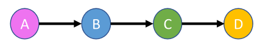

---
<style scoped>
section {
    font-size: 25px;
}
</style>
**Cycle**: Path where starting and ending nodes coincide 起點和終點重合的路徑。

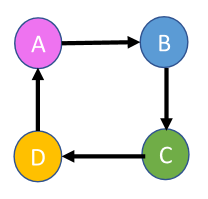

---
#### Geodesic Distance and Shortest Path
<style scoped>
section {
    font-size: 25px;
}
</style>

**Distance** is a network metric that allows the calculation of the number of edges between any pair of nodes in a network. **距離 (Distance)** 是一種網路度量，用於計算網路中任意一對節點之間的邊數。

- We can use the distance measure to calculate node eccentricity, which is the maximum distances from a given node to all other nodes in a network. 我們可以使用距離度量來計算節點的**離心率 (eccentricity)**，即從給定節點到網路中所有其他節點的最大距離。

- It is also possible to calculate **network diameter**, which is the **highest** eccentricity of its nodes and thus represents the maximum distance between nodes.還可以計算**網路直徑 (network diameter)**，它是其節點中**最高**的離心率，因此代表了節點間的最大距離。

- In most social networks, the **shortest path** is computed based on the cost of transition from one node to another such that the longer the path value, the greater the cost.在大多數社會網路中，**最短路徑**是基於從一個節點轉移到另一個節點的成本來計算的，路徑值越長，成本越高。

---
<style scoped>
section {
    font-size: 25px;
}
</style>

- For `directed` graphs, the geodesic distance d between two nodes (u, v) is defined as the number of edges between these two nodes, while the `shortest path` is defined as the path from u to v with **minimum** number of edges. 對於**有向**圖，兩個節點 (u, v) 之間的測地距離 $d$ 定義為這兩個節點之間的邊數，而**最短路徑**定義為從 u 到 v 具有**最少**邊數的路徑。

- For undirected graphs, the distance d from u to v is the same distance as from v to u.對於無向圖，從 u 到 v 的距離 $d$ 與從 v 到 u 的距離相同。

**Path length**: # of links involved in the path (if the path involves n nodes then the path link is n-1). 路徑中涉及的連結數量（如果路徑涉及 n 個節點，則路徑連結數為 n-1）。

- The distance $d_{ij}$ (**shortest path, geodesic path**) between two nodes i and j is the number of edges along the shortest path connecting them.兩個節點 i 和 j 之間的距離 $d_{ij}$ (**最短路徑**，或稱**測地路徑**) 是連接它們的最短路徑上的邊數。

---
<style scoped>
section {
    font-size: 30px;
}
</style>
The Distance between every pair of nodes are

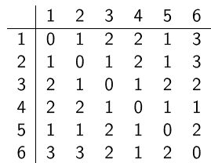

In`directed` graphs, the distance from one node A to another B is generally different from that from B to A.在**有向**圖中，從一個節點 A 到另一個節點 B 的距離通常不同於從 B 到 A 的距離。

---
<style scoped>
section {
    font-size: 25px;
}
</style>
- `Shortest path` (between any two nodes): the path with the minimum length, which is called the shortest distance. and It is not unique. 長度最小的路徑，稱為最短路徑。它不是唯一的（可能存在多條長度相同的最短路徑）。

- `Diameter` 直徑 (of the network): the `highest distance` in the network. 網路中的**最大距離**。

---

##### Degree distribution
<style scoped>
section {
    font-size: 25px;
}
</style>
A probability distribution where $p_k$ is the fraction of nodes that have degree exactly equal to k. $p_k$ = # of nodes with degree k, divided by 概率分佈，其中 $p_k$ 是度數恰好等於 k 的節點所占的比例。$p_k$ = 度數為 k 的節點數量除以 N。

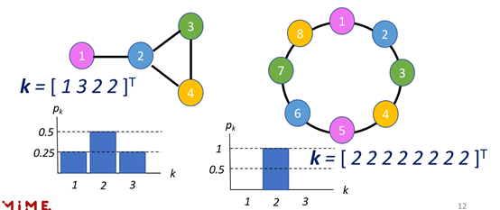

---
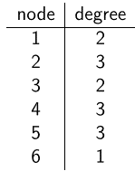

The degree distribution therefore is:

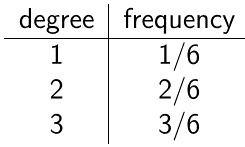

---
#### Directed Network

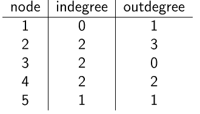

Degree distribution: A frequency count of the occurrence of each degree

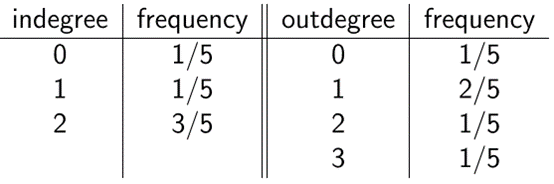

---
#### Path distance distribution

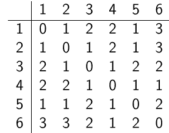

The path distance distribution D therefore is:

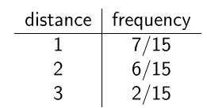

---


In the **absence** of a u − v path, the distance is $\infty$. 

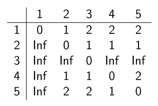

The path distance distribution D therefore is:

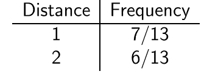


----
<style scoped>
section {
    font-size: 25px;
}
</style>
- Walk: A walk in a graph is a sequence of vertices and edges, where each edge connects the preceding vertex to the next one. Walks can revisit vertices and edges multiple times. For example, in a graph, a walk from vertex A to C might be A → B → A → B → C, even though it loops. 圖中的行走是頂點和邊的序列，其中每條邊將前一個頂點連接到下一個頂點。行走可以多次重新訪問頂點和邊。例如，在圖中，從頂點 A 到 C 的行走可能是 A → B → A → B → C，即使它形成了環路。

- Path: A path is a special type of walk where no vertex is repeated (except possibly the start and end in cycles, but generally, paths are simple and acyclic).  路徑是一種特殊類型的行走，其中沒有頂點被重複（除了在環中起點和終點可能重合的情況，但通常路徑是簡單且無環的）。*(注：此處原文定義傾向於簡單路徑 Simple Path，即頂點不重複)*

- Geodesic Distance 測地距離: This is the length of the shortest path between two vertices in a graph (also known as the graph distance). It measures the minimal number of edges needed to connect them. 這是圖中兩個頂點之間最短路徑的長度（也稱為圖距離）。它衡量連接它們所需的最少邊數。

---

<style scoped>
section {
    font-size: 25px;
}
</style>

- Shortest Path: The shortest path between two vertices is the path with the minimal length (fewest edges in unweighted graphs or minimal weight in weighted ones). 兩個頂點之間的最短路徑是長度最小的路徑（在未加權圖中為最少邊數，在加權圖中為最小權重總和）。

- Degree Distribution: This describes how degrees (the number of edges connected to each vertex) are distributed across the graph. In undirected graphs, degree is the total connections per vertex. In directed graphs, we distinguish in-degree (incoming edges) and out-degree (outgoing edges). 這描述了度數（連接到每個頂點的邊數）如何在整個圖中分佈。在無向圖中，度是每個頂點的總連接數。在有向圖中，我們區分**入度** (in-degree，傳入邊) 和**出度** (out-degree，傳出邊)。

---
<style scoped>
section {
    font-size: 25px;
}
</style>

We'll use a 6x6 adjacency matrix (rows/columns represent vertices 0-5; 1 indicates an edge, 0 none). 我們將使用一個 6x6 的**鄰接矩陣**（行/列代表頂點 0-5；1 表示存在邊，0 表示無邊）。

For the **undirected graph**, the matrix is symmetric (edges are bidirectional). I chose a simple structure: a path with some extra edges for connectivity (e.g., making it more interesting than a straight line). 對於**無向圖**，矩陣是對稱的（邊是雙向的）。我選擇了一個簡單的結構：一條帶有額外邊以增加連通性的路徑（例如，使其比直線更有趣）。

For the **directed graph**, the matrix is asymmetric (edges are one-way). I modified the undirected one to enforce directions, creating a mostly linear flow with some branches. 對於**有向圖**，矩陣是不對稱的（邊是單向的）。我修改了無向圖的矩陣以強制方向，創建了一個主要是線性流動並帶有一些分支的結構。

---
<style scoped>
  pre {
    max-height: 400px; /* Adjust height as needed */
    overflow-y: auto;
    font-size: 2.8rem; /* Optional: adjust font size to fit more lines */
  }
</style>

```py
import networkx as nx
import numpy as np
from collections import Counter

# Undirected graph adjacency matrix (a simple path graph with some extra edges for connectivity)
undirected_adj = np.array([
    [0, 1, 0, 0, 0, 0],
    [1, 0, 1, 0, 0, 1],
    [0, 1, 0, 1, 0, 0],
    [0, 0, 1, 0, 1, 0],
    [0, 0, 0, 1, 0, 1],
    [0, 1, 0, 0, 1, 0]
])

G_undirected = nx.from_numpy_array(undirected_adj)  # Create undirected graph from matrix

# Walk example: Manually define a valid walk from 0 to 4 (can repeat, but here it's simple: 0→1→5→4)
walk_undirected = [0, 1, 5, 4]
# To verify: Check adjacency for each consecutive pair (e.g., undirected_adj[0][1]=1, [1][5]=1, [5][4]=1)

# Path example: Use BFS-based shortest_path (ensures no repeats by nature of shortest path in unweighted graph)
path_undirected = nx.shortest_path(G_undirected, 0, 4)
# How to arrive: BFS starts at 0, explores neighbors level by level until reaching 4, backtracking the path.

# Geodesic Distance: Use shortest_path_length (BFS computes minimal edges)
geodesic_dist_undirected = nx.shortest_path_length(G_undirected, 0, 4)
# How to arrive: Count edges in the shortest path found via BFS.

# Shortest Path: Already computed above; it's the path with geodesic distance as length.

# Degree distribution: Get degrees, then count frequencies
degrees_undirected = [d for n, d in G_undirected.degree()]  # List degrees for nodes 0-5
degree_dist_undirected = Counter(degrees_undirected)  # Count occurrences of each degree

# Directed graph adjacency matrix (directed version: one-way edges, mostly linear with branches)
directed_adj = np.array([
    [0, 1, 0, 0, 0, 0],
    [0, 0, 1, 0, 0, 1],
    [0, 0, 0, 1, 0, 0],
    [0, 0, 0, 0, 1, 0],
    [0, 0, 0, 0, 0, 1],
    [0, 0, 0, 0, 1, 0]
])

G_directed = nx.DiGraph(directed_adj)  # Create directed graph

# Walk example: Manually define from 0 to 5 (0→1→5)
walk_directed = [0, 1, 5]
# Verify: directed_adj[0][1]=1, [1][5]=1 (direction matters; reverse wouldn't work if not present)

# Path example: Use shortest_path for directed graph (handles direction)
path_directed = nx.shortest_path(G_directed, 0, 5)

# Geodesic Distance: shortest_path_length for directed
geodesic_dist_directed = nx.shortest_path_length(G_directed, 0, 5)

# Shortest Path: As above.

# Degree distribution: Separate in/out degrees
in_degrees = [d for n, d in G_directed.in_degree()]
out_degrees = [d for n, d in G_directed.out_degree()]
in_degree_dist = Counter(in_degrees)
out_degree_dist = Counter(out_degrees)
```

