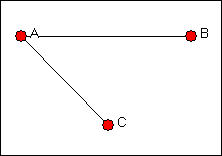
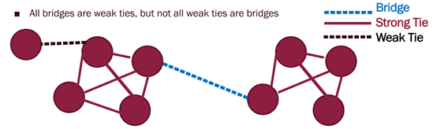

<!-- _class: lead -->


# Big Data and Society

**Class03A Network Relation**

**國企 Wen-Bin Chuang**
**2026-02-14**


-----

## Network Relation

#### Dyads 雙元關係
<style scoped>
section {
    font-size:  26px;
}
</style>
The **smallest "component"** are composed of two actors: the `dyad` (that is, a pair of actors). For `binary ties (present or absent)`, there are two possibilities for each pair in the population - either they have a tie, or they don't. 最小的 "元件 "由兩個參與者組成：二人組（即成對參與者 二元）。對於二元聯繫（存在或不存在）來說，人群中的每一對都有兩種可能性--`要麼有聯繫，要麼沒有`。

We can `characterize` the whole population in terms of the prevalence of these dyadic "structures." This is what the `density` measure does. 我們可以根據這些 二元關係 "結構 "的普遍程度來 `描述`整個人群的特徵。這就是`密度`測量的作用。

-----

##### Density
<style scoped>
section {
    font-size:  26px;
}
</style>
Measuring the density of a network gives us a ready index of the degree of dyadic connection in a population. 通過測量網路的密度，我們就可以得出一個群體中 二元聯繫程度的指數。

For binary data, density is simply the ratio of the number of adjacencies that are present divided by the number of pairs.密度只是存在的鄰接數除以配對數的比值，即所有可能的二元聯繫中實際存在的比例。

如果資料是對稱或非定向的，則密度是對數（(n*n-1)/2）來計算的；如果資料是定向的，則密度是根據 `成對總數`來計算的。

- 網路的密度可以讓我們深入瞭解**資訊在節點間傳播的速度**，以及參與者在多大程度上擁有高水準的社會資本和/或社會約束等現象。

----

###### Reciprocity
<style scoped>
section {
    font-size:  26px;
}
</style>
If we are considering a **directed relation** (A might like B, but B might not like A), there are `four` possible dyadic relationships: A and B are not connected, A sends to B, B sends to A, or A and B send to each other.  `對於`對稱的二元資料，兩個參與者要麼有聯繫，要麼沒有聯繫。密度幾乎可以說明一切。對於**定向資料**，有四種可能的對偶關係： A 和 B 沒有聯繫，A 向 B 發送資訊，B 向 A 發送資訊，或者 A 和 B 互相發送資訊。

-----
<style scoped>
section {
    font-size:  26px;
}
</style>
A common interest in looking at **directed dyadic relationships** is the extent to which ties are **reciprocated** (those where each directs a tie to the other). It may tell us about the degree of cohesion, trust, and social capital that is present. 一個群體在多大程度上具有`互惠`關連性（雙方都直接與對方建立紐帶）的特徵，可以讓我們瞭解這個群體的 凝聚力、信任和社會資本的程度。

One approach is to focus on the dyads, and ask what proportion of pairs have a reciprocated tie between them?參與者 A 和 B 有互惠聯繫，參與者 B 和 C 有非互惠聯繫，參與者 A 和 C 沒有聯繫。這個網路中 **互惠關連性** 的普遍程度如何？ 

This would yield one such tie for three possible pairs (AB, AC, BC), or a reciprocity rate of .333. 一種方法是關注二元組，詢問有多大比例的二元組之間存在`互惠聯繫？`這將得出三個可能的配對（AB、AC、BC）中有一個這樣的互惠關連性，即互惠率為 0.333。

----

##### Triad Relation 三元關係
<style scoped>
section {
    font-size:  26px;
}
</style>
The smallest social structure that has the `true character` of a "society" is the **triad - any "triple" {A, B, C} of actors**.  真正具有 **"社會 "特徵**的最小社會結構是**三元組-- 參與者的任何 "三元組"{A、B、C}**。

With `undirected data`, there are **four** possible types of triadic relations 三元的 (no ties, one tie, two ties, or all three ties).  在無定向資料中，有**四種**可能的三元關係類型（無聯繫、一聯繫、兩聯繫或全部三聯繫）

----
<style scoped>
section {
    font-size:  26px;
}
</style>
Counts of the relative prevalence of these four types of relations across all possible triples (that is a "triad census") can give a good sense of the extent to which a population is characterized by **"isolation," "couples only," "structural holes"** (i.e. where one actor is connected to two others, who are not connected to each other), or **"clusters.**" 對所有可能的三元組中這四種類型關係的相對普遍性進行統計（即 "三元組普查"），可以很好地瞭解一個群體在多大程度上具有**"孤立"、"僅夫妻"、"結構洞 "**（即一個參與者與另外兩個參與者有聯繫，而這兩個參與者之間沒有聯繫）或**"集群 "**的特徵。

- The **"structural holes"** and **"brokerage"** elaborate on ways of looking at positional opportunity and constraint of individual actors. "結構洞 "和 "仲介 "詳細闡述了觀察 個別參與者的位置機會和限制的方法。

----

#### Structure Hole
<style scoped>
section {
    font-size:  26px;
}
</style>
Ronald Burt popularized the term **"structural holes"** to refer to some very important aspects of **positional advantage/disadvantage** of individuals that result from how they are embedded in neighborhoods. 羅奈爾得-伯特（Ronald Burt）推廣了 "結構洞"（structural holes）一詞，指的是個人的 **地位 優勢/劣勢**的一些非常重要的方面，這些方面是由於他們如何嵌入鄰里關係而產生的。

----
<style scoped>
section {
    font-size:  26px;
}
</style>
Suppose that actor A wanted to **influence** or **exchange with** another actor.  假設參與者 A 想要影響另一個參與者或與他交換。

- Assume that both B and C may have some interest in interacting or exchanging, as well. Actor A will not be in a strong bargaining position in this network, because both of A's potential exchange partners (B and C) have alternatives to treating with A; they could isolate A, and exchange with one another. 假設 B 和 C 可能也有興趣進行互動或交流。在這個網路中，參與者 A 的討價還價能力並不強，因為 A 的潛在交流夥伴（B 和 C）都有與 A 進行交流的其他選擇；他們可以孤立 A，相互交流。

---


<style scoped>
section {
    font-size:  26px;
}
</style>
The structural hole `is` the gap itself. That is, a relation or tie is "absent" such that B and C cannot exchange (perhaps they are not aware of one another, or there are very high transaction costs involved in forming a tie).  在這種情況下，參與者 A 由於參與者 B 和參與者 C 之間的 "結構洞 "而處於優勢地位。參與者 A 有兩個可供選擇的交換夥伴；參與者 B 和參與者 C 如果選擇（或必須）進行交換，則只有一個選擇。

----
<style scoped>
section {
    font-size:  26px;
}
</style>
A **structural hole** is the `absence` of a tie between two actors (like B and C) who are both connected to a third actor (A).結構洞（Structural Hole） 指的是兩個行動者（如 B 和 C）之間缺乏直接聯繫，儘管它們都與第三個行動者（A）相連。 So, the structural hole already exists when B and C *cannot* or *do not* interact directly.因此，當 B 和 C 無法或沒有直接互動時，結構洞便已存在。

- **Structural hole = missing link between B and C**, **A bridges the hole** by being connected to both.•	結構洞 = B 與 C 之間缺失的連結，而 A 通過與雙方建立連接來 bridging（橋接）這個洞。

- If B and C are connected → no structural hole → A is redundant → **A has weak bargaining power**.•	如果 B 和 C 已相連 → 不存在結構洞 → A 的角色變得冗餘 → A 的議價能力較弱。
- If B and C are **NOT** connected → a structural hole exists → A is the broker → **A has strong bargaining power**.•	如果 B 和 C 未相連 → 存在結構洞 → A 充當經紀人（Broker）→ A 擁有較強的議價能力。

----

###### Transitivity
<style scoped>
section {
    font-size:  26px;
}
</style>
All of the really fundamental forms of social relationships can be observed in `triads`. Because of this interest, we may wish to conduct a "triad census" for each actor, and for the network as a whole. 所有真正基本的社會關係形式都可以在`三人小組`中觀察到。

- If node A is connected to node B, and node B is connected to node C, then node A and node C are also  connected. In  an  undirected  network,  the  triad  is **closed**. 如果節點 A 與節點 B 相連，且節點 B 與節點 C 相連，那麼節點 A 與節點 C 也應相連。在無向網路中，這種三點結構稱為**閉合**（closed）三元組。

- If the A-B and B-C ties occur first, then the A-C tie `is more likely to` follow. 如果 A–B 和 B–C 的連接先形成，那麼 A–C 的連接就**更有可能**隨後出現。

---
<style scoped>
section {
    font-size:  26px;
}
</style>
- The proportion of transitive **triplets** in a whole network can be measured by dividing the total number of **closed triplets** (three nodes connected by three ties) by the total number of connected triplets (the sum of closed triplets  plus  **open  triplet**s—triplets  connected  only  by  two  ties). 整個網路中傳遞性**三元組**（triplets）的比例可通過以下方式衡量：將**閉合三元組**（三個節點彼此通過三條邊相連）的總數，除以所有連通三元組的總數（閉合三元組與**開放三元組**——僅通過兩條邊連接的三元組——之和）。

  
- The  ratio ranges from 0 when no triplets are closed to 1 when all triplets are closed, indicates the proportion of paths of length two that are closed. 該比例取值範圍為 0 到 1：當沒有三元組閉合時為 0，當所有三元組都閉合時為 1，它表示長度為 2 的路徑中有多少被閉合了。


---
<style scoped>
section {
    font-size:  26px;
}
</style>
Transitivity is a property of edges that allows us to perform `triadic closures (closed triples)` and make **predictions** about the **node’s neighborhood.** 傳遞性（Transitivity）是網路邊的一種性質，使我們能夠進行**三元閉包**（triadic closures，即閉合三元組）並據此對**節點的鄰域**做出**預測**。

If node A is connected to node B and node B is connected to node C, then it is likely that node A is also connected to node C. 如果節點 A 與節點 B 相連，且節點 B 與節點 C 相連，那麼節點 A 與節點 C 很可能也存在連接。

The average transitivity of a social network is defined as the number of triangles over the number of connected triples 社會網路的平均傳遞性定義為三角形數量與連通三元組數量之比.
$$
\text{transitivity}=\frac{3*\text{No. of triangles}}{\text{No. connected triples}}
$$

----

###### Clustering Coefficient
<style scoped>
section {
    font-size:  26px;
}
</style>
A triplet consists of three nodes that are connected by either **two (open triplet)** or **three (closed triplet)** undirected ties. 一個三元組包含三個節點，它們通過**兩條**（開放三元組）或**三條**（閉合三元組）無向邊相連

A **triangle** consists of three closed triplets, one centered on each of the nodes. The **global clustering coefficient** is the number of closed triplets (or 3 x triangles) over the total number of triplets (both open and closed). 。一個**三角形**由三個閉合三元組組成，每個節點各為中心一個。**全域聚類係數**等於閉合三元組數量（或等價於 3 × 三角形數量）除以三元組總數（包括開放和閉合的）。

---
<style scoped>
section {
    font-size:  26px;
}
</style>
  How many **triangles** do you see in each? 你能在這兩個網路中看到多少個**三角形**？ The triangles are cliques (or indications of the presence of cliques), where all three nodes are tied to one another. 三角形代表的是**團**（cliques）——三個節點彼此完全連接。
  
  The more “cliquey” of the two networks indicating that it is more likely to be able to be broken down into subgroups of factions. 網路越“團化”，越可能被劃分為若干子群體或派系。

----
<style scoped>
section {
    font-size:  26px;
}
</style>
**Structural holes and transitivity** are closely related concepts in social network analysis—they describe **opposite structural tendencies** in how connections form among three actors (triads).**結構洞**（Structural holes）與**傳遞性**（transitivity）是社會網路分析中密切相關的概念——它們描述了三個行動者（三元組）之間連接形成的**相反結構傾向**。

- **Closed Triplet (or Triadic Closure)** is **closed** when the third tie (B–C) is present: A–B, A–C, **and B–C** all exist. It is a **triangle**.  **閉合三元組**（或三元閉包）：當第三條邊（B–C）存在時，即 A–B、A–C 和 B–C 三者都存在，就構成了一個**三角形**。 

**Transitivity** describe the **tendency for triplets to close**—a hallmark of cohesive, clustered networks (e.g., friendship groups). High transitivity → many closed triplets → dense local clustering. **傳遞性**描述了三元組**趨向閉合**的傾向——這是高度凝聚、聚集性網路（如朋友圈）的典型特徵。高傳遞性 → 大量閉合三元組 → 密集的局部聚類。

-----
<style scoped>
section {
    font-size:  26px;
}
</style>
- **Transitivity ⇨ closes triplets ⇨ eliminates structural holes.** **傳遞性 ⇨ 閉合三元組 ⇨ 消除結構洞**
- **Structural holes ⇨ require \*lack\* of transitivity ⇨ open triplets** **結構洞 ⇨ 需要傳遞性的缺失 ⇨ 開放三元組**。
  - **Structural holes** = **open triplets** (missing B–C tie). **結構洞 = 開放三元組**（缺少 B–C 連接）。
  - **Transitivity** is the social force that **closes** those triplets. **傳遞性**是促使三元組**閉合**的社會力量。
  - Thus, **structural holes and transitivity are inversely related**: more of one means less of the other. 因此，**結構洞與傳遞性呈反向關係**：一方越多，另一方就越少。

---
<style scoped>
section {
    font-size:  26px;
}
</style>
This tension between **cohesion** (closure) and **brokerage** (holes) is central to understanding how networks create value! **凝聚性**（閉包）與**仲介性**（結構洞）之間的這種張力，是理解網路如何創造價值的核心！

This **tension between cohesion and brokerage**—or, equivalently, between **closed networks** (high transitivity) and **networks with structural holes**—is indeed one of the most important ideas in social network theory, especially for understanding how individuals and organizations gain competitive advantages. 這種**凝聚與仲介之間的張力**——或者說，**高傳遞性的閉合網路**與**存在結構洞的網路**之間的對立——確實是社會網路理論中最重要的思想之一，尤其有助於理解個體與組織如何獲得競爭優勢。

----

### **Cohesion (Closure) → Trust, Cooperation, Enforcement**
<style scoped>
section {
    font-size:  26px;
}
</style>
- In a **closed triad** (A–B–C all connected), norms, trust, and reciprocity are easier to sustain. 在一個**閉合三元組**（A、B、C 全部相連）中，規範、信任與互惠更容易維持。

- People can monitor each other (“If you cheat me, I’ll tell C”). 個體可以相互監督（“如果你騙我，我就告訴 C”）。

- Ideal for **collaboration**, **teamwork**, and **norm enforcement**. 適合**協作**、**團隊合作**與**規範執行**。
- **Value**: Reliability, shared understanding, social support. **價值**：可靠性、共同理解、社會支持。

---
<style scoped>
section {
    font-size:  26px;
}
</style>
- **What it enables** (once observed):
  - **Trust**: Reputational monitoring is possible; misbehavior can be sanctioned. **信任**：可進行聲譽監督；不當行為可被制裁。
  - **Cooperation**: Shared expectations and norms reduce uncertainty. **合作**：共用規範與預期降低了不確定性。
  - **Enforcement**: Third-party monitoring allows for indirect reciprocity (“I help you because C will punish me if I don’t”). **執行**：協力廠商監督使間接互惠成為可能（“我幫你，是因為 C 會懲罰我不幫”）。
  - **What it is \*not\***: A strategy to “build trust.” Trust *emerges* *because* of closure—it’s a *consequence*, not a goal you engineer directly. **注意**：它**不是**一種“建立信任”的策略。信任是閉包的**結果**，而非可直接設計的目標。
- For example: A tight-knit R&D team where everyone works closely—high cohesion enables deep coordination. 一個緊密合作的研發團隊，高凝聚性促成了深度協調。

----

### **Brokerage (Spanning Structural Holes) → Novelty, Opportunity, Control**
<style scoped>
section {
    font-size:  26px;
}
</style>
- When A connects **two unconnected groups** (e.g., engineering and marketing), A accesses **diverse, non-redundant information**.當 A 連接**兩個未相連的群體**（如工程部與市場部），A 就能獲取**多樣化、非冗餘的資訊**。
- A can **repackage ideas**, spot market gaps, or control resource flows.A 可以**整合觀點**、發現市場空白，或控制資源流動。

- **What it enables** (once observed):
  - **Novelty**: B and C operate in different information spheres; A accesses both.**新穎性**：B 與 C 處於不同資訊領域；A 同時接觸兩者。
  - **Opportunity**: A can synthesize, arbitrage, or time-shift information.**機會**：A 可綜合資訊、套利或把握時機。
---
<style scoped>
section {
    font-size:  26px;
}
</style>

  - **Control**: A regulates or mediates the flow between disconnected parties.**控制力**：A 調節或仲介彼此隔離的各方之間的資訊或資源流動。
  - **What it is 'not'**: A tactic to “be innovative.” Innovation arises *because* A spans non-redundant sources—it’s a *structural advantage*, not a personal trait.**注意**：它**不是**一種“追求創新”的技巧。創新源於 A 跨越了非冗餘資訊源——這是一種**結構性優勢**，而非個人特質。
- **Value**: Innovation, early information, strategic influence.**價值**：創新、早期資訊、戰略影響力。
- *Example*: A product manager who bridges engineering and sales—translating technical specs into customer benefits—is a classic broker.**例**：一位元產品經理同時對接工程與銷售，將技術參數轉化為客戶價值，是典型的仲介者。

----

#### The Trade-Off
<style scoped>
section {
    font-size: 26px;
}
</style>
- **Too much closure**: Echo chambers, groupthink, redundant knowledge.**過度閉合**：導致回音室效應、群體思維、知識冗餘。
- **Too many holes**: Lack of trust, difficulty coordinating, no shared norms**結構洞過多**：缺乏信任、難以協調、無共用規範。

The most effective actors (or organizations) often **balance both**:最有效的行動者（或組織）往往**兼顧兩者**

- Build **cohesive teams internally** (for execution),在**內部構建凝聚團隊**（用於執行），
- While **spanning structural holes externally** (for innovation and opportunity).同時**在外部跨越結構洞**（用於創新與機會）。

This duality is why Burt argued: **Closure creates commitment; brokerage creates opportunity**正是這種雙重性，使伯特**（Burt）提出**：**閉合帶來承諾，仲介帶來機會

----
<style scoped>
  pre {
    max-height: 400px; /* Adjust height as needed */
    overflow-y: auto;
    font-size: 2.8rem; /* Optional: adjust font size to fit more lines */
  }
</style>
```py
import networkx as nx
import matplotlib.pyplot as plt

# Create a directed or undirected graph (undirected for simplicity)
G = nx.Graph()

# Add nodes
G.add_nodes_from(['A', 'B', 'C', 'D', 'E'])

# Add edges
# - Triangle A-B-C: represents CLOSURE
# - A connected to D and E, but D-E not connected: A spans a STRUCTURAL HOLE
G.add_edges_from([
    ('A', 'B'), ('B', 'C'), ('C', 'A'),  # Closed triplet (triangle)
    ('A', 'D'), ('A', 'E')               # Open triplet: D and E not connected
    # Note: no edge between D and E → structural hole
])

# Visualize the network
pos = nx.spring_layout(G, seed=42)
nx.draw(G, pos, with_labels=True, node_color='lightblue', node_size=1500, font_size=16)
plt.title("Network: Triangle (A-B-C) + Structural Hole (A-D-E)")
plt.show()

# -------------------------------------------------
# 1. Detect CLOSED TRIPLETS (Closure)
# -------------------------------------------------
triangles = [cycle for cycle in nx.enumerate_all_cliques(G) if len(cycle) == 3]
print("Closed triplets (triangles):", triangles)

# Local clustering coefficient (higher = more closure around node)
clustering = nx.clustering(G)
print("\nClustering coefficient (proxy for closure):")
for node, coeff in clustering.items():
    print(f"  {node}: {coeff:.2f}")

# -------------------------------------------------
# 2. Detect STRUCTURAL HOLES (Brokerage)
# -------------------------------------------------
# Burt's "constraint" measure: lower = more brokerage
constraint = nx.constraint(G)
effective_size = nx.effective_size(G)

print("\nStructural hole indicators:")
print("Node | Effective Size | Constraint (lower = more brokerage)")
print("-" * 55)
for node in G.nodes():
    eff = effective_size.get(node, 0)
    con = constraint.get(node, 0)
    print(f"  {node}  |      {eff:6.2f}    |        {con:6.2f}")
```


----

##### Weak tie theory (Granovetter, 1973)
<style scoped>
section {
    font-size:  26px;
}
</style>
The strenght of a tie is a (probably linear) combination of the amount of time , the emotional intensity, the intimacy (mutual confiding), and the reciprocal services which characterize the tie. 連接的強度是一種（可能是線性的）組合，包括互動所花費的**時間**、**情感強度**、**親密程度**（相互傾訴）以及**互惠服務**等特徵。

Mark Granovetter published "The strength of weak ties" in 1973, proposing the theory of weak tie. He argued that **weak ties** are better able to traverse different social groups than strong ties, and therefore can reach more people and **cross** greater social distances. Mark Granovetter 於 1973 年發表了《弱連接的力量》（*The Strength of Weak Ties*）一文，提出弱連接理論。他指出，**弱連接**比強連接更能跨越不同的社會群體，因此能夠觸達更多人，並**跨越更遠的社會距離**。

---
<style scoped>
section {
    font-size:  26px;
}
</style>
Strong ties refer to those people we really trust, who's social circle might overlap ours (such as family ties) and who are likely to **be similar to us**. **強連接**指的是我們高度信任的人，其社交圈可能與我們的高度重疊（例如家人），並且他們通常**與我們非常相似**。

Weak ties on the other hand define all other relations, such as **co-workers and acquaintances**.  相比之下，**弱連接**則涵蓋其他所有關係，例如**同事**和**熟人**。


---

##### Bridge
<style scoped>
section {
    font-size:  26px;
}
</style>
A bridge is an **edge** between two connected components its removal would make the network disconnected. A bridge is an edge whose removal places **5** and **6** in different components. The **5-6** edge is a bridge, meaning that its removal would place 5 and 6 in distinct connected components. 橋接邊是指連接兩個連通分量的**邊**，一旦移除該邊，整個網路將變得不連通。例如，邊 **5–6** 就是一條橋接邊，因為它的移除會使節點 5 和節點 6 被劃分到兩個不同的連通分量中。

Bridges provide nodes with access to parts. If 5 is going to get new information (like a job) that she doesn't already know, it might come from 6.  橋接邊為節點提供了接觸網絡其他部分的通道。如果節點 5 要獲取她尚未知曉的新資訊（比如一份工作機會），這些資訊很可能就來自節點 6。

---


<style scoped>
section {
    font-size:  26px;
}
</style>
Local Bridge: A local bridge is the edge X-Y where X, Y have **no friends in common** (a local bridge does not form the side of any triangle). 

----
<style scoped>
section {
    font-size:  26px;
}
</style>
Facilitate inter-group communication, increase social cohesion, and help spur innovation. They are usually weak ties, but not every weak tie is a bridge. 



----

#### **Core Problem Type Weak Tie Theory**
<style scoped>
section {
    font-size: 26px;
}
</style>
How do individuals or organizations discover \*new opportunities, ideas, or resources\* that are not already circulating in their close-knit group? 個體或組織如何發現那些**尚未在其緊密小圈子內流通的新機會、新想法或新資源**？：This arises when 這種情況通常出現在以下情境中: 

- Your close network (strong ties) is **informationally redundant** (everyone knows the same things). 你的親密社交網路（強連接）在資訊上是**冗餘的**（所有人都知道差不多的事情）；
- The valuable opportunity/idea exists **in a different social, professional, or cultural cluster** 有價值的機會或想法存在於**另一個不同的社會、職業或文化群體**中.
- You need a **bridge** to that external cluster 你需要一條**橋樑**，通向那個外部群體.

**Rule of thumb**:

- Use **weak ties** for **discovery** (finding opportunities). 利用**弱連接**進行**發現**（尋找機會）；
- Use **strong ties** for **execution** (seizing opportunities). 依靠**強連接**進行**執行**（把握機會）

----
<style scoped>
section {
    font-size: 26px;
}
</style>
Weak tie theory explains `why` opportunities are invisible—but not how to find them efficiently. That’s where **structural hole theory (Burt)** and **modern network intelligence** step in. 弱連接理論解釋了**為什麼**某些機會對我們“不可見”，但並未說明**如何高效地找到它們**。這正是**結構洞理論**（Burt）和**現代網路智慧**發揮作用的地方。

#### 1. **Structural Holes Give You Direction**

- If you know **which groups are disconnected**, you know **where novelty lives**. 如果你知道**哪些群體彼此不連通**，你就知道**新意所在之處**。
- Example: You’re in **Marketing**. You notice **R&D** and **Customer Support** don’t talk. o  你身處**市場部**；你注意到**研發部**和**客戶服務部**之間幾乎沒有交流；
  - → The opportunity (e.g., a new product idea) likely lives **at that intersection**. 那麼新機會（例如一個新產品創意）很可能就**存在於這個交界地帶**
  - → Build a tie to *both* sides. Now you’re not guessing—you’re **targeting a known hole** 主動與**雙方都建立聯繫**。此時你不再是盲目猜測，而是在**精准定位一個已知的結構洞**

**Structural holes turn “somewhere out there” into “right there, between X and Y.”** 結構洞把模糊的某個地方轉化為明確的就在 X和Y 之間

----

#### **Use Strategic Tie Activation**
<style scoped>
section {
    font-size:  26px;
}
</style>
Not all weak ties are equal. Prioritize those that: 並非所有弱連接都同等重要。應優先考慮那些

- Connect to **different industries, functions, or geographies** (high *structural diversity*). 連接到**不同行業、職能或地域**的連接（具有高“結構多樣性”）
- Are **active brokers themselves** (they span multiple holes). 本身已是**活躍的仲介者**（他們自己就跨越多個結構洞）
- Have **recent signals** (e.g., posted about a relevant job, attended a key conference). 最近有**活躍信號**（例如發佈了相關職位、參加了關鍵會議等）

Weak tie + strategic positioning **弱連接**+ **戰略性定位= **targeted opportunity discover** 精准的機會發現


