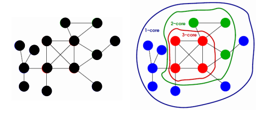
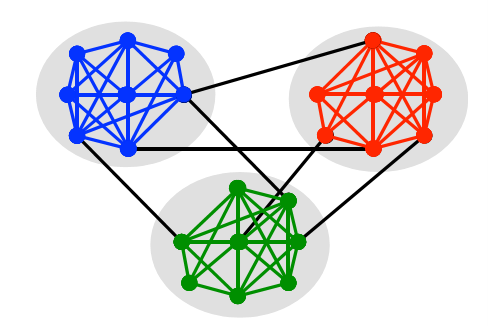
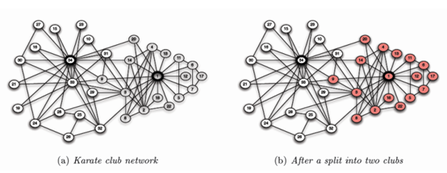

<!-- _class: lead -->


# Big Data and Society

**Class03B Network Segment**

**國企 Wen-Bin Chuang**
**2026-02-14**


-----

## Network Sementation
<style scoped>
section {
    font-size: 25px;
}
</style>
Network **segmentation** refers to dividing a graph into meaningful substructures, often to reveal how the network is organized at different scales: global (whole network), mesoscale (groups), and local (small patterns). 網路**分割**（segmentation）是指將圖劃分為具有實際意義的子結構，通常用於揭示網路在不同尺度下的組織方式：全域（整個網路）、中觀尺度（群體）和局部（小型模式）。

The concepts operate at different levels and are interconnected in a hierarchical way:

The extent to which subsets of vertices are cohesive—or ‘stuck together’— with respect to the relation defining edges in the network graph. 網路分析中的許多問題都可以歸結為涉及 **"網路凝聚力"**的問題。


---
<style scoped>
section {
    font-size: 25px;
}
</style>
`網路凝聚力`是指相對於網路圖中定義邊的關係而言，頂點子集的凝聚程度--或者說 "粘在一起 "的程度。

`Cohesive groups` are communities in which the nodes (members) are connected to others in the same group more frequent than they are to those who are outside of the group, allowing all of the members of the group to reach each other. 在這種群體中，節點（成員）與同一群體中其他人的聯繫比與群體外其他人的聯繫更頻繁，從而使群體中的所有成員都能相互聯繫。

Within such a highly cohesive group, members tend to have strong homogenous beliefs. 在這樣一個具有高度凝聚力的群體中，成員往往具有強烈的同質信仰。

-----

### Segmentation ≠ Fragmentation
<style scoped>
section {
    font-size: 25px;
}
</style>
- **Healthy segmentation**: Clear boundaries, *with intentional bridges*.
- **Toxic fragmentation**: No ties across groups → silos, conflict, redundancy loss *and* novelty loss.
- The goal isn’t to `eliminate` segmentation—but to **manage its boundaries wisely**

-----

#### Giant Component
<style scoped>
section {
    font-size: 25px;
}
</style>

The **giant component** is a foundational concept that captures a critical transition in network connectivity. The giant component stands out because it typically contains a *finite fraction* of all nodes in the network (e.g., 60%, 80%, or more), especially as the network grows large. **巨連通分量**（giant component）都是一個核心概念，它揭示了網路連通性發生**質變**的關鍵時刻。巨連通分量之所以特殊，在於它通常包含了網路中**相當大比例的節點**（例如60%、80%甚至更多），尤其是在網路規模較大時。

- The emergence of a giant component signals a **phase transition**—a sudden qualitative change in the global structure of the network. This phenomenon was first rigorously described in the **Erdős–Rényi random graph model**: 巨連通分量的出現標誌著網路結構發生了一種**相變**（phase transition）——即網路從碎片化狀態突然轉變為具備全域連通能力的狀態。

---
<style scoped>
section {
    font-size: 25px;
}
</style>
這一現象最早在**Erdős–Rényi** **隨機圖模型**中被嚴格描述：
  - When the average number of connections per node (the expected degree, often denoted ⟨k⟩) is **below 1**, the network consists almost entirely of tiny, isolated fragments. 當每個節點的平均連接數（即平均度 ⟨k⟩）**小於1**時，網路幾乎完全由微小、孤立的碎片組成，無法形成長距離連接；
  - When ⟨k⟩ **exceeds 1**, a giant component **abruptly appears**, absorbing a growing proportion of nodes as connectivity increases. 當平均度**超過1**時，一個巨連通分量會**突然出現**，並隨著連接密度的增加而迅速吸收更多節點。

---
<style scoped>
section {
    font-size: 25px;
}
</style>  
- Consider a social network like Facebook: early on, users formed small friend groups with little overlap. 以 Facebook 為例：早期用戶僅形成小規模的朋友圈，彼此孤立。

- As more users joined and friend links accumulated, a **giant component emerged**—eventually linking billions of people into a single, traversable web. 隨著使用者數量激增和好友連接不斷累積，網路中逐漸**湧現出一個巨連通分量**——最終將數十億用戶納入一張可遍歷的連接之網。


- If you can find a path (however long) from any user to almost any other, you’re witnessing the giant component in action. 如果你能（無論路徑多長）從任意一位用戶找到通向幾乎所有其他使用者的路徑，那你所觀察到的正是 巨連通分量的實際體現。

------

#### **K-Core**
<style scoped>
section {
    font-size: 25px;
}
</style>
A subgraph where every node has `at least degree *k*` within the subgraph (mesoscale/global decomposition). 指網路中的一個子圖，其中每個節點在該子圖內的度數至少為 *k*（中觀/全域分解）。 


k-Core decomposition peels the network layer-by-layer (onion-like structure) by removing low-degree nodes, revealing a hierarchical **core-periphery organization**. k-核分解通過逐層剔除低度節點（類似剝洋蔥的結構），揭示出網路的層級化 **核心—邊緣組織**。


The highest k-core (main core) is the densest central part, often inside the giant component. It identifies robust, highly connected `hubs`. 最高階的 k-核（即主核）是網路中最密集的中心部分，通常位於巨連通分量內部，用於識別結構穩健、高度互聯的`樞紐節點`。

---
<style scoped>
section {
    font-size: 25px;
}
</style>
These subgraphs are `not necessarily cohesive groups`, but they can tell about the areas which contain clique-like structures. 這些子圖並不一定是有內聚力的群組，但它們可以說明哪些區域包含類似於clique的結構。

K-cores can be used as a way to find cohesive subgroups in graphs. K 核可以用來尋找圖中的內聚子群。



-------

#### **Clique**
<style scoped>
section {
    font-size: 25px;
}
</style>
A complete subgraph where `every pair of nodes is connected` (local dense structure).一個完全子圖，其中任意兩個節點之間都有邊相連（局部密集結構）。

Cliques represent the `strongest possible local cohesion`. A **maximal clique** cannot be extended further. **簇(團)**代表了`局部範圍內最強的凝聚性`。極大團（maximal clique）是指無法再通過加入其他節點而擴展的團。

A triangle is an example of a clique of **size three** since it has three nodes and all the nodes are connected.  A clique with size greater than or equal to that of every other clique in the graph is called a **maximum clique**. 三角形就是一個**大小為三**的團的例子，因為它有三個節點，而且**所有節點都是相連的**

---
<style scoped>
section {
    font-size: 25px;
}
</style>
We often want to find **all of the cliques** in a network of various sizes. We could have a theory for example that people will dress or behave similarly or affect those in their cliques. we might imagine cliques to be meaningful for the outcomes we are interested in study.我們經常希望在不同規模的網路中找到所有的**簇(團)**。例如，我們可以有這樣一種理論，即人們的穿著打扮或行為舉止都會相似，或者會影響到他們小團體中的人。也就是說，我們可以想像小團體對我們感興趣的研究結果是有意義的.

For example, the same can be said of only two of the 11 cliques of size four. 在空手道網路中，兩個最大的簇（正式名稱為最大簇）是最大的，而 11 個大小為 4 的小群中只有兩個是最大的。

---
<style scoped>
  pre {
    max-height: 400px; /* Adjust height as needed */
    overflow-y: auto;
    font-size: 2.8rem; /* Optional: adjust font size to fit more lines */
  }
</style>
```py
import networkx as nx
from collections import Counter

# Load the karate club graph (NetworkX has this built-in)
karate = nx.karate_club_graph()

# Find all maximal cliques
clique_out = list(nx.find_cliques(karate))

# Get the number of cliques
num_cliques = len(clique_out)
print(f"Number of cliques: {num_cliques}")

# Get the size distribution of cliques
clique_sizes = [len(clique) for clique in clique_out]
size_counts = Counter(clique_sizes)
print("Clique size distribution:")
for size, count in sorted(size_counts.items()):
    print(f"Size {size}: {count} cliques")

# Find all cliques of size 5
cliques_of_size_5 = [clique for clique in clique_out if len(clique) == 5]
print(f"\nCliques of size 5: {cliques_of_size_5}")
```

------

### Motif
<style scoped>
section {
    font-size: 25px;
}
</style>
Small recurring subgraphs (e.g., triangles = 3-clique, feed-forward loops in directed networks) that `appear more frequently` than in random networks. 指 `小規模且反復出現的子圖結構`（例如三角形即為3階團，在有向網路中如前饋環等），其出現頻率顯著高於隨機網路中的預期。

`Motifs` are building blocks of local connectivity and function (e.g., triangles indicate transitivity or clustering). `模體/ 子圖模式`是局部連接與功能的基本構建單元（例如，三角形體現了傳遞性或聚類特性）。

---
<style scoped>
section {
    font-size: 25px;
}
</style>
- `Triangle`: Very frequent → trust, cohesion, Star: Moderate (influencers); Chain: Less common. 三角形（Triangle）：非常常見 → 代表信任與凝聚力；星型（Star）：中等頻率（影響者）；鏈型（Chain）：較少見。

- Social Media Analysis: Motif of Interest: **Triangle** (A–B, B–C, A–C) 社交媒體分析：關注的子圖模式（Motif）：**三角形**（A–B、B–C、A–C）

  - **Trust & reciprocity**信任与互惠性: On platforms like Facebook or LinkedIn, triangles indicate mutual friendships—strong social validation.在 Facebook 或 LinkedIn 等平臺上，三角形結構表示相互的好友關係——具有強烈的社會認同

  - **Echo chambers**回音室效应: Dense triangle clusters often form ideological bubbles where information reinforces itself. 密集的三角形聚類常形成意識形態“資訊繭房”，其中資訊不斷自我強化。

  - **Influencer authenticity****影響者真實性: Fake influencer networks (e.g., bought followers) show **few triangles**—real social networks are triangle-rich虛假的影響者網路（例如購買粉絲）通常**三角形極少**；而真實的社交網路則富含三角形結構。.

------
<style scoped>
section {
    font-size: 25px;
}
</style>
- Finance & Fraud Detection： Motif of Interest: **Star** (one central node connected to many others, no lateral links) **星型**（Star，一個中心節點連接多個其他節點，節點間無橫向連接）and **Chain** (A→B→C) 金融與欺詐檢測：關注的子圖模式（Motif）：和**鏈型**（Chain，A→B→C）

  - **Star motif**: In transaction networks, may indicate a **central hub**—could be a legitimate marketplace (e.g., PayPal) or a **money laundering funnel****星型模式**：在交易網路中，可能表示一個**中心樞紐**——既可能是合法的交易平臺（如 PayPal），也可能是**洗錢資金彙集點**.

  - **Chain motif**: Suggests **layering**—a classic anti-money-laundering (AML) red flag where funds pass through multiple accounts to obscure origin. **鏈型模式**：暗示存在**分層轉移**（layering）行為——這是反洗錢（AML）中的典型警示信號，即資金通過多個帳戶層層轉移，以掩蓋其原始來源。

-----
<style scoped>
section {
    font-size: 25px;
}
</style>
- Marketing & Customer Analytics: Motif of Interest: **Open Triad** (A–B, A–C, but B–C not connected) = **Structural Hole** 行銷與客戶分析：關注的子圖模式（Motif）：**開放三元組**（Open Triad，即 A–B、A–C 存在連接，但 B 與 C 之間無連接）＝ **結構洞**（Structural Hole）
  - **Brokers/Influencers**: Node A bridges two disconnected groups (B and C)—a classic "network entrepreneur" (per sociologist Ronald Burt). **仲介者／影響者**：節點 A 連接了兩個彼此不相連的群體（B 和 C），是典型的社會學意義上的“網路創業者”（社會學家羅奈爾得·伯特 Ronald Burt 提出的概念）。
  - **Information arbitrage**: Brokers control flow between clusters and gain early access to diverse ideas. **信息套利**：仲介者控制著不同社群之間的資訊流動，並能率先接觸多元化的觀點與資訊，從而獲得競爭優勢。

------

## Motif Comparison Across Domains
<style scoped>
section {
    font-size: 20px;
}
</style>
| Motif                     | Social Media                            | Finance                                          | Marketing                                        |
| ------------------------- | --------------------------------------- | ------------------------------------------------ | ------------------------------------------------ |
| **Triangle**              | Trust, cohesion, fake account detection | Rare (inefficient); may indicate collusion rings | Loyalty clusters, referral networks              |
| **Open Triad **(A–B, A–C) | Bridge between communities              | Unusual; may signal intermediary brokers         | **Key!** Identifies cross-community influencers  |
| **Star**                  | Celebrity-follower model                | Money laundering hubs, payment processors        | Brand–customer broadcast model                   |
| **Chain**                 | Message forwarding                      | Layering in money laundering                     | Customer referral chains (e.g., invite-a-friend) |
---
<style scoped>
section {
    font-size: 25px;
}
</style>
**Motifs turn abstract network structure into actionable business intelligence**子圖模式/ 模體（Motifs）將抽象的網路結構轉化為可操作的商業智慧。.

- In **social media** 社交媒體: triangles = trust, open triads = reach 三角形 = 信任，開放三元組 = 觸達力。.
- In **finance**金融領域: chains = risk, stars = hubs (good or bad) 鏈型 = 風險，星型 = 樞紐（可能是良性平臺，也可能是非法通道）.
- In **marketing**行銷場景: brokers (open triads) > mere followers 仲介者（開放三元組中的中心節點）的價值遠高於普通追隨者

-----
<style scoped>
  pre {
    max-height: 400px; /* Adjust height as needed */
    overflow-y: auto;
    font-size: 2.8rem; /* Optional: adjust font size to fit more lines */
  }
</style>
```py
import networkx as nx
import matplotlib.pyplot as plt
import numpy as np
import pandas as pd

# -------------------------------------------------
# 1. Load or create a social network
# -------------------------------------------------
# Use the Karate Club network (classic social network with known split)
G = nx.karate_club_graph()

# Make sure it's undirected and simple
G = nx.Graph(G)

# -------------------------------------------------
# 2. For each node, count local 3-node motifs:
#    - Triangles (closed triads)
#    - Open triads (structural holes)
# -------------------------------------------------
def compute_local_motifs(G):
    """
    Returns a dict with for each node:
      - 'triangles': number of triangles the node participates in
      - 'open_triads': number of open triads centered at the node
    """
    motif_data = {}
    for node in G.nodes():
        neighbors = list(G.neighbors(node))
        n_neighbors = len(neighbors)
        
        # Number of edges among neighbors = triangles centered at node
        subgraph = G.subgraph(neighbors)
        edges_among_neighbors = subgraph.number_of_edges()
        
        # Triangles = each edge among neighbors forms a triangle with node
        triangles = edges_among_neighbors
        
        # Open triads = all possible pairs of neighbors minus actual edges
        # Total possible pairs = C(n,2)
        total_pairs = n_neighbors * (n_neighbors - 1) // 2
        open_triads = total_pairs - edges_among_neighbors
        
        motif_data[node] = {
            'triangles': triangles,
            'open_triads': open_triads,
            'degree': n_neighbors
        }
    return motif_data

motif_data = compute_local_motifs(G)

# Convert to DataFrame for easy analysis
df = pd.DataFrame.from_dict(motif_data, orient='index')
df.index.name = 'node'
df = df.sort_index()

print("Motif counts for first 10 nodes:")
print(df.head(10))

# -------------------------------------------------
# 3. Build a "Motif-Based Influencer Score"
# -------------------------------------------------
# Idea: Balance between being well-connected (triangles) and bridging (open_triads)
# We normalize both metrics to [0,1] and combine them.

# Normalize using min-max (robust for small networks)
df['triangles_norm'] = df['triangles'] / df['triangles'].max() if df['triangles'].max() > 0 else 0
df['open_triads_norm'] = df['open_triads'] / df['open_triads'].max() if df['open_triads'].max() > 0 else 0

# Influencer Score = geometric mean (penalizes extreme imbalance)
# Alternatively: arithmetic mean, or weighted (e.g., 0.4*tri + 0.6*open)
df['influencer_score'] = np.sqrt(df['triangles_norm'] * df['open_triads_norm'])

# Handle nodes with no neighbors
df['influencer_score'] = df['influencer_score'].fillna(0)

# Sort by score
df_sorted = df.sort_values('influencer_score', ascending=False)
print("\nTop 5 Influencers by Motif Score:")
print(df_sorted[['degree', 'triangles', 'open_triads', 'influencer_score']].head())

# -------------------------------------------------
# 4. Visualize the network with influencer scores
# -------------------------------------------------
# Map score to color and size
node_colors = [df.loc[node, 'influencer_score'] for node in G.nodes()]
node_sizes = [500 * (df.loc[node, 'influencer_score'] + 0.1) for node in G.nodes()]  # +0.1 for visibility

plt.figure(figsize=(12, 9))
pos = nx.spring_layout(G, seed=42)  # fixed layout

nx.draw_networkx_edges(G, pos, alpha=0.5)
nx.draw_networkx_nodes(
    G, pos,
    node_color=node_colors,
    node_size=node_sizes,
    cmap=plt.cm.viridis,
    edgecolors='k',  # black border for clarity
    linewidths=0.5
)
nx.draw_networkx_labels(G, pos, font_size=8)

plt.title("Social Network: Motif-Based Influencer Score\n(Color & Size = Influencer Score)")
plt.axis('off')
plt.tight_layout()
plt.show()

# -------------------------------------------------
# 5. Optional: Compare with traditional centrality
# -------------------------------------------------
df['degree_centrality'] = pd.Series(nx.degree_centrality(G))
df['betweenness'] = pd.Series(nx.betweenness_centrality(G))

print("\nCorrelation with traditional metrics:")
print(df[['influencer_score', 'degree_centrality', 'betweenness']].corr()['influencer_score'])
```


----

## Community Detection

#### Finding densely connected node groups
<style scoped>
section {
    font-size: 25px;
}
</style>
**Community detection** refers to the task of identifying groups of nodes in a network that are more densely connected internally than with the rest of the network. **社區發現**（Community Detection）是指在網路中識別出內部連接緊密、而與外部連接稀疏的節點群組。

These groups—also called modules, clusters, or communities—often correspond to functional units, such as friend circles in social networks, protein complexes in biological networks, or topic-related web pages. 這些群組也被稱為模組、聚類或社區，常對應現實中的功能單元——例如社交網路中的朋友圈、生物網路中的蛋白質複合體，或萬維網中主題相關的網頁集合。

---
<style scoped>
section {
    font-size: 25px;
}
</style>
**Community detection** is the process of identifying groups (also called *modules*, *clusters*, or *communities*) of nodes in a network such that**社區發現**（Community detection）是指在網路中識別出若干節點群組（也稱為*模組*、*簇*或*社區*）的過程，其核心特徵是：:

- Nodes **within** a group are **more densely connected** to each other **組內節點之間連接更密集**,
- Nodes **between** different groups are **sparser connected** **不同組之間的節點連接更稀疏**.



----
<style scoped>
section {
    font-size: 25px;
}
</style>
This reflects the intuition that real-world networks often exhibit **modular organization**: functionally or structurally cohesive subunits that operate semi-independently 現實世界網路通常具有**模組化組織**（modular organization）的直觀特性：即由功能上或結構上緊密內聚的子單元組成，這些子單元在一定程度上獨立運作。.

Community detection is not a single algorithm but a broad class of methods, including `modularity optimization (e.g., Louvain)`, statistical inference (e.g., Stochastic Block Models), information-theoretic approaches (e.g., Infomap), and clique-based techniques. 社區發現並非單一演算法，而是一類方法的統稱，包括：基於`模組度優化`的方法（如Louvain演算法）、統計推斷方法（如隨機塊模型）、資訊理論方法（如Infomap），以及基於團的演算法等。


Communities can be **disjoint** (each node belongs to one group) or **overlapping** (nodes belong to multiple groups), depending on the method and context. 根據方法和應用場景的不同，社區可以是**互斥的**（每個節點僅屬於一個社區），也可以是**重疊的**（節點可同時屬於多個社區）。  

---

Zachary Karate Club



-----
<style scoped>
section {
    font-size: 25px;
}
</style>
- In a **social network**, communities might represent friend groups, departments, or interest-based circles 在**社交網路**中，社區可能代表朋友圈、部門或基於共同興趣的群體。.
- In a **protein–protein interaction network**, they may correspond to protein complexes involved in the same biological pathway 在**蛋白質****–蛋白質相互作用網路**中，社區可能對應參與同一生物通路的蛋白質複合物.
- In the **web graph**, communities can group pages about similar topics 在**網圖**（Web graph）中，社區可將主題相似的網頁聚合在一起.

---
<style scoped>
section {
    font-size: 25px;
}
</style>
There is **no universally agreed mathematical definition** of a community—different methods embody different intuitions **社區並沒有一個普遍公認的定義**——不同的檢測方法體現了對“社區”結構的不同直覺和假設。:

| Intuition                  | Formalization                                                |
| -------------------------- | ------------------------------------------------------------ |
| **Dense internal edges**   | Maximize intra-community edges (e.g., modularity)            |
| **Sparse external edges**  | Minimize inter-community cuts (e.g., normalized cut)         |
| **Statistical regularity** | Nodes in the same group have similar connection patterns (e.g., SBM) |
| **Random-walk trapping**   | A random walker stays longer within a community (e.g., Infomap) |

----
<style scoped>
section {
    font-size: 25px;
}
</style>
We’ll create a network consisting of **two** clusters that are completely connected, which themselves are loosely connected.讓我們從創建一個具有清晰群體結構的簡單圖開始。首先，我們將創建一個由?個完全相連的群組組成的網路，這兩個群組本身是鬆散連接的。

<style scoped>
  pre {
    max-height: 400px; /* Adjust height as needed */
    overflow-y: auto;
    font-size: 2.8rem; /* Optional: adjust font size to fit more lines */
  }
</style>
```py
import networkx as nx
import matplotlib.pyplot as plt

# Create graph with two cliques
G = nx.Graph()

# Define cliques
clique1 = ['A', 'B', 'C', 'D', 'E']
clique2 = ['F', 'G', 'H', 'I', 'J']

# Add nodes and clique edges
G.add_nodes_from(clique1 + clique2)
G.add_edges_from([(u, v) for i, u in enumerate(clique1) for v in clique1[i+1:]])  # Clique 1 edges
G.add_edges_from([(u, v) for i, u in enumerate(clique2) for v in clique2[i+1:]])  # Clique 2 edges
G.add_edges_from([('A', 'F'), ('B', 'G')])  # Inter-clique edges

# Visualize graph with consistent layout
plt.figure(figsize=(8, 5))
nx.draw(G, pos=nx.spring_layout(G, seed=7, k=1, iterations=50), 
        node_color='lightblue', node_size=500, edge_color='black', 
        font_size=10, font_weight='bold')
plt.title('Two Cliques Graph')
plt.axis('off')
plt.show()
```


-----

### **Major Algorithmic Approaches**
<style scoped>
section {
    font-size: 25px;
}
</style>
Community detection methods is the  Modularity-Based Optimization 社區檢測方法之一是**基於模組度優化**

- **Idea**: Find the partition that maximizes **modularity Q**尋找使**模組度** **Q**（modularity）最大化的網路劃分方式.
- Algorithms:
  - **Louvain**: Fast, greedy, multi-level optimization (widely used) 快速、貪心、多層級優化，被廣泛應用.
  - **Leiden**: Improves Louvain by ensuring well-connected communities 在 Louvain 基礎上改進，確保所發現的社區內部連接良好、結構更合理.
- **Pros**: Fast, scalable to millions of nodes計算高效，可擴展至百萬級節點的大規模網路 .
- **Cons**: Resolution limit; degeneracy; not statistically principled 存在**解析度限制**（無法檢測過小的社區）、**解的退化性**（大量不同劃分可能具有相近的 Q 值），且缺乏嚴格的統計推斷基礎.

-----

### Modularity
<style scoped>
section {
    font-size: 25px;
}
</style>
**Modularity** (denoted *Q*) is a quantitative measure that evaluates the quality of a network partition into communities.Modularity，通常記為 *Q*）是一種用於評估網路社區劃分品質的量化指標。 

It measures how much the **actual density of edges within communities** exceeds the **expected density** in a suitable **randomized null model**. **模組度**（它通過比較社區內部實際存在的邊數與在某一隨機模型（通常是保持節點度數不變的配置模型）下期望的邊數之差來衡量社區結構的顯著性。

---

Mathematically:
$$
Q=\frac{1}{2m}\sum_{i,j}\left[A_{ij}-\frac{k_i k_j}{2m}\right]\delta(c_i c_j)
$$
<style scoped>
section {
    font-size: 30px;
}
</style>
where $A_{ij}$ is the adjacency matrix, $k_i$ is the degree of node *i*, *m* is the total number of edges, and $\delta(c_i c_j)=1$ if nodes *i* and *j* are in the same community.


-----
<style scoped>
section {
    font-size: 25px;
}
</style>
- **High modularity** (Q → 1): Strong community structure (dense within, sparse between).
- **Low modularity** (Q ≈ 0 or negative): No meaningful community structure—partition is no better than random.

High modularity (*Q* close to 1) suggests strong community structure. However, modularity has known limitations: 模組度越高（接近1），說明社區結構越明顯。但模組度也存在局限性：


- **Resolution limit解析度限制**: It may fail to detect small communities in large networks. 在大型網路中可能無法識別較小的社區；
- **Degeneracy解的簡並性**: Many vastly different partitions can yield similar *Q* values. ：大量結構迥異的劃分可能具有相近的 *Q* 值。

Despite these issues, modularity remains widely used due to its simplicity and intuitive interpretation. 儘管如此，因其簡潔直觀，模組度仍是社區發現中最常用的指標之一。

----
<style scoped>
  pre {
    max-height: 400px; /* Adjust height as needed */
    overflow-y: auto;
    font-size: 2.8rem; /* Optional: adjust font size to fit more lines */
  }
</style>
```py
# pip install networkx python-louvain matplotlib leidenalg
import networkx as nx
import community as community_louvain  # This is python-louvain
import matplotlib.pyplot as plt

# 1. Create or load a graph
# We'll use the famous "Karate Club" network (a classic benchmark)
G = nx.karate_club_graph()

# Optional: Add labels (node names) for clarity
# Each node has an attribute 'club' (Mr. Hi or John A)
# We'll use it later for ground-truth comparison

# 2. Detect communities using the Louvain algorithm
partition = community_louvain.best_partition(G)

# partition is a dict: {node: community_id}
print("Number of communities detected:", len(set(partition.values())))
print("Community assignment (first 10 nodes):", {k: partition[k] for k in list(partition)[:10]})

# 3. Compute modularity (Q)
modularity_score = community_louvain.modularity(partition, G)
print(f"Modularity (Q) = {modularity_score:.4f}")

# 4. Visualize the network with community coloring
# Assign a color to each community
color_map = [partition[node] for node in G.nodes()]

plt.figure(figsize=(10, 8))
pos = nx.spring_layout(G, seed=42)  # fixed layout for reproducibility
nx.draw_networkx(
    G,
    pos,
    node_color=color_map,
    cmap=plt.cm.tab20,
    node_size=300,
    with_labels=True,
    font_size=10
)
plt.title(f"Community Detection via Louvain (Modularity Q = {modularity_score:.4f})")
plt.axis("off")
plt.tight_layout()
plt.show()

# Leiden Algorithm (More Robust)
# pip install leidenalg
import leidenalg as la
import igraph as ig

# Convert NetworkX graph to igraph
G_ig = ig.Graph.from_networkx(G)

# Run Leiden
partition_leiden = la.find_partition(G_ig, la.ModularityVertexPartition)
print("Leiden: Number of communities =", len(partition_leiden))

# Modularity is built into the partition
print("Leiden modularity =", partition_leiden.quality())
```


-----

### How to make the community: 自己 or SBM

##### Case I: describe what kind of community
<style scoped>
  pre {
    max-height: 400px; /* Adjust height as needed */
    overflow-y: auto;
    font-size: 2.8rem; /* Optional: adjust font size to fit more lines */
  }
</style>
```py
import networkx as nx
import random

# Set seed for reproducibility
random.seed(42)

# Initialize graph with 200 nodes
G = nx.Graph()
G.add_nodes_from(range(200))  # 0–99: Pro-Vax, 100–199: Skeptical

# Add dense internal connections within each group
print("Adding intra-group edges...")
for i in range(100):
    for j in range(i + 1, 100):
        if random.random() < 0.08:
            G.add_edge(i, j)

for i in range(100, 200):
    for j in range(i + 1, 200):
        if random.random() < 0.07:
            G.add_edge(i, j)

# Add sparse bridge edges between groups
print("Adding inter-group (bridge) edges...")
for _ in range(8):
    a = random.randint(0, 99)
    b = random.randint(100, 199)
    G.add_edge(a, b)

# Ground-truth persona labels
true_persona = {node: "Pro-Vax" if node < 100 else "Skeptical" for node in G.nodes()}
true_label = {node: 0 if node < 100 else 1 for node in G.nodes()}  # 0 = Pro-Vax, 1 = Skeptical
#######

# Basic network stats
n_nodes = G.number_of_nodes()
n_edges = G.number_of_edges()

pro_edges = sum(1 for u, v in G.edges() if u < 100 and v < 100)
skep_edges = sum(1 for u, v in G.edges() if u >= 100 and v >= 100)
bridge_edges = n_edges - pro_edges - skep_edges

print(f"\nNetwork built: {n_nodes} users, {n_edges} interactions")
print(f"  - Pro-Vax internal edges: {pro_edges}")
print(f"  - Skeptical internal edges: {skep_edges}")
print(f"  - Bridge (cross-group) edges: {bridge_edges}")

# Compute modularity of ground-truth partition
from networkx.algorithms import community as nx_comm

partition = [
    [node for node in G.nodes() if true_label[node] == 0],
    [node for node in G.nodes() if true_label[node] == 1]
]
modularity = nx_comm.modularity(G, partition)
print(f"\nModularity of true communities: {modularity:.4f}")

# Compute average Jaccard similarity within each group (as a measure of internal cohesion)
def avg_jaccard_in_group(G, nodes):
    total_sim = 0.0
    count = 0
    node_list = list(nodes)
    for i in range(len(node_list)):
        for j in range(i + 1, len(node_list)):
            u, v = node_list[i], node_list[j]
            neighbors_u = set(G.neighbors(u))
            neighbors_v = set(G.neighbors(v))
            intersection = neighbors_u & neighbors_v
            union = neighbors_u | neighbors_v
            if len(union) > 0:
                jaccard = len(intersection) / len(union)
                total_sim += jaccard
                count += 1
    return total_sim / count if count > 0 else 0.0

pro_nodes = [n for n in G.nodes() if n < 100]
skep_nodes = [n for n in G.nodes() if n >= 100]

avg_jaccard_pro = avg_jaccard_in_group(G, pro_nodes)
avg_jaccard_skep = avg_jaccard_in_group(G, skep_nodes)

print(f"\nAverage Jaccard similarity:")
print(f"  - Within Pro-Vax group: {avg_jaccard_pro:.4f}")
print(f"  - Within Skeptical group: {avg_jaccard_skep:.4f}")

# Optional: store attributes on graph for later use
nx.set_node_attributes(G, true_persona, 'persona')
nx.set_node_attributes(G, true_label, 'label')

print("\nGraph ready for simulation (e.g., message targeting, retention modeling, or community detection).")
```


---

## Supplement I: Stochastic Block Model

<style scoped>
section {
    font-size: 25px;
}
</style>
The **Stochastic Block Model**(SBM) is a generative probabilistic model for networks with `community structure`. **隨機塊模型**（Stochastic Block Model, SBM）是一種用於 `生成`具有`社區結構網路` 的概率模型。


It assumes that nodes are assigned to latent groups (blocks), and the probability of an edge between any two nodes depends only on their group memberships. 它假設每個節點屬於某個潛在的“塊”（即社區），任意兩節點之間是否存在邊僅由它們所屬的塊決定。

------

### **Define Parameters**
<style scoped>
section {
    font-size: 25px;
}
</style>
- **Number of nodes** N; **Number of communities (blocks)** K
- **Define Block Probability Matrix B**:Choose probabilities that reflect **assortative** (dense within-community, sparse between), **disassortative**, or other structures.
  - `prob_matrix`: A square matrix (list of lists or NumPy array) where `prob_matrix[i][j]` is the probability of an edge between a node in block `i` and a node in block `j`.
    - Diagonal entries (`i == j`) control **within-community connectivity**. 
    - Off-diagonal entries control **between-community connectivity**


For example, in an assortative SBM, edges are more likely between nodes in the same block than across blocks. SBMs can also model disassortative or core–periphery patterns by adjusting the connection probability matrix. 例如，在**同配性**（assortative）中，同一塊內的節點間連邊概率更高；通過調整塊間連接概率矩陣，SBM 也可建模**異配性**或核心—邊緣等結構。


---

<style scoped>
  pre {
    max-height: 400px; /* Adjust height as needed */
    overflow-y: auto;
    font-size: 2.8rem; /* Optional: adjust font size to fit more lines */
  }
</style>

```py
import networkx as nx

# Define community sizes and connection probabilities
# A list of integers specifying the number of nodes in each block
sizes = [150, 200, 100]  # Total: 450 nodes
# Block 0: 0–149 → "Home Baristas"
# Block 1: 150–349 → "Busy Professionals"
# Block 2: 350–449 → "Gift Buyers"

prob_matrix = [
    [0.08,  0.01,  0.005],  # Home Baristas
    [0.01,  0.06,  0.008],  # Busy Professionals
    [0.005, 0.008, 0.05]    # Gift Buyers
]

# Generate stochastic block model graph
G = nx.stochastic_block_model(sizes, prob_matrix, seed=2025, directed=False)

# Assign true personas
true_persona = {}
persona_types = ["Home Baristas", "Busy Professionals", "Gift Buyers"]
start = 0
for i, size in enumerate(sizes):
    for node in range(start, start + size):
        true_persona[node] = persona_types[i]
    start += size

# Store persona as node attribute
nx.set_node_attributes(G, true_persona, 'true_persona')
#########

# --- Diagnostics ---
n = G.number_of_nodes()
m = G.number_of_edges()
print(f"Network generated: {n} nodes, {m} edges")

# Count intra- vs inter-block edges
intra_edges = 0
inter_edges = 0
block_id = {}
start = 0
for block_idx, size in enumerate(sizes):
    for node in range(start, start + size):
        block_id[node] = block_idx
    start += size

for u, v in G.edges():
    if block_id[u] == block_id[v]:
        intra_edges += 1
    else:
        inter_edges += 1

print(f"Intra-community edges: {intra_edges}")
print(f"Inter-community edges: {inter_edges}")
print(f"Inter-community edge fraction: {inter_edges / m:.3f}")

# Compute modularity of ground-truth partition
from networkx.algorithms import community as nx_comm
partition = [
    list(range(0, 150)),
    list(range(150, 350)),
    list(range(350, 450))
]
mod = nx_comm.modularity(G, partition)
print(f"Modularity of true communities: {mod:.4f}")

# Optional: compute average Jaccard similarity per community (as proxy for internal cohesion)
def avg_jaccard(G, nodes):
    total, count = 0.0, 0
    node_list = list(nodes)
    for i in range(len(node_list)):
        for j in range(i + 1, len(node_list)):
            u, v = node_list[i], node_list[j]
            N_u = set(G.neighbors(u))
            N_v = set(G.neighbors(v))
            union = N_u | N_v
            if union:
                jacc = len(N_u & N_v) / len(union)
                total += jacc
                count += 1
    return total / count if count > 0 else 0.0

for i, (start, size) in enumerate(zip([0, 150, 350], sizes)):
    nodes = range(start, start + size)
    jacc = avg_jaccard(G, nodes)
    print(f"Average Jaccard similarity in {persona_types[i]}: {jacc:.4f}")

print("\nGraph is ready for persona-aligned simulation.")
```


---

**Basic (Standard) SBM** (Undirected, Binary Edges)
<style scoped>
section {
    font-size: 25px;
}
</style>
- *G*=(*V*,*E*) be a network with $N=∣V∣$ nodes,
- $z=(z_1,...,z_N)$ be group assignments, where $z_i∈{1,...,K}$
- $\Omega \in [0,1]^{K×K}$ be a **block connectivity matrix**, where $\Omega_{rs}$ is the probability of an edge between a node in group r and a node in group s

Then, the probability of an edge $A_{ij}=1$ (in the adjacency matrix A) is:
$$
P(A_{ij}=1|z,\Omega)=\Omega_{z_i, z_j}
$$
Assuming edges are **independent**, the full likelihood is:
$$
P(A|z,\Omega)=\prod_{i<j}\Omega_{z_i, z_j}^{A_{ij}}(1-\Omega_{z_i, z_j})^{1-A_{ij}}
$$
Goal: Given observed A, **infer** the most likely z and $\Omega$.

-----

Key advantages of SBMs:
<style scoped>
section {
    font-size: 25px;
}
</style>
- **Statistically principled**: Enables model selection (e.g., via likelihood or Bayesian inference). **統計基礎堅實**：可通過似然函數或貝葉斯推斷進行模型選擇
- **Flexible**: Extensions include degree-corrected SBM (accounts for heterogeneous degrees), overlapping memberships, and hierarchical structure. **高度靈活**：存在多種擴展形式，如度校正SBM（處理度異質性）、重疊成員SBM、層級SBM等
- **Avoids resolution limit**: Can detect communities at multiple scales when properly regularized. **無解析度限制**：在合理正則化下可識別多尺度社區結構

SBMs treat community detection as a **statistical inference problem**, not just an optimization task. SBM 將社區發現視為一個**統計推斷問題**，而非單純的優化任務，因此在理論和應用上日益受到重視。

----

## Supplement II: Core–Periphery Structure
<style scoped>
section {
    font-size: 25px;
}
</style>
**Core–periphery structure** is a type of mesoscale organization where a network consists of a **dense core** of highly interconnected nodes and a **sparse periphery** of nodes that connect mainly (or only) to the core but not to each other. **核心—邊緣結構**（Core–Periphery Structure）是一種中觀尺度的網路組織模式，其中網路由一個**高度互聯的密集核心**和一個**稀疏的邊緣區域**組成。邊緣節點主要（或僅）與核心節點相連，彼此之間很少或沒有連接。

- A **dense, highly interconnected core** of nodes acts as a central hub,
- A **sparse periphery** of nodes connects **primarily (or exclusively) to the core**, but **rarely to each other**.

---
<style scoped>
section {
    font-size: 25px;
}
</style>
This creates a **two-tier hierarchy**: the core integrates and mediates, while the periphery depends on it for connectivity.

Unlike community structure (which emphasizes *modularity*), core–periphery emphasizes *asymmetry*: the core acts as a hub of integration, while the periphery depends on it. 與強調“模組化”的社區結構不同，核心—邊緣結構突出的是**不對稱性**：核心作為整合中心，邊緣則依賴於核心。

**Key contrast with communities**:

- **Communities** = *modular* (dense within, sparse between groups)
- **Core–periphery** = *radial* (dense center, sparse outer layer with asymmetric ties)

---
<style scoped>
section {
    font-size: 25px;
}
</style>
Detection methods include:

- **Heuristic algorithms** (e.g., Borgatti & Everett’s discrete/continuous core–periphery score) **啟發式演算法**（如 Borgatti & Everett 提出的離散/連續核心—邊緣評分）
- **Probabilistic models** (e.g., core–periphery SBM, where one block is dense internally and connects strongly to a sparse peripheral block) **概率模型**（如核心—邊緣隨機塊模型，其中一個塊內部稠密，且與另一個稀疏邊緣塊強連接）

This structure is common in transportation networks (major hubs vs. local airports), citation networks (influential papers vs. niche studies), and international trade (central economies vs. peripheral exporters).

---
<style scoped>
section {
    font-size: 25px;
}
</style>
There are two main modeling perspectives:

**(A) Discrete Core–Periphery** (Borgatti & Everett, 2000)

- Each node is assigned **binary status**: core (1) or periphery (0).
- Idealized adjacency matrix (after reordering)

$$
A \approx\left[\begin{array}{cc}
Dense & Dense\\
Dense & Sparse
\end{array} \right]
$$

- Core–core: dense; Core–periphery: dense; Periphery–periphery: sparse (ideally zero)

#### **(B) Continuous Core–Periphery**
- Each node has a **coreness score** $c_i∈[0,1]$.

- Edge probability increases with the **coreness of both endpoints**.

- Often modeled as
  $$
  P(A_{ij}=1)\propto f\left(c_{i},c_{j}\right),\\
  e.g.f\left(c_{i},c_{j}\right)=c_{i}c_{j}
  \text{   or   } max(c_{i},c_{j})
  $$
---
<style scoped>
  pre {
    max-height: 400px; /* Adjust height as needed */
    overflow-y: auto;
    font-size: 2.8rem; /* Optional: adjust font size to fit more lines */
  }
</style>
  ```py
  import networkx as nx
  import matplotlib.pyplot as plt
  
  # Load a network
  G = nx.karate_club_graph()
  
  # Use degree centrality as a proxy for "coreness"
  # (You can also try eigenvector_centrality, betweenness, etc.)
  coreness = nx.degree_centrality(G)
  # Normalize to [0, 1] if desired (degree_centrality is already normalized by max possible degree)
  
  # Visualize
  pos = nx.spring_layout(G, seed=42)
  colors = [coreness[node] for node in G.nodes()]
  
  plt.figure(figsize=(8, 6))
  nx.draw(G, pos, node_color=colors, cmap='coolwarm', node_size=300, with_labels=True)
  plt.title("Core–Periphery Structure (Red = Core, Blue = Periphery)")
  plt.show()
  
  print("Top 5 core nodes:", sorted(coreness, key=coreness.get, reverse=True)[:5])
  ```

-----
<style scoped>
section {
    font-size: 25px;
}
</style>
**Core–periphery models**核心—邊緣模型 capture asymmetry and integration** in networks—revealing who holds the center and who orbits around it 揭示了網路中的**不對稱性與整合性**，清晰地刻畫出誰佔據中心位置、誰處於週邊依附狀態.

Unlike community detection, which asks *“Who clusters together?”*, core–periphery analysis asks與社區發現所關注的“**誰和誰聚集成群？**”不同，核心—邊緣分析提出的問題是:


**“Who holds the network together** 誰維繫著整個網路的連通？, and **who depends on them?**“誰又依賴於這些中心節點?

Whether through heuristic scores or probabilistic models, identifying this structure provides deep insight into **power, flow, and resilience** in complex systems 無論是通過啟發式指標（如中心性）還是概率生成模型（如連續型核心—邊緣模型），識別這種結構都能為理解複雜系統中的**權力分佈、資訊或資源流動路徑，以及系統韌性**提供深刻洞見.

