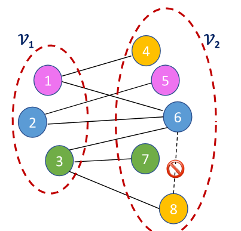

<!-- _class: lead -->

# Big Data and Society

**Class04 Affiliation Networks**

**國企 Wen-Bin Chuang**
**20246-02-14**

---

## Affiliation Networks附屬網路

###### Affiliation Matrix **附屬矩陣** (aka, Incidence Matrix **關聯矩陣**, or individual-by-group matrix **個體-群體矩陣**)

An affiliation network is a network where the members are affiliated with one another based on `co-membership` in a group, or `co-participation` in some type of event. 附屬網路是一種通過**共同成員身份**（co-membership）或**共同參與**（co-participation）某種事件而建立聯繫的網路。 

That is, individuals can be linked through **“affiliations”** that shared associations to groups or objects or be tied by the classes they have taken together. 具體而言，個體之間可以通過他們對**群體、物件或活動的共用歸屬關係**而產生關聯, 例如，一起上過同一門課程的學生、加入同一個社團的成員，或共同參與某個專案的人員。這種共用的“附屬關係”構成了網路中的連接基礎。

---

##### 密切相關的幾種網路結構和概念

- membership network **成員網路**: 描述個體通過共同隸屬於某個組織或機構而形成的網路。e.g. board of directors 典型例子是**董事會網路**（board of directors）——不同公司的董事若在多個公司交叉任職，這些公司之間就形成“連鎖”（interlock），而董事則通過其任職關係相互關聯。
- hypernetwork or hypergraph**超網路 / 超圖**: 在標準圖中，一條邊僅連接兩個節點；而在超圖中，一條**超邊**（hyperedge）可同時連接兩個以上的節點，自然地表示多個個體共同參與一個群體或事件的情形。附屬網路常可建模為超圖，其中每個群體就是一個超邊
- bipartite graphs **二分圖**: 附屬網路通常以**二分圖形式表示**：一類節點代表**個體**（如人），另一類節點代表**群體或事件**（如社團、課程、公司）。邊僅存在於兩類節點之間（人–群體），而同類節點之間無直接連接。通過對二分圖進行**單模投影**（one-mode projection），可得到個體之間的共現關係網絡。
- interlocks**連鎖關係**: 在組織層面（如企業董事會、學術委員會等）因**共用成員**而產生的結構關聯。例如，若某位董事同時在A公司和B公司任職，則A與B之間形成“連鎖”，這種結構可揭示權力集中、資訊流動或資源協同等現象。

這些概念共同構成了分析附屬關係、群體參與及跨組織連接的重要工具。

---

---

For example, company directors have the opportunity to interact with each other when they sit together on the same corporate board of directors.公司董事在共同任職於同一企業董事會時，便有機會彼此互動。

 Moreover, the companies themselves can be seen to be connected through their shared director memberships. 此外，**公司之間也可以通過共用的董事成員關係而相互連接**——也就是說，當同一位董事同時擔任兩家不同公司的董事會成員時，這兩家公司便通過該董事建立起關聯。
 
 That is, when the same director sits on two different company boards, those companies are connected through that director.  這種由人員重疊所形成的公司間連接，常被稱為“**董事會連鎖**”（board interlock），是附屬網路和組織網路分析中的一個經典案例。

---

#### Bipartite graphs **二分圖**

A bipartite graph is a graph whose vertices can be divided into two independent sets L and R such that an edge connects a vertex in L to one R. 二分圖是一種特殊的圖結構，其頂點集可以被劃分為兩個互不相交的獨立集合 L 和 R（也常記作 V1 和 V2），使得圖中的每一條邊都**僅連接一個來自** L **的頂點與一個來自** R **的頂點**

The corresponding graph that does not have these independent set partitions is called a folded graph. Connections are available only between the groups V1 and V2.

---

在附屬網路（affiliation networks）等實際場景中，二分圖常用於表示兩類不同實體之間的關係，In scenarios such as affiliation networks, bipartite graphs are commonly used to represent relationships between **two distinct types** of entities:例如：

- Individuals個體 ↔ Groups群體 (e.g., users and interest groups) （如用戶與興趣小組）
- Directors董事 ↔ Companies公司 (e.g., directors serving on multiple corporate boards) （如董事在多個公司任職）
- Students ↔ Courses 學生 ↔ 課程

When a bipartite graph is transformed into a one-mode projection containing only one type of node (retaining either just the individuals or just the groups), the result is known as a folded graph. 若將二分圖轉換為僅包含其中一類節點（如只保留個體或只保留群體）的單模網路（one-mode projection），則得到所謂的**折疊圖**（folded graph）。
In this folded graph, nodes of the same type that were originally indirectly connected via shared associations (such as two directors serving on the same board) become directly linked, thereby revealing latent collaboration or association structures. 在折疊圖中，原本通過共同關聯間接相連的同類節點（如兩位共同任職於某董事會的董事）被直接連接起來，從而揭示潛在的協作或關聯結構。

---

---

##### Incidence matrix 關聯矩陣

To do this, we would first need data in a matrix in which `rows` represent individuals (or species) and `columns `represent groups (or populations). 要構建附屬網路，首先需要一個**關聯矩陣**（也稱為**隸屬矩陣**或**個體**-群體矩陣**）。

Note that you could flip the columns and rows–either way is fine. You just need to be aware of how you arranged it. 

This type of data matrix is called an `incidence matrix` that depicts how $n$ actors belong to $g$ groups. 在這個矩陣中, **行**（rows）代表**個體**（如學生、董事、物種等），**列**（columns）代表**群體**（如課程、公司、棲息地等）。(行與列的角色可以互換（即用行表示群體、列表示個體），只要保持一致並清楚自己的資料結構即可。)

這種矩陣被稱為**關聯矩陣**，用於描述 *n* 個行動者（actors）如何隸屬於 g個群體（groups）。矩陣中的每個元素通常為 0 或 1（也可為權重值）：

- **1** 表示該個體屬於該群體，
- **0** 表示不屬於。

---

##### Unipartite Projections **單模投影**

One simple way is to do what is called a **one-mode projection** of this data by multiplying this matrix with the **transpose** of itself. 為了分析同類節點之間的關係（例如“哪些人經常一起出現”或“哪些課程有相似的學生”），我們通常通過**單模投影**（one-mode projection）將二模矩陣轉換為兩個單模矩陣.

Assume that the  dimensions  are  $n$  rows  and  $g$ columns, respectively. 假設關聯矩陣 A 的維度為 n×g . n 行代表 **行動者**（actors），g 列代表 **群體/事件**（groups/events）. 

If actor i attends event j, the entry in the i, jth cell in the matrix equals 1; otherwise, the entry is 0. 若行動者 i 參與了事件 j，則 Aij=1，否則為 0。 `Projection`, reduces a 2-mode matrix to a pair of 1-mode matrices.  

---

---

###### 行動者–行動者投影(Actor Co-attendance Network)

The first result,  $X^A$ ,  is  a  symmetric,  valued  matrix  of  coattendances  for  pairs  of `actors`, obtained as the product of matrix multiplication:
$$
X^A =AA^{T}
$$

- $X^A$ is a $n*n$ matrix and her nondiagonal cell values are the numbers of `actors (node)` attended by both actor i and actor j. The diagonal entries show the number of events each actor attended. **對角線元素**  表示行動者 i **總共參與的事件數**。**非對角線元素**  表示行動者 i 和 j共同參與的事件數量（即`共現次數`）

該矩陣可用於構建**行動者之間的社交網路**，邊權重反映合作或互動強度。

---

###### 群體–群體投影（Group Overlap Network）

The second result, $X^E$ , is a symmetric, valued matrix of coparticipants at pairs of `groups(class)`, obtained by multiplying the matrices in reverse order:
$$
X^E =A^{T}A, 
$$

- $X^E$ is a $g*g$ matrix and the nondiagonal cells of this matrix are the number of actors participating in both group i and group j, whereas the diagonal entries of $X^E$  are the number of actors attending each group.

At the network level of analysis, **mean rates** of activity are readily computed  from  values  in  the  two  projection matrices. **對角線元素** 表示參與群體 k 的**總行動者人數**, **非對角線元素** 表示群體（或事件）k 和 l共用的行動者數量. 

該矩陣可用於分析課程相似性、會議重疊度、組織協同性等。

---

###### 網路層面的匯總統計

The average activity level can be quickly calculated from the diagonal of the projection matrices. 從投影矩陣的對角線可快速計算平均活躍度：

- Average number of participants per event **每個事件的平均參與人數**：
$$
\text{Mean group size}= \frac{\text{diag}(X^E)}{g}
$$

- Average number of events participated in per actor**每個行動者的平均參與事件數**：
  $$
  \text{Mean actor size}= \frac{\text{diag}(X^A)}{g}
  $$

This matrix multiplication-based projection method is concise and efficient, serving as a standard technique in social network analysis for handling affiliation or participation data. 這種基於矩陣乘法的投影方法簡潔高效，是社會網路分析中處理隸屬或參與資料的標準技術。

---

The adjacency matrix of `each one-mode projection` can be obtained with the **project_affiliation_network** function. 每種**單模投影**（one-mode projection）的鄰接矩陣都可以通過 project_affiliation_network 函數生成。

In the code below, notice how the **edge attribute weight** is specified. This produces a valued adjacency matrix, where the values indicate how many ties connect any of the nodes. 特別注意如何指定 **邊屬性 weight**。該設置會生成一個**帶權鄰接矩陣**（valued adjacency matrix），其中每個非零元素的值表示對應節點對之間通過多少個共同關聯（即共現次數）而連接。

--- 

So, for example, the Class adjacency matrix indicates that classes 2 and 3 have a weight of 2. This reflects the observation we made earlier that classes 2 and 3 share two students. 在**課程的鄰接矩陣**中：課程 2 與課程 3 之間的權重為 **2**，這正反映了我們之前的觀察：**這兩門課程共有兩名學生**（S3 和 S4）。

Similarly, in the adjacency matrix of students: if Student A and Student B have co-enrolled in 3 courses, the weight of their connection in the projected network is 3. 類似地，在**學生的鄰接矩陣**中：若學生 A 與學生 B 共同選修了 3 門課程，則他們在投影網路中的連接權重為 3。

This weighted representation not only preserves the binary information of whether a connection exists but also quantifies the strength or degree of overlap in their association. This provides richer structural information for subsequent analyses, such as community detection, centrality analysis, or clustering. 這種帶權表示不僅保留了連接是否存在（二值資訊），還量化了關聯的**強度或重疊程度**，為後續的社區發現、中心性分析或聚類提供更豐富的結構資訊。

----

Affiliation networks (also called two-mode or bipartite networks) are a cornerstone of network science, bridging sets like actors-events or users-items.附屬網路（又稱二模網路或二分網路）是網路科學的核心模型之一，用於連接兩類不同實體，如“行動者–事件”或“用戶–物品”。 

We've covered the basics—building from matrices/edge lists, visualization with shapes/colors, projections, and tie strengths. 已掌握了其基礎內容：從關聯矩陣或邊清單構建網路、通過節點形狀與顏色進行視覺化、生成單模投影，以及分析聯繫強度。

- Key Metrics: quantify "hub" students (high centrality) or fragmented classes (low modularity) **核心指標分析**：量化網路中的結構性特徵，例如識別具有高中心性（如度中心性、介數中心性）的“樞紐型學生”，或評估課程群體是否高度分散（如通過低模組度反映社區結構鬆散）。

- Community Detection and Clustering **社區發現與聚類**：在單模投影網路中應用社區檢測演算法（如Louvain方法），發現具有相似隸屬模式的學生子群或高度重疊的課程簇，從而揭示潛在的功能模組或興趣社群。

---

- **Link Prediction and Recommendations**: Predict missing affiliations (e.g., suggest classes for students based on similar peers) **連結預測與推薦**基於現有隸屬關係預測缺失的連接。例如，根據與某學生選課行為相似的同伴所修課程，為其推薦可能感興趣的課程——這是協同過濾和個性化推薦系統的重要基礎。

These advanced methods enable affiliation networks to move beyond descriptive analysis, supporting prediction, intervention, and intelligent decision-making. They hold broad application value across diverse scenarios, including education, organizational management, social platforms, and business recommendation systems.這些進階方法使附屬網路不僅停留在描述性分析，更能支持預測、干預與智慧決策，在教育、組織管理、社交平臺和商業推薦等場景中具有廣泛應用價值。

---

Link prediction aims to forecast missing or future edges in a network based on existing structure.連結預測（Link Prediction）旨在基於網路的現有結構，預測其中**缺失的或未來可能出現的連接**。 

In affiliation (bipartite) networks, this typically means predicting new connections between the two partitions (e.g., which class a student might join next). 在附屬網路（即二分圖）中，這一任務通常意味著預測**兩個不同集合之間的新關聯**，例如：某位學生接下來可能選修哪門課程、用戶可能喜歡哪個商品，或董事可能加入哪家公司。Common approaches include 常見的連結預測方法:

---

- **Topological Methods**拓撲結構方法: Use graph structure like common neighbors (shared affiliations), Jaccard coefficient (overlap ratio), or Adamic-Adar (weighted by rarity of shared nodes). 利用網路的局部結構特徵進行預測 , **共同鄰居**（Common Neighbors）：兩名學生若已共同出現在多門課程中，則更可能在未來繼續共用新課程**Jaccard** **係數**：衡量兩個節點鄰居集合的重疊比例（如兩門課程的學生群體重合度）；**Adamic-Adar** **指數**：對稀有共同鄰居賦予更高權重，強調“通過小眾群體建立的聯繫”更具信息量。

- **Probabilistic Models**概率模型**:** Like matrix factorization or random walks, estimating edge probabilities. 如**矩陣分解**（Matrix Factorization）將關聯矩陣分解為低維潛在因數，用於估計未觀測邊的概率；或基於**隨機遊走**（Random Walk）的方法，類比資訊在二分圖中的傳播路徑以評估連接可能性。

---

- **Machine Learning:** Train classifiers on node features (e.g., degrees) to predict edges. 將連結預測轉化為分類問題，利用節點特徵（如學生選課數量、課程受歡迎程度）或成對組合特徵（如度數乘積、路徑長度）訓練分類器（如邏輯回歸、梯度提升樹），預測是否存在潛在連接。

- **Why It Matters:** In real-world scenarios, it powers personalized suggestions (e.g., LinkedIn connections) or fraud detection (anomalous affiliations). 連結預測是許多現實應用的核心技術，例如：**個性化推薦**（如 LinkedIn 推薦人脈、電商平臺推薦商品）；**異常檢測**（如識別可疑的董事兼任關係或虛假帳戶行為）；**資源匹配優化**（如將學生精准匹配到適合的課程或項目）。

---

Challenges: Bipartite graphs lack intra-partition edges, so predictions focus cross-partition.  由於二分圖內部同一集合的節點之間**不存在直接連接**，所有預測必須聚焦于**跨集合的邊**。

Avoid overfitting by splitting data into train/test (e.g., remove 20% edges for testing).為避免過擬合，應將原始邊集劃分為訓練集與測試集（例如隨機移除 20% 的邊作為待預測目標），並在未見資料上評估模型性能。此外，需注意冷開機問題（新學生或新課程缺乏歷史資料）以及資料稀疏性對預測準確率的影響。

