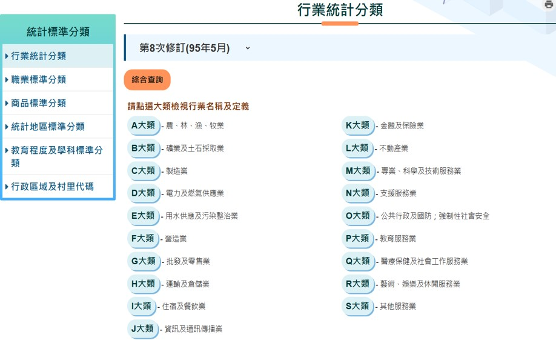
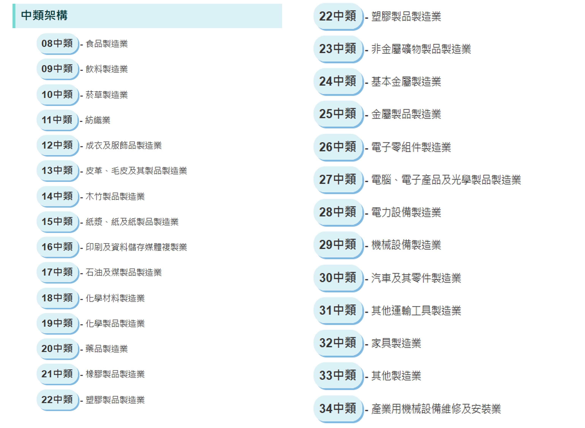
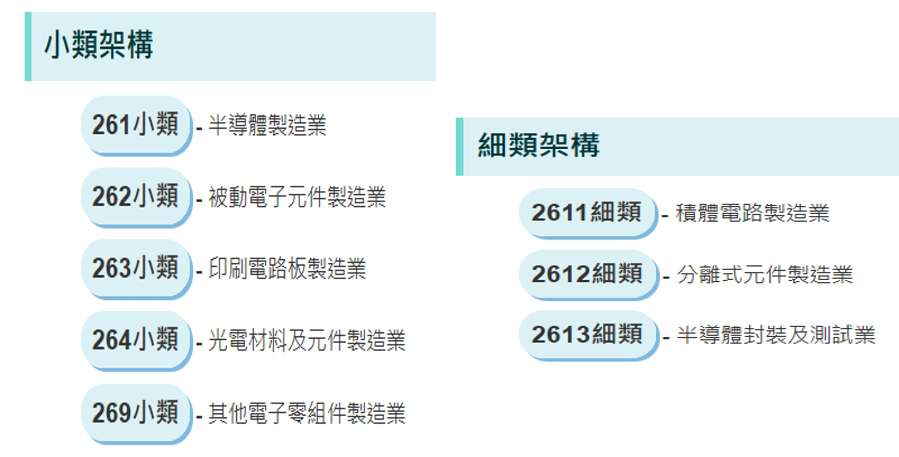

<!-- _class: lead -->

#### Competitors and Competition

##### 競爭者和競爭

**國企 Wen-Bin Chuang**
**2026-09-14**

----

#### Competition 競爭

- 如果某一家企業的`策略選擇`對另一家企業的`業績(績效)`產生不利影響，則它們互為`競爭對手`。
- 一家企業可能同時在多個投入市場和產出市場擁有競爭對手。
- 競爭可以是`直接的`，也可以是`間接的`。

----

#### 直接與間接競爭對手

- **直接**競爭對手：某一家企業的策略選擇`直接影響`另一家企業的業績。
- **間接**競爭對手：某一家企業的策略選擇會`通過第三家企業`(? Who?協力廠商 ?)的反應，`間接影響`另一家企業的業績。

----

#### 替代品的特徵

- 實際中，任何生產**替代品**的企業都可以視為 **競爭對手**。  
- 兩種產品若具備以下特徵，通常互為緊密替代品：    
  - 具有相似的**性能特徵**  
  - 使用**場合相似** 
  - 在同一**地理區域銷售**

----

#### 性能特徵

- **性能特徵** 描述產品為顧客提供的**功能**。
- 屬於同一類別或同一`標準行業分類(SIC)`的 產品未必是替代品（例如：賓士與現代），若其性能特徵差異巨大。
   
   - 汽車行業的例子：座位容量,    外觀吸引力,    動力與操控性,    可靠性
   

---

#### 標準行業分類(SIC)

- `產品`和`服務`通過 代碼進行識別。
  - https://www.stat.gov.tw/standardindustrialclassification.aspx?n=3144&sms=0&rid=8
  - 每一位數字代表更細化的分類層級。  

- 屬於同一類別或相同SIC代碼的產品**未必是替代品**。

---

---

---

----

#### 使用場合

- 產品可能具有`相似特徵`，但**使用時機不同**。
- `豆漿`和`可樂`雖同為飲料，但消費場合不同。
- 另一個例子：`溜冰鞋` vs. `羽球鞋`

----

#### 地理區位競爭對手的識別

- 當企業在不同地理區域銷售時，需分別識`個別區域內`的競爭對手。
  - 位於兩個不同地理市場中的相同產品，由於**運輸成本**的存在，並非替代品。 
  - 企業不應僅依賴**行政區**來劃分，而應關注商品和服務在各**區域間的流動情況**。

---

#### 識別區域內的競爭對手

- Step 1:確定`顧客來源地`
- Step 2:調查該區域居民的`購物地點`
  - 對於通過**網路平台銷售的產品（如圖書、藥品）**，識別地理區位的競爭變得更為困難。

---

#### Market Structure市場結構

- `產業經濟學`定義的市場通常以其**集中程度**來描述。 

  - `壟斷（獨占）`是集中度最高的極端情況: 僅有`一個`賣家, **市場控制力強**。  
  - `完全競爭`是另一極端 : 賣家數量眾多且不可計數, `個別企業`對市場的**控制力微弱**。

----

#### 市場結構的衡量指標

###### 產業集中度（Concentration Ratio, CRn）

- **定義**：某產業中**前 n 家最大企業**的市場佔有率總和，最常用的是 **CR4**（前四大）與 **CR8**（前八大）。

$CR_n=\sum_{i=1}^n S_i$ , $S_i$ 個別企業的市場佔有率

- **判讀（常見的貝恩 Bain 分類經驗法則）**：
  - CR4 ≥ 75%：極高寡占; 
  - 50% ~ 75%：中高寡占; 
  - 35% ~ 50%：中低寡占; 
  - CR4 < 35%：競爭型市場

---

#### 赫芬達爾—赫希曼指數（HHI, Herfindahl-Hirschman index）

**定義**：產業中**所有企業**市場佔有率的平方和：

$HHI=\sum_{i=1}^N(S_i)^2$ 

- 以百分比整數計算，範圍為 `0 ~ 10,000`。
- 判讀（美國司法部標準）：
  - HHI < 1,500 為競爭市場；
  - 1,500 ~ 2,500 為中度集中；
  - 2,500 為高度集中（寡占）。

---

| 指標    | 衡量角度             | 核心公式              | 優點                     | 主要侷限                    |
| ------- | -------------------- | --------------------- | ------------------------ | --------------------------- |
| **CRn** | `前幾大`企業份額     | $\sum_{i=1}^n S_i$    | 簡單直觀、資料易得       | 忽略 n 名以外企業與內部差異 |
| **HHI** | `全體企業`份額平方和 | $\sum_{i=1}^N(S_i)^2$ | 放大巨頭權重、對併購敏感 | 需全樣本資料                |

---

| **維度**         | **完全競爭** **(Perfect Competition)** | **壟斷競爭** **(Monopolistic Competition)** | **寡頭壟斷** **(Oligopoly)** | **完全壟斷** **(Monopoly)** |
| ---------------- | -------------------------------------- | ------------------------------------------- | ---------------------------- | --------------------------- |
| **典型行業**     | 農產品（小麥、玉米）                   | 餐飲、服裝、洗髮水                          | 飛機製造、電信運營商、汽車   | 自來水、電網、專利藥        |
| **企業數量**     | 無數家                                 | 很多家                                      | 少數幾家（2-10家）           | 唯一 1 家                   |
| **產品差異**     | 完全無差異（同質）                     | 有差異（品牌/特色）                         | 同質或差異皆可               | 獨一無二（無替代品）        |
| **進入壁壘**     | 無                                     | 較低                                        | 很高                         | 極高（不可逾越）            |
| **定價能力**     | 無（接受市場價格）                     | 較弱（有一定品牌溢價）                      | 較強（受制于競爭對手）       | 極強（受制於政府管制）      |
| **HHI** **數值** | 接近 00                                | <1,500                                      | >2,500                       | 10,000                      |

----

#### Perfect Competition完全競爭

- 眾多賣家出售 **同質產品**
- 眾多**資訊充分**的買家
- 消費者可**無成本地**比價
- 賣家可**無成本地 自由進出市場**
- 每家企業面臨**無限彈性的需求曲線**

----

#### 農產品市場（如全球小麥、大豆或玉米市場）

- 假設你是一位種植小麥的農民。全球有成千上萬的農民在種植小麥,且消費者（如麵粉廠）認為張三的小麥和李四的小麥沒有任何區別（**完全同質**） 。
- 如果你試圖把小麥價格提高 1 毛錢，麵粉廠會立刻轉向其他農民購買，你的銷量會瞬間降為零。
- 因此，`單個農民`對`市場價格`沒有任何影響力，只能被動接受市場供需決定的均衡價格。

- 現實中不存在100%完美的完全競爭，農產品市場是最接近的理論模型。
             

---

#### 激烈價格競爭的條件

即使**未完全滿足理想條件**，只要滿足以下兩項或以上，價格競爭仍可能非常激烈：

- 賣家眾多
- 顧客認為**產品同質**
-  **產能過剩**

----

####  Homogeneous Products同質產品

- **降價**可帶來三方面收入增長：
  - 原有顧客購買更多 
  - 吸引新顧客
  - 競爭對手的顧客轉向本企業
  - **下下策！！！！**

---

#### Excess Capacity產能過剩

- 企業若`未滿負荷運營`，可將價格定在平均成本以下，以覆蓋可變動成本。
- 若整個行業產能過剩，價格可能低於平均成本，部分企業可能選擇退出。
- 若退出不可行（例如產能具有行業專用性）， 產能過剩與虧損將持續一段時間。
- **真的不好嗎?** 

---

#### Monopoly 獨占(壟斷)

- 在市場上幾乎不受競爭約束。
- 可在`需求允許範圍`內**自由設定價格或品質**。
- 若存在邊緣小企業，其決策對獨占者的利潤影響甚微。

----

###### 在大多數城市，只有一家自來水公司為你提供自來水。

- 為什麼是壟斷？ 這是一個**自然壟斷（Natural Monopoly）**。如果允許多家公司競爭，每家公司都要在城市地下重新鋪設一套水管網路，這會導致巨大的資源浪費和極高的成本。因此，由一家企業統一鋪設管網、集中供水是成本最低、效率最高的**規模經濟**。
- 結果：由於沒有其他選擇，自來水公司是絕對的壟斷者。但為了防止它利用壟斷地位收取天價水費，政府通常會對其進行嚴格的**價格管制（Price Regulation）**和**品質監督**。
- 其他壟斷案例：擁有`特效藥`核心專利的製藥廠在專利期內的法定壟斷；某些國家的煙草專賣局。
               

----

#### 獨占與創新

獨占者有時是因**生產效率更高**或更充分滿足**消費者需求**而成功取得壟斷地位。  

- 因此，在企業通過`正當競爭`成為獨占者的情形下，消費者可能成為淨受益者。
- 現主時, 獨占者比完全競爭市場中的企業更有動力**創新**，因其能繼續維持壟斷地位, 來獲取部分創新收益。由於消費者同樣從創新中受益，若長期限制 獨占者利潤，反而會損害消費者利益。
- **熊彼得說**

---

#### 獨占性競爭

- 賣家眾多，且各賣家自認自身行為不會**顯著影響競爭對手**。

  - 每個賣家銷售 **差異化產品**。  

  - 與完全競爭不同，獨占競爭中各企業面臨向下傾斜的需求曲線，而非水平線。

    - 代表有自主決定價格的能力
    
    
    

- 在一個城市裡，有星巴克、85度C，也有無數街角的獨立咖啡館。雖然它們賣的都是**咖啡**（核心功能相同），但它們在口味、店內環境、品牌文化、地理位置上存在`一點點`差異化。因為這種**差異化**，街角咖啡館即使比隔壁店貴 2 塊錢，依然會有喜歡它特定口味的老顧客光顧（擁有局部的壟斷定價權）。
  
  - 但同時，如果它漲價太離譜，顧客就會流失到其他咖啡店（面臨激烈的競爭）。   

  - 開一家新咖啡館的資金和技術門檻不高（低進入壁壘）。

---

#### 垂直與水平差異化

- `垂直差異化`產品：`品質`差異明確（如高端 vs. 低端）  

- `水平差異化`產品：`產品特性`不同，以吸引不同消費群體  

---

###### 汽車業 - Lexus vs Toyota

- 策略核心：同一集團內的品質層級分化
- 豐田汽車建立了清晰的品牌層級體系，最高層級包括 Toyota、Lexus、Scion、Daihatsu、Hino 等五個傘品牌
- `垂直差異化`特徵：
  - Toyota：以品質穩定、可靠耐用聞名的`大眾市場`定位 
  - Lexus：高端豪華品牌，提供更卓越的工藝、性能和服務品質
  - 消費者普遍認同 Lexus 的品質高於 Toyota，這是客觀一致的判斷

-----

#### Apple 產品線 - 價格與性能的垂直分化

- 策略核心：通過`規格`與`價格`建立清晰層級
  - Apple 通過垂直整合與封閉平台戰略，創造出`差異化`的產品體系 。
  - iPhone 產品層級（2026年）：
    -  **iPhone 17 Pro/Pro Max**：頂級旗艦，最高規格
    - **iPhone 17/17 Plus**：中高端主流產品
    - **iPhone SE**：入門級產品
  - **Mac 與 iPad 層級：**
    - 通過處理器性能、記憶體、儲存容量等客觀指標進行區分
    - 2026年6月全球調漲售價，部分 MacBook 規格價差達幾千到上萬台幣 
    - 價格差異直接反映在性能和功能上，消費者可明確判斷優劣

----

#### 服裝零售 - Banana Republic vs GAP vs Old Navy

- 策略核心：同一集團內的三層級定位
- 這三個品牌都屬於 **Gap Inc**.，但定位於不同品質與價格層級 ：
  - Banana Republic：高端時尚，較高品質面料和設計
  - GAP：中端主流品牌，平衡品質與價格
  - Old Navy：平價快時尚，強調性價比
- 垂直差異化邏輯： 消費者可以客觀判斷 Banana Republic 的產品品質高於 GAP，GAP 高於 Old Navy，這種品質差異反映在面料、剪裁、設計細節等方面。         

---

#### 地理區位與水平差異化

- `雜貨店`依靠`地理位置`吸引顧客。  
- 消費者基於**交通成本**選擇商店。  

  - 交通成本使消費者不會因微小價格差異而更換購買地點。

---

####  獨特偏好 Idiosyncratic Preferences

- `獨特偏好`也產生水平差異化。  
- **地理位置**和**口味**是獨特偏好的重要來源。
- **搜索成本(search cast)** 會抑制消費者在漲價時轉向其他賣家。

----

#### 星巴克（Starbucks）的地理差異化策略

- **全球本土化策略：**
  - 星巴克在全球擴張時，會根據不同地理區域的**文化特色**進行產品調整 
  - 中東地區推出**豆蔻**風味咖啡，亞洲地區推出**月餅風味**拿鐵等本土化產品 
    - 在中東地區，加入豆蔻的咖啡被稱為"**Gahwa**"（阿拉伯咖啡），這是幾個世紀以來的傳統, 中東許多國家都有在咖啡中加入豆蔻的習慣，包括Levant地區（巴勒斯坦、敘利亞、黎巴嫩、約旦）和沙烏   地阿拉伯等海灣國家. 星巴克的月餅**靈感來自其經典飲品**，例如：**榛果拿鐵月餅**,**抹茶拿鐵月餅**,**香草拿鐵月餅**
    -  在不同國家開設門市時，會考慮當地的文化、消費習慣進行客製化

**地理區位選擇：**

- 採用市場滲透策略，在已有據點的國家開設更多門市 
- 根據地理位置進行市場細分，考慮氣候、文化、人口等因素

----

#### 麥當勞（McDonald's）的區位與水平差異化

- 地理位置策略：
  - 麥當勞使用「3英里規則」分析選址，評估半徑內的一切因素. 即使是相距僅0.4英里的兩家門市，也會因位置不同而出現完全不同的客群模式 
  - 水平差異化（菜單本土化）：
    - 中東地區推出**McArabia三明治** 
    - 俄羅斯推出麥當勞湯品，根據地區偏好調整菜單 
    - 當地所有權使菜單和促銷活動能夠適應區域偏好

----

##### 可口可樂的地理區位差異化

- **區域營運策略：**
  - 將歐洲地區原本統一的營運單位，依地理區域分割為**十個獨立單位**, 九個單位的最高階主管都是非美國籍，落實本土化管理 
  - 推出本土化口味的創新產品 
  
  
  
- **水平差異化競爭：**
  - 可口可樂與百事可樂的競爭中，產品本身品質相近，但通過**品牌定位**、**口味偏好**形成水平差異 
  - 消費者選擇基於主觀偏好而非品質高低

---

##### 搜索成本與差異化

- **搜索成本：獲取替代品資訊所需的成本**  

  - 低價賣家會嘗試降低消費者的搜索成本（例如通過廣告）  

- 某些市場搜索成本很高（例如醫生服務）

---

#### Oligopoly寡占壟斷

- 市場中僅有`少數賣家`。  每家企業的定價與產量決策都會影響整個行業的價格與產出。  
- 寡占模型聚焦於**企業如何對彼此行為作出反應**。

----

#### 一個典型的雙寡頭壟斷（Duopoly）市場。

- 極高的壁壘：研發一架大型客機需要數百億美元的資金、頂尖的航空技術以及極其嚴苛的安全認證。新公司幾乎不可能進入這個市場。
- **相互依賴**：波音和空客在制定價格或推出新機型（如波音737 MAX vs 空巴 A320neo）時，必須時刻盯著對方的動作。如果波音降價，空巴為了保住市場份額也必須跟進降價，從而引發博弈。

---

#### 價格-成本加成Price-Cost Margins與市場集中度

- 理論預測：`集中度越高`的行業，`價格-成本加成（price-cost margin）`越高。 
- 但 `加成差異` 也可能由其他因素導致：
  - 政府監管 
  - 會計準則差異 
  - 買方集中度

- 為準確研究集中度與加成之間的關係，必須控制上述干擾因素。  
-  多數實證研究聚焦於特定行業，並比較地理上分離的市場。

---

##### 關於集中度與價格的實證證據

- 在多個行業中，集中度更高的市場通常價格更高。

  - 對於當地服務的企業（如醫生、水管工等）， “進入門檻” 即支撐一定數量賣家所需的人口規模

- 在賣家數量從1家增至2家時，可以服務的人口規模增加約四倍。

