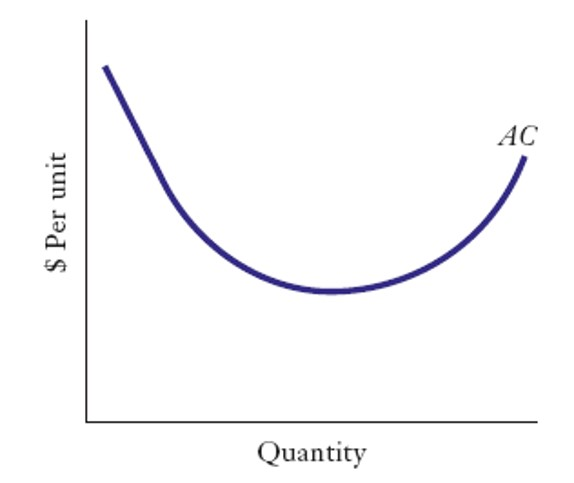
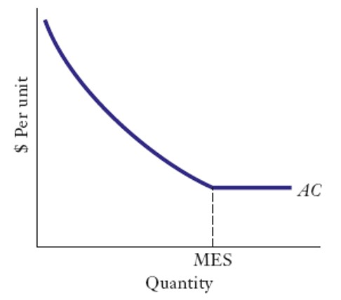
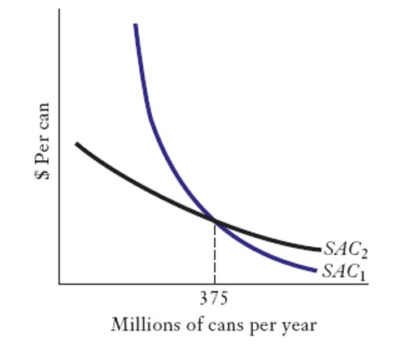
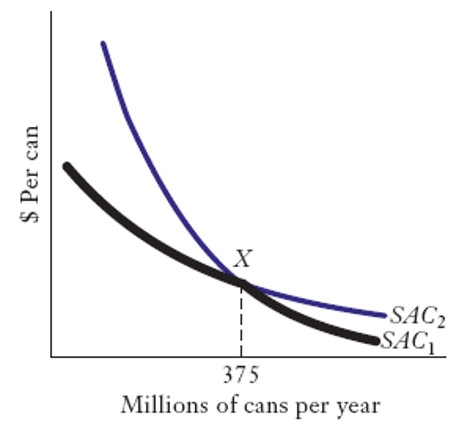
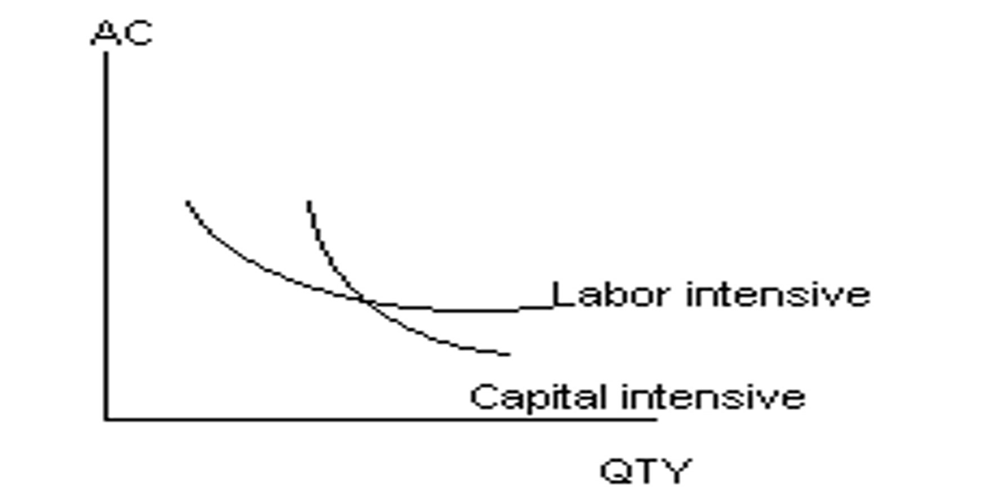
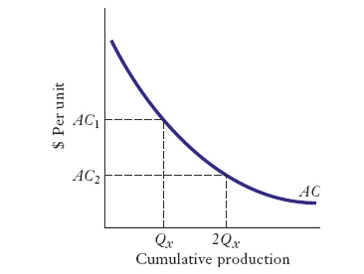

<!-- _class: lead -->

#### Economies of Scale and Scope

##### 規模經濟與範圍經濟

**國企 Wen-Bin Chuang**
**2026-09-14**

----

#### 水平邊界 Horizontal Boundaries of the Firm 

- 企業服務於`多大`的市場？ 
  - 在某些行業中，`少數大型企業`主導市場（如商用飛機製造）。 
  - 在另一些行業中，小型企業是常態（如服裝設計、大學）。 
  - 還有一些行業，大企業和小企業`共存`（如軟體、啤酒、銀行、保險公司）。

-  是什麼決定了企業的`水平邊界`？

- 企業應如何`適當地`選擇其水平邊界？

----

#### 水平邊界的決定因素

-  `規模經濟` — 隨著`產量`增加，平均成本下降。
-  `範圍經濟` — 在“同一企業屋簷下, `生產不同產品或服務`所帶來的成本節約。
- `學習曲線`  — 通過`累積`的專業知識和經驗獲得的成本優勢。

----

#### 規模經濟（Economies of Scale）

- 帶來`成本優勢`, 可以決定市場結構與進入壁壘(參進障礙) 

- 會影響企業的內部組織形式 , 進而決定企業的**橫向邊界** （吃下多大的市場）

- 平均成本隨產量增加而下降時，存在**規模經濟**（Economies of scale）。 

- 若平均成本隨產量增加而上升，則為**規模不經濟**（Diseconomies of scale）。

----

#### U型成本曲線

- 隨著**固定成本**被分攤到更大的產量上，平均成本下降。
- 但當`產能約束`顯現後，平均成本最終會上升。

  - U型曲線意味著`極小`和`極大`的企業都處於成本劣勢。
  - 企業存在唯一的最優規模。

----

----

####  L型成本曲線

- 現實中，成本曲線更接近`L型`而`非U型`（Johnston’s Study）。 大型企業相對於小企業很少處於成本劣勢。  

- 存在一個 **最小有效規模（Minimum Efficient Scale, MES）**，超過該規模後，各企業的平均成本趨於一致。

---

---

#### Economies of Scope範疇經濟

- 企業1生產兩種產品：A和B。
- 企業2僅生產產品A。
- 如果企業1 在生產A的成本方面低於企業2，則存在`範圍經濟`

  - 多生產B可以減少生產A的 **增量成本（incremental cost）**。

---

#### 規模經濟與範疇經濟的來源

- **固定成本**的分攤  

- **可變投入要素生產率** 的提升  

- **庫存**上的節省  

- **立方–平方**定律（Cube-Square Rule）

----

#### Fixed Costs固定成本

- **不可分性 (Indivisibilities)**:某些投入無法低於某一最低規模。 
- 不可分性導致`高昂固定成本`，從而產生規模經濟與範圍經濟。 

- 規模與範疇經濟可出現在不同層面：   
  - 產品層面
  - 工廠層面 
  - 多工廠層面

---

#### 產品上的專屬固定成本

- 研發（R&D）  
- 專用生產的設備  
- 建立生產的設置成本（Set-up costs）  
- 人才培訓支出

----

###### Tradeoff Among Technologies技術之間的權衡技術之間的權衡

----

----

#### 長期與短期

- 在`短期`內，**增加產量**可帶來規模經濟。
- 在`長期`內，通過**選擇合適的技術**實現規模經濟。

- 長期與短期
  - 通過更充分地**利用產能**降低成本（短期規模經濟）。 
  - 通過轉向 `高固定成本技術` 降低成本（長期規模經濟）。

----

----

#### 規模經濟與專業化(specialization)

- `分工`受市場範圍限制（亞當·斯密）
  - 隨著市場規模擴大，規模經濟使 **專業化** 成為可能。  
  - 更大的市場催生`專業化企業`

- 當市場進一步擴大時，由於規模經濟，這些**專業化**活動可能轉為**內部化（in-house）**。

----

- 「可變投入要素生產率」（Productivity of Variable Inputs，如勞動力、原材料等）的提升，是企業降低平均成本、獲取競爭優勢的核心機制。

  - 當生產規模擴大時，企業可以將生產過程細分為`更小的環節`。工人（可變投入）專注於單一重複性任務，並透過「熟能生巧」（Learning by doing）顯著提升邊際產量與平均產量。
  - 大規模生產者對原材料（可變投入）的需求量大，不僅能獲得`價格折扣`，還能要求供應商提供更高品質、規格更統一的原料。
  - 一個專業的銷售團隊或研發人員（可變投入）同時推廣或開發多條相關產品線。由於產品間存在技術或市場的關聯性，銷售人員在拜訪同一客戶時可交叉銷售（Cross-selling）
----
#### 庫存 Inventories

- 企業持有`庫存`以避免缺貨。缺貨不僅導致銷售損失，還可能損害客戶忠誠度。  

- 相對於銷售額，大企業能夠以`更少的庫存（比例更低）`運營，而小企業則需持有相對更多的庫存。

---

#### 立方–平方定律 Cube-Square Rule

- 空心球體**直徑加倍**時，**體積**增至**8倍**，但**表面積**僅增至**4倍**。  

- 在生產中，容器成本常與表面積相關，而產能與體積相關, 由此產生規模經濟。

---

#### 採購中的規模經濟

- 單一買家銷售成本更低（例如：團體保險比個人保險更便宜）。  

- 大買家價格敏感度更高，可能向供應商壓價。  
  - 供應商為避免交易中斷，可能向大買家提供更優條件。  

- 小企業可通過**聯合採購聯盟**（purchasing alliances） 獲得類似優勢。

---

#### 廣告中的規模經濟

- 花在每位客戶的廣告成本 =（接觸每位潛在客戶的成本）×  （潛在客戶轉化為實際客戶的比例） 

- 大型企業接觸每位**潛在客戶的成本更低**（第一項）。大型企業也擁有**更廣的覆蓋範圍**（第二項）

- 大型**全國性企業**接觸每位潛在客戶的廣告成本，低於**區域性小企業**。  

- 廣告製作成本及與媒體談判的成本可分攤到多個市場。

---

#### 傘形品牌特性(Umbrella Branding) 與範疇經濟

- 知名品牌（如三星）覆蓋多種產品。  

- 品牌的開發與維護存在`範圍經濟`。  

- 若已有具有良好形象的品牌，推出新產品更容易被市場接受 （例如：SONY 推出數位相機 $\alpha$）

---

#### Apple（蘋果）

Apple（蘋果）- 科技業的`傘形品牌`典範
品牌架構： Apple是全球最有價值的品牌，採用單一品牌覆蓋所有產品線。

- 產品範疇：

  - 硬體產品：iPhone、iPad、MacBook、iMac、Apple Watch、AirPods、HomePod

  - 服務：Apple Music、Apple Pay、Apple TV+、iCloud

  - 金融：Apple Card(信用卡)

- 策略演變：
  - Steve Jobs時代：商品策略極簡，僅四個象限（消費級/專業級 × 桌上型/可攜式）
  - 庫克擴張：延伸到智慧音箱、手錶、甚至金融服務，但所有產品仍緊密連結在Apple品牌下

---

#### Adidas

Adidas - 運動用品的全方位品牌
品牌範疇： Adidas從運動鞋起家，擴展到全方位的運動用品。

- 產品線：
  - 鞋類：NMD_R1、Ultraboost等
  - 服裝：運動褲、短褲、T恤、外套
  - 配件：背包、帽子、襪子
  - 運動器材：足球、護具
  - 生活風格商品：手機殼、太陽眼鏡
- 品牌定位：
  - 核心始終是運動表現，時尚和生活風格是次要的
  - 理解到在運動領域的成功和聲譽，才能支撐時尚面向

----

#### Samsung

Samsung使用單一主品牌行銷廣泛的電子產品。

- 產品類別：
  - 智慧型手機和平板：Galaxy系列
  - 家用電器：冰箱、洗衣機、電視
  - 半導體和元件
  - 顯示器技術
- 品牌優勢：
  - 消費者對一個商品的信任會延伸到其他商品類別
  - 強調創新和市場細分，但所有商品都統一在Samsung品牌下
  - 在全球市場建立一致的品質和創新形象

---

#### 傘形品牌特性的局限性

- 傘形品牌特性並非總是有效。 
  - 例：在美國，Lexus與豐田（Toyota）是分開的品牌。 
  - **Nisson** and **Infiniti**?  
  - **Honda** and ?

- 品牌形象衝突可能導致不經濟（Diseconomies of scope）。
  - 在某些行業（如製藥），企業品牌不如具體產品品牌重要。

---

#### 柯夢波丹（Cosmopolitan）優格

媒體品牌跨界`食品`的災難

- 背景：全球最成功的女性雜誌之一，嘗試推出「Cosmopolitan`低脂優格`」

- 品牌形象衝突：
  - 原有定位：女性時尚雜誌，提供健康、營養建議
  - 延伸邏輯：認為讀者會信任其推出的任何產品
  - 實際問題：消費者無法理解雜誌為何'推薦`生鮮食品
- 失敗原因：
  - 產品與雜誌核心業務缺乏實質關聯 
  - 消費者質疑品牌的倫理和使命 
  - 僅在18個月內就宣告失敗
- 教訓： 即使是內容品牌，也不能隨意延伸到`完全不相關`的實體商品類別。

----

#### 李維斯（Levi's）男士西裝

- `休閒`vs`正式`的定位衝突

- 背景：1980年代初期，牛仔褲市場領導者嘗試推出男士西裝系列 

- 品牌形象衝突：
  - 原有形象：休閒、舒適、耐用、戶外風格
  - 延伸產品：正式西裝
  - 目標客群問題：新客戶不買帳，老客戶不需要

---

教訓： 品牌延伸不能跨越到與核心USP（獨特銷售主張）對立的類別。

- 關鍵警示
- 品牌不是萬能的：強大的品牌也有延伸邊界
- 契合度至關重要：母品牌與延伸產品必須有邏輯關聯
- 消費者認知是王道：不管企業怎麼想，消費者買單才是關鍵
- 及時止損：發現衝突時應果斷終止商品線
- 考慮獨立品牌：如吉百利的「Smash」，用新品牌重新定位

---

#### 研發（R&D）中的規模經濟

- 研發項目和研發部門存在**最小可行規模(MES)**。
  - 企業規模可降低創新的平均成本。 
  - 但小型組織可能更適合激勵研究人員。    

- 研發中也存在範疇經濟：
  - 一個項目的想法可協助另一項目。

---

#### Strategic Fit 策略契合

- 策略契合是指**互補性**所帶來的`範疇經濟`。 
- 這種契合使競爭對手無法通過 **零散模仿** 獲得同等優勢。  
- 策略契合是長期競爭優勢的關鍵。

---

#### Diseconomies of Scale規模不經濟

- 超過某一規模後，`更大`未必`更好`。

- 規模不經濟的來源包括：    
  - 勞動力成本上升    
  - 專業化資源過度分散 
  - `利益衝突`（Conflicting out）    
  - 激勵與協調問題

---

#### 企業規模與勞動力成本

- 大企業平均員工的`工資`通常高於小企業。  

- 可能原因：    
  - 大企業更容易**工會化**    
  - 小企業工作環境可能更令人愉悅 (家人?)   
  - 大企業需從更遠地區吸引員工 

---

#### 利益衝突 "Conflicting Out”

- 專業性服務公司 若已有某些客戶，可能難以承接該客戶其競爭對手新業務。  
- 當存在敏感資訊時，此類衝突會限制企業擴張。

---

#### 激勵與協調效應

- 企業規模擴大後：  
  - 難以有效監督和溝通  
  - 難以評估和獎勵個人績效  
  - `過於詳細的規章制度`可能抑制員工創造力 

---

#### The Learning Curve學習曲線

- 學習經濟與規模經濟不同。  

- 學習經濟取決於 **經驗累積**，而非產出速率。
  - 資本密集型技術即使沒有學習效應，也能帶來規模經濟。 
  - 複雜的勞動密集型流程可能帶來學習效應，但未必存在規模經濟。 

-  學習帶來：    
  - 成本下降    品質提升    更有效的定價與行銷

----

----

#### 斜率作為學習效益的度量

- 當累計產量翻倍時，平均成本的相對大小即為學習曲線的斜率。  
- **斜率為0.8（實證中位數）**意味著累計**產量翻倍**後，**平均成本下降20%**。  

- 隨時間推移，學習效應趨於平緩，斜率最終趨近於  1.0。

---

#### 為何要多元化?

- 跨產品、跨市場的多元化可利用`規模經濟`與`範疇經濟`。 

- 出於其他動機的多元化往往成效不佳。  

- 管理層可能偏好多元化，即使它並不利於股東。

---

#### 主導性通用管理邏輯

- 管理階層發展出`特定技能（如資訊系統、財務）`。

- 表面看起來不相關的業務可能都需要這些技能。
- 但若這些技能在`新行業`裡並不一定適用，該邏輯可能被誤用。

---

#### Internal Capital Markets內部資本市場

- 在多元化企業中，盈利單元產生的盈餘可調配給資金短缺單元，形成企業內部資本市場。  
-  關鍵問題：是否合理預期外部市場無法為盈利專案融資？

---

#### 多元化與風險

- 多元化可降低企業風險，平緩盈利波動。 

-  但股東通常無法從中獲益，因為他們可以分散投資組合。  

-  若股東是持有大比例股份的創始人，則能從企業多元化中受益。

---

#### 多元化的成本

- 多元化企業可能產生高昂的`影響成本`（influence costs）。 
  - 組織內部各事業單位（SBUs）、部門或個人，為了爭取總部資源、影響決策、建立權力地位，或保護自身利益，而投入的`非生產性時間、精力與資源`  

-  需建立複雜的`控制系統` 來約束管理者。 

-  內部資本市場在實踐中可能運作不良。

---

#### 管理層推動多元化的動機

- 管理層可能偏好`成長（即使無利可圖）`，因其可提升社會地位、聲望與政治權力。  

- 通過擴大企業規模，管理層可能提高自身薪酬。

#### 管理層推動多元化的其他原因

- 管理層可能認為：若企業業績與整體經濟走勢一致（多元化可實現這一點），自身職位更安全。  

- 由專業管理層控制的企業，比由企業所有人所控制的企業更傾向於進行`異業多元化`（Conglomerate Diversification）。