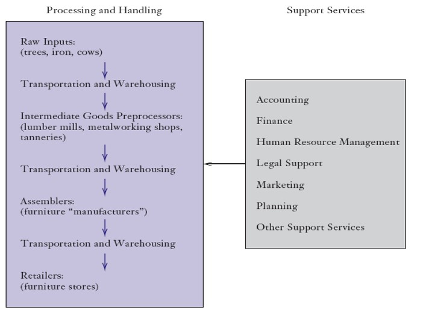

<!-- _class: lead -->

#### The Vertical Boundaries of the Firm

#####      企業的垂直邊界

**國企 Wen-Bin Chuang**
**2026-09-14**

---

#### The Vertical Chain垂直價值鏈

- 垂直價值鏈    
  - 始於`原材料`的獲取，    
  - 終於`最終產品或服務`的銷售。
  - 包括財務、行銷等`支援性服務`
  -  會計, 財務, 法律支持, 行銷, 策略規劃, 人力資源管理

- `垂直價值鏈`的組織是企業策略的重要組成部分。哪些垂直價值鏈環節應在**企業內部 (in-house) 完成**
    ？

---

#### 垂直價值鏈

---

#### 企業的垂直邊界 (Vertical Boundary)

- 企業的`垂直邊界`決定了哪些任務應在**企業內部**完成，哪些任務應**外包**出去。

- 即 **自製還是外購(make-or-buy)** 的決策
  - 在`市場的無形之手`與`組織的有形之手`之間做出選擇。
    - 決策取決於使用市場與內部執行任務的成本與收益比較。

#### 界定邊界 

- 企業需要明確自身的垂直邊界。  
  - 事實上, 垂直價值鏈各項任務都可以交給的`市場外部專業機構`即為市場企業(Market Firms) 。  

- 市場企業通常是在其領域內公認的領先者（例如：UPS）。

---

#### 自製(in-house)或外購(outsourcing)的一些誤區 

- 誤區一：企業應`自製`能帶來競爭優勢的資產。
  - 企業 **(誤)認為** 某項資產是競爭優勢的來源， 但如果該資產在市場上其實很容易獲得， 此時需重新評估其競爭優勢的判斷。
  - 一家五金零件加工廠，斥資引進了德國最新型的五軸聯動 CNC 加工機台，以及日本頂級的機械手臂。老闆認為：「我們的加工精度和速度是業界第一，因為我們擁有這些**頂級設備**，這就是我們不可替代的優勢。」
  
- 誤區二：企業 **(誤)認為**外包某項活動可消除該活動的成本。
  - 無論成本由企業自身承擔（自製）還是由供應商承擔（外購），成本都存在。關鍵在於哪種方式更有效率。
  - 一家中型零售企業認為內部養一個 20 人的 IT 研發團隊太貴了（包含高薪工程師薪資、勞健保、辦公空間、軟硬體設備），於是決定將系統開發與維護全面外包給國外的軟體公司或本地的系統整合商（SI）               

---

#### 自製或外購的一些誤區

- 誤區三： 企業 **(誤)認為** 向後整合(input)可`獲取供應商的利潤空間`。
  - 若供應商確實獲得經濟利潤，需追問：為何市場未將其侵蝕？長期來看，競爭通常會消除超額利潤。
  - 老闆認為：「我們每天消耗這麼多食材，中間被盤商和加工廠賺了太多差價。如果我們自己包地種菜、養豬，並建立超大型中央廚房，我們就能『吃掉整條供應鏈的利潤』，實現從農場到餐桌的暴利。」
    - 殘酷的現實是，供應商之所以能賺取這 30% 的利潤，是因為他們在該特定領域擁有「規模經濟」、「學習曲線優勢」或「獨特的專業管理能力」。

-----

- 誤區四： **誤認為** `向後整合`可規避`投入品價格過高`的風險。
  - 企業誤以為「向後整合」能將「市場價格風險」轉化為「內部固定成本」。但殘酷的現實是，上游投入品價格過高，往往是因為其本身具備高資本門檻、長建設週期或受全球總體經濟影響。
  - 高層認為：「只要我們擁有自己的`礦山`，我們就能鎖定原物料成本，徹底規避國際金屬價格過高的風險，確保我們的電動車利潤不被上游礦商吃掉。」
    - **殘酷的市場現實**: 從買下礦權、環評、基礎建設到真正開採出礦，通常需要 5 到 10 年。這期間需要持續投入巨額資金，且極易遭遇當地環保抗爭、地緣政治或罷工等不可控風險。
  - 某家知名 IC 設計公司（如生產驅動 IC 或電源管理 IC 的公司），在半導體缺貨潮時面臨晶圓代工廠（如台積電、聯電）大幅漲價且產能被排擠的窘境。**誤認的優勢**：老闆認為：「代工價格太高且受制於人，我們應該自己蓋一座成熟製程的晶圓廠（或封測廠）。這樣不僅能確保產能，還能規避代工價格過高的風險，把利潤留在自己口袋。」
    - **殘酷的市場現實**: 晶圓廠是極度重資產的行業，折舊費用驚人。晶圓廠必須維持極高的產能利用率（通常需 80% 以上）才能損益兩平。
  - 實際上，可通過`遠期`或`期貨合約`對沖投入品價格風險，可以無需垂直整合。

-----

- 誤區五： **誤認為** `向前整合`控制分銷管道 可阻止競爭對手進入。
  - 企業在市場佔有率達到一定程度後，往往會產生一種「渠道霸權」的錯覺。認為：「只要我們透過收購或自建，控制了`下游的分銷管道`（如零售門市、經銷商網絡、實體賣場），競爭對手就沒有地方賣東西了，從而能建立極高的進入壁壘，把對手擋在門外。」
    - 知名的 3C 家電品牌，為了防止競爭對手搶佔`實體貨架`，決定投入巨资在全國各大核心商圈瘋狂開設「品牌直營旗艦店」和「專賣店」，並要求商場給予排他性位置。
      - 盲目向前整合控制管道，不僅無法真正封殺對手，反而會讓企業背上沉重的「重資產包袱」、喪失管道的「中立性」，甚至引發嚴重的「反壟斷監管風險」。競爭對手往往會透過「繞道」或「降維打擊」的方式，開創出全新的銷售管道。
    - 消費者的購買習慣迅速向`線上轉移`。競爭對手根本不需要開實體店，直接透過官方網站、社群媒體直播帶貨、或進駐大型綜合電商平台（如 Amazon、蝦皮、京東），就能以極低的成本觸達全國消費者。
  - 兩種可能：開闢新管道可能很容易；若管道稀缺，收購價格將反映其全部價值。無論哪種情況，封鎖管道本身不會帶來經濟利潤。 

---

#### 使用市場企業的優勢

- 市場企業可能擁有`專利`或`專有資訊`，使其具備`超低成本生產能力`。  
- 市場企業能夠實現企業內部單元無法達到的`規模經濟`。  
- 外部企業`受市場紀律約束`，而企業內部部門可能借公司整體成功掩蓋低效（存在理成本與影響力成本）。
- 市場企業 更可能充分利用`學習效應`帶來的經濟性。
  - 例如：汽車製造商更願意從獨立供應商而非競爭對手處採購`反鎖死刹車系統`。

---

#### 使用市場企業的劣勢   

- 生產流程`協調困難`；    
- 可能洩露`企業私有資訊`；    
- `交易成本`。

---

#### 代理成本（Agency Costs）

- 公司（股東/董事會） vs. 管理層（高階主管）

  - 主管往往會利用這個`決策`來滿足自身的利益，從而`損害公司`整體的資本回報率。

- 管理層 vs. 基層員工

  - 員工拿的是固定薪水，做壞了頂多挨罵或拿不到年終獎金，不會面臨「公司倒閉、自己破產」的生存危機。員工會傾向於「摸魚」，管理層必須設立龐大的「中階主管」去盯人

- here 代理成本源於`員工懈怠(不同心)` 以及管理層為防止懈怠所付出的`監督成本`。

  - 當任務由企業內部執行時，代理問題尤為突出。

------

#### 三大組成（Jensen & Meckling）

| 組成                             | 說明                                                         |
| -------------------------------- | ------------------------------------------------------------ |
| **監督成本**（Monitoring Costs） | 委託人為監視代理人行為所花的成本，如審計、董事會、績效考核制度 |
| **約束成本**（Bonding Costs）    | 代理人為取信委託人而自我擔保的成本，如財務揭露、履約保證     |
| **剩餘損失**（Residual Loss）    | 即使有監督與約束，代理人決策仍偏離委託人最優解所造成的福利損失 |

---

#### 影響成本(Influence Cost)

- 將`任務內部化` (in-house) 會產生影響成本。  

- 企業`內部資本市場`負責在企業內部`人力和資本配置`。  
  - 各部門可能通過`遊說、政治活動`等影響資源配置。 
  - 影響活動所消耗的資源即為影響成本。

---

#### 內部資本市場

- 當組織中的`資源配置、升遷、預算`等決策由上層集中決定時，成員會把原本可用於生產的時間與精力，轉而投入到`遊說、討好、運作決策者等`無**生產力的活動**上，這種資源浪費即為影響成本。
- 簡言之：代理成本關注**代理人偏離委託人利益**；影響成本關注「下屬為影響決策而進行的**尋租與內耗**」。
- 產生條件
  - 決策權集中（有「老闆」或委員會可被影響）
  - 資源分配、升遷、評價具有裁量空間
  - 影響結果的利益足夠大
- 典型表現
  - 花大量時間經營人際關係、向上管理，而非做好本職工作
  - 部門之間爭奪預算與資源的政治角力
  - 為爭取升遷而進行印象管理、隱瞞壞消息
  - 組織內部的「尋租」與派系鬥爭

---

#### 與代理成本的關係

- 影響成本可視為代理問題在組織內部縱向關係上的一種延伸與具體化。
- 兩者共同點在於：都因**利益不一致**與**資訊不對稱**而產生資源誤置。
  - 差別在於，`影響成本`特別強調`集中決策權`所誘發的尋租行為——即使沒有明顯的「貪污」或「怠惰」，光是遊說與內耗本身就是成本。
- 當決策權、資訊與利益配置不當時，組織會產生內生的資源浪費。前者聚焦於「代理人偏離委託人」，後者聚焦於「下屬為影響集中決策而尋租」。

---

#### 垂直整合的典範與衰落：福特胭脂河工廠（Ford River Rouge）

- 1920年代，亨利·福特為了實現Model T的大規模生產，在密西根州建立了「胭脂河工廠」。這是商業史上`向後垂直整合`（Backward Integration） 的極致：福特不僅組裝汽車，還擁有自己的鐵礦、煤礦、橡膠園、玻璃廠、鐵路甚至船隊。鐵礦石從一端進去，汽車從另一端出來。
- 為什麼選擇高度整合？
  - 市場交易成本高：當時的供應商市場不成熟，零組件規格不統一，外部採購無法保證穩定供應與品質。
  - 規模經濟與物流控制：將所有生產環節集中在一個園區，大幅降低了運輸與庫存成本。
- 邊界的重塑（衰落與解體）： 隨著汽車產業成熟，這種「大包大攬」的垂直整合暴露出致命的內部組織成本：
  - 官僚主義與影響成本：龐大的`內部部門為了爭奪預算和資源，產生了嚴重的內部政治與內耗`。
  - 缺乏彈性：當消費者需求從單一的Model T轉向多樣化車款（如通用汽車的策略）時，福特龐大的專屬資產（專屬關係資產）變成了`沉沒成本`，無法快速轉向。 
- 結果：現代的汽車產業走向了`垂直分工`，車廠將70%以上的零組件外包給專業供應商（如Bosch、Denso），自身只保留核心設計與最終組裝，以維持靈活性。

---

#### 半導體產業的垂直解構：從 IDM 到 Fabless-Foundry (IC 設計公司 -晶圓代工廠)

- 早期半導體產業的`垂直邊界是高度整合`的，即 IDM（Integrated Device Manufacturer，整合元件製造商）模式，如 Intel、三星、德州儀器。企業自己包辦 IC 設計、晶圓製造、封裝測試。
- 邊界的重塑（台積電的破局）： 1987年台積電創立，開創了純晶圓代工（Pure-play Foundry） 模式，徹底重塑了半導體的垂直邊界，催生了 Fabless（無晶圓廠設計公司，如 NVIDIA、AMD、聯發科）的崛起。
- 為什麼會發生垂直分工？
  - `規模經濟`的門檻：先進製程晶圓廠的資本支出動輒上百億美元，設計公司根本無力承擔（內部化成本過高）。
  - `資產專用性`與`敲竹槓風險`的降低：台積電透過標準化的 PDK（製程設計套件）和嚴格的 IP 保護契約，降低了設計公司與代工廠之間的`「交易成本」`。台積電「永不與客戶競爭」的承諾，解決了客戶擔心技術被剽竊的「敲竹槓（Hold-up）」風險。 
- 結果：半導體產業從「垂直整合」走向「垂直分工」，設計與製造解耦，大幅降低了創新門檻，造就了今天繁榮的晶片設計生態

---

#### 為「速度」而反常規整合：Zara（Inditex）的極速供應鏈

- 在服裝零售產業，常規的垂直邊界是`高度外包`（如 H&M、Gap 將生產幾乎全部外包給亞洲的低成本代工廠）。然而，Zara 卻選擇了半垂直整合：它將約 50% 的核心產品生產，保留在西班牙總部附近的自有工廠或緊密合作的當地工廠，只有`基礎款`才外包到亞洲。
- 為什麼選擇內部化（整合）？
  - `時間成本`與`機會成本`：快時尚的核心競爭力是「速度」。如果外包到亞洲，從設計到上架需要數月，且必須提前大量下單，這會導致極高的庫存滯銷風險（這是一種隱性的交易成本）。
  - `靈活性`優先於製造成本：Zara 在西班牙生產的製造成本雖然比亞洲高，但將前置時間壓縮到僅需 2-3 週，且可以小批量生產、根據市場反饋快速補貨。 
- 結果：Zara 透過向後整合核心生產環節，犧牲了部分製造成本，但大幅降低了庫存成本與錯失市場趨勢的風險，成就了其快時尚霸主地位。

---

#### 自製的理由 

- 與供應商`協調不善`帶來的成本；  
- 合作夥伴不願`開發`和`共用私有資訊`；  
- 通過內部完成任務可避免的交易成本。  

- 上述三類問題均可追溯至`契約(合同)` 訂立的困難。

---

#### 契約的作用

- `契約`保護交易雙方免受對方`機會主義行為`的侵害  
  - 當某些任務由企業外部完成時，企業常使用契約。  

- 契約通常列明：    
  - 需要完成的`任務內容`； 
  - 一方`未履行義務`時的補救措施； 
  - 執行任務的`成本`。

- 契約的保護效力取決於：  
  - 契約本身的`完備性`；    
  -  `契約法體系`。

---

#### 完備契約（Complete Contract）

- 要使契約可執行，**外部第三者(如法官或仲裁員)** 必須能夠：
  - 觀察到`具體情境`（contingency）；
  - 觀察到各方`行為`；
  - 對違約方施加約定的`懲罰`。

---

#### 不完備契約（incomplete contracts）

- 現實中的契約通常是不完備契約。常見的因素:
  - 有限理性；  
  - `績效`難以界定或衡量；  
  - 信息不對稱。

#### 有限理性
- 個人在以下方面能力有限：    
  - 資訊處理；應對複雜性； 追求理性目標。  
  - 個人無法預見所有可能的情境。

---

#### 績效的界定與衡量

- 契約履行的標準可能存在`殘餘模糊性`。例如: `正常磨損`等術語可能有不同解釋。  
  
- 績效有時並不總能被明確無誤地衡量。`服務品質`

#### 信息不對稱

- 契約各方對與契約相關的`資訊獲取並不對等`。
  - 通常某一方具有資訊優勢, 資訊優勢方可能肆無忌憚地提供虛假資訊。 

- 依賴此類資訊不對等所訂立的契約將面臨執行困難。

---

#### 私有資訊洩露

- 企業不希望其`競爭優勢`來源遭到損害。  
  - 當使用外部企業時，`產品設計`或`生產工藝`等私有資訊可能被洩露。
- 有效的`專利保護`有所幫助，但可能無法**提供充分保障**。
  - `保險是事後`  
  - 可通過包含競業禁止條款的契約防止資訊洩露。  
     - 實際中，競業禁止條款往往難以執行。

---

#### Transactions Costs交易成本

- 若市場機制能提升效率，為何大量活動仍在`價格體系`之外進行？(Coase提出)

- 採用市場機制所產生的、可通過內製節省的成本即`交易成本`。  
  - 外包涉及`談判`、`起草`和`執行契約`的成本。

---

#### 交易成本的來源

- 需要`關係專用性資產`（Relationship-Specific Assets）的投資；
  - 往往該項投資完成後可能出現`機會主義行為`（“敲竹槓”(套牢) 問題，hold-up problem）；
  -  准租(quasi –rent)（套牢問題的嚴重程度）。

- 是`專為某項交易所必需投入的資產`；一旦投入，交易對方難以無成本替換，雙方在一定程度上被`鎖定`。
  - 投資一旦投入，就難以轉作他用（即「沉沒成本」高）；若想要轉用於其他交易，將產生巨大成本。

---

#### 資產專用性的形式

- 地理區位專用性；    
- 實物資產專用性；    
- 專用投資；    
- 人力資產專用性。

---

#### 地理區位專用性

- 為節省`運輸與庫存成本、提高流程效率`，資產需靠近特定地點佈局：    
  - 水泥廠通常建在石灰礦附近；    
  - 制罐廠 靠近 罐裝廠 佈局。
  - 友達面板接近康寧玻璃

#### 實物資產專用性

- 實物資產可能需為特定交易專門設計：    
  - 玻璃容器生產所用`模具`為特定用戶定制；    
  - 煉油廠專為處理某種鋁土礦而設計。

---

#### 汽車零組件的 make-or-buy（Monteverde & Teece, 1982）

- 需要`「應用專屬工程知識」`（application-specific know-how）的零組件，GM 與克萊斯勒更傾向`自製`；標準化零件則外購。
- 現代對照：汽車座椅供應商（Lear、Magna）在組裝廠旁設專屬產線（高專用性），但因重複交易與聲譽機制存在，多以長期契約 + 共設園區的混合模式治理，而非全面整合。

---

#### 專用投資

- 某些投資專為滿足單一客戶而進行，若失去該客戶，原本的投資將無利可圖：   
  - 港口為滿足某些客戶的特殊需求而投資； 
  - 國防承包商為生產特定先進武器系統而建設製造設施。

#### ASML 與蔡司（Zeiss）：極端專用性下的混合治理

- **情境**：EUV 曝光機的極紫外光學鏡片，全球只有蔡司能做，精度要求達原子級。
- **專用性**：蔡司的設備、人才與 know-how 幾乎完全**專屬於 ASML**；反之 ASML 也高度依賴蔡司 ——雙邊鎖定。
- **治理選擇**：ASML 並未完全整合蔡司（隱性知識難以內部化），而是 2017 年入股蔡司半導體光學部門 **24.9%** 並共同投資研發——以**持股聯盟**  這種混合模式保護雙邊專屬投資

---

#### Tesla 與 Panasonic 的 Gigafactory

- 內華達電池廠中，Panasonic 投資電池芯產線、Tesla 負責電池組裝與系統整合。
- 專用性：雙方互為專屬資產且地理共置。
- 治理：以合資/長期合作契約分擔投資與風險，而非 Tesla 自行整合電芯製造（當時缺乏相關能力）。

---

#### 人力資產專用性

- 參與交易的某些員工需掌握與特定關係相關的`技能、知識和資訊`：    
  - 行政人員掌握特定`企業資源計畫（ERP）軟體`的使用技能；    
  - 銷售人員深入瞭解客戶企業的內部組織結構。

- 企業專屬訓練（如台積電製程工程師的 tacit know-how）使員工技能對外部市場價值有限 → 企業以`薪酬、內部升遷, 長期僱用、年功`等內部勞動市場機制保護雙方投資，這是 「人力」層面的垂直邊界延伸。
  - 效率工資論

---

#### 套牢問題

- 租金與准租金（Rent and Quasi-rent）
  - 租金（Rent）：指經濟利潤；
  - **准租金（Quasi-rent）**：指某項交易產生的超額經濟利潤。
- 敲竹槓問題（The Hold-up Problem 套牢）
  - 在`不完備契約`和`關係專用性資產`並存的情況下，交易一方可能在投資完成後，利用對方的`依賴性`要求重新談判（如提高價格、降低服務），從而攫取部分准租金，導致投資不足或合作失敗。這就是著名的`敲竹槓套牢`問題。

---

- 假設 A 公司（買方）需要 B 公司（供應商）提供一種**特殊零件**。B 必須投資 100 萬元建置專用生產線（關係專用性資產）。雙方簽訂契約，但因契約不完備，未明確約定未來價格調整機制。

  - 事前（ex ante）：B 考慮是否投資。若預期投資後能獲得合理報酬，就會投資。
  - 事後（ex post）：B 投資完成後，A 知道 B 已被「套牢」（因為生產線無法轉賣），於是要求降價：「不然我就換供應商（即使實際上很難換）」。
- 由於契約不完備，法院無法強制執行原定價格，B 只能被迫接受較低價格。
- 結果：B 的投資報酬降低，甚至虧損；預期到這種風險，B 在`事前`可能不願投資，導致有效率的交易無法發生（投資不足，underinvestment）

- 這解釋了為何某些交易會選擇**垂直整合（vertical integration）**

---

#### Fisher Body 與 GM——（Klein, Crawford & Alchian, 1978）

- 1920 年代 GM 向 Fisher Body 採購汽車車身，簽約 10 年、採成本加成計價。
- 專用性：車身模具與廠房是高度實體與場址專用投資；Fisher 不願在 GM 組裝廠旁設廠（怕形成專屬資產被剝削）。
- 敲竹槓：Fisher 利用契約漏洞（成本加成 → 多用人工、抬高成本基數）賺取準租金，且拒絕配合調整廠址。
- 邊界重劃：GM 於 1926 年買下 Fisher Body，垂直整合解決 hold-up。（註：Coase 晚年對此案的真實動機提出質疑。）

---

#### 解決「敲竹槓」的向後整合：蘋果自研晶片（Apple Silicon）

把**交易內部化到同一企業內**，以避免契約不完備帶來的套牢風險。

- 長達十幾年間，蘋果 Mac 電腦的 CPU 一直依賴 Intel 供應（市場交易/外包）。但在 2020 年，蘋果宣布放棄 Intel，全面轉向自研的 M 系列晶片（Apple Silicon），這是一次重大的向後垂直整合。
- 為什麼選擇內部化？
  - 高度資產專用性與績效瓶頸：蘋果對筆電的輕薄、續航與效能有極致要求，而 Intel 的通用型 x86 晶片在功耗控制上遭遇瓶頸（「擠牙膏」）。
  - 敲竹槓風險（Hold-up Problem）：當蘋果的產品創新高度依賴 Intel 的晶片進度時，Intel 的研發延遲直接拖累了 Mac 的銷量。蘋果處於被動挨打的局面。
  - 生態系整合：蘋果希望打通 Mac、iPhone、iPad 的底層架構（ARM 架構），這需要硬體與 iOS/macOS 軟體的深度協同，外部供應商無法提供這種專屬關係資產。 
  - 結果：蘋果透過向後整合自研晶片，不僅擺脫了對 Intel 的依賴，還實現了遠超競爭對手的能效比，並進一步鞏固了其軟硬體一體化的隔離機制。

---

#### 套牢對交易成本的影響

- 套牢問題提高了交易成本：    
  - 契約(合同)談判更加困難；    
  - 可能需投資以改善事後議價地位；    
  - 潛在套牢引發不信任；    
  - 關係專用性資產投資不足。

#### 套牢與昂貴的防護措施

- 為防範套牢風險，各方可能投資於低效的保護措施：    
  - 製造商為從市場企業採購的投入品建立 備用生產基地；    
  - 使用浮動式發電廠，以避免地點專用性投資。