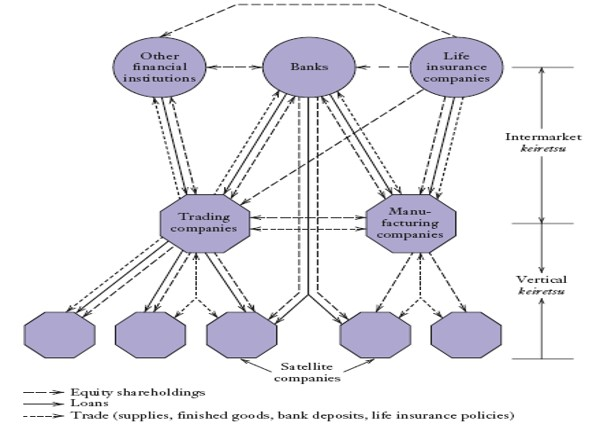

<!-- _class: lead -->

#### Integration and Its Alternatives

#####      整合及其替代方案

**國企 Wen-Bin Chuang**
**2026-09-14**

---

#### Real-World Evidence

- 隨著`企業規模擴大`，它們往往`向前整合`進入`行銷`與`分銷`領域。  

- 當需要進行`專用性投資`時，企業更可能採取`向前整合`。  

- 統計證據支持`規模經濟與資產專用性`的影響。

----

- 在`資產專用性（或規模）相同`的情況下，通用汽車（GM）的縱向整合程度高於福特（Ford）。  
- 在航空航太行業，**設計專用性越高**，企業越傾向於**縱向整合**生產環節。  
- 在公用事業領域，靠近煤礦的電廠（礦口電廠）比其他電廠更可能被整合。
- 在 電子元器件行業，企業更傾向於使用自己的銷售團隊：    
  - 當`資產專用性`較高時；    
  - 當`企業規模`較大時；    
  - 當`績效衡量`更為困難時。

---

#### 垂直整合與資產所有權(Asset Ownership)

- `自製還是外購`決策本質上是關於`資產所有權與控制權`的決策(**Grossman, Hart and Moore GHM**)。
  - 所有權附帶`剩餘控制權`（即合同中未明確規定事項的控制權）。  
  - 垂直整合將剩餘控制權轉移給整合後的企業。

---

#### 剩餘控制權

- `剩餘控制權`指的是在契約未明確規定的範圍內，對資產或企業事務擁有`最終決策權的權利`。換句話說，就是「當事情發生而契約沒寫清楚時，誰可以說了算」。

- 企業併購與垂直整合
  - 如果A公司收購B公司，A就獲得B公司資產的剩餘控制權，可決定如何配置資源、是否關閉部門等。
  - 股東 vs 經理人
    - 股東（特別是大股東）通常保留重大決策的剩餘控制權（如更換CEO、出售公司），而日常運營交給經理人。
  - 合資企業與戰略聯盟
    - 合作雙方需協商誰在關鍵爭議上擁有最終決定權，這就是剩餘控制權的分配問題。

- 與「剩餘索取權」的區別: 對利潤或資產價值變動的索取權,通常歸股東,股東分紅、股票增值

---

#### 合資企業（Joint Ventures JV）中的控制權配置

- 所有權與控制權分離的經典設計
- 2010年，荷蘭皇家殼牌（Royal Dutch Shell）與巴西Cosan公司成立Raizen合資企業涉及數十億美元的下游石油和生物燃料業務 
- 剩餘控制權的精巧設計：
  - 下游業務JV（煉油廠和零售加油站）
    - 殼牌：50%所有權 + 51%投票權（剩餘控制權）,  Cosan：50%所有權 + 49%投票權
  - 生物燃料JV（全球甘蔗生物燃料生產）
    - Cosan：50%所有權 + 51%投票權（剩餘控制權）,  殼牌：50%所有權 + 49%投票權

---
  
- 理論邏輯：
  - 根據GHM理論，讓對`特定資產價值影響最大的一方`擁有剩餘控制權是最優的
    - 殼牌在下游煉油和零售方面有更多專業知識 → 獲得下游業務控制權
    - Cosan在巴西生物燃料方面有優勢 → 獲得生物燃料業務控制權
- 啟示：
  - 剩餘控制權可以與所有權、收益權`分離配置`
  - 通過狀態依存的控制權分配，實現激勵相容

---

#### 平臺經濟中的剩餘控制權

- `零工經濟（Gig Economy）的代理問題`, Uber、FoodPanda等平臺通過演算法管理勞動者, 平臺聲稱勞動者是`獨立承包商`，而非員工
- 剩餘控制權的實際配置：
  - 平臺保留的 `剩餘控制權的定價權`：平臺單方面決定服務價格和傭金比例
    - **派單權**：演算法決定誰獲得工作機會; **解約權**：可以不經通知`停用`勞動者帳戶
    - **規則制定權**：`單方面`修改服務條款和績效標準; **資料控制權**：掌握所有交易資料和客戶資訊
  - 勞動者承擔的`剩餘風險`：
    - 資本投資風險：需自購車輛、支付油費、保險、維護費 
    - 需求波動風險：平臺將市場風險轉嫁給勞動者
    - 收入不確定性：按任務計酬，無保底工資
    - 人力資本投資風險：需自費培訓，技能可能過時

----

 - 悖論：
    - 形式上：勞動者被定義為`獨立承包商`，`應承`擔剩餘控制權. 
    - 實際上：平臺通過演算法保留了幾乎所有關鍵決策權（剩餘控制權），勞動者既無定價權，也無工作自主權  
- 理論啟示：
  - 這是`剩餘控制權`與`剩餘索取權`嚴重錯配的典型案例. 
  - 平臺享受了"所有權的好處"（控制權和利潤），卻逃避了"所有權的成本"（雇主責任和社會保障）

---

#### 特許經營（Franchising）中的剩餘控制權

- 麥當勞（McDonald's）的`特許經營模式`(加盟)

- 麥當勞通過`特許經營模式`全球擴張, 加盟商支付加盟費，獲得品牌使用權

- 剩餘控制權的配置：

  - 麥當勞總部保留的剩餘控制權 
    - **智慧財產權控制**：對商標、配方、運營手冊的完全控制
    - **標準制定權**：`單方面`決定產品品質、服務標準
      - **審計權**：可以隨時檢查加盟店運營; 
      - **終止權**：在特定條件下可以終止特許經營合同; 
      - **定價指導權**：對菜單價格有影響力

---

  - 加盟商的有限控制權：
    - 日常運營決策（雇傭員工、排班等）
    - 本地行銷活動的部分自主權. 但：不能更改核心產品、不能隨意定價、不能更改裝修標準
- 理論意義：
  - 這充份表現出剩餘控制權的**邊界模糊性**
  - 特許經營合同中`無法窮盡所有決策權`，因此未明確規定的剩餘控制權歸屬成為爭議焦點
  - 根據GHM理論，物質資產（品牌、智慧財產權）的所有者, 天然享有剩餘控制權

---

#### 資料治理中的剩餘控制權

- 資料數據時代的`產權難題`
- `資料`被稱為`21世紀的石油`, 但資料的`所有權`和`剩餘控制權`歸屬極其模糊
- 資料產生的剩餘控制權爭議 :
  - 用戶：認為自己是`資料產生者`，應擁有控制權
  - 平臺：認為自己是`資料收集和處理者`，應擁有剩餘控制權
  - 社會/政府：認為涉及公共利益的資料應受公共治理

- 典型案例：Facebook-Cambridge Analytica事件
  - Facebook允許協力廠商應用收集`使用者資料`
  - Cambridge Analytica未經使用者同意，將資料用於`政治廣告`
  - 問題：在使用者協定未明確規定的情況下，誰有權決定`資料的二次使用？`（剩餘控制權問題）
---

- 理論困境：
  - 根據GHM理論，剩餘控制權應歸屬于**物質資產所有者**（平臺擁有伺服器、演算法）
  - 但`資料`具有`非排他性`和`外部性`，與傳統物質資產不同, 這導致資料治理的產權悖論
    - `非排他性`意味著同一份資料可以被多個主體在不同場景下同時、反覆使用，而不會因一次使用而被消耗或減少其對其他使用者的供給，具備了`準公共財的特徵`
    - 一方面，它能產生強大的**正外部性**（如促進AI創新、提升社會整體運行效率）；另一方面，它也伴隨著顯著的**負外部性**（如隱私洩露、數據安全風險、演算法歧視等）
  - 綜合`非排他性`與`外部性`，資料治理中的剩餘控制權配置必須解決「促進流通」與「風險控制」的雙重目標
- 可能的解決方案：
  - 數據信託（Data Trust）：將資料剩餘控制權委託給獨立的受託人
  - 數據合作社（Data Cooperative）：使用者集體擁有資料剩餘控制權
  - 監管干預：通過法規，賦予使用者"資料可攜帶權"、"被遺忘權"等，限制平臺的剩餘控制權

----

#### 垂直整合和資產所有權

- 若`合同是完整`的，則垂直價值鏈中由誰擁有資產並不重要。  
- 若`合同是不完整`的，`資產所有權`將決定各方`是否願意`進行關係專用性投資。

#### 組織 垂直價值鏈 的三種方式：  

- 兩個單位相互獨立（非整合）；  
- 上游單位擁有下游單位的資產（前向整合）；  
- 下游單位擁有上游單位的資產（後向整合）。

---

- 整合的形式會影響各方投資於`關係專用性資產`的激勵。  
- 垂直整合是否最優，取決於各方投資對增值的相對貢獻程度。
  - 如果上游與下游參與方的投資對價值創造的`重要性相當`，則市場交易更受青睞。  
  - 如果`某一方`的投資在價值創造中更為關鍵，則垂直整合更優。

- 資產所有權是垂直整合的一個重要維度。 
  - 根據對`專用資產控制程度的不同`，整合可能存在不 同程度。    
    - 例如：汽車製造商可使用獨立供應商生產車身部件，但自己擁有模具和衝壓設備。

---

#### 治理(Governance)與垂直整合

- 使用`市場企業`會帶來契約低效率。  
- 垂直整合以`內部治理`取代市場契約。

  - 決策權下放和資產控制權在企業內部進行，而非企業之間。  
  - 治理不善可能抵消`垂直整合`所帶來的好處。

- 涉及 實物資產時，可結合市場交易與上游（或下游）資產所有權。  
- 當人力資產至關重要時，只有通過全面的垂直整合才能獲得對這些資產的控制權。

---

#### 垂直並購中的流程問題

- 治理結構的形成過程可能會排除某些治理安排。  

- 並購後的衝突可能導致`收購方與被收購方`管理者之間難以合作。

#### 垂直整合的替代方案

- 漸進式整合（部分自製，部分外購）  

- 合資企業與戰略聯盟  
- 基於企業間長期隱性契約的半正式協作關係

---

#### 漸進式整合(Tapered Integration)

- 漸進式整合是`垂直整合`與`市場交易`的`混合形式`。
- 企業可自行生產`部分`投入品，其餘`部分`從外部採購。  
- 企業也可通過內部銷售管道銷售部分產品，其餘則通過獨立經銷商銷售。

---

#### 漸進式整合的優勢

- 無需大規模資本投入即可拓展額外的投入/產出管道。  
- 內部運營的成本與盈利資訊有助於與市場企業談判。
- 自製的潛在威脅 可約束外部供應商的行為。
  - 內部管道會因外部採購可能性的存在而保持積極性。  
  - 內部供應能力可防範潛在的“套牢”（hold-up）風險。

#### 漸進式整合的劣勢

- 可能喪失規模經濟。  
- 協調難度加大，因為 內外兩個生產單位 需就產品規格與交貨時間達成一致。  
- 管理者可能出於自身利益，即使內部生產已無效率，仍繼續維持。

---

#### 策略聯盟與合資企業

- 策略聯盟涉及參與企業為共同專案開展合作、協調與資訊共用。  
- 合資企業是一種策略聯盟，由合作方共同創建並共同擁有一家新的獨立組織。
- 策略聯盟與合資企業介於`純粹市場交易`與`完全垂直整合`之間。
- 聯盟依賴`信任與互惠`，而非正式契約。  
- 爭端很少訴諸訴訟，通常通過協商解決。

---

#### 策略聯盟的應用場景

- 未來活動存在高度不確定性，使各方難以擬定詳細合同。  
- 交易複雜，無法依賴合同法“填補空白”。  
- 關係專用性資產可能導致潛在的套牢問題。
- 任一方單獨發展所需專業能力成本過高。  
- 交易的市場機會預期持續時間較短，使長期合同或並購缺乏吸引力。  
- 監管環境要求必須與本地合作夥伴共同開展業務。

---

#### 協作關係(Collaborative Relationships)

- 傳統上，日本和韓國工業企業比西方 行垂直整合程度更低。
- 日本和韓國企業通過`長期關係而非公平交易（arm’s length）`組織垂直價值鏈。
- 日本存在兩種主要協作關係類型：    
  - `分包商網路` (Subcontractor networks)
  - `企業集團`（日本稱“Keiretsu”，韓國稱“財閥/Chaebol”）

---

#### 分包商網路 

- 日本製造商與其分包商網路保持`緊密、非正式、長期的關係`。    
- 日本製造商與分包商之間的典型關係，其資產專用性遠高於西方

#### 企業集團（Keiretsu）

- 成員間存在強大的`制度性聯繫`。  
- 高管間的社交紐帶與私人關係進一步加強聯繫。  
- 當垂直價值鏈活動由企業集團成員執行時，協調容易，且無套牢問題。
- 成員企業與集團外部有廣泛的業務往來；它們既從集團內銀行借款，也從外部銀行融資。

---

#### 日本企業集團中的債務、股權與貿易聯繫

---

#### 隱性契約 

- `隱性契約`是企業間未明言但彼此心照不宣的商業理解。
- 企業集團成員通過隱性契約相互協作。
- 企業間長期關係可使其在無正式契約的情況下仍採取合作行為。
- 任何一方若採取`機會主義行為`，將面臨失去未來業務（及未來利潤流）的威脅，從而受到約束。  
- 保護自身市場聲譽的願望是使隱性契約得以維繫的另一機制。