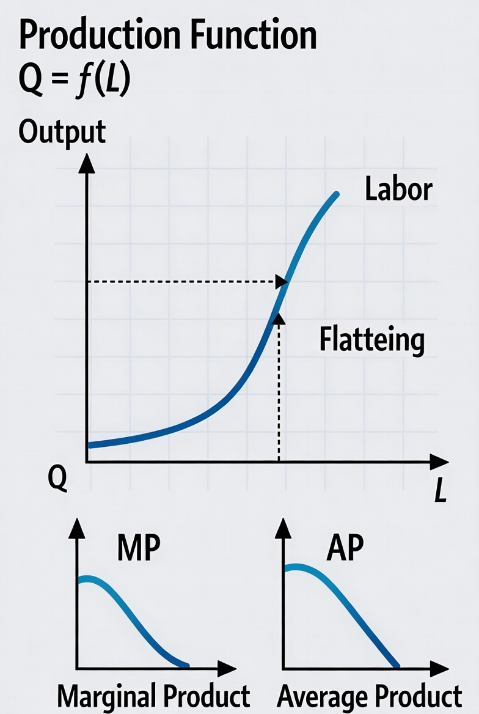
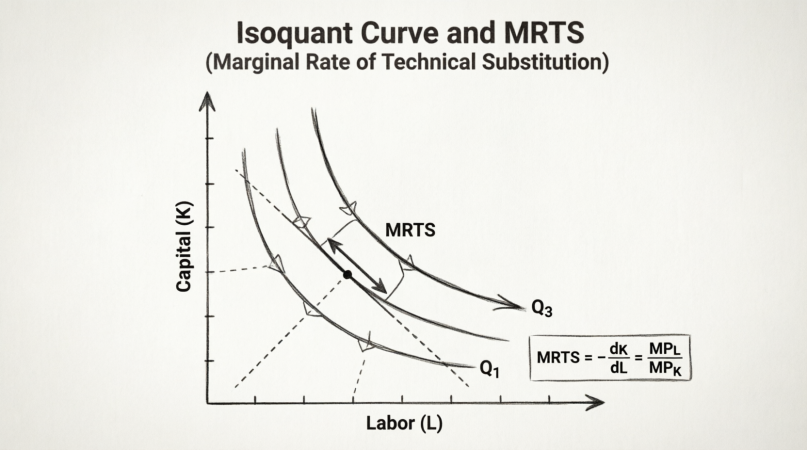
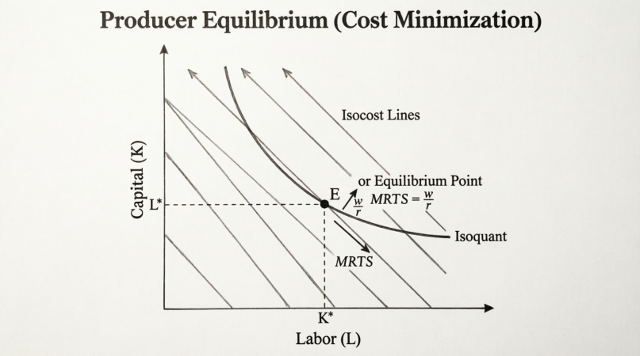
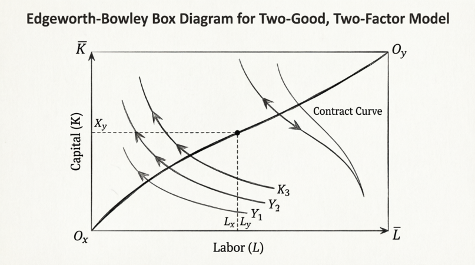
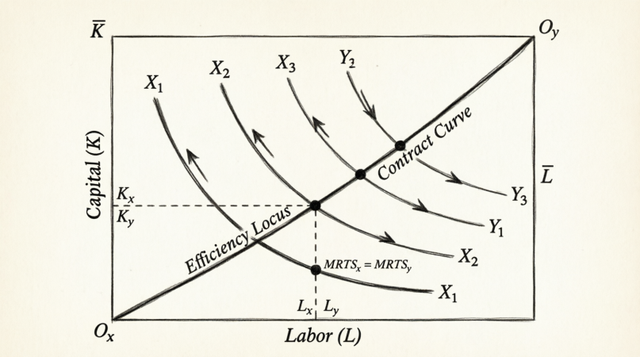
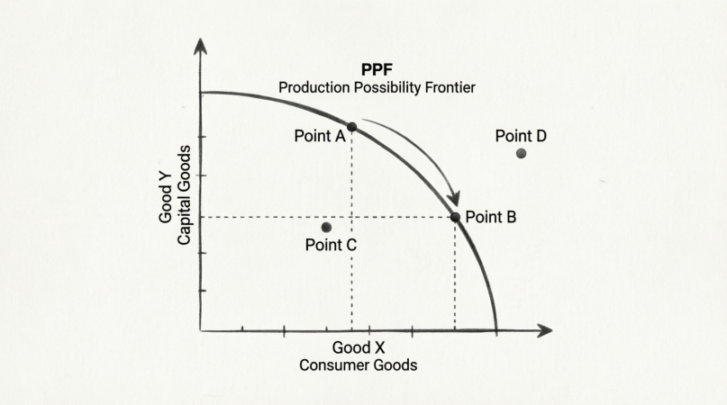
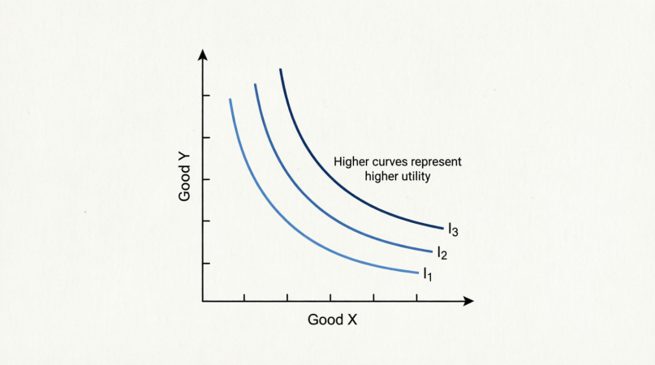
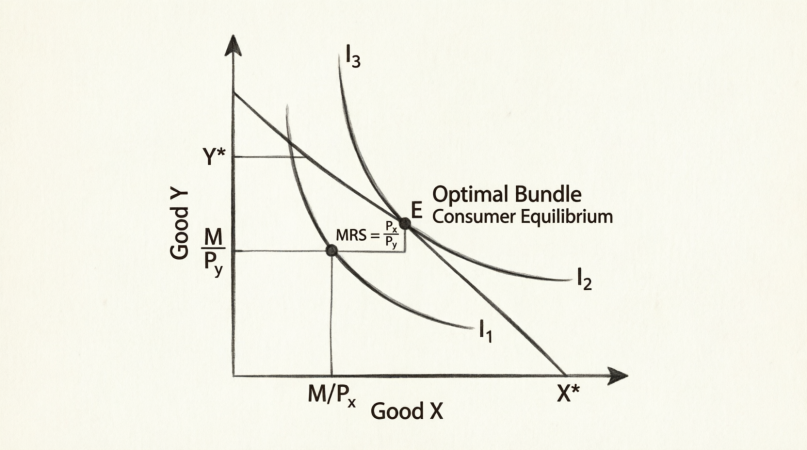
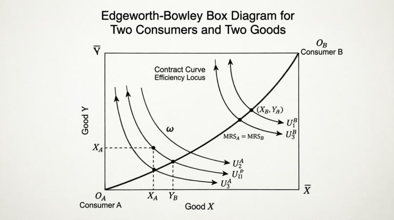

<!-- _class: lead -->

# Microeconomic Review 

**Wen-Bin Chuang**
**2026-09-14**

---

## Production Function

### Part 1

###### 1. Production Function

The **production function** shows the maximum output ($Q$) that can be produced from given quantities of inputs, usually labor ($L$) and capital ($K$). **General form**: $Q = f(L, K)$

- It assumes `technical efficiency` (best available technology).
- `Short Run`: At least one input is fixed (e.g., K fixed → Q = f(L)). `Long Run`: All inputs are variable.

**Example**: Cobb-Douglas production function $Q = A L^\alpha K^\beta$ (where A > 0, α and β are `output elasticities`).

-----

###### 2. Marginal Product of Labor ($MP_L$) and Marginal Product of Capital ($MP_K$)

- **MPL** = Additional output from one more unit of labor (holding K constant) $MP_L = \frac{\partial Q}{\partial L}$
- **MPK** = Additional output from one more unit of capital (holding L constant) $MP_K = \frac{\partial Q}{\partial K}$

**Law of Diminishing Marginal Returns**: When one input increases while others are fixed, `eventually` $MP_L$ (or $MP_K$) will decrease.

----

----

##### 3. Isoquant Curve

An **isoquant** (equal quantity curve) shows all combinations of $L$ and $K$ that produce the **same level of output** (constant $Q$)..

- Downward sloping (`trade-off` between inputs).
- Convex to the origin (due to `diminishing` marginal rate of technical substitution).
- Higher isoquants (further from origin) represent higher output levels.

`Marginal Rate of Technical Substitution (MRTS)`: The slope of the isoquant $MRTS_{L,K} = -\frac{dK}{dL} = \frac{MP_L}{MP_K}$

----

----

###### 4. Returns to Scale

How output changes when **all inputs** are increased proportionally by a factor **t > 1**. $f(t\cdot L, t\cdot K)$

| Scaling Factor | Output Change     | Returns to Scale |
| -------------- | ----------------- | ---------------- |
| t              | Q becomes t × Q   | **Constant**     |
| t              | Q becomes > t × Q | **Increasing**   |
| t              | Q becomes < t × Q | **Decreasing**   |

**Example** (Cobb-Douglas): If all inputs × t 
              → new $Q = A (tL)^α (tK)^β = t^{(α+β)} × \text{original}\cdot Q$

- α + β = 1 → Constant returns;  α + β > 1 → Increasing returns;  α + β < 1 → Decreasing returns

----

###### 5. Homogeneous Function (Degree of Homogeneity)

A production function is **homogeneous of degree r** if: $f(tL, tK) = t^r \cdot f(L, K)$

- r = degree of homogeneity = sum of exponents in Cobb-Douglas (α + β).
- `Directly linked to returns to scale`: 
  - `r = 1` → Constant returns to scale/ `r > 1` → Increasing returns to scale/ r < 1 → Decreasing returns to scale

**Euler's Theorem** (for homogeneous functions): If `f` is homogeneous of degree $r$ , then:
$$
r \cdot f(\mathbf{x}) = \sum_{i=1}^n x_i \frac{\partial f}{\partial x_i}
$$
This is very useful in economics for linking to marginal products and income distribution.

----

**Step 1: Start with the definition of homogeneity**

Define $g(t) = f(t x_1, t x_2, \dots, t x_n)$, By homogeneity:
$$
g(t) = t^r f(x_1, x_2, \dots, x_n)
$$

**Step 2: Differentiate both sides with respect to t**

Differentiate the right-hand side (easy):
$$
\frac{d}{dt} [t^r f(\mathbf{x})] = r t^{k-1} f(\mathbf{x})
$$

---

Now differentiate the left-hand side using the **chain rule**:
$$
\frac{d}{dt} g(t) = \sum_{i=1}^n \frac{\partial f}{\partial (t x_i)} \cdot \frac{\partial (t x_i)}{\partial t} = \sum_{i=1}^n \frac{\partial f}{\partial (t x_i)} \cdot x_idt
$$
So we have:
$$
\sum_{i=1}^n x_i \frac{\partial f}{\partial (t x_i)} = r t^{r-1} f(\mathbf{x})
$$

----

**Step 3: Set t=1**

When t=1 , the arguments $t x_i$ become $x_i$, so:
$$
\sum_{i=1}^n x_i \frac{\partial f}{\partial x_i} = r (1)^{r-1} f(\mathbf{x}) = r f(\mathbf{x})
$$

Rearranging gives **Euler's Theorem**:
$$
\boxed{r \cdot f(\mathbf{x}) = \sum_{i=1}^n x_i \frac{\partial f}{\partial x_i}(\mathbf{x})}
$$

----

If a production function $Q=f(L,K)$ is homogeneous of degree $r$, then:
$$
L\frac{\partial Q}{\partial L}+K\frac{\partial Q}{\partial K}=r\cdot Q
$$

Using `marginal products`:
$$
L\cdot MP_L+K\cdot MP_K=r\cdot Q
$$
This means that the `sum of each input multiplied` by its marginal product equals $r$ times total output. If the production function is `homogeneous of degree one`. then Euler’s theorem becomes:
$$
L\cdot MP_L+K\cdot MP_K= Q
$$
This is also called the **product exhaustion theorem**.

-----

**Euler’s theorem** shows how output can be distributed among factors of production. If factors are paid according to their marginal productivity:
$$
\frac{w}{P}=MPL_L, \quad \frac{r}{P}=MP_K
$$
Then under **constant returns to scale**:
$$
L\cdot w+K\cdot r= PQ
$$
This implies that there is no surplus left after paying labor and capital their marginal products. 

---

#### 6. Ray from the Origin

- **"Radial blow-ups"** (radial expansion / scaling along a ray from the origin) means that：the isoquants corresponding to different output levels have **exactly the same shape**; they are merely **scaled proportionally outward from the origin** (or shrunk inward toward it).

- Suppose the input bundle $(L,K)$  lies on the isoquant for output $Q_0$. Then the scaled bundle $(\lambda L,\lambda K)$ produces:

$$
f(\lambda L, \lambda K)=\lambda^r Q_0
$$
So every point on the $Q_0$  isoquant, when multiplied by $\lambda$, lands exactly on the $\lambda^r Q_0$ isoquant. 
- Geometrically, the higher isoquant is the lower one **blown up radially** from the origin by the factor   $\lambda$— same shape, larger size.

- The defining feature of a **homogeneous production function** is: when all inputs are expanded by the same proportion $\lambda$ ，output changes by the factor $\lambda^r$  (where $r$ is the **degree of homogeneity**)）。This implies that **the isoquants are homothetic**. 

----

**Why the isoquants are radial blow-ups of one another** 

- Along any **ray from the origin**, the slope of the isoquants ($MRTS$) stays **constant**: each isoquant you cross is just a scaled-up copy of the previous one, and a ray cuts all of them at points with the same $K/L$ ratio and the same tangent slope. 

- **In short**: homogeneity ⇒⇒ MRTS depends only on the input ratio ⇒⇒ the isoquant map is a family of radial blow-ups (a homothetic map). 
  - Distance along the ray shows how output changes:
    - Isoquants `equally` spaced → Constant returns
    - Isoquants `getting` closer → Increasing returns
    - Isoquants `getting farther apart` → Decreasing returns

----

- One of the most important properties of **homogeneous** production function.
  
  - **Marginal Rate of Technical Substitution (MRTS)**: For homogeneous functions, the MRTS depends only on the ratio of inputs (not the scale), which makes isoquants "radial blow-ups" of each other.
  
    - Then the marginal products are homogeneous of degree  k−1. Therefore, their ratio is homogeneous of degree 0:
  
      - $$
        \frac{\text{MPL}(tL, tK)}{\text{MPK}(tL, tK)} = \frac{t^{k-1}\text{MPL}(L,K)}{t^{k-1}\text{MPK}(L,K)}=\frac{\text{MPL}(L,K)}{\text{MPK}(L,K)}
        $$
  
    - $MP_L(\lambda L, \lambda K)=\lambda^{r-1}MP_L(K,L)$, the same $MP_K$, MRTS is homogeneous of **degree zero**.

----

#### Part 2: 

#### 1. Equilibrium for a Single Producer (Cost Minimization)

**Cost Minimization Condition** (for given $Q$): The firm chooses $L$ and $K$ such that the **isoquant is tangent to the isocost line** $c=w\times l+r\times k$. **Key Equilibrium Condition**:
$$
\frac{MP_L}{MP_K} = \frac{w}{r} \quad \Rightarrow \quad MRTS_{L,K} = \frac{w}{r}
$$

Where: $w$ = wage rate (price of labor);  $r$ = rental rate of capital (price of capital). This means: **Marginal Product per dollar** should be equal across inputs

$$
\frac{MP_L}{w} = \frac{MP_K}{r}
$$

----

------

##### 1.2 Optimal Input Ratio: K/L is a Function of w/r

For `homogeneous production functions`, the optimal capital-labor ratio depends only on relative factor prices and is **independent of the output level** $Q$.   

**Cobb-Douglas Case**: $Q = A L^\alpha K^\beta$,  
- Optimal condition gives: $\frac{K}{L} = \left( \frac{\beta}{\alpha} \right) \left( \frac{w}{r} \right)$

**Important Points**:

- K/L is **homogeneous of degree zero** in prices → depends on the **ratio** w/r only.
- If w/r ↑ (labor becomes relatively expensive) → firm uses more capital (K/L rises).
- This is the firm’s **expansion path** in the long run.

---

Given Cost Minimization Problem: $\text{MRTS}_{L,K} = \frac{\text{MPL}}{\text{MPK}} = \frac{w}{r}$. 
- Assume f(L,K) is `homogeneous of degree k` . Then the marginal products are homogeneous of degree  k−1. Therefore, their ratio is homogeneous of degree 0. This means the MRTS depends only on the **input ratio** $\frac{K}{L}$, not on the scale  t. 

- So we can write: $\frac{\text{MPL}(L,K)}{\text{MPK}(L,K)} = h\left( \frac{K}{L} \right)$ and at the optimum: $h\left( \frac{K^*}{L^*} \right) = \frac{w}{r}$ $\rightarrow \left( \frac{K^*}{L^*} \right) = h^{-1}\left(\frac{w}{r}\right)$. This is a function **only of $\frac{w}{r}$** — independent of Q .

----

##### 2. Two-Good, Two-Factor Model (2×2 Model)

An economy produces **two goods (X and Y)** using **two factors (Labor L and Capital K)**. Assumptions:

- Fixed total endowments of $\bar{L}$ and $\bar{K}$.
- `Perfect competition` in factor and product markets.
- `Constant returns to scale` (often assumed).
- Different `factor intensities`: e.g., X is labor-intensive, Y is capital-intensive.

----

##### 2.1. Edgeworth-Bowley Box

A graphical tool to show efficient allocation of two inputs (L and K) between two goods (X and Y).

**Construction**:

- Width of box = Total Labor ($\bar{L}$) / Height of box = Total Capital ($\bar{K}$)
- Origin for good X: bottom-left / Origin for good Y: top-right

**Inside the box**: Isoquants for good X (from bottom-left) / Isoquants for good Y (from top-right)

----

----

##### 2.1.1 Efficiency Locus (Contract Curve)

The set of all **Pareto efficient** allocations of inputs between the two goods.

- Points where an isoquant of X is **tangent** to an isoquant of Y.

- At every point on the efficiency locus:  $MRTS_{L,K}^X = MRTS_{L,K}^Y$. (Marginal Rate of Technical Substitution is equal for both goods)

- This means the economy is **technically efficient** — no reallocation can increase output of one good without decreasing the other.

----

-----

##### 2.2 Production Possibility Frontier (PPF)

The **PPF** (or transformation curve) shows the maximum combinations of `two goods (X and Y)` that can be produced with full and efficient use of all resources. **How to derive PPF from Edgeworth Box**:

- Take all points on the **efficiency locus** (contract curve).
- For each point, read off the output levels ($Q_x$ and $Q_y$).
- Plot these in goods space (X on horizontal, Y on vertical).

----

**Properties of PPF**:

- Downward sloping (trade-off between X and Y).

- Concave to the origin (bowed-out) → due to `increasing opportunity cost`.

- Slope of PPF = `Marginal Rate of Transformation (MRT)`  $MRT_{X,Y} = -\frac{dY}{dX} = \frac{MC_X}{MC_Y}$

**Key Result**: At competitive equilibrium:  $MRT_{X,Y} = \frac{P_X}{P_Y}$

-----

-----

##### Summary Table

| Concept                 | What it Shows                     | Key Condition                  |
| ----------------------- | --------------------------------- | ------------------------------ |
| Single firm equilibrium | Cost min / Profit max             | $MRTS = w/r$                   |
| Optimal K/L             | Factor demand ratio               | $K/L = f(w/r)$                 |
| Edgeworth Box           | Allocation of L & K between X & Y | -                              |
| Efficiency Locus        | Technically efficient allocations | $MRTS^X = MRTS^Y$              |
| PPF                     | Max output combinations           | $MRT = Px/Py$ (in equilibrium) |

----

##### Big Assumption

- **Good X** = Labor-intensive (higher L/K ratio) 
- **Good Y** = Capital-intensive (higher K/L ratio)
- Total resources: Fixed $\bar{L}$ (labor) and $\bar{K}$ (capital)

------

##### 1. Edgeworth-Bowley Box with Different Factor Intensities

- **X-origin**: Bottom-left corner / **Y-origin**: Top-right corner. Assume **Y is capital-intensive**:

- Isoquants of Y are relatively **flatter** near the Y-origin (they prefer more capital).
- Isoquants of X are relatively **steeper** near the X-origin (they prefer more labor).

----

**Efficiency Locus (Contract Curve)**:

- The curve connecting all tangency points of X and Y isoquants will **not** be a straight diagonal.
- It will be **curved**, bowed **towards the labor-intensive good’s origin** (i.e., bowed towards the bottom-left, X-origin).
- Reason: To produce more Y (capital-intensive), the economy must use relatively more capital, so efficient points shift resources in a way that favors the factor intensity.

----

###### 2. Production Possibility Frontier (PPF)

When Y is capital-intensive and X is labor-intensive, the PPF has these features:

- **Bowed-out (concave to the origin)** → increasing opportunity cost.

- The slope (`MRT`)  becomes steeper as we move rightward (more X, less Y).

  - Near the Y-intercept (producing mostly Y): Opportunity cost of X in terms of Y is **low** (because we are releasing a lot of labor, which X uses intensively).
- Near the X-intercept (producing mostly X): Opportunity cost of X in terms of Y is **high** (because we have to release capital, which Y uses intensively).

-----

#### **Intuition**:

- Shifting resources from Y to X is relatively easy at first (when we have lots of capital in Y).
- As we produce more and more X, it becomes harder because X needs a lot of labor, but labor is becoming relatively scarce.

----

##### 3. Effect on Factor Prices (w/r)

As the economy moves along the PPF:

| Point on PPF           | Output Mix        | Relative Demand for Labor | w/r (wage/rental) | K/L ratio used |
| ---------------------- | ----------------- | ------------------------- | ----------------- | -------------- |
| Near Y-axis (mostly Y) | Capital-intensive | Low                       | Low (w low)       | High           |
| Near X-axis (mostly X) | Labor-intensive   | High                      | High (w high)     | Low            |

- When the economy produces **more X** (labor-intensive), the relative demand for labor rises → **w/r increases**.
- This causes firms in both sectors to substitute toward capital (higher K/L in both X and Y).

-----

#### Competitive Equilibrium (in the 2-Good, 2-Factor Model)

**Competitive Equilibrium** occurs when:

- All consumers maximize utility
- All firms maximize profit (or minimize cost)
- All markets clear (supply = demand) simultaneously
- Resources are fully utilized

We focus here on the **production side** of competitive equilibrium.

---

#### Part 3

##### 1. Key Conditions for Competitive Equilibrium

###### 1.1. Firm Level (Profit Maximization / Cost Minimization)

For each good (X and Y): 
- $MRTS_{L,K}^X = \frac{w}{r} \quad \text{and} \quad MRTS_{L,K}^Y = \frac{w}{r}$ 
→ This implies:$MRTS_{L,K}^X = MRTS_{L,K}^Y$

This condition is already satisfied on the **Efficiency Locus** (Contract Curve) in the Edgeworth Box.

###### 1.2. Goods Market Equilibrium: $MRT_{X,Y} = \frac{P_X}{P_Y}$

- The slope of the PPF (MRT) equals the relative price ratio.
- Firms produce at the point on the PPF where the value of marginal products equals factor prices.

-----

###### 1.3. Factor Market Clearing (Full Employment)

- Total labor demand = Total labor supply: $L_X + L_Y = \overline{L}$
- Total capital demand = Total capital supply: $K_X + K_Y = \overline{K}$

###### 1.4. Zero Profit Condition (Long Run, Constant Returns to Scale)

$P_X = MC_X \quad \text{and} \quad P_Y = MC_Y$

------

##### 2. How Competitive Equilibrium is Achieved

1. **Firms** take prices ($P_x$, $P_y$, $w$, $r$) as given.
2. Each firm chooses input combination so that $MRTS = w/r$.
3. They produce output so that $MRT = P_x/P_y$.
4. **Factor prices** (w and r) adjust until both labor and capital markets clear.
5. **Goods prices** ($P_x$ and $P_y$) adjust until goods markets clear.
6. The economy ends up at a point **on the Efficiency Locus** and **on the PPF**.

**Result**: The allocation is **Pareto Efficient** in production.

------

##### 3. Graphical Representation

- **In Edgeworth-Bowley Box**: Equilibrium is a point on the **Contract Curve** (Efficiency Locus) where the common tangent to the isoquants has slope = **–w/r**.

- **In PPF Diagram**: Equilibrium production point is where the **PPF is tangent** to the isorevenue line (slope = $–P_x/P_y$).

- **In Factor Price Space**: Factor demand curves and supply (fixed) determine equilibrium w and r.

------

#### 4. Important Properties of Competitive Equilibrium

| Condition           | Economic Meaning                    | Mathematical Expression                      |
| ------------------- | ----------------------------------- | -------------------------------------------- |
| $MRTS^X = MRTS^Y$   | Technical Efficiency                | Equal slope of isoquants                     |
| $MRTS = w/r$        | Cost minimization                   | Efficient input mix                          |
| $MRT = P_x/P_y$     | Allocative Efficiency in production | Right mix of goods                           |
| Full employment     | No idle resources                   | $L_x + L_y = \bar{L}$, $K_x + K_y = \bar{K}$ |
| Profit maximization | Firms produce where P = MC          | Zero economic profit (long run)              |

----

### Preference, Demand and Welfare

##### 1. Utility and Its Characteristics

**Utility** is a numerical representation of a consumer’s `satisfaction or preference` for different bundles of goods. 

- **Utility Function**: $U = U(X, Y)$ where $X$ and $Y$ are quantities of two goods.

---

#### Main Characteristics / Assumptions of Utility:

| Property                         | Meaning                                       | Implication                                     |
| -------------------------------- | --------------------------------------------- | ----------------------------------------------- |
| **Completeness**                 | Consumer can rank any two bundles             | Can always say $A\succ B$, $B\succ A$, or A ~ B |
| **Transitivity**                 | If $A\succ B$ and $B\succ C$, then $A\succ C$ | Consistent preferences                          |
| **Non-satiation (Monotonicity)** | More is better (at least for one good)        | Higher indifference curves = higher utility     |
| **Convexity**                    | Averages are preferred to extremes            | Indifference curves are convex to origin        |
| **Ordinal**                      | Only ranking matters, not the absolute number | Any monotonic transformation is okay            |
| **Marginal Utility**             | Additional satisfaction from one more unit    | Diminishing MU is common                        |

**Marginal Rate of Substitution (MRS)**: $MRS_{X,Y} = -\frac{dY}{dX} = \frac{MU_X}{MU_Y}$, (MRS = slope of indifference curve)

----

----

##### 1.1 Single Consumer’s Decision (Utility Maximization)

A consumer maximizes utility subject to budget constraint. 
- **Problem**:

$$
\max U(X, Y) \quad \text{subject to} \quad P_X X + P_Y Y = I
$$

(where I = income)

**Equilibrium Condition** (tangency condition):
$$
MRS_{X,Y} = \frac{P_X}{P_Y}
$$

or
$$
\frac{MU_X}{MU_Y} = \frac{P_X}{P_Y} \quad \Rightarrow \quad \frac{MU_X}{P_X} = \frac{MU_Y}{P_Y}
$$

**Interpretation**: `Marginal utility per dollar` should be equal for all goods.

----

**Graphical Solution**:

- `Indifference curves` (convex, downward sloping)
- Budget line (slope = $–P_x/P_y$)
- Optimal point: **tangency** between highest indifference curve and budget line.

**Demand Functions**: Solving the above gives **Marshallian demand**:

- $X^* = X(P_x, P_y, I); \quad Y^* = Y(P_x, P_y, I)$

----

----

##### 1.2 Two Individuals’ Contract Curve (Exchange Economy)

Now we move to **pure exchange economy** with two consumers (A and B) and two goods (X and Y).

**Edgeworth-Bowley Box for Exchange**:

- Width = Total $\hat{X}$ ; Height = Total $\hat{Y}$; 
- Origin for A: bottom-left / Origin for B: top-right

**Indifference curves**:

- A’s indifference curves from bottom-left and B’s indifference curves from top-right

----

##### Contract Curve (Pareto Efficient Allocations)

The **contract curve** is the set of all points where:
$$
MRS_{X,Y}^A = MRS_{X,Y}^B
$$

**Meaning**: It is impossible to make one person better off without making the other worse off.

----

**Characteristics of Contract Curve**:

- Runs from one origin to the other (A’s origin to B’s origin).
- Usually curved.
- All points on the contract curve are **Pareto efficient** in exchange.
- Points **off** the contract curve are inefficient (mutually beneficial trade is possible).

**Core Theorem**: Any competitive equilibrium (Walrasian equilibrium) in exchange economy lies **on the contract curve**.

----

-----

#### Summary Table

| Concept                 | Graph Tool         | Key Condition            | Economic Meaning             |
| ----------------------- | ------------------ | ------------------------ | ---------------------------- |
| Utility                 | Indifference Curve | Convex, downward sloping | Consumer preferences         |
| Single consumer optimum | Budget line + IC   | $MRS = Px/Py$            | Utility maximization         |
| Two-person exchange     | Edgeworth Box      | $MRS^A = MRS^B$          | Pareto efficient exchange    |
| Contract Curve          | Edgeworth Box      | All tangency points      | Set of efficient allocations |

----

#### The Power of Homothetic Preferences

###### Aggregation Problem

`Homothetic preferences` mean that the **income elasticity of demand** for every good is exactly equal to 1. Practically, this means if a consumer's income rises by 10%, they buy exactly 10% more of *every* good. They scale up their consumption proportionally, keeping the exact same percentage of their budget on every item, regardless of how rich they get. In this case, economists can combine millions of individuals into one "**national demand**."

- **The Problem:** If preferences aren't homothetic, *who* holds the money matters. If the rich get richer, national demand shifts toward luxury goods, making aggregate demand unpredictable.
- **The Solution:** Because the elasticity is exactly 1 across the board, **income distribution doesn't matter**. National demand depends `only` on total income and prices. This allows economists to model an entire nation as a single **"Representative Consumer,"** vastly simplifying the math..

----

##### Isolating Supply-Side Drivers (Comparative Advantage)

Traditional trade theories—such as the **Ricardian model** (technology differences) and the **Heckscher-Ohlin (H-O) model** (factor endowments)—aim to prove that trade is driven by differences in *supply* (technology or resources).

- **The Need:** If we allow preferences to vary wildly between countries (e.g., Americans just *love* wine and the French just *love* cheese), we cannot mathematically prove that trade is driven by comparative advantage. The trade pattern could just be a result of "tastes."
- **The Result:** By assuming preferences are **identical and homothetic** across all countries, we hold demand constant globally. If Country A exports cars to Country B, we can then mathematically prove it is because Country A is relatively abundant in capital (supply side), not because Country B simply hates cars (demand side).

----

##### Common Homothetic Preferences

1. **Cobb-Douglas Preferences (The Classic Model)**

   - **The Math:** $U(X,Y) =X^{\alpha}Y^{\beta}$, ($\alpha +\beta =1$) 
   - It is the simplest form of homothetic preferences. By mathematical definition, a consumer will always spend a fixed *percentage* of their income on Good X and a fixed percentage on Good Y, no matter how rich they get.
   - It is a **homogeneous function** of degree 1. If you scale both goods by  t: $U(tX, tY) = (tX)^\alpha (tY)^\beta = t^{\alpha+\beta} X^\alpha Y^\beta = t^1 \cdot U(X,Y) \quad \text{if} \quad \alpha+\beta=1$

----

   - **Key Proof (Demand Side)**: We already derived:
     - $X^* = \alpha \cdot \frac{I}{P_X}$; $Y^* = \beta \cdot \frac{I}{P_Y}$

   → The **ratio** $\frac{Y^*}{X^*} = \frac{\beta}{\alpha} \cdot \frac{P_X}{P_Y}$ 
   → This ratio **depends only on prices**, **not on income level**.

   This is the definition of **homothetic preferences**: optimal consumption ratio is independent of income.

--------

2. **Constant Elasticity of Substitution (CES) Preferences (The Modern Workhorse)**
   - **The Math:** $U=(a X^{\rho}+bY^{\rho})^{1/\rho}$ 
   - It is slightly more flexible than Cobb-Douglas. It allows consumers to substitute between goods at a constant rate, while still maintaining an **income elasticity of exactly 1**.
   - If you scale inputs by t: $U(tX, tY) = \left[ a (tX)^\rho + b (tY)^\rho \right]^{1/\rho} = t \cdot \left[ a X^\rho + b Y^\rho \right]^{1/\rho} = t \cdot U(X,Y)$.

   - Just like Cobb-Douglas, the optimal **X/Y ratio** depends only on relative prices ($P_X/P_Y$) and parameters ($a, b, \rho$), **not on total income**.

----

**Reasons for this assumption**:

1. **To isolate supply-side effects** By making preferences identical, any difference in autarky prices or trade patterns must come from **factor endowments** (labor vs capital), not from taste differences.
2. **Mathematical simplicity** It allows us to draw one set of **community indifference curves** for the whole world or country.
3. **Representative Consumer** Because they are homothetic, we can treat millions of consumers as if they were one single consumer with total national income.

---

#### Cobb-Douglas Utility Function

**Utility Function**:
$$
U(X, Y) = X^\alpha Y^\beta \quad \text{where } \alpha + \beta = 1 \quad (\text{usually})
$$

###### Derivation of Demand Functions

**Step 1**: Set up the consumer problem Maximize $U(X, Y)$ subject to $P_X X + P_Y Y = I$

**Step 2**: Use MRS = Price Ratio condition
$$
MRS_{X,Y} = \frac{MU_X}{MU_Y} = \frac{\alpha Y}{\beta X} = \frac{P_X}{P_Y}
$$

----

**Step 3**: Solve for optimal ratio
$$
\frac{Y}{X} = \frac{\beta}{\alpha} \cdot \frac{P_X}{P_Y}
$$
**Step 4**: Plug into budget constraint From the above, we get the famous **Cobb-Douglas Demand Functions**:
$$
X^* = \frac{\alpha}{P_X} \cdot I ,\quad
Y^* = \frac{\beta}{P_Y} \cdot I
$$

----

**Key Properties**:

- Expenditure shares are constant: Consumer spends **α portion** of income on X and **β portion** on Y.
- Demand is **homogeneous of degree zero** in prices and income.
- Income elasticity = 1 (homothetic).
- Own-price elasticity = -1.

----

###### 3.2.2 CES Utility Function (Constant Elasticity of Substitution)

**General Form**:
$$
U(X, Y) = \left[ a X^\rho + b Y^\rho \right]^{1/\rho} \\
\left(U(X_1, X_2, ..., X_N) = \left[ \sum_{i=1}^N a_i X_i^\rho \right]^{1/\rho}\right)
$$
Where:

- $\rho = \frac{\sigma - 1}{\sigma}$ and $\sigma$ = **Elasticity of Substitution** (how easily X and Y can substitute for each other)

----

**Special Cases**:

- $\sigma \to \infty$ ($\rho \to 1$) → Perfect substitutes; 
- $\sigma = 1$ ($\rho \to 0$) → Cobb-Douglas
- $\sigma \to 0$ ($\rho \to -\infty$) → Leontief (perfect complements)

----

#### Derivation of Demand Functions

Using the same **tangency condition** ($MRS = P_X / P_Y$):

After solving the optimization problem, the Marshallian demand functions for CES are:
$$
X^* = \frac{I}{P_X} \cdot \frac{ a^{\sigma} P_X^{1-\sigma} }{ a^{\sigma} P_X^{1-\sigma} + b^{\sigma} P_Y^{1-\sigma} }, \quad
Y^* = \frac{I}{P_Y} \cdot \frac{ b^{\sigma} P_Y^{1-\sigma} }{ a^{\sigma} P_X^{1-\sigma} + b^{\sigma} P_Y^{1-\sigma} },
$$
$$
\left(X_i^* = \frac{a_i^\sigma \, P_i^{-\sigma} }{ \sum_{j=1}^N a_j^\sigma P_j^{1-\sigma} } \cdot I\right)
$$
----

**More Compact Form** (using **price index**):

Let the **price index** be:
$$
P = \left( a^{\sigma} P_X^{1-\sigma} + b^{\sigma} P_Y^{1-\sigma} \right)^{1/(1-\sigma)}, \quad
\left(P = \left( \sum_{j=1}^N a_j^\sigma P_j^{1-\sigma} \right)^{1/(1-\sigma)}\right)
$$
Then
$$
X^* = \frac{a^{\sigma} }{P_X^{\sigma}} \cdot \frac{I}{P^{1-\sigma}}, \quad
Y^* = \frac{b^{\sigma} }{P_Y^{\sigma}} \cdot \frac{I}{P^{1-\sigma}}
$$
$$
\left(X_i^* = a_i^\sigma \left( \frac{P_i}{P} \right)^{-\sigma} \cdot \frac{I}{P}\right)
$$

----

**Key Properties**: 

- Demand is **linear in income** (`homothetic`).
- Expenditure share on good i: $s_i = \frac{P_i X_i^*}{I} = \frac{a_i^\sigma P_i^{1-\sigma}}{\sum a_j^\sigma P_j^{1-\sigma}}$
- Total demand: $X_i^D = \sum_{k=1}^M X_i^k = a_i^\sigma P_i^{-\sigma} \cdot \frac{I_{total}}{P^{1-\sigma}}$

----

##### Comparison Table: Cobb-Douglas vs CES

| Feature                                | Cobb-Douglas       | CES (General)                        |
| -------------------------------------- | ------------------ | ------------------------------------ |
| Elasticity of Substitution ($\sigma$) | 1 (fixed)          | Any value > 0                        |
| Expenditure Shares                     | Constant (α and β) | Change with relative prices          |
| Demand Sensitivity to Price            | Moderate           | Depends on $\sigma$                 |
| As $\sigma \to \infty$               | -                  | Becomes perfect substitutes          |
| As $\sigma \to 0$                    | -                  | Becomes Leontief (fixed proportions) |
| Homothetic?                            | Yes                | Yes                                  |
| Used in Trade Models                   | Very common in H-O | Common in modern New Trade Theory    |

