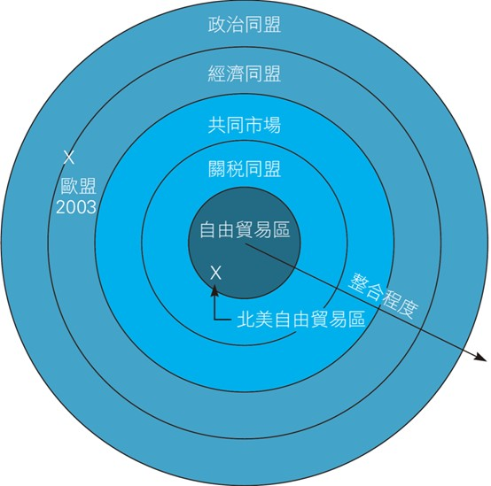
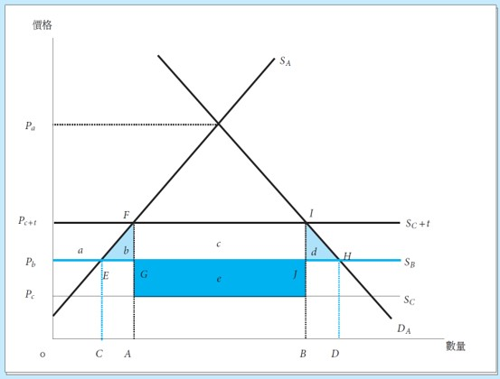

<!-- _class: lead -->

### Regional Economic Integration
#### 區域經濟整合

**Wen-Bin Chuang**
**2026-09-14**

-----

**Regional Economic Integration** refers to `agreements` between countries in a `geographic region` to reduce or eliminate trade barriers among themselves, while possibly maintaining barriers against non-members. The main objective is to increase `economic efficiency`, `boost trade`, `attract investment`, and `enhance bargaining power` in global negotiations.

-----

### **Levels of Regional Economic Integration**

| Level                                  | Description                                                | Tariff on Members | Common External Tariff | Free Movement of Factors | Examples                         |
| -------------------------------------- | ---------------------------------------------------------- | ----------------- | ---------------------- | ------------------------ | -------------------------------- |
| **Preferential Trade Agreement (PTA)** | Reduced tariffs on `selected goods`                        | Reduced           | No                     | No                       | Many developing country deals    |
| **Free Trade Area (FTA)**              | Elimination of tariffs on substantially `all` trade        | Zero              | No (each keeps own)    | No                       | USMCA, ASEAN FTA, RCEP           |
| **Customs Union (CU)**                 | FTA + Common `External` Tariff                             | Zero              | Yes                    | No                       | Mercosur, Southern African CU    |
| **Common Market**                      | Customs Union + `Free movement of labor & capital`         | Zero              | Yes                    | Yes                      | EU Single Market (earlier stage) |
| **Economic & Monetary Union**          | Common Market + `Common currency` + `coordinated policies` | Zero              | Yes                    | Yes                      | Eurozone (EU)                    |
| **Political Union**                    | Full integration with `Common Government`                  | Zero              | Yes                    | Yes                      | (Theoretical)                    |

----

----

### **Static vs Dynamic Effects**

| Type                | Effects                                                      | Usually More Important?  |
| ------------------- | ------------------------------------------------------------ | ------------------------ |
| **Static Effects**  | Trade creation, diversion, terms of trade                    | Short to medium term     |
| **Dynamic Effects** | Economies of scale, competition, technology transfer, investment, innovation | Long term (often larger) |

**Dynamic Benefits**:

- Larger market → economies of scale, Increased competition
    → efficiency gains (X-efficiency)
- Attracts Foreign Direct Investment (FDI), Better infrastructure and policy coordination.

----

### **Pros (Advantages) of Regional Integration**

| Category      | Advantages                                  | Explanation                                                  |
| ------------- | ------------------------------------------- | ------------------------------------------------------------ |
| **Economic**  | `Trade Creation`                            | Replaces high-cost domestic production with cheaper partner production |
|               | Economies of Scale                          | Larger regional market allows firms to produce more efficiently |
|               | Increased Competition                       | Forces domestic firms to become more efficient ("X-efficiency") |
|               | Investment Attraction (FDI)                 | Larger market + policy stability attracts foreign investors  |
|               | Technology Transfer & Innovation            | Easier movement of people, capital, and knowledge            |
|               | Better Infrastructure & Policy Coordination | Joint projects in transport, energy, standards               |
| **Political** | Enhanced Bargaining Power                   | Larger bloc has more influence in WTO or with big powers (e.g., EU, ASEAN) |
|               | Peace and Stability ("Peace Dividend")      | Countries that trade intensively are less likely to fight (EU example) |
|               | Domestic Reform Anchor                      | International commitments help lock in difficult domestic reforms |
| **Strategic** | Supply Chain Resilience                     | Regional integration reduces dependence on distant suppliers |
|               | Geopolitical Influence                      | Creates counterweight to global powers                       |

------

### **Cons (Disadvantages)**

| Category        | Disadvantages                                      | Explanation                                                  |
| --------------- | -------------------------------------------------- | ------------------------------------------------------------ |
| **Economic**    | `Trade Diversion`                                  | May shift imports from efficient global producers to less efficient partners |
|                 | Loss of Tariff Revenue                             | Important revenue source for many developing countries       |
|                 | Adjustment Costs & Unemployment                    | Some industries contract, leading to job losses in the short term |
|                 | Risk of "Race to the Bottom"                       | Pressure to lower taxes, labor, or environmental standards   |
|                 | Uneven Distribution of Gains                       | Some regions/industries benefit much more than others (e.g., core vs periphery) |
| **Sovereignty** | Loss of Policy Autonomy                            | Must follow common rules (tariffs, regulations, subsidies)   |
|                 | Harmonization Costs                                | Expensive to align standards, laws, and regulations          |
| **Political**   | Increased Complexity & Bureaucracy                 | New institutions and decision-making processes               |
|                 | Risk of Domination by Larger Members               | Smaller countries may lose influence (e.g., concerns in Mercosur, AfCFTA) |
| **Other**       | Exclusion of Non-Members ("Spaghetti Bowl" effect) | Proliferation of overlapping FTAs creates complex rules of origin |
|                 | Potential for Conflict                             | Disputes over rules, compensation, or external tariffs       |

----

### **Major Regional Trade Agreements (2026)**

- **EU** — Deepest integration (Economic & Monetary Union)
- **USMCA** — Modern FTA (USA, Mexico, Canada)
- **RCEP** — Largest by population (ASEAN + China, Japan, Korea, Australia, NZ)
- **CPTPP** — High-standard FTA (11 countries, including Japan, Vietnam, Canada)
- **AfCFTA** — African Continental Free Trade Area (ambitious but implementation ongoing)
- **ASEAN Economic Community**

-----

### **Key Economic Concepts**

#### **Trade Creation vs Trade Diversion** (Jacob Viner, 1950)

- **Trade Creation**: Replacement of `high-cost domestic production` with `lower-cost imports` from partner countries → **Welfare Improving**.

- **Trade Diversion**: Replacement of `low-cost imports` from the rest of the world with `higher-cost imports` from partner countries (due to preferences) → **Welfare Reducing**.

-----

##### Model Setup (Small Country)

Assume a small country forms an **FTA** with a partner country.

- **Demand**: $Q_d = D(P)$, **Supply**: $Q_s = S(P)$
- $P_c$ = World price (most efficient producer),  $P_b$ = `Partner` country price ($P_c < P_b$)
- $t$ = Specific tariff rate

**Prices**:

- Pre-FTA import price (`from world`) = $P_c + t$
- Post-FTA import price `from partner` = $P_b$ (tariff removed)

- Post-FTA import price from world = $P_c + t$ (tariff remains)

----

###### Key Equations

**Before FTA** (with tariff on all imports):
$$
P_1 = P_c + t, \quad
\text{Imports} = D(P_1) - S(P_1)
$$
**After FTA**:
$$
P_2 = P_b \quad \text{(assuming } P_c + t > P_b > P_c \text{)},\quad
\text{Imports from Partner} = D(P_2) - S(P_2)
$$

- **Trade Creation** = Increase in total imports due to `lower price` --> mainly `replaces` domestic `poor` production

- **Trade Diversion** = `Portion` of imports that switches `from world to partner`

----

#### Welfare Diagram Description 

Imagine the diagram with Price on vertical axis, Quantity on horizontal axis.

**Lines**:

- Domestic Demand (downward sloping), Domestic Supply (upward sloping)
- Horizontal lines for prices: $P_c$, $P_b$,  $P_c + t$

----

----

#### **Welfare Areas (Detailed Labeling)**

When the country moves from $P_c +t$ to $P_b$:

- **Consumer Surplus Gain** = Area **(a + b + c + d)**,  
- **Producer Surplus Loss** = Area **a** 
- **Government Tariff Revenue Loss** = Area **(c + e)**  
  - lost on imports now coming `from partner`

-----

- **Net Welfare Effect** = (b+d)−e, Where:

  - **Area b** = **Trade Creation Gain** (production efficiency)

  - **Area d** = **Trade Creation Gain** (consumption efficiency)

  - **Area e** = **Trade Diversion Loss**

**Interpretation**:

- If **(b + d) > e** → Net welfare `gain` from FTA; 
- If **(b + d) < e** → Net welfare `loss` from FTA

-----

#### Summary Table

| Effect              | Area    | Welfare Impact | Meaning               |
| ------------------- | ------- | -------------- | --------------------- |
| Consumer Gain       | a+b+c+d | Positive       | Lower price           |
| Producer Loss       | -a      | Negative       | Reduced output        |
| Lost Tariff Revenue | -(c+e)  | Negative       | Government loss       |
| **Trade Creation**  | **b+d** | **Positive**   | Efficiency gain       |
| **Trade Diversion** | **-e**  | **Negative**   | Inefficient source    |
| **Net Welfare**     | b+d–e   | Ambiguous      | Depends on magnitudes |

----

#### **Dynamic Gains from Regional Economic Integration**

- While **static effects** (trade creation vs diversion) are one-time reallocations of resources, 

- **Dynamic gains** are the long-term, ongoing benefits that drive `sustained economic growth`. These are generally considered much larger and more important than static effects.

---

#### Main Sources of Dynamic Gains

| Dynamic Gain                         | Mechanism                                                    | Expected Impact                                  |
| ------------------------------------ | ------------------------------------------------------------ | ------------------------------------------------ |
| **Economies of Scale**               | Larger regional market allows firms to increase production scale | Lower average costs, higher competitiveness      |
| **Increased Competition**            | More foreign competitors force firms to reduce inefficiency ("X-inefficiency") | Higher productivity, innovation                  |
| **Technology Transfer & Spillovers** | FDI, imports of capital goods, movement of skilled workers   | Faster technological progress                    |
| **Foreign Direct Investment (FDI)**  | Bigger market + policy certainty attracts more investment    | Capital inflow, job creation, knowledge transfer |
| **Product Variety & Innovation**     | Larger market supports more product differentiation          | Consumer welfare + learning-by-doing             |
| **Structural Transformation**        | Shift of resources from low-productivity to high-productivity sectors | Long-term growth acceleration                    |
| **Policy Reform & Credibility**      | External commitments lock in better policies                 | Better institutions and governance               |

----

#### Economic Theory Behind Dynamic Gains

###### A. Economies of Scale (Internal & External)

- Firms face decreasing average costs as output increases.

- **Simple Equation**:
$$
AC = \frac{TC}{Q} \quad \text{where } AC \text{ falls as } Q \text{ (output) rises in larger market}
$$

  - **Internal economies**: Firm-level (better machinery, specialization)
  - **External economies**: Industry-level (clustering, shared suppliers, skilled labor pools)

---

#### B. Pro-Competitive Effect & X-Efficiency (Leibenstein)

Before integration: Protected firms operate with slack (inefficiency). After integration: Competition forces firms closer to the efficiency frontier.

#### C. Endogenous Growth Theory (Romer, Grossman-Helpman)

Integration increases:

- Knowledge spillovers; Returns to R&D; Rate of innovation

**Growth Equation (Simplified)**: 
$$
g = f(\text{openness, market size, human capital, R\&D})
$$
Larger integrated markets raise the growth rate *g*.

----

#### Numerical / Illustrative Example

**Scenario**: Country A has a domestic market of 10 million consumers. It forms an FTA with Country B (another 15 million).

- Before Integration:

  - Firm produces 50,000 cars/year → Average Cost = $22,000
  - Limited competition → operates at 80% efficiency

- After Integration

  (25 million combined market):

  - Firm can sell 120,000 cars/year → Average Cost drops to **$16,000** (economies of scale)
  - Competition rises → efficiency rises to 95%
  - Productivity growth: +2.5% per year (instead of 0.8%)

**Cumulative Effect** over 10 years: The dynamic gains can be **3–5 times larger** than one-time static gains.

---

#### Conditions for Maximizing Dynamic Gains

Dynamic gains are **not automatic**. They depend on:

1. **Complementary Policies**: Education, infrastructure, flexible labor markets, good governance.
2. **Depth of Integration**: Deeper agreements (Common Market > FTA) generate larger dynamic effects.
3. **Initial Conditions**: Countries with similar technological levels gain more from scale and competition.
4. **Openness to the World**: Integration should be “open regionalism” rather than closed blocs.
5. **Adjustment Support**: Retraining programs, social safety nets to manage short-term costs.

----

**Key Takeaway**:

- Most economists believe that **dynamic gains** from successful regional integration are the primary reason countries pursue it. 

- While static effects can be small or even negative, the long-term benefits from `productivity growth`, `innovation`, and `structural change` often make integration worthwhile — **provided** countries implement supporting domestic policies.