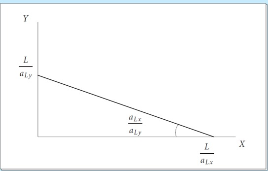

<!-- _class: lead -->

## Gain from Trade

**國企 Wen-Bin Chuang**
**2026-09-14**

----

**Gains from Trade** refer to the increase in economic welfare (utility or real income) that a country achieves by engaging in international trade compared to **Autarky** (no trade situation).

**Core Idea**: Even if a country is not more efficient in producing anything, it can still benefit from trade by `specializing` according to its **comparative advantage** and exchanging goods with other countries.

There are two main types of gains:

- **Static Gains** (one-time improvement in `consumption possibilities`)
- **Dynamic Gains** (long-term benefits from technology, competition, scale, etc.)

The idea that trade creates `mutual benefits` is one of the most important and robust insights in economics.

------

### Main Sources of Gains from Trade

| Source                                | Explanation                                                  | Type           |
| ------------------------------------- | ------------------------------------------------------------ | -------------- |
| **Comparative Advantage**             | Countries specialize in goods they produce at lower opportunity cost | Static         |
| **Economies of Scale**                | Larger market allows firms to produce at lower average cost  | Dynamic        |
| **Product Variety**                   | Consumers get access to more varieties of goods and services | Static/Dynamic |
| **Competition Effect**                | Increased competition forces firms to become more efficient  | Dynamic        |
| **Technology & Knowledge Spillovers** | Trade facilitates transfer of ideas and technology           | Dynamic        |
| **Resource Allocation**               | Factors of production move to more productive sectors        | Static         |

----

## Ricardian Model of Comparative Advantage 

Comparative advantage, introduced by `David Ricardo in 1817`, explains why countries (or individuals/entities) benefit from specializing in and trading goods they can produce at a lower opportunity cost, even if one party has an absolute advantage in everything.

**Key Insight**: Even if one country is absolutely more productive in everything, both countries can gain from trade by specializing according to **comparative advantage**.

  We will build the model from the ground up, starting with our assumptions, moving to the Production Possibility Frontiers (PPFs), and finally demonstrating mathematically and graphically why free trade makes both countries better off.

---

###### 1.Model Setup and Notation

First, let’s establish our notation and the rules of our economic world.

- **Goods:** We have two goods, indexed by i, where $i\in{X,Y}$ .
- **Technology (Unit Labor Requirements):** We index goods by i. Let $a_{Li}$  denote the labor needed to produce one unit of good i at home. Similarly, $a_{Li}^∗$  is the labor needed per unit of production in the foreign country. We assume these are **constant**, meaning we have constant returns to scale in labor.
- **Labor Endowments:** The total labor force available at home is $L$, and abroad it is $L^∗$ .
- **Labor Mobility:** Labor is **perfectly mobile** between industries `within` each country (a worker can easily switch from making X to making Y). However, labor is **completely immobile** *across* countries (workers cannot migrate from home to foreign).
- **Marginal Product of Labor (MPL):** Because technology is constant, the MPL in each industry is simply the inverse of the unit labor requirement: $MPL_i=1/a_{Li}$.

---

###### 2. The Production Possibility Frontier (PPF) 

Because labor is the only factor of production and the MPL is `constant`, the Production Possibility Frontier (PPF) for each country is a **straight line**. The slope of the PPF represents the **opportunity cost** of producing good X in terms of good Y.

- For the **Home** country, the slope of the PPF is $a_{LX}/a_{LY}$.
- For the **Foreign** country, the slope of the PPF is $a_{LX}^*/a_{LY}^*$.

---

---

**Autarky (No Trade):** Imagine a world where borders are closed. Under autarky, each country must `produce exactly what it consumes`. The autarky equilibrium will occur where the country's PPF is tangent to its community indifference curve (its preferences). Let’s call the home autarky equilibrium point $E_0$  and the foreign autarky equilibrium point $E_0^∗$ .

---

---

###### 3. Identifying Comparative Advantage

Now, let’s introduce **Comparative Advantage**. A country has a comparative advantage in a good if it can produce it at a `lower opportunity cost` than the other country. Suppose the **home country has a comparative advantage in producing good X**. This means the opportunity cost of X at home is lower than abroad: $a_{LX}/a_{LY} <a_{LX}^*/a_{LY}^*$. 

**Graphically:** If we put good Y on the vertical axis and good X on the horizontal axis, this inequality implies that the **slope of the PPF at home is flatter (lower)** than the slope of the PPF abroad. Home is relatively more efficient at producing X.

---

---

###### 4. Opening to Free Trade: Specialization

Now, let’s open the borders to international trade. The world market will determine a relative world price, p*p* (the price of good X in terms of good Y). For trade to be `mutually beneficial` and for both countries to `specialize`, the world price p must lie strictly *between* the two autarky opportunity costs: $a_{LX}/a_{LY} <p<a_{LX}^*/a_{LY}^*$. 

Let’s look at how producers in each country react to this world price p:

**The Home Country:** Because the world price p is greater than the home opportunity cost ($p > a_{LX}/a_{LY}$), it is `highly profitable` to produce good X. Home producers will shift all their labor (L) into industry X.

- **Production Point:** The home country is now **fully specialized** in good X. On the graph, this is the X-intercept of the home PPF, which we will call **Point N**.

---

**The Foreign Country:** Conversely, because the world price p is less than the foreign opportunity cost $p < a_{LX}^*/a_{LY}^*$, it is cheaper to import good X and produce good Y instead. Foreign producers will shift all their labor ($L^∗$) into industry Y.

- **Production Point:** The foreign country is now **fully specialized** in good Y. On the graph, this is the Y-intercept of the foreign PPF, which we will call **Point N***.

---

----

###### 5. The Gains from Trade: Consumption Beyond the PPF

Production is only half the story; what matters to the citizens is `consumption`. Because they can now trade at the world relative price p, both countries face a new **Budget Line** (or terms of trade line) passing through their production points, with a slope of $−p$ .

**Home Consumption:** Starting from production point **N** (all X), the home country exports some of good X and imports good Y at the relative price p. They will choose to consume at the point where this budget line is tangent to their highest possible indifference curve. Let’s call this consumption point **C**.

---

**Foreign Consumption:** Starting from production point **N*** (all Y), the foreign country exports good Y and imports good X at price p. They will consume at the point where their budget line is tangent to their highest indifference curve. Let’s call this consumption point **C***.

**The Magic of Trade:** Look closely at points **C** and **C\*** on your graph. Because the world price p lies between the two autarky slopes, the new budget lines are flatter than the foreign PPF and steeper than the home PPF.

As a result, the consumption points **C** and **C\*** lie strictly **above and outside** their respective PPFs!

---

Under `autarky`, a country could never consume outside its PPF; it was constrained by its `own production capabilities`. But under free trade, trade acts like a new technology. By specializing according to comparative advantage and trading, both countries achieve a consumption point that is physically impossible to reach under autarky.

Trade Equilibrium:

- Produce at Point **N** (more specialized in X).
- Consume at Point **C1** (on a higher indifference curve).

**Gains from Trade**: The country moves from a lower indifference curve (C0) to a higher one (C1).

In a two-good model, gains from trade are shown by:

- **Consumption Possibility Frontier (CPF)** expands outward when trade is allowed.
- The country can reach a higher **indifference curve** (higher utility).

---

---

###### 6. Terms of Trade (ToT)

**Terms of Trade** measures the **relative price** of a country’s exports compared to its imports.
$$
\text{ToT} = \frac{P_{Exports}}{P_{Imports}} \times 100
$$

- If ToT **increases** → A country can buy **more imports** for the same amount of exports → **Better**.
- If ToT **decreases** → A country must export **more** to buy the same amount of imports → **Worse**.

---

#### **Intuition**

When a country’s Terms of Trade improve, it means its export goods become relatively **more valuable** in the world market. This allows the country to:

- Import more goods and services for every unit it exports.
  - Reach a **higher consumption possibility frontier**.
  - Achieve a **higher level of welfare** (higher indifference curve).

---

##### 7. Summary

To wrap up today's lecture, here are the key takeaways:

1. **Constant opportunity costs** lead to linear PPFs.
2. **Comparative advantage** is determined by comparing the slopes of the PPFs (opportunity costs).
3. When the world price p falls between the two autarky opportunity costs, it triggers **complete specialization** (Home produces only X, Foreign produces only Y).
4. By trading at price p, both countries can consume at points **outside their PPFs**, proving definitively that **free trade is a positive-sum game** and makes both nations better off than they were in autarky.

---

#### Evidence of Ricardian Model of Comparative Advantage

David Ricardo published his theory of comparative advantage in 1817. For over a century, it remained largely a theoretical construct. Testing it empirically was notoriously difficult because you have to measure "labor productivity" across different countries and link it directly to actual trade flows, while controlling for a myriad of other factors like capital, technology, and tariffs.

  MacDougall decided to test the model by looking at two of the world's leading industrial powers at the time: **the United States and the United Kingdom**. He focused on 25 specific manufacturing industries.

When MacDougall plotted these 25 industries on a scatter graph—putting Relative Labor Productivity on the horizontal axis and Relative Export Performance on the vertical axis—the results were striking.

---

He found a **remarkably strong, clear positive correlation**.

- In industries where US workers were, say, twice as productive as UK workers (a productivity ratio of 2.0), US exports in that industry were also roughly twice as large as UK exports (an export ratio of 2.0).
- Conversely, in the few industries where the UK actually had higher labor productivity than the US, the UK dominated the export markets for those specific goods.

The data points clustered tightly around a 45-degree line, indicating an almost proportional relationship between relative productivity and relative export shares.

---

---

## Revealed Preference Theory (RPT)

`Revealed Preference Theory` can be used to prove gains from trade in a very elegant way — without needing to assume specific utility functions or indifference curves. 

#### **1. Direct Revealed Preference**

- Bundle **A** is **directly revealed preferred** to bundle **B** if:

  - The consumer `chose` bundle **A**, and

  - Bundle **B** was affordable at the same time (i.e., cost of B ≤ income when A was chosen).

Mathematically: If $\mathbf{p^A} \cdot \mathbf{x^A} \geq \mathbf{p^A} \cdot \mathbf{x^B}$, and the consumer chose $\mathbf{x^A}$, then:
$$
\mathbf{x^A} \succsim \mathbf{x^B}
$$

---

#### **2. Weak Axiom of Revealed Preference (WARP)**

- **Statement**: If bundle A is revealed preferred to bundle B, then bundle B should **not** be revealed preferred to bundle A. In other words:
  - If A is chosen when B is affordable → B should not be chosen when A is affordable.

**Violation of WARP** = Inconsistent behavior (irrational choice).

---

- RPT provides one of the **cleanest proofs** that trade creates gains:

  - In autarky, the country chooses consumption bundle **A**.
  - When trade opens, bundle **A** is still affordable (the country could still produce it).
    - But the country **chooses** a different bundle **C**. Therefore, by Revealed Preference: **C is preferred to A** → The country is better off.

---

#### Proving Gains from Trade with RPT

#### Setup:

- Let **A** = `Autarky` consumption bundle. Let **C** = Consumption bundle under `free trade`

#### Key Argument:

- In **autarky**, the consumer chooses bundle **A** at `domestic prices` ($P^A$). When the country opens to trade:

  - The consumer faces `world prices `($P^*$). The value of the autarky bundle **A** at world prices is **affordable** under the trade budget (because the country can still produce A and trade at world prices). Mathematically:

$$
P^* \cdot A \leq P^* \cdot C
$$

Since the consumer **chooses C** when A is also affordable (at world prices), by **Weak Axiom of Revealed Preference (WARP)**: → The consumer **reveals** that **C is preferred to A** ($C \succ A$). 

---

**Key insight from RPT**: The post-trade consumption bundle is chosen when the autarky bundle remains affordable (at the new prices and with trade income). Therefore, the post-trade bundle is *revealed preferred* to the autarky bundle. This directly demonstrates **gains from trade** without needing to measure utility explicitly:

- If choices are consistent (satisfy WARP/SARP), the economy as a whole (or representative agent) is better off.
- The pattern of trade "reveals" the underlying comparative advantage: countries export goods in which they have a revealed lower opportunity cost.

---

###### Core Inequality (Autarky vs. Free Trade)

- $p^A, c^A$: Autarky (no-trade) prices and consumption bundle.
- $p^W, c^W$: World (free-trade) prices and post-trade consumption bundle.

In free trade, the autarky bundle $c^A$ remains affordable at world prices and trade income (the country could still produce and consume it, but chooses not to). Therefore:
$$
\underbrace{\mathbf{p}^W \cdot \mathbf{c}^W}_{\text{Value of chosen trade bundle}} \ \geq \ \underbrace{\mathbf{p}^W \cdot \mathbf{c}^A}_{\text{Value of autarky bundle at world prices}}
$$

- If the inequality is **strict** (≠), then $c^W$ is *strictly revealed preferred* to $c^A$.
- This directly proves **gains from trade** under the Weak Axiom of Revealed Preference (WARP).

This is the central equation used in the literature to show welfare gains from trade without utility functions

---

###### Weak Axiom of Revealed Preference (WARP) in Trade Context

If $c^W$ is revealed preferred to $c^A$, then it cannot be that $c^A$ is revealed preferred to $c^W$:
$$
\mathbf{p}^W \cdot \mathbf{c}^W \geq \mathbf{p}^W \cdot \mathbf{c}^A \quad \implies \quad \mathbf{p}^A \cdot \mathbf{c}^A \not\geq \mathbf{p}^A \cdot \mathbf{c}^W \quad \text{(or strict version)}
$$
In practice, because autarky maximizes domestic production value at $p^A$, we usually have $p^A · c^A ≥ p^A · c^W$, which combined with the first inequality confirms consistency and gains.

