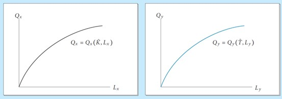
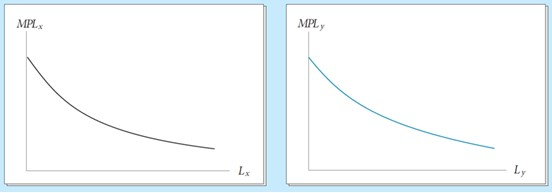
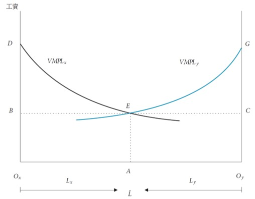
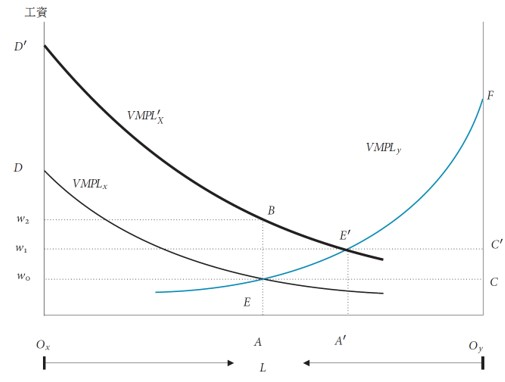

<!-- _class: lead -->

## Specific Factor Model

**國企 Wen-Bin Chuang**
**2026-09-14**

-----

The **Specific Factors Model** (also known as the **Ricardo-Viner model**, developed by Jacob Viner's (1930s) extensions of Ricardo; formally developed by Ronald Jones (1971) and Peter Neary (1978)) bridges the gap between short-run reality and long-run trade theory.  While the Heckscher-Ohlin model assumes all factors are perfectly mobile across sectors, the Specific Factors model recognizes that in the short-to-medium run, capital, land, and specialized equipment are often `stuck` in particular industries. Only labor (or broadly defined "mobile factors") can reallocate freely.

   The Specific-Factor Model explains why owners of sector-specific capital (e.g., factory owners, farmers, miners) often have strong opinions about trade policy — they gain or lose heavily depending on whether their sector `expands` or `contracts`. This shift fundamentally changes trade's `distributional politics`: winners and losers are determined by sector, not by factor type.

---

#### Core Assumptions

| Assumption                          | Description                                                  |
| ----------------------------------- | ------------------------------------------------------------ |
| Two goods (X and Y)                 | e.g., Manufacturing and Agriculture                          |
| **Three factors**                   | Labor (L) + Specific Capital in X (Kx) + Specific Capital in Y (Ky) |
| Labor is **mobile** between sectors | Workers can move from one industry to another                |
| Capital is **specific** (immobile)  | Capital is stuck in its sector in the short run              |
| Constant Returns to Scale           | In each sector                                               |
| Perfect Competition                 | In goods and labor markets                                   |
| Diminishing Marginal Returns        | To labor in each sector (due to fixed specific capital)      |
| Full employment of all factors      | Labor and both specific capitals                             |

Most Important Feature: Labor is the `mobile factor`, while capital is `sector-specific`.

----

#### Main Mechanism

###### Goods Price → Factor Price Relationship

- An increase in the **price of a good** benefits the **specific factor** used in that sector **strongly**.
- It benefits **labor** (mobile factor) **moderately**, while it **hurts** the specific factor in the **other sector**.

###### Detailed Effects:

| Change                   | Effect on Wage (w) | Effect on Return to $K_x (r_x)$ | Effect on Return to $K_y (r_y)$ |
| ------------------------ | ------------------ | ---------------------------- | ---------------------------- |
| Price of X ↑ (e.g. $P_x$ ↑) | **Increases**      | **Strong Increase**          | **Decreases**                |
| Price of Y ↑ (e.g. $P_y$ ↑) | **Increases**      | **Decreases**                | **Strong Increase**          |

---

**Intuition**:

- When $P_x$ rises → `Demand` for labor in sector X increases → wages rise. Sector X expands, pulling labor from sector Y.
- Owners of $K_x$ (specific to X) gain a lot (higher revenue + lower real wage cost relative to output price), while Owners of $K_y$ lose because their sector contracts.

**Real Income Effect**:

- Specific factor owners are heavily exposed to price changes in their sector.
- Workers (mobile) have **ambiguous** real income effects depending on their consumption basket.

----

#### Endowment Change → Factor Price and Output

**A. Increase in Labor Endowment (↑ L)**

- Output of **both goods** increases. Wage (**w**) **falls** (due to diminishing returns).
- Return to both specific capitals ($r_x$ and $r_y$) **increase**.

B. Increase in Specific Capital (e.g., ↑ $Kx$)

- Output of X **increases significantly**, while Output of Y **decreases** (labor moves to X).
- Wage (**w**) **increases**.
- Return to $K_x$ ($r_x$) **falls** (diminishing returns), while Return to $K_y$ ($r_y$) **increases**.

This is similar to the `Rybczynski effect` but modified due to specificity.

-----

#### Intuition

###### How Labor Allocation Works:

1. Firms maximize profit: hire labor until **Value of Marginal Product of Labor (VMPL)** equals wage:
   $$
   \begin{array}{c}
   VMPL_{x}=P_{X}\cdot MPL_{X}\left(L_{X}\right)=w\\
   VMPL_{Y}=P_{Y}\cdot MPL_{Y}\left(L_{Y}\right)=w
   \end{array}
   $$

$MPL$ `diminishes` as more labor is added to a fixed specific factor ⇒ $VMPL$ curves slope downward.

**Equilibrium**: Labor splits so $VMPL_X=VMPL_Y=w$. The `intersection` of the two $VMPL$ curves determines $L_X^∗,L_Y^∗,w^∗$.

---

---

---

---

#### Response to a Price Change (e.g., $P_X↑$ due to trade/tariff):

- $VMPL_X$ shifts upward.
- Labor moves from Y to X until $VMPL_X=VMPL_Y$  again.
- **Wage rises**, but **less than proportionally** to $P_X$.
- **Sector X expands**, **Sector Y contracts**.
- Distributional outcomes follow directly from factor ownership patterns.

---

-----

### Summary Comparison with H-O Model

| Feature                | Specific-Factor Model              | Heckscher-Ohlin Model      |
| ---------------------- | ---------------------------------- | -------------------------- |
| Time Horizon           | Short Run                          | Long Run                   |
| Factor Mobility        | Labor mobile, Capital specific     | Both factors fully mobile  |
| Effect of Price Change | Strong effect on specific factors  | Benefits abundant factor   |
| Income Distribution    | Clear winners and losers           | Based on factor abundance  |
| Pattern of Trade       | Based on specific factor abundance | Based on overall K/L ratio |

-----

##### Key Theorems & Policy Implications

| Result                     | Implication                                                  |
| -------------------------- | ------------------------------------------------------------ |
| **Sectoral Distribution**  | Trade creates winners/losers by industry, not by factor class |
| **Ambiguous Labor Effect** | Workers gain purchasing power for imported goods, lose for exported goods |
| **Compensation Principle** | Aggregate national income rises; gainers could theoretically compensate losers |
| **Tariff Protection**      | Shields sector-specific assets from foreign competition; explains industry lobbying |
| **Short vs Long Run**      | Short run: specific factors dominate politics. Long run: capital becomes mobile ⇒⇒ H-O/S-S logic applies |

---

#### Political Economy Insight:

The model explains why trade politics often align with **sectoral coalitions** (e.g., steelworkers + steel owners vs. auto workers + auto owners) rather than class-based factor alliances (labor vs. capital). This matches empirical lobbying patterns in the US, EU.

---

###  Mathematical Derivation

#### Zero-Profit Condition (Revenue = Factor Payments)

By `Euler's Theorem` for `CRS production functions`:
$$
Q_X=F_{X,L}L_X+F_{X,K}K_X
$$
Multiply by $P_X$  and substitute $w=P_X\cdot F_{X,L}$ and $r_X=P_X\cdot F_{X,K}$
$$
P_XQ_X=wL_X+r_XK_X
$$
This is the **zero-profit condition**: total revenue equals total factor payments.

---

#### Comparative Statics (Hat Notation)

Take the `total differential` and Apply `product rule`:
$$
P_XdQ_X+Q_XdP_X=L_Xdw+wdL_X+K_Xdr_X+r_XdK_X
$$
From the production function, $dQ_X=F_{X,L}dL_X+F_{X,K}dK_X$. 
Multiply by $P_X$ :
$$
P_XdQ_X=wdL_X+r_XdK_X
$$
so, $Q_XdP_X=L_Xdw+K_Xdr_X$ , 
Divide by $P_XQ_X$ :
$$
\frac{dP_X}{P_X}=\frac{wL_X}{P_XQ_X}\frac{dw}{w}+\frac{r_XK_X}{P_XQ_X}\frac{dr_X}{r_X}
$$

---

- $\hat{x}≡\frac{dx}{x}$ (proportional change), 
- $\theta_{LX}≡\frac{wL_X}{P_XQ_X}$(labor's share of revenue/cost), 
- $\theta_{KX}≡\frac{r_XK_X}{P_XQ_X}$ (capital's share)

Since CRS ⇒$\theta_{LX}+\theta_{KX}=1$ , we get the **standard Jones hat-algebra equation**:
$$
  \hat{P_X}=\theta_{LX}\hat{w}+(1−\theta_{LX})\hat{r}\\
  \rightarrow \hat{r_X}=\frac{1}{1−\theta_{LX}}(\hat{P_X}−\theta_{LX}\hat{w})
$$

since $1−\theta_{LX}<0$ , we can get the $\hat{r}_X>\hat{P}_X$ and  $\hat{P}_X>\hat{w}>\hat{P}_Y$

---

  

  This inequality is the core of the **Stolper-Samuelson / Specific-Factors magnification effect**:

  | Condition              | Economic Meaning                                             |
  | ---------------------- | ------------------------------------------------------------ |
  | $\hat{P_X}>0$          | Output price rises (e.g., trade liberalization, tariff removal, demand shock) |
  | $\hat{w}<\hat{P_X}$    | Nominal wage rises, but **less than the output price** (real wage in terms of good X falls) |
  | $\hat{r_X}>\hat{P_X} $ | Return to capital rises **more than the output price** (real return in terms of all goods rises) |

The price increase generates a "revenue windfall" $ΔP_X⋅Q_X$ . Because labor's share is only $\theta_{LX}$ , most of this windfall must flow to capital. The factor $1/(1−\theta_{LX})>1$ **magnifies** the gap between $\hat{P_X}$  and $\hat{w}$ , pushing $\hat{r}_X$  above $\hat{P}_X$ .

-----

#### 1. Profit Maximization & Labor Demand

$$
\begin{array}{c}
w=P_{X}\cdot MPL_{X}\left(L_{X}\right)=P_{X}F_{X,L}\left(K_{X},L_{X}\right)\\
w=P_{Y}\cdot MPL_{Y}\left(L_{Y}\right)=P_{Y}F_{Y,L}\left(K_{Y},L_{Y}\right)
\end{array}
$$

Labor market clearing: $L_X+L_Y=\bar{L}$.

#### 2. Comparative Statics (Hat Notation)

Let $\theta_{Li}$= labor's share of revenue in sector i: $\theta_{Li}=\frac{wL_{i}}{P_{i}Q_{i}}$. Totally differentiate the equilibrium conditions:
$$
\begin{array}{c}
\hat{w}=\theta_{LX}\hat{P}_{X}+\left(1-\theta_{LX}\right)\hat{r}_{X}\\
\hat{w}=\theta_{Ly}\hat{P}_{y}+\left(1-\theta_{LY}\right)\hat{r}_{Y}
\end{array},
$$

Solving the system yields the **key inequality** (assuming $\hat{P}_X>\hat{P}_Y=0$ ):
$$
\hat{P}_X>\hat{w}>\hat{P}_Y
$$

---

#### 3. Returns to Specific Factors

From zero-profit conditions:
$$
\begin{array}{c}
\hat{r}_{X}=\frac{1}{1-\theta_{LX}}\left(\hat{P}_{X}-\theta_{LX}\hat{w}\right)>\hat{P}_{X}\\
\hat{r}_{Y}=\frac{1}{1-\theta_{LY}}\left(\hat{P}_{Y}-\theta_{LY}\hat{w}\right)>0_{}
\end{array},
$$

-----

#### 4. Real Returns Summary

| Factor                    | Nominal Change                | Real Return in X*X* | Real Return in Y*Y* | Ambiguity?          |
| ------------------------- | ----------------------------- | ------------------- | ------------------- | ------------------- |
| **Specific to X** ($K_X$) | $\hat{r}_X>\hat{P}_X$         | ↑                   | ↑↑                  | ❌ Unambiguous gain  |
| **Specific to Y** ($K_Y$) | $\hat{r}_Y<0$                 | ↓↓                  | ↓                   | ❌ Unambiguous loss  |
| **Mobile Labor** (L)      | $\hat{P}_X>\hat{w}>\hat{P}_Y$ | ↓                   | ↑                   | ✅ Ambiguous overall |

**Core Result**: The specific factor in the expanding sector gains more than the price rise; the specific factor in the contracting sector loses absolutely; labor's welfare depends on consumption shares.

