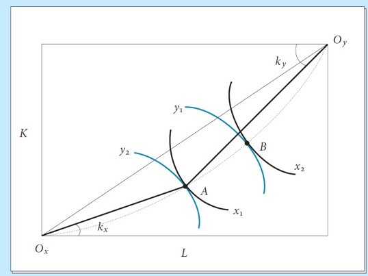
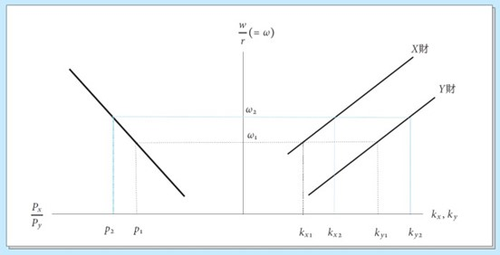

<!-- _class: lead -->

#### Heckscher-Ohlin Model I

**Wen-Bin Chuang**
**2026-09-14**

-----

The **Heckscher-Ohlin Model** (developed by Eli Heckscher, 1919 and Bertil Ohlin, 1924) is a `general equilibrium model` that explains international trade based on **differences in factor endowments** between countries.

The Heckscher-Ohlin model extends the Ricardian comparative advantage framework by explaining the *source* of comparative advantage: Differences in **relative factor endowments** (e.g., capital vs. labor) `across countries`, combined with differences in **factor intensities** of `goods`.  It assumes `identical technologies` across countries, so trade patterns arise purely from `endowment differences`.

**Core Idea**: Countries export goods that intensively use their **abundant factor** and import goods that intensively use their **scarce factor**.

----

#### Key Related Theorems in H-O

1. **Rybczynski Theorem**: At constant prices, an increase in `one factor endowment` increases output of the intensive good more than proportionally and decreases output of the other good.
2. **Stolper-Samuelson Theorem**: An increase in the `relative price of a good` raises the real `return` to the intensive factor and lowers the real return to the other factor.
3. **Factor Price Equalization (FPE)**: Under certain conditions (no specialization, etc.), free trade equalizes `relative factor prices (w/r)` across countries.

---

#### Core Assumptions (2×2×2 Model)

| Assumption                            | Description                                      |
| ------------------------------------- | ------------------------------------------------ |
| Two countries, Two goods, Two factors | Standard 2×2×2 model                             |
| `Perfect Competition`                 | In both goods and factor markets                 |
| Constant Returns to Scale (CRS)       | Production functions are homogeneous of degree 1 |
| Identical Homothetic Preferences      | Same tastes across countries                     |
| Technology                            | Same technology in both countries                |
| Factors mobile within country         | Labor and Capital mobile between sectors         |
| Factors immobile between countries    | No international factor mobility                 |
| No transport costs / trade barriers   | Free trade                                       |
| Full employment                       | All factors are fully utilized                   |

---

#### Key Concept

1. ###### Factor Endowment (Country-Level Property)

**Factor Endowment** refers to the **total amount** of factors (Labor $L$ and Capital $K$) available in each country. Countries differ in their **relative endowments**.

- **Notation**: `Home`: Capital-Labor ratio = $\frac{K}{L}$; `Foreign`: Capital-Labor ratio = $\frac{K^*}{L^*}$
- **Definition**: A country is **capital-abundant** if $\frac{K}{L} > \frac{K^*}{L^*}$;  A country is **labor-abundant** if $\frac{K}{L} < \frac{K^*}{L^*}$

----

###### 2. Factor Intensity (Good-Level Property)

**Factor Intensity** tells us which good uses more of a particular factor **relative to the other good**.

- **Definition**: Good $Y$ is **capital-intensive** relative to good $X$ if, at any given factor price ratio $w/r$, it uses a higher capital-labor ratio in production:

$$
\frac{K_Y}{L_Y} > \frac{K_X}{L_X}, \quad ∀ w/r
$$
**Example**: Automobiles = Capital-intensive; Textiles = Labor-intensive

**Important**: Factor intensity is a **relative** concept and is assumed to be the same in both countries (no factor intensity `reversal`).

----

###### 3. Factor Proportion (Factor Ratios)

- Refers to the **optimal input mix** ($K/L$ ratio) used in production.
- Determined by relative factor prices ($w/r$) and technology.
- At equilibrium, both sectors use different factor proportions:
  - Capital-intensive good uses **higher K/L ratio**; Labor-intensive good uses **lower K/L ratio**

In the `Edgeworth-Bowley Box`, this is shown by the different shapes of `isoquants`.

----

----

### Heckscher-Ohlin Theorem 

> A country will **export** the goods that **intensively uses** its **relatively abundant factor**, and **import** the goods that intensively uses its **relatively scarce factor**.

**Example**:

- China (labor-abundant) → exports labor-intensive goods (textiles, electronics assembly)
- Germany (capital-abundant) → exports capital-intensive goods (machinery, cars)

---

#### Main Mechanism

This is the **general equilibrium** way to find the world price in the H-O model.

###### Step-by-Step Process:

1. `Autarky Equilibrium`:

   - Each country has its `own relative price` ($P_X / P_Y$). Labor-abundant country has **lower** relative price of labor-intensive good → excess supply potential.

2. `Excess Demand Functions`:

   - At any given `world relative price` $p^W=(P_X / P_Y)^W$, calculate `Excess Demand` of for $X$ and $Y$ for Home and Foreign ($Z^{Home}, Z^{Foreign}$)

3. `World Market Clearing`: World excess demand must be zero:
   $$
   Z_X^{Home}(P^W) + Z_X^{Foreign}(P^W) = 0
   $$

---

4. `Equilibrium World Price`:

   - The world relative price will settle **between** the `two autarky price ratios`.

   - Labor-abundant country will export the labor-intensive good (negative excess demand = excess supply), while Capital-abundant country will export the capital-intensive good.

**Intuition**:

- `Autarky price` in labor-abundant country is `lower` for labor-intensive good. When trade opens, the world price lies in between → labor-abundant country exports labor-intensive good.

----

#### Economic Intuition

1. **Endowment → Output**: More capital relative to labor forces the economy to use its abundant factor intensively → produces more Y relative to X at any given price.
2. **Output → Price**: Higher relative supply of Y meets downward-sloping demand → autarky price of Y falls.
3. **Price → Trade**: When borders open, the country with the lower autarky price of Y sells it abroad → exports the good that uses its abundant factor.

----

###### Key Concept

###### 1. $K/L↑⇒Q_Y/Q_X↑$ (Holding Prices Constant)

Start from `factor market clearing`:
$$
a_{LX}Q_X+a_{LY}Q_Y=L\quad and \quad a_{KX}Q_X+a_{KY}Q_Y=K
$$
Divide the second by the first:
$$
\frac{K}{L}=\frac{a_{KX}Q_X+a_{KY}Q_Y}{a_{LX}Q_X+a_{LY}Q_Y}=\frac{a_{KX}+a_{KY}\lambda}{a_{LX}+a_{LY}\lambda},\quad \text{where}\quad \lambda≡\frac{Q_Y}{Q_X}
$$

**Differentiate (1) w.r.t. $\lambda$, holding $a_{ji}$  fixed** (prices constant ⇒⇒ factor prices fixed ⇒⇒ coefficients fixed):
$$
\frac{d(K/L)}{d\lambda}=\frac{a_{KY}(a_{LX}+a_{LY}\lambda)−a_{LY}(a_{KX}+a_{KY}\lambda)}{(a_{LX}+a_{LY}\lambda)^2}=\frac{a_{KY}a_{LX}−a_{LY}a_{KX}}{(a_{LX}+a{LY}\lambda)^2}
$$
----

By the `capital-intensity assumption`:
$$
\frac{a_{KY}}{a_{LY}}>\frac{a_{KX}}{a_{LX}}⇒a_{KY}a_{LX}−a_{LY}a_{KX}>0
$$
Thus:
$$
\frac{d(K/L)}{d\lambda}>0⇔\frac{∂\lambda}{∂(K/L)}>0
$$
**Result 1**: At constant goods prices, a higher capital-labor endowment **strictly increases** the relative supply of the capital-intensive good Y.

----

----

###### 2. $K/L↑⇒P_Y/P_X↓$ (Autarky Market Clearing)

In `autarky`, relative supply equals relative demand:
$$
\lambda^S(K/L, P)=D(P)
$$

From Step 1, at any fixed P, $\lambda^S$  is `increasing` in K/L. Demand D(P) is `strictly decreasing` in $P$. **Totally differentiate** **(3)**:
$$
\frac{∂\lambda^S}{∂(K/L)}d(K/L)+\frac{∂\lambda^S}{∂P}dP=D^′(P)dP
$$
----

Under `CRS` + `perfect competition`, `zero-profit conditions` tie $P$ to $(w,r)$, and $\lambda^S$  depends on $P$ only through factor substitution. But for the **Rybczynski channel**, the dominant effect is the endowment shift, so we isolate the comparative static:
$$
\frac{dP}{d(K/L)}=\frac{∂\lambda^S/∂(K/L)}{D^′(P)−∂\lambda^S/∂P}
$$

Since $D^′(P)<0$  and the denominator is negative (standard stability condition), and $∂\lambda^S/∂(K/L)>0$ :
$$
\frac{dP}{d(K/L)}<0
$$
**Result 2**: A higher capital-labor endowment **lowers the autarky relative price** of the capital-intensive good Y.

---

## Heckscher-Ohlin Theorem from RPT

| Symbol   | Meaning                                        | Intuitive Understanding                                      |
| -------- | ---------------------------------------------- | ------------------------------------------------------------ |
| $p,p^a$  | Commodity prices under free trade / autarky    | Market prices                                                |
| $w,w^a$  | Factor prices under `free trade` / `autarky`   | Wages, interest rates, rents, etc.                           |
| $c,c^a$  | Consumption bundles under free trade / autarky | The final combination of goods purchased by the nation       |
| v        | Domestic factor endowment                      | Total amount of capital, labor, land, etc., actually owned by the country |
| A        | Input-output matrix (factors × goods)          | Amount of factors required to produce 1 unit of each good    |
| $F≡Ac−v$ | **Net factor imports**                         | Factor services "embedded" in consumed goods −− domestic endowment = factors indirectly borrowed or lent out through trade |

-----

#### Optimization Foundations

Under `perfect competition` and `constant returns to scale`, good prices equal the weighted sum of factor costs: $p=wA$. When `factor markets clear`, the total factors used in production equal the endowment: $Ay=v$ .

#### Trade Balance + Zero Profit → $w⋅F=0$

- `Trade balance` requires: expenditure on consumption = earnings from production, i.e., $p⋅c=p⋅y$ .

- The `zero-profit` condition requires: production revenue = total factor payments, i.e., 

  $p⋅y=w⋅v$ . Combining these yields: $p⋅c=w⋅v$.

  - Using $p=wA$ , the left side can be rewritten as: $p⋅c=(wA)⋅c=w⋅(Ac)$.
  - Substituting `full employment` into the equation: $w⋅(Ac)=w⋅v⇒w⋅(Ac−v)=0$ .
  - Given $F≡Ac−v$, we directly obtain: $w⋅F=0$.

----

**Intuition**: Valued at the free-trade factor prices $w$, the total value of factor services "net imported" by a country through trade is **zero**. Since `trade balance` implies that what you buy is exactly what you sell, the accounts naturally balance at the factor level. This is not an assumption, but an inevitable consequence of accounting identities and optimization conditions.

---

#### Revealed Preference Logic → $w^a⋅F≥0$ 

This is the **core of RPT**. Let's break it down into three layers:

- **Autarky state**: There is `no trade`, so consumption = production ($c^a=y^a$), and the factors used in production exactly equal the endowment ($Ay^a=v$, `full employment`). Therefore, the net factor imports under autarky are $F^a=Ac^a−v=0$ , which naturally gives $w^a⋅F^a=0$ .
- **Free trade state**: The country chooses consumption $c$ and trade pattern $F$ at prices $p$. According to the principle of revealed preference, if $c$ was chosen at prices $p$, it must be **at least as expensive or more expensive** at `autarky prices` $p^a$  (otherwise, the country would have chosen it under autarky): $p^a⋅c≥p^a⋅c^a$ .
  - **Translating into factor terms**: Using $p^a=w^aA$, 
    - the left side of the above inequality becomes $w^aAc$ , 
    - the right side becomes $w^aAc^a=w^av$  (since $Ac^a=v$ `under autarky`). 
  - Rearranging yields: $w^a(Ac−v)≥0⇒w^a⋅F≥0$ .

----

**Intuition**: Valued at the autarky factor prices $w^a$ , the "value" of the net factor imports $F$ brought about by free trade is `non-negative`. Because the country voluntarily chooses trade, it reveals that the trade bundle is at least as good as autarky when evaluated at autarky prices. This is a direct manifestation of rational choice.

---

#### Combining to Get the Core Inequality → $(w^a−w)⋅F≥0$

Now we have two key equations/inequalities:

- **Free trade valuation**: $w⋅F=0$  and **Autarky price valuation**: $w^a⋅F≥0$ . Subtracting the two: $w^a⋅F−w⋅F≥0⇒(w^a−w)⋅F≥0$ .

---

#### Why is this the "Law of Comparative Advantage"?

The **inequality** $(w^a−w)⋅F≥0$  is a **non-negative vector inner product** condition. Expanding it:
$$
\sum_k(w_k^a−w_k)\cdot F_k≥0
$$

- **Interpretation**:
  - If factor `k` is relatively **expensive at home** ($w^a_k > w_k$), then $F_k ≥ 0$ → country **imports** factor `k` services.
  - If factor `k` is **relatively cheap** ($w^a_k < w_k$), then $F_k ≤ 0$ → country **exports** factor `k` services.
  - This is the **non-parametric Law of Comparative Advantage**. It holds without identical technologies or specific demand systems.

---

**Conclusion**: Trade flows are driven by differences in relative factor prices. **Expensive factors are indirectly imported, while cheap factors are indirectly exported**. This is precisely the pure, non-parametric expression of the Heckscher-Ohlin theorem, and it does not require assumptions of `identical technologies` across countries, `identical demand` structures, or explicit factor intensity rankings. 

