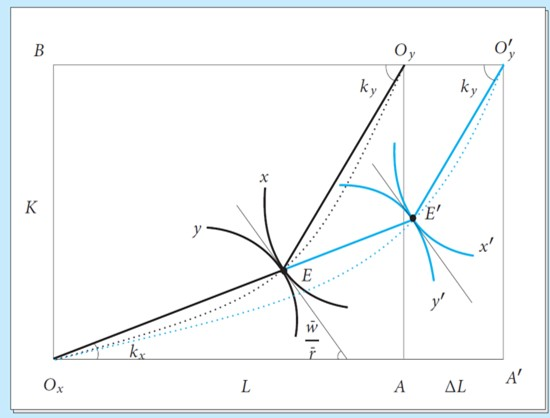

<!-- _class: lead -->

## Heckscher-Ohlin Model II

**Wen-Bin Chuang**
**2026-09-14**

-----

## Stolper-Samuelson Theorem

The `Stolper-Samuelson Theorem` (1941) is one of the most important results in the Heckscher-Ohlin model. It describes how `changes in goods prices` affect `real factor incomes`. 

**Core Idea**: An increase in the `relative price` of a good will raise the `real return` to the factor used intensively in that good and lower the real return to the other factor. In simpler terms:

- If the price of the **labor-intensive** good rises → **Real wages rise**, real return to capital falls.
- If the price of the **capital-intensive** good rises → **Real return to capital rises**, real wages fall.

“In the Heckscher-Ohlin world, trade `benefits the abundant factor` and hurts the scarce factor. This is the Stolper-Samuelson Theorem — one of the strongest and most politically relevant results in international trade theory.” In autarky, there is a `lower` relative price of the abundant factor; while the trade can raise the relative price. + S-S theorem, their real wages rise.

----

#### Core Assumptions (Same as H-O Model)

| Assumption                            | Description                                      |
| ------------------------------------- | ------------------------------------------------ |
| Two countries, Two goods, Two factors | Standard 2×2×2 model                             |
| `Perfect Competition`                 | In both goods and factor markets                 |
| Constant Returns to Scale (CRS)       | Production functions are homogeneous of degree 1 |
| Identical Homothetic Preferences      | Same tastes across countries                     |
| Technology                            | Same technology in both countries                |
| Factors mobile within country         | Labor and Capital mobile between sectors         |
| Factors immobile between countries    | No international factor mobility                 |
| No transport costs / trade barriers   | Free trade                                       |
| Full employment                       | All factors are fully utilized                   |

----

#### Main Mechanism 

When a country **opens to trade**:

- **Labor-abundant country** exports the **labor-intensive** good → price of labor-intensive good **increases** (relative to autarky).
- According to Stolper-Samuelson:
  - Real wage of labor (**abundant factor**) **rises**
  - Real return to capital (**scarce factor**) **falls**

This happens because:

- Increased `demand` for the labor-intensive good → increased `demand` for labor → wages rise.
- As resources move into the labor-intensive sector, capital becomes relatively `less demanded` → return to capital falls.

----

1. **Trade opens** → World prices differ from autarky prices → Domestic relative goods price changes.
2. Firms in the sector with the rising price `expand production`; firms in the other sector `contract`.
3. Expanding sector demands more of its intensive factor; contracting sector releases factors.
4. **Factor markets clear**: Total endowments are fixed, so factor prices must adjust to reallocate factors across sectors.
5. The factor used intensively in the expanding sector faces excess demand → its price rises.
6. The other factor faces excess supply → its price falls.
7. **Magnification**: Factor price changes exceed output price changes, ensuring real returns move unambiguously.

---

#### Important Implications

| Situation                               | Effect on Real Wage (w) | Effect on Real Return to Capital (r) |
| --------------------------------------- | ----------------------- | ------------------------------------ |
| Price of labor-intensive good ↑         | **Increases**           | Decreases                            |
| Price of capital-intensive good ↑       | Decreases               | **Increases**                        |
| Labor-abundant country opens to trade   | **Winners**: Workers    | **Losers**: Capital owners           |
| Capital-abundant country opens to trade | **Losers**: Workers     | **Winners**: Capital owners          |

----

####  Political Economy Implications

| Dimension                | Prediction                                                   |
| ------------------------ | ------------------------------------------------------------ |
| **Income Distribution**  | Trade `widens` the gap between abundant and scarce factors   |
| **Political Coalitions** | Abundant-factor owners support free trade; scarce-factor owners demand protection |
| **Historical Evidence**  | 19th-century US: Capital-abundant → manufacturers favored tariffs; Land-abundant South favored free trade. Post-WWII Europe: Labor-abundant → unions supported trade liberalization. |
| **Policy Design**        | Justifies trade adjustment assistance, compensation schemes, progressive taxation |

-----

#### Empirical Evidence & Testing Challenges

- **Developing countries**: `Trade liberalization` often raises demand for `unskilled labor (abundant factor)` → reduces wage inequality in some cases (e.g., Mexico post-NAFTA, though results are mixed).
- **Advanced economies**: Opening to low-wage country imports correlates with relative wage declines for low-skilled workers in manufacturing (consistent with SS if low-skilled labor is scarce relative to developing nations).

---

####  Testing Difficulties:

1. **Simultaneity**: Goods prices, technology, and endowments change simultaneously.
2. **Factor heterogeneity**: "Labor" `isn't homogeneous`; skill, education, and region matter.
3. **Incomplete specialization**: Many countries don't fully specialize, blurring price transmission.
4. **Trade vs. Technology**: Skill-biased technological change often confounds SS predictions in advanced economies.

---

####  Modern Approaches:

- Industry-level wage regressions controlling for technology and capital accumulation.
- Natural experiments (e.g., tariff reductions, trade agreement implementations).
- Structural estimation of H-O-SS systems (e.g., Hakura & Rodrik, 1999; Goldberg & Pavcnik, 2007). 

---

#### Key Takeaways

1. **Trade affects factor incomes, not just national income**.
2. **Magnification effect** ensures real returns move unambiguously for abundant/scarcity factors.
3. **Distributional consequences** are central to trade policy design and political feasibility.
4. The theorem is a **comparative static result** about goods price → factor price transmission, applicable beyond trade (e.g., tariffs, subsidies, technological shocks).
5. While empirically nuanced, SS remains the foundational framework for understanding **who wins and who loses from globalization**.

----

#### Mathematical Derivation

###### 1. Starting Point: Zero-Profit Conditions (Competitive Markets)

In the `2×2 Heckscher-Ohlin model`:
$$
\begin{aligned} w \cdot a_{LX} + r \cdot a_{KX} &= P_X \quad \text{(Good X — labor-intensive)} \\ w \cdot a_{LY} + r \cdot a_{KY} &= P_Y \quad \text{(Good Y — capital-intensive)} \end{aligned}
$$
Where:

- $w$ = wage (return to labor), $r$ = rental rate (return to capital)
- $a_{ij}$ = unit input requirements (assumed fixed in the short run for differentiation, or cost-minimizing)

---

##### 2. Differentiate with Respect to Prices (Percentage Change Form)

Take `total differentials` and divide by the original equations to get **percentage changes** (denoted by hats: $\hat{x} = dx/x$):
$$
\begin{aligned} \theta_{LX} \hat{w} + \theta_{KX} \hat{r} &= \hat{P}_X \\ \theta_{LY} \hat{w} + \theta_{KY} \hat{r} &= \hat{P}_Y \end{aligned}
$$

Where **cost shares** ($\theta_{ij}$) are defined as:
$$
\theta_{LX} = \frac{w a_{LX}}{P_X}, \quad \theta_{KX} = \frac{r a_{KX}}{P_X}, \quad \theta_{LX} + \theta_{KX} = 1
$$
(and similarly for good Y). Note that because `X is labor-intensive`: $\theta_{KX} < \theta_{KY}$  and  $\theta_{LX} > \theta_{LY}$

---

###### 3. Matrix Form

$$
\begin{bmatrix} \theta_{LX} & \theta_{KX} \\ \theta_{LY} & \theta_{KY} \end{bmatrix} \begin{bmatrix} \hat{w} \\ \hat{r} \end{bmatrix} = \begin{bmatrix} \hat{P}_X \\ \hat{P}_Y \end{bmatrix}
$$

Let $\boldsymbol{\Theta}$ be the cost-share matrix. Then:
$$
\begin{bmatrix} \hat{w} \\ \hat{r} \end{bmatrix} = \boldsymbol{\Theta}^{-1} \begin{bmatrix} \hat{P}_X \\ \hat{P}_Y \end{bmatrix}
$$

---

###### 4. Solve Using Cramer’s Rule (Key Result)

The determinant of $\boldsymbol{\Theta}$ is:
$$
|\boldsymbol{\Theta}| = \theta_{LX}\theta_{KY} - \theta_{LY}\theta_{KX} = \theta_{LX}(1-\theta_{KY}) - (1-\theta_{LX})\theta_{KX}
$$
Because $X$ is labor-intensive ($\theta_{KX} < \theta_{KY}$), we have $|\boldsymbol{\Theta}| > 0$. Solving for changes:

$$
\hat{w} = \frac{\theta_{KY} \hat{P}_X - \theta_{KX} \hat{P}_Y}{|\boldsymbol{\Theta}|}\quad
\hat{r} = \frac{\theta_{LX} \hat{P}_Y - \theta_{LY} \hat{P}_X}{|\boldsymbol{\Theta}|} \quad \text{(signs flip due to positive determinant)}
$$

---

###### 5. Main Stolper-Samuelson Results (Percentage Changes)

`Assume that` the relative price of the labor-intensive good rises:$\hat{P}_X > \hat{P}_Y$ (i.e., $\hat{P}_X - \hat{P}_Y > 0$). Then:

- **Real return to labor rises more than proportionally**: $\hat{w} > \hat{P}_X > \hat{P}_Y > \hat{r}$
- **Real return to capital falls**: $\hat{r} < 0$ in real terms (relative to both goods)

**Magnification Effect**: The change in factor prices is *magnified* relative to goods price changes:
$$
|\hat{w}| > |\hat{P}_X| > |\hat{P}_Y| > |\hat{r}|
$$

(with opposite directions for the two factors).

---

#### 6. Intuitive Summary

- An increase in $P_X$ (labor-intensive good) increases `demand for labor more` than for capital → $w$ rises strongly. 
- Capital demand relatively falls → $r$ falls (or rises less).
- Because of the magnification effect, real returns to capital fall in terms of *both* goods, and real wages rise in terms of both goods.

----

## Rybczynski Theorem (1955)

The `Rybczynski Theorem` (1955) examines the effect of an increase in `factor endowment` on `output levels` at constant goods prices.  It explains how `economic growth` through factor accumulation leads to changes in the production structure — favoring the sector that uses the growing factor intensively. At **constant relative goods prices**, an increase in the endowment of one factor will:

- Increase the output of the good that **intensively uses** that factor (**more than proportionally**),
- Decrease the output of the other good (**absolute decline** possible).

**Core Idea**: In simple terms: “If a country gets more of one factor (e.g., more labor), it will produce much more of the labor-intensive good and less of the capital-intensive good.” This is the **supply-side dual** of the Stolper-Samuelson theorem.

---

###### Important Implications

| Factor Increase     | Effect on Labor-Intensive Good | Effect on Capital-Intensive Good |
| ------------------- | ------------------------------ | -------------------------------- |
| Labor Endowment ↑   | **Strong Increase**            | Decrease                         |
| Capital Endowment ↑ | Decrease                       | **Strong Increase**              |

------

#### Core Assumptions (2×2×2 Model) (Same as H-O Model)

| Assumption                            | Description                                      |
| ------------------------------------- | ------------------------------------------------ |
| Two countries, Two goods, Two factors | Standard 2×2×2 model                             |
| `Perfect Competition`                 | In both goods and factor markets                 |
| Constant Returns to Scale (CRS)       | Production functions are homogeneous of degree 1 |
| Identical Homothetic Preferences      | Same tastes across countries                     |
| Technology                            | Same technology in both countries                |
| Factors mobile within country         | Labor and Capital mobile between sectors         |
| Factors immobile between countries    | No international factor mobility                 |
| No transport costs / trade barriers   | Free trade                                       |
| Full employment                       | All factors are fully utilized                   |

---

#### Main Mechanism 

Suppose **Labor endowment increases** while `goods prices remain constant`:

1. At the initial wage-rental ratio ($w/r$), firms want to use `more labor`.
2. The `labor-intensive` sector (say Good $X$) can absorb more labor profitably.
3. Resources (especially capital) are pulled away from the capital-intensive sector (Good $Y$).
4. Result:
   - Output of **labor-intensive good (X)** ↑ significantly
   - Output of **capital-intensive good (Y)** ↓

This is called the **Rybczynski Effect**.

---

#### Graphical Explanation

**Using the Edgeworth-Bowley Box**:

- Increase in labor shifts the box outward horizontally (more labor).
- The efficiency locus (contract curve) shifts.
- At constant factor prices (constant $w/r$), the new equilibrium point moves such that:
  - Labor-intensive industry expands a lot.
  - Capital-intensive industry contracts.

----

----

#### **Using Production Possibility Frontier (PPF)**:

- Increase in labor endowment **shifts the PPF outward**, but **biased** toward the labor-intensive good.
- **At constant relative prices**, production moves **along the new PPF** in a way that increases $X$ a lot and decreases $Y$.

---

----

#### Political Economy Implications

| Context                             | Rybczynski Prediction                                        |
| ----------------------------------- | ------------------------------------------------------------ |
| **Immigration/Refugee inflows**     | Labor-intensive sectors (construction, agriculture, services) expand; capital-intensive sectors contract |
| **Foreign Direct Investment (FDI)** | Capital inflow expands manufacturing/infrastructure; labor-intensive traditional sectors shrink |
| **Natural resource discovery**      | Resource-intensive sector booms; other sectors contract (pre-price feedback; distinct from Dutch Disease) |
| **Demographic transition**          | Aging population (↓L) contracts labor-intensive sectors, relatively expands capital-intensive ones |
| **Industrial policy**               | Subsidized capital accumulation shifts output toward capital-intensive industries, potentially crowding out others |

---

#### Empirical Evidence & Limitations

###### Supportive Evidence:

- **Mariel Boatlift (1980)**: Miami's labor supply shock expanded construction and low-skilled services, consistent with Rybczynski.
- **EU Eastern Enlargement**: Capital flows from West to East expanded capital-intensive manufacturing in accession countries.
- **Chinese regional studies**: Provinces with higher capital accumulation saw disproportionate growth in machinery/electronics output.

---

##### Intuitive Explanation

When labor increases **at fixed prices**:

- The economy wants to use the extra labor.
- Since good X uses labor more intensively, expanding X absorbs the new labor efficiently.
- To release more capital (which is needed along with the extra capital in X), the economy must contract industry Y (capital-intensive), freeing up capital.

---

##### Link to Trade Patterns (H-O Model)

- A capital-abundant country (higher $K/L$) will produce relatively more of the capital-intensive good — this is the Rybczynski effect working across countries.
- Explains why endowment differences lead to different production patterns and thus trade patterns (H-O theorem).

---

##### Key Takeaways

1. **Endowment changes reshape production structure** even without price changes.
2. **Magnification effect**: Output of the intensive sector grows faster than the factor itself.
3. **Contraction of the non-intensive sector** is a necessary condition for factor price stability.
4. The theorem is a **partial equilibrium/ceteris paribus result** within a general equilibrium framework; in reality, price feedback (via Stolper-Samuelson) and demand adjustments modify outcomes.
5. Highly relevant for immigration policy, FDI strategy, demographic planning, and industrial development.

----

#### Mathematical Derivation

###### 1. Full Employment Conditions (Endowment Constraints)

$$
\begin{aligned} a_{LX} Q_X + a_{LY} Q_Y &= L \\ a_{KX} Q_X + a_{KY} Q_Y &= K \end{aligned}
$$

In matrix form:
$$
\mathbf{A} \mathbf{Q} = \mathbf{V}
$$

where $\mathbf{A}$ is the input coefficient matrix, $\mathbf{Q} = \left[ \begin{matrix} Q_X \\ Q_Y \end{matrix} \right], \quad 
\mathbf{V} = \left[ \begin{matrix} L \\ K \end{matrix} \right]$.

---

###### 2. Differentiated Form (Percentage Changes)

Differentiate the full employment conditions while holding **goods prices constant** (which implies input coefficients $a_{ij}$ are `fixed` because factor prices are fixed by goods prices via zero-profit conditions):
$$
\begin{aligned} \lambda_{LX} \hat{Q}_X + \lambda_{LY} \hat{Q}_Y &= \hat{L} \\ \lambda_{KX} \hat{Q}_X + \lambda_{KY} \hat{Q}_Y &= \hat{K} \end{aligned}
$$
Where **allocation shares** ($\lambda_{ij}$) are:

- $\lambda_{LX} = \frac{a_{LX}\cdot Q_X}{L}$ = share of labor used in industry X
- $\lambda_{KX} = \frac{a_{KX}\cdot Q_X}{K}$ = share of capital used in industry X (and $\lambda_{LX} + \lambda_{LY} = 1$, etc.)

Because X is capital-intensive, we have $\lambda_{KX} > \lambda_{LX}$ and $\lambda_{KY} < \lambda_{LY}$.

---

###### 3. Matrix Form and Solution

$$
\begin{bmatrix} \lambda_{LX} & \lambda_{LY} \\ \lambda_{KX} & \lambda_{KY} \end{bmatrix} \begin{bmatrix} \hat{Q}_X \\ \hat{Q}_Y \end{bmatrix} = \begin{bmatrix} \hat{L} \\ \hat{K} \end{bmatrix}
$$

Let $\boldsymbol{\Lambda}$ be the matrix above. Its determinant $|\boldsymbol{\Lambda}| > 0$ because of the intensity ranking.

Solving using Cramer’s rule:
$$
\hat{Q}_X = \frac{\lambda_{KY} \hat{K} - \lambda_{LY} \hat{L}}{|\boldsymbol{\Lambda}|}\\
\hat{Q}_Y = \frac{\lambda_{LX} \hat{L} - \lambda_{KX} \hat{K}}{|\boldsymbol{\Lambda}|}
$$

---

#### Main Results (Rybczynski Effects)

**Case 1: Increase in Capital Endowment** ($\hat{K} > 0,  \hat{L} = 0$)

- $\hat{Q}_X > \hat{K} > 0$  (output of capital-intensive good rises **more than proportionally**)
- $\hat{Q}_Y < 0$          (output of labor-intensive good **falls**)

**Case 2: Increase in Labor Endowment** ($\hat{L} > 0 , \hat{K} = 0$)

- $\hat{Q}_Y > \hat{L} > 0$ and $\hat{Q}_X < 0$

This is called the **magnification effect** on the quantity side.

