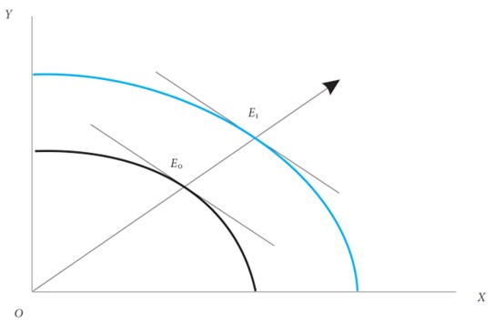
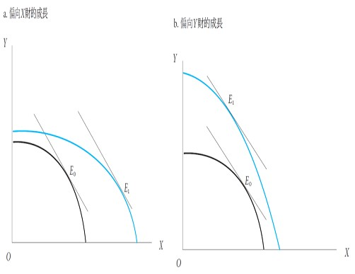
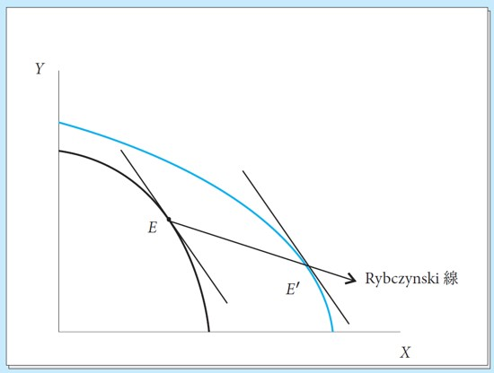
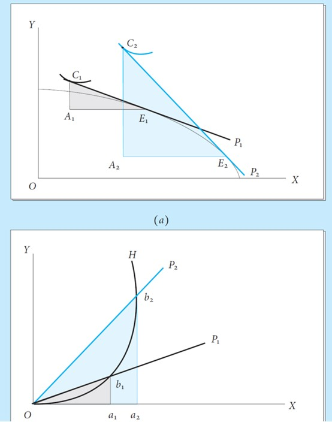
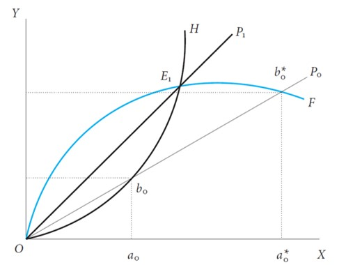
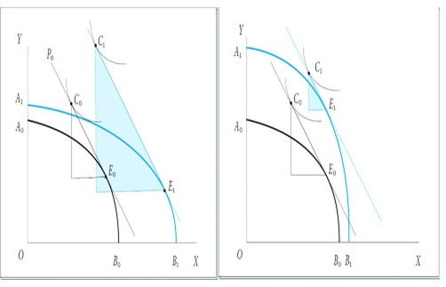
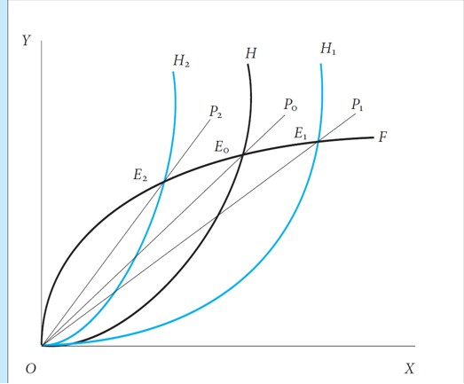
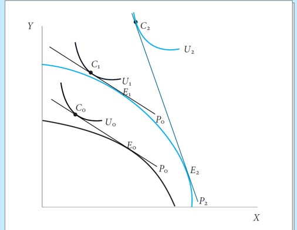
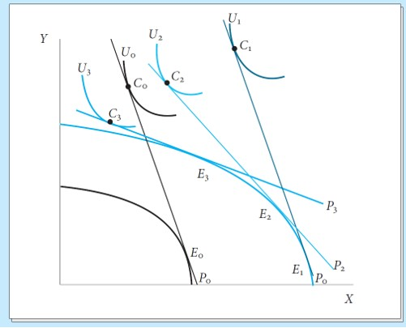

<!-- _class: lead -->

## Trade and Growth

**Wen-Bin Chuang**
**2026-09-14**

----

**Economic growth** refers to an increase in a country's `productive capacity` and real output `over time`, typically measured by the growth rate of Gross Domestic Product (GDP).

###### Sources of Economic Growth:

- **Factor accumulation**: Increases in labor force, physical capital, human capital, or natural resources
- **Technological progress**: Improvements in productivity and efficiency
- **Institutional improvements**: Better governance, property rights, and market efficiency

###### Types of Growth:

- **Balanced growth**: All sectors expand `proportionally`.
- **Biased (unbalanced) growth**: Some sectors grow faster than others due to factor-specific increases or sector-biased technological change

---

---

------

#### Effect of Economic Growth on Trade

Economic growth affects international trade through `two` main channels:

###### A. Production Effect

Growth changes a country's `production possibilities`:

- Expands the Production Possibility Frontier (PPF), alters the composition of output depending on which sector receives the `growth impulse`. Changes export supply and import-competing production.

###### B. Consumption Effect

Growth increases `national income`, which affects:

- Overall consumption levels, Demand for imports (typically rises with income). Consumption patterns (depending on income elasticity of demand)

----

###### Net Effect on Trade Volume:

- **Trade expands** when production and consumption effects `reinforce` each other
- **Trade may contract** if growth is strongly biased toward `import substitution`

###### Effect on Terms of Trade:

For a **large country** (one that can influence world prices):

- **Export-biased growth** → Increased export supply → May **worsen** terms of trade
- **Import-biased growth** → Reduced import demand → May **improve** terms of trade

-----

#### Main Mechanism

The Rybczynski Theorem assumes the country is a **"small country"**—meaning its production changes are too small to affect world market prices. Therefore, the **relative price of goods remains constant**.

###### Economic Growth (if Factor Accumulation)

Suppose the country experiences economic growth specifically through an **increase in its Labor force (L)**, while Capital (K) remains constant.

###### The Biased Shift of the PPF

Because Labor is used in both industries, the maximum possible output of *both* goods increases slightly. However, because `Cloth` is **labor-intensive**, the PPF shifts outward **asymmetrically (biasedly)**:

- The intercept on the `Cloth` ($X$) axis shifts out significantly and The intercept on the `Food` ($Y$) axis shifts out only a tiny bit. This creates a new, larger frontier: $PPF_2$ .

----

-----

###### The Rybczynski Result (**At Constant Prices**)

Because we assume `constant world prices`, the new equilibrium must be tangent to a price line with the **exact same slope** as $P_1$ .

- When we draw a line parallel to $P_1$  tangent to the new $PPF_2$ , the new tangency point reveals the Rybczynski effect:
- `Cloth` production ($C_2$) increases massively (more than proportionally to the labor increase). `Food` production ($F_2$) actually decreases ($F_2<F_1$). 
  - Resources (both Labor and Capital) are pulled out of the Food sector to support the massive expansion of the Cloth sector.

----

###### Constant- Price Assumption?

The `constant-price assumption` is useful for **isolating** the production effect, but `in reality`, if a country is large enough, a massive increase in its exports will flood the world market and **change the relative price (Terms of Trade)**. Following the Rybczynski shift, the country is now producing a massive surplus of `Cloth` (its `export good`) and `less Food` (its `import good`).

- The increased global supply of Cloth drives `down` its price.
- The decreased domestic supply of Food increases the demand for imported Food, `driving up` its price.
- **Result:** The relative price of Cloth falls. The Terms of Trade (TOT) deteriorate. The new price line ($P_2$) is **flatter** than $P_1$.

-----

###### Moving Along the New PPF

The economy is no longer at the `pure Rybczynski tangency point`. Because the relative price of Cloth has fallen, Cloth becomes relatively less profitable to produce.

- Producers react to the new price ratio ($P_2$) by moving down along the new $PPF_2$  to a new tangency point.
- **Production Adjustment:** The production of Cloth `decreases slightly` from its pure Rybczynski peak, and the production of Food `increases` from its Rybczynski trough.
- **Key Takeaway:** The change in relative prices **dampens (mitigates) the pure Rybczynski effect**. The output of the expanding good doesn't grow quite as much, and the output of the contracting good doesn't fall quite as much.

-----

#### Offer Curves in General Equilibrium

**Key Concepts:**

1. **Offer Curve**: Shows a country's `desired trade (exports and imports)` at different relative prices
2. **Exports** = `Excess supply` of the export good and **Imports** = `Excess demand` for the import good

----
###### Graphical Representation of the Offer Curve

Consider a country producing and consuming two goods:

- **Cloth (C)**: The `export good`, **Food (F)**: The `import good`

**Axes:**

- X-axis: `Exports of Cloth` (or Excess Supply of Cloth, Production of Cloth − Consumption of Cloth) 
- Y-axis: `Imports of Food` (or Excess Demand for Food, Consumption of Food − Production of Food)

----

**Shape:**

- The `offer curve` typically starts from the origin and bends backward at high relative prices
- Initially upward sloping $P_C/P_F$ 
  - As $\frac{P_C}{P_F}$ rises  (cloth becomes more expensive):
    - Production of cloth increases (move along PPF), Consumption of cloth `decreases` (substitution effect) --> **Cloth exports increase** and Food imports increase to pay for the larger exports
- Higher $\frac{P_C}{P_F}$ → More cloth exports supplied
- May bend backward: `At very high prices`, the `income effect` may dominate, reducing export supply

---
###### Key Insight:

The offer curve captures **both production and consumption decisions** in a single relationship, showing a country's `willingness to trade` at various price ratios.

----

-----

#### Two-Country Trade Equilibrium

###### Setting Up the Two-Country Model

- Consider two countries: **Home Country (H)**: Exports Cloth, Imports Food and **Foreign Country (F)**: Exports Food, Imports Cloth

###### Offer Curves for Both Countries

- Home's Offer Curve ($OC_H$): Shows Home's `willingness to export` Cloth in exchange for Food. Plotted in (Cloth Exports, Food Imports) space
- Foreign's Offer Curve ($OC_F$): Shows Foreign's `willingness to export` Food in exchange for Cloth. 

---

###### Equilibrium Determination

**World Market Clearing Conditions:** Determined by the `intersection` of two countries' offer curves and **Must satisfy** trade balance: `Value of exports = Value of imports`

1. **Cloth Market:** $\text{Home’s Cloth Exports}=\text{Foreign’s Cloth Imports}$

2. **Food Market:** $\text{Foreign’s Food Exports}=\text{Home’s Food Imports}$

3. **Trade Balance (automatically satisfied by Walras' Law):** 

   $P_C×(\text{Home’s Cloth Exports})=P_F×(\text{Home’s Food Imports})$

---

##### Graphical Equilibrium: **Finding the Equilibrium Terms of Trade:**

1. Plot both offer curves on the same diagram:
   - X-axis: Cloth (Home's exports / Foreign's imports)
   - Y-axis: Food (Home's imports / Foreign's exports)
2. Equilibrium Point ($E_1$):
   - The intersection of $OH$  and $OF$ 
   - At this point, both countries' desired trades are mutually consistent
3. Equilibrium Terms of Trade:
   - The slope of the ray from origin to point $E_1$
   - $P_1=(P_C/P_F)^∗=\frac{\text{Food Imports}}{\text{Cloth Exports}}$  at equilibrium

---

----

#### Economic Growth Benefit the Country?

**In a Closed Economy (Autarky):** Economic growth is **always** beneficial. Because the country cannot trade, its consumption possibilities are strictly limited by its production possibilities. 

- When the Production Possibility Frontier (PPF) shifts outward due to growth, the country simply moves to a **higher Community Indifference Curve**. There are no external markets to distort the outcome; more physical goods always mean **higher welfare**.

**In an Open Economy:** The introduction of international trade adds a crucial new variable: 

- **The Terms of Trade (Relative Prices)**. If a country is **large** (meaning its production volume is big enough to influence world prices), its **growth affects the global market**. If the growth is `heavily` biased toward the `country's export sector`, the massive increase in export supply `crashes` the global price of those exports.

----

----

- When a country experiences `economic growth`, its Production Possibility Frontier `(PPF) shifts` outward. How this growth affects international trade depends entirely on the **bias of the growth** (driven by the Rybczynski Theorem). This bias determines how the country's **Offer Curve (OC)** shifts, which in turn determines the new equilibrium **Terms of Trade (TOT)** and the ultimate impact on national welfare (consumption). 
- Here are the **three distinct cases** of economic growth and their effects on production, terms of trade, and consumption.

---

#### The Mechanism: 

Before diving into the cases, we must understand how the Offer Curve shifts:

- **Export-Biased Growth:** Growth favors the `export sector` (e.g., a massive increase in the labor force in a labor-abundant country exporting textiles). The country wants to `export more` at any given price. **The OC shifts outward ( OH --> OH1 to the right).** ($P_1$ `flatter`)
- **Import-Biased Growth:** Growth favors the import-competing sector (e.g., a massive increase in capital in a labor-abundant country, boosting machinery production). The country needs `fewer imports`. **The OC shifts inward (OH-->OH2 to the left).** ($P_2$ `steeper`)

---

----

#### Case 1: The "All Good" Scenario (Import-Biased Growth)

*Production increases, Terms of Trade improve, and Consumption (Welfare) increases.*

###### The Setup

The `Home country` experiences economic growth that is biased toward its **import-competing sector** (e.g., `Food`). According to the Rybczynski theorem, the production of **Food** `expands significantly`, while the production of **Cloth** (exports) may even `contract`.

###### The Offer Curve Shift

Because the Home country is now producing more of the good it used to import, its demand for imports `falls` at every relative price.

- **Result:** Home’s Offer Curve shifts **inward (to the left)**.

---

#### The Economic Outcome

1. **Production:** The physical capacity of the economy has grown (**PPF shifted out**).
2. **Terms of Trade (TOT):** The inward shift of Home's OC intersects Foreign's OC at a new equilibrium where the `relative price` of Home's exports has risen. **Home's TOT improves.** (Home gets `more imports` for every unit of exports).
3. **Consumption/Welfare:** The country benefits from a **double dividend**. It has more physical goods to consume, *and* its purchasing power in the global market has increased. The country reaches a `higher` community indifference curve. **Welfare unambiguously increases.**

---

---

#### Case 2: The "Mixed" Scenario (Moderate Export-Biased Growth)

*Production increases, Terms of Trade deteriorate, but Consumption (Welfare) still increases.*

###### The Setup

The Home country experiences economic growth that is **biased toward its export sector** (e.g., `Cloth`). This is the **most common** real-world scenario for **developing economies**. The Rybczynski effect causes a massive `expansion` in `Cloth production`.

###### The Offer Curve Shift

The Home country now has a much larger surplus of Cloth to sell to the world. At any given price, it is willing to **export more Cloth** in exchange for Food.

- **Result:** Home’s Offer Curve shifts **outward (to the right)**.

---

#### The Economic Outcome

1. **Production:** The physical output of the economy has grown.
2. **Terms of Trade (TOT):** Because Home is a `large country`, flooding the world market with extra Cloth drives down the global price of Cloth. The new intersection of the OCs occurs at a `flatter price` line. **Home's TOT deteriorates.** (Home must export more Cloth to get the same amount of Food).
3. **Consumption/Welfare:** This is the crucial `trade-off`. The deterioration in TOT acts as a "tax" on the country's growth. However, in this moderate case, the physical gain in production is larger than the loss in purchasing power. The outward shift of the consumption possibilities frontier outweighs the flatter price line. The country reaches a higher indifference curve. Welfare increases, but by less than it would have if the TOT had remained constant.

---

#### Case 3: Immiserizing Growth (Extreme Export-Biased Growth)

First discovered by **F.Y. Edgeworth** (1894), rediscovered, named, and formalized by **Jagdish N. Bhagwati** (1958), with algebraic generalizations by **Harry G. Johnson** (1958).

###### The Setup

This is the `paradoxical worst-case scenario`, first formalized by Jagdish Bhagwati (1958). The Home country experiences **extreme, highly biased growth in its export sector**, and the country is `large enough` to influence world prices. Furthermore, the Foreign country's demand for these exports is highly **inelastic** (Foreign's Offer Curve is very steep/bent backward).

###### The Offer Curve Shift

Home’s massive export boom causes its Offer Curve to shift **drastically outward**.

---

#### The Economic Outcome

1. **Production:** The physical output of the export sector has surged.
2. **Terms of Trade (TOT):** The massive increase in export supply crashes the global price of the export good. Because Foreign demand is inelastic, Foreign is only willing to buy this massive extra quantity if the price drops precipitously. **Home's TOT deteriorates severely.**
3. **Consumption/Welfare:** The loss in purchasing power is so **catastrophic** that it completely swamps the physical gains in production. The new, **drastically flatter** price line means the country's consumption possibilities have actually shrunk. The country is forced to trade a massive amount of exports for very few imports. The country ends up on a **lower community indifference curve**. **Welfare decreases.** The country is literally `immiserized` (made poorer) by its own economic growth.

---

---

#### Conditions Required for Immiserizing Growth:

For this paradox to occur, three strict conditions must be met simultaneously:

1. **Large Country:** The country must be `large enough` to affect world prices.
2. **Export-Biased Growth:** The growth must heavily favor the export sector (strong Rybczynski effect).
3. **Inelastic Foreign Demand:** The rest of the world must have a very low income elasticity of demand for the country's exports (Foreign's Offer Curve must be inelastic).

---

- **The Positive Effect:** The country produces more **physical goods (Quantity effect)**.
- **The Negative Effect:** The country's exports are now **worth less** on the global market, meaning it can buy fewer imports **(Price/Terms of Trade effect)**.

`Core Idea:` 

- **Closed Economy:** Growth = Unambiguous Welfare Gain.
- **Open Economy:** Growth = Welfare Gain *minus* the Terms of Trade effect.

If the negative price effect is `severe enough`, it completely wipes out the positive quantity effect, leaving the country poorer than before it grew.

----

#### Summary of the Three Cases

| Case                | Type of Growth         | Offer Curve Shift   | Terms of Trade (TOT)      | Trade Volume | National Welfare (Consumption)    |
| :------------------ | :--------------------- | :------------------ | :------------------------ | :----------- | :-------------------------------- |
| **1. All Good**     | Import-Biased          | Inward (Left)       | **Improves**              | Decreases    | **Increases** (Double dividend)   |
| **2. Mixed**        | Moderate Export-Biased | Outward (Right)     | **Deteriorates**          | Increases    | **Increases** (Growth > TOT loss) |
| **3. Immiserizing** | Extreme Export-Biased  | Drastically Outward | **Deteriorates Severely** | Increases    | **Decreases** (TOT loss > Growth) |

---

#### The Takeaway

Economic growth is not an automatic guarantee of higher living standards in an open economy. While the **Rybczynski Theorem** dictates how physical production changes, the **Offer Curve** framework reveals that a country's ultimate welfare depends on the **Terms of Trade**. If a country grows by producing exactly what the rest of the world already has in abundance, it can inadvertently destroy its own purchasing power.

----

#### Mathematical Derivation

A country's welfare depends on its **Real Income** (its purchasing power in the global market). Real Income is simply the value of what it produces and exports.

Let’s define our variables:

- $X$  = Quantity of Exports produced.
- $P$  = Price of Exports (in terms of Imports). *This is the Terms of Trade.*
- $I$  = Real Income (Purchasing Power).

Therefore, the basic equation for a country's purchasing power is: $I=P×X$ 

----

###### Step 1: The Effect of Economic Growth

When the country experiences economic growth, `two things` happen simultaneously:

1. Quantity changes ($ΔX$): The country produces more exports. (This is the **Rybczynski effect**).
2. Price changes ($ΔP$): Because the country is flooding the market with exports, the global price of those exports drops.

We want to find the change in Real Income ($ΔI$). Using basic algebra, the change in income is: $ΔI=(P×ΔX)+(X×ΔP)$

----

###### Step 2: Breaking Down the Two Effects

Let's look at the two parts of this equation:

1. The Production Effect: $(P×ΔX)$ 

   - $ΔX$  is positive (the country is making more stuff), Therefore, this term is **positive (+)**.

   - *Plain English:* Making more goods increases your income.

2. The Terms of Trade Effect: $(X×ΔP)$ 

   - $ΔP$  is negative (the price of exports crashes because of oversupply), this term is **negative (-)**.

   - *Plain English:* The price crash decreases your income.

So, the total change in welfare is: $ΔI=[\text{Gain from making more}]−[\text{Loss from price crash}]$ 

----

###### Step 3: The Condition for Immiserizing Growth

For the country to be **immiserized** (made worse off), its total Real Income must go down. That means $ΔI$  must be less than zero:

- Substitute our equation into this inequality: $(P×ΔX)+(X×ΔP)<0$
- Now, move the negative price term to the other side of the inequality: $(P×ΔX)<−(X×ΔP)$

(Note: We add a negative sign to $ΔP$ on the right side just to make it a positive number representing the "magnitude of the price drop".)

----

###### Step 4: The Final Simplified Rule

Divide both sides by $P$  to make it even cleaner:
$$
ΔX<−X(\frac{ΔP}{P})
$$
**Immiserizing Growth happens when:** The `percentage drop` in export prices ($\frac{ΔP}{P}$) is so massive that it outweighs the **percentage increase in export production** ($\frac{ΔX}{X}$).

---

#### Summary

1. **Growth makes you produce more** ($ΔX$ is positive). This is good.
2. **Producing more crashes the price** ($ΔP$ is negative). This is bad.
3. If the price crashes **proportionally more** than the production increases, your total purchasing power shrinks.
4. You are physically producing more, but you are globally poorer. **That is Immiserizing Growth.**
