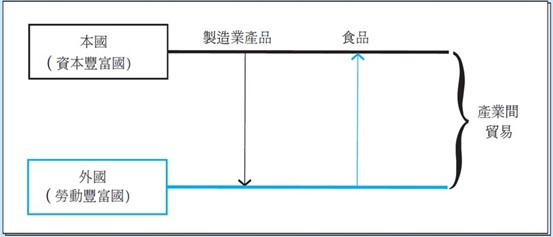
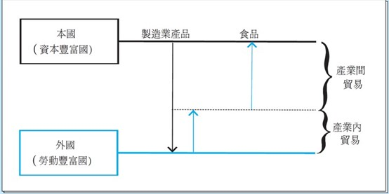

<!-- _class: lead -->

## New Trade Theory

**國企 Wen-Bin Chuang**
**2026-09-14**

----

**New Trade Theory** (primarily developed by Paul Krugman in 1979–1980) explains why countries trade even when they have similar factor endowments and technologies. It shifts focus from **comparative advantage** to **economies of scale** (increasing returns to scale) and **imperfect competition**. 

This theory successfully explains **intra-industry trade** — countries both exporting and importing similar products (e.g., cars, smartphones, wine).

----

#### Inter-Industry Trade

- Inter-industry trade is the exchange of **completely different types of goods** between countries. It involves trading products from one industry for products from a completely different industry.
  - **The Core Driver:** **Comparative Advantage**. Countries export goods that they can produce efficiently (or have an abundance of resources for) and import goods that are costly for them to produce.
  - Its impact on income distribution is dramatic, polarizing, and creates clear "winners" and "losers."

---

##### Intra-Industry Trade

`Intra-industry` trade is the exchange of **similar products within the same industry** between countries. Instead of trading different categories of goods, countries trade varieties of the same category.

- **The Core Driver:** **Economies of Scale** and **Product Differentiation**. Consumers love variety, and companies need massive markets to produce goods at a low cost. Instead of every country trying to build its own car industry from scratch, countries specialize in *specific types* of cars and trade them.

- Historically, economists thought intra-industry trade was mostly "win-win" with few distributional consequences. 

---

- Economists use the **Grubel-Lloyd (GL) Index** (1975) to measure the extent of intra-industry trade.

  The index ranges from **0 to 1**:

  - **GL = 0:** Pure inter-industry trade (a country only exports wheat and only imports cars).
  - **GL = 1:** Pure intra-industry trade (a country exports \$10 billion in cars and imports exactly \$10 billion in cars).

----

------

#### 1. Key Assumptions

- **Increasing Returns to Scale** (Economies of Scale): Average cost falls as output increases.
- **Monopolistic Competition**: Many firms, differentiated products, free entry/exit.
- **Love of Variety**: Consumers prefer variety (`Dixit-Stiglitz` preferences).
- Countries can have `identical technologies` and `factor endowments`.
- No trade costs initially (can be added later).

-----

#### 2. Core Mechanism

Firms face **fixed costs** + **variable costs**, leading to declining average costs:
$$
AC = \frac{F}{q}
$$
Where F = fixed cost; q = output per firm 

- Larger scale → lower average cost → firms want to produce more.

When `trade opens`:

- `Market size increase`s → firms can sell more → they can lower prices.
- `More varieties` become available to consumers.
- Some firms exit, survivors produce at larger scale (more efficient).

-----

#### 3. Key Equations in the Krugman Model

###### Consumer Preferences (Dixit-Stiglitz)

Utility function with `love of variety`:
$$
U = \left( \sum_{i=1}^{n} c_i^{\frac{\sigma-1}{\sigma}} \right)^{\frac{\sigma}{\sigma-1}}
$$
Where $\sigma > 1$ is the `elasticity of substitution` between varieties.

----

#### Firm Pricing (Monopolistic Competition)

Cost structure: Fixed cost =  F, Marginal cost = m  --> Total cost =$wF + w m q$, where w = wage

Each firm sets `price as a markup` over marginal cost:
$$
P = \left( \frac{\sigma}{\sigma-1} \right) \cdot m \cdot w
$$
-----

#### Zero-Profit Condition (Free Entry)

In equilibrium, `profits = 0` so:
$$
P \cdot q = w \cdot F + w \cdot m \cdot q
$$

Solving gives equilibrium `output` per firm:
$$
q = \frac{F(\sigma-1)}{m}
$$
→ Output per firm is `constant` (depends only on fixed cost and $\sigma$), independent of market size.

----

#### Equilibrium in Closed Economy

`Number of varieties (firms)`:
$$
n = \frac{L}{F \sigma}
$$
Larger countries have more varieties.

----

##### Opening to Trade – Main Results

When `two identical countries` open to trade. Total number of varieties (firms) in the world increases with trade because the integrated market supports more firms, each producing at larger scale.

1. **Market Size Effect**: Each firm now faces a larger market (`2L` instead of L).
2. **Selection & Scale**: Some firms exit, surviving firms produce the same q but sell to a bigger market.
3. **Variety Expansion**: Consumers in each country now access **twice** as many varieties ($2n$ instead of  n).

---

###### The Home Market Effect (Important Prediction)

When countries are **not the same size**:

- The **larger country** will export more than proportionate share of varieties.
- It becomes a net exporter of differentiated goods.

**Intuition**: `Larger` domestic market allows firms to `cover fixed costs more easily` → they become more competitive in exports. This explains why big economies (USA, China, Germany) tend to be major exporters in many manufacturing sectors.

------

##### 4. Main Predictions of New Trade Theory

| Prediction              | Explanation                                |
| ----------------------- | ------------------------------------------ |
| Intra-industry Trade    | Countries trade similar goods              |
| Home Market Effect      | Larger country exports more varieties      |
| Trade increases variety | Consumers gain from more product varieties |
| Gains from Trade        | Even `without comparative advantage`       |
| Possible agglomeration  | Firms cluster in larger markets            |

-----

###### 5. Types of Gains from Trade

1. **Variety Gains** — Consumers access more varieties.
2. **Efficiency Gains** — Surviving firms produce at larger scale (lower AC).
3. **Pro-competitive Effect** — Increased competition lowers markups.
4. **Selection Effect** (in heterogeneous firm models) — Only most productive firms survive.

These gains are in addition to traditional comparative advantage gains. Even without comparative advantage or differences in factor endowments, trade is mutually beneficial.

------

##### 6. Comparison with Previous Models

| Model                | Main Driver            | Type of Trade      | Explains Intra-industry Trade? |
| -------------------- | ---------------------- | ------------------ | ------------------------------ |
| Ricardian            | Technology             | Inter-industry     | No                             |
| Heckscher-Ohlin      | Factor Endowments      | Inter-industry     | No                             |
| Specific Factors     | Factor Specificity     | Inter-industry     | No                             |
| **New Trade Theory** | **Economies of Scale** | **Intra-industry** | **Yes**                        |

------

##### 7. Policy Implications

- Trade liberalization is generally welfare-enhancing even between similar countries.
- Large countries have an advantage (Home Market Effect).
- Protectionism can be strategically used in some cases (strategic trade policy), but risky.

-----

Krugman’s theory remains highly relevant because:

- Most trade between OECD countries is **intra-industry**.
- Global Value Chains combine New Trade Theory (scale + variety) with `traditional comparative advantage`.
- Explains success of export-oriented industrialization in East Asia.

----

#### Mathematical Derivation

###### Consumer Preferences (Dixit-Stiglitz Utility)

Consumers have CES (Constant Elasticity of Substitution) preferences over a continuum of differentiated varieties:
$$
U = \left( \int_{0}^{n} c(i)^{\frac{\sigma-1}{\sigma}} di \right)^{\frac{\sigma}{\sigma-1}}
$$

Where:

- n = number of available varieties (firms)
- $\sigma > 1$ = elasticity of substitution between varieties (higher $\sigma$ = less differentiated products)
- $c(i)$ = consumption of variety  i

----

**Budget Constraint**:

$$
\int_{0}^{n} p(i) c(i) \, di = I
$$

(I  = total income/expenditure)

-----

###### Consumer Demand for Each Variety

Maximizing utility subject to the budget constraint gives the demand function for each variety:
$$
c(i) = \frac{p(i)^{-\sigma}}{P^{1-\sigma}} \cdot I
$$

Where P is the **price index** (aggregate price level):
$$
P = \left( \int_{0}^{n} p(j)^{1-\sigma} dj \right)^{\frac{1}{1-\sigma}}
$$
This price index has a nice property: $I/P$ represents real income (indirect utility is proportional to  $I/P$).

----

##### Firm Behavior

Each firm produces a unique variety with the following cost structure:
$$
\text{Total Cost} = wF + w\cdot m \cdot q
$$

Where:

- F = fixed cost (e.g., R&D, headquarters); m = marginal cost (constant), w = wage; q = output of the firm

----

**Average Cost (declining due to economies of scale)**:
$$
AC(q) = \frac{wF}{q} + w m
$$

**Profit Maximization**: Firms face a downward-sloping demand curve with elasticity $\sigma$. They set price as a **markup** over marginal cost:
$$
p = \left( \frac{\sigma}{\sigma - 1} \right) \cdot (w m)
$$

Let $\mu = \frac{\sigma}{\sigma-1}$ be the markup. So:
$$
p = \mu \cdot w\cdot m
$$

------

##### Zero-Profit Condition (Free Entry)

In the `long run`, `free entry` drives economic profit to zero:
$$
\text{Revenue} = \text{Total Cost}, \quad
p \cdot q = wF + (w m) \cdot q
$$

Substitute $p = \mu \cdot w m$:
$$
(\mu \cdot w m) \cdot q = wF + w m \cdot q
$$
Divide both sides by $w$:
$$
\mu m q = F + m q, \quad
m q (\mu - 1) = F
$$

----

Since $\mu - 1 = \frac{1}{\sigma-1}$, we get:
$$
q = \frac{F (\sigma - 1)}{m}
$$

**Important Result**: Equilibrium output per firm (q) is **constant**, independent of market size. It depends only on technology (F, c) and preference parameter ($\sigma$).

-----

##### Closed Economy Equilibrium

`Labor is the only factor`. Total labor supply =  $L$. Labor used in production:
$$
L = n \cdot (F + m \cdot q)
$$

Substitute $q = \frac{F(\sigma-1)}{m}$:
$$
F + m q = F + F(\sigma-1) = F\sigma
$$

Thus:
$$
L = n \cdot F \sigma \quad \Rightarrow \quad n = \frac{L}{F\sigma}
$$

Number of varieties is proportional to country size $(L)$.

-----

##### Open Economy (Free Trade) Equilibrium

Assume two identical countries (Home and Foreign), each with labor L. Total world labor = $2L$. With free trade:

- All firms can sell in `both` markets.
- Because countries are `identical, wages remain equal` ($w = w^*$).
- Each firm now faces a `market size` of $2I$.

Since $q$ per firm remains the same (from zero-profit condition), the total number of varieties in the **world** becomes:
$$
n^W = \frac{2L}{F\sigma}
$$
Each country still has $n = \frac{L}{F\sigma}$ firms (same as in autarky), but now consumers in each country can access **twice** as many varieties ($n^W = 2n$).

-----

##### Gains from Trade

Gains come from two sources:

**A. Variety Gains** Real income (welfare) is proportional to $I/P$ . With trade, the price index P falls because more varieties are available:
$$
P_{\text{trade}} < P_{\text{autarky}}
$$

**B. Efficiency Gains** Although output per firm `q` is the same, the larger market allows the economy to support the same number of firms while giving consumers access to more varieties at lower average costs indirectly through scale.

----

**Welfare Gain**:
$$
\frac{U_{\text{trade}}}{U_{\text{autarky}}} = \left( \frac{n^W}{n} \right)^{\frac{1}{\sigma-1}} = 2^{\frac{1}{\sigma-1}} > 1
$$

Even with identical countries, trade increases welfare through increased product variety and better exploitation of economies of scale.

---

#### Home Market Effect (HME) – Krugman’s New Trade Theory II

The **Home Market Effect** is one of the most important predictions of Krugman’s model. It states that:

> In the presence of economies of scale and `trade costs`, the **larger country** will export a **more than proportionate** share of differentiated goods relative to its size.

The country with the larger domestic market tends to become a **net exporter** of manufactured (differentiated) goods.

----

#### 1. Intuition

- Firms prefer to locate production in the larger market to minimize transport/trade costs.
- This gives firms in the large country a cost advantage (they sell more domestically without trade costs).
- As a result, the large country attracts more firms and becomes a net exporter.

------

#### 2. Mathematical Setup

Assume two countries: Home (large) and Foreign (small).

- Total world labor: $L^W = L + L^*$; 
- Share of world expenditure in Home: $s = \frac{L}{L^W} > 0.5$, Share in Foreign: $1-s < 0.5$

**Key parameters**:

- $\sigma$ = elasticity of substitution
- $\tau > 1$ = iceberg trade cost (to deliver 1 unit abroad, $\tau$ units must be produced)

------

#### 3. Key Equations

#### Firm Profit Maximization and Pricing

Each firm sets price with markup:
$$
p = \frac{\sigma}{\sigma-1} \cdot m \cdot w \quad \text{(domestic price)}\quad
p_x = \tau \cdot p \quad \text{(export price)}
$$

-----

###### Total Revenue for a Firm Located in Home

A firm located in Home sells to both markets:
$$
r_H = \left( \frac{p}{P} \right)^{1-\sigma} s E + \left( \frac{p_x}{P^*} \right)^{1-\sigma} (1-s) E
$$

Where E = world expenditure.

----

##### Zero-Profit Condition

In equilibrium, revenue must cover fixed and variable costs. This leads to the **wage equation** (real wage or market potential equation). The condition for firm location equilibrium is that profits (or real wages) are equalized across countries (or firms are indifferent). The standard simplified wage equation in the Krugman model is:

$$
w^{1-\sigma} = \frac{s}{ \phi } + \frac{(1-s) \tau^{1-\sigma}}{ \phi^* }\\
ϕ^∗(w^*)^{1-\sigma} = \frac{s \tau^{1-\sigma}}{ \phi } + \frac{(1-s)}{ \phi^* }
$$
Where $\phi$ and $\phi^*$ represent market access (price indices).

------

##### 4. Core Home Market Effect Equation

After solving the model, the share of firms located in Home ($n / n^W$) is:
$$
\frac{n}{n^W} = \frac{s - \frac{\tau^{1-\sigma} (1-s)}{1 - \tau^{1-\sigma}}}{1 - \frac{\tau^{1-\sigma}}{1 - \tau^{1-\sigma}}}
$$
----

#### Key Result:

If $s > 0.5$ (Home is larger), then:
$$
\frac{n}{n^W} > s
$$
That is, the share of firms (and varieties) in the larger country exceeds its share of world demand. This means the large country is a **net exporter** of differentiated goods.

------

#### 5. Simple Intuition with Numbers

Suppose: Home has 60% of world income ($s = 0.6$); Foreign has 40%; Trade costs $\tau = 1.2$

Then 

the model typically predicts that Home hosts **more than 60%** of all firms (e.g., 65–70%), making it a clear net exporter. This is called the **magnification effect** — small differences in country size lead to larger differences in industrial location and trade patterns.

------

#### 6. Policy and Empirical Implications

- Explains why big countries (USA, China, Germany) tend to be major exporters in differentiated products.

- Justifies **industrial policy** and clustering strategies.

- Stronger when trade costs are moderate (not too high, not zero).

- One of the foundations of **New Economic Geography** (Krugman, 1991).

  

