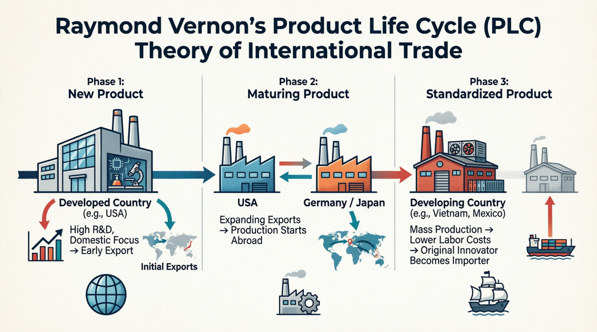
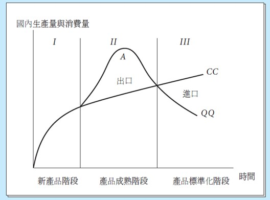

<!-- _class: lead -->

## Other Trade Model

**國企 Wen-Bin Chuang**
**2026-09-14**

----

## Product Life Cycle (PLC) Theory

Raymond Vernon’s **Product Life Cycle (PLC) Theory of International Trade**, introduced in 1966, is a groundbreaking framework that explains how the trade patterns of a specific good change over time as the product matures.

  Before Vernon, trade theories (like Ricardo and Heckscher-Ohlin) treated **comparative advantage as static**. Vernon argued that comparative advantage is **dynamic**: a country might have a comparative advantage in producing a good when it is first invented, but lose that advantage as the product ages and becomes standardized.

----

---

----

#### Three Stages of the Product Life Cycle

Vernon originally developed this theory to explain the post-WWII trade behavior of the United States, using manufactured goods like consumer electronics, chemicals, and pharmaceuticals as examples. The cycle is divided into three distinct stages:

###### Stage 1: The New Product (Introduction)

- **Location of Production:** The innovating, high-income country (historically, the United States).
- **Characteristics:** The product is new, unstandardized, and requires highly skilled labor and heavy R&D. Production processes are not yet fully defined, so manufacturing must be located close to the home market to allow for quick feedback from consumers and rapid design changes.
- **Trade Pattern:** The innovating country exports the product to other high-income countries. Demand in the home country is highly inelastic (consumers are willing to pay a premium for the new tech), while foreign demand is just beginning to grow.

----

###### Stage 2: The Maturing Product (Growth)

- **Location of Production:** Begins to shift to other developed nations (e.g., Europe, Japan).
- **Characteristics:** The product design becomes more standardized. Demand in foreign markets grows rapidly. Competitors in other developed nations begin to emerge and figure out how to produce the good.
- **Trade Pattern:** Exports from the innovating country peak and then begin to decline. To maintain market share and avoid tariff barriers, firms from the innovating country start engaging in **Foreign Direct Investment (FDI)**, setting up assembly plants in foreign markets.

----

#### Stage 3: The Standardized Product (Maturity/Decline)

- **Location of Production:** Shifts entirely to developing, low-wage countries.
- **Characteristics:** The product is now a fully standardized commodity (e.g., a basic calculator or a standard t-shirt). Technology is widely known. The primary basis of competition is no longer innovation or quality, but **price**.
- **Trade Pattern:** Production moves to developing nations to take advantage of cheap, unskilled labor. The original innovating country (the US) shuts down its domestic factories and becomes a **net importer** of the very product it invented.

---

#### Limitations in the Modern Globalized Economy

While highly influential, the strict Vernon model is less applicable to the 21st-century global economy for several reasons:

- **Simultaneous Global Launches:** Today, products like the iPhone or modern pharmaceuticals are launched globally on day one. Companies do not wait for a "maturing" stage to enter foreign markets.
- **Global Supply Chains (Modular Production):** Products are no longer made entirely in one country and then moved. A single product (like a car or smartphone) is fragmented. R&D happens in the US, components are made in South Korea and Japan, and final assembly occurs in China. The product is in multiple "stages" of its life cycle simultaneously across different borders.
- **Reverse Innovation:** Innovation is no longer the exclusive domain of the West. Multinational corporations now frequently develop new, low-cost products in emerging markets (like India or China) and later introduce them to developed markets (e.g., GE's portable ECG machines developed in India).

----

## Gravity Model

The **Gravity Model**, Developed by Jan Tinbergen (1962),  is one of the most successful empirical models in international economics for predicting bilateral trade flows between countries. It draws an analogy to **Newton's law of gravitation**, suggesting that trade between two countries is proportional to their economic sizes and inversely proportional to the distance between them.

------

#### 1. Basic Intuition

Just as `gravitational force` between two objects increases with their `mass` and decreases with `distance`, trade between two countries increases with their economic sizes and decreases with trade barriers (distance, tariffs, language differences, etc.).

##### Core Variables:

1. Economic Size (GDP): Larger economies trade more. Positive relationship with trade flows
2. Distance
   - `Geographic distance` between economic centers
   - Proxy for `transportation costs` and `information barriers`
   - Negative relationship with trade flows

----

#### 2. Simple Empirical Gravity Equation

The `basic gravity model` in log-linear form is:
$$
\ln(T_{ij}) = \alpha + \beta_1 \ln(Y_i) + \beta_2 \ln(Y_j) + \beta_3 \ln(D_{ij}) + \epsilon_{ij}
$$
Where:

- $T_{ij}$ = Trade flow from country i to country j (exports)
- $Y_i, Y_j$ = Economic size (GDP) of countries i and j
- $D_{ij}$ = Distance between i and j
- Expected signs: $\beta_1 > 0 , \beta_2 > 0 , \beta_3 < 0$
- Consistently predicts that:
  - Distance elasticity is around **-0.7 to -1.0**
  - GDP elasticity is close to **1.0**

----

#### 3. Modern Gravity Model

The modern gravity model has `strong theoretical micro-foundations` from different trade models. It provides **micro-foundations** for the gravity equation that are consistent with almost all major trade theories.

-----
###### Anderson and van Wincoop (2003) – Structural Gravity

- **Multilateral Resistance (MR)** is one of the most important theoretical and empirical advancements in the modern **structural gravity model**. It addresses a key limitation of the simple ("naive") gravity equation. The most commonly used theoretical version is:

$$
X_{ij} = \frac{Y_i Y_j}{Y^W} \left( \frac{t_{ij}}{\Pi_i P_j} \right)^{1-\sigma}
$$

Where:

- $X_{ij}$ = exports from i to j, $Y^W$ = world GDP, $t_{ij}$ = `bilateral trade cost factor` (≥ 1)
- $\sigma$ = elasticity of substitution
- $\Pi_i$ = **Outward multilateral resistance** (how easy it is for i to export to the world)
- $P_j$ = **Inward multilateral resistance** (how easy it is for j to import from the world)

-----

##### What Is Multilateral Resistance(MR) ?

In the real world, bilateral trade between countries *i* and *j* does **not** depend only on their `direct` bilateral trade costs (e.g., distance, tariffs, language). It also depends on `how easy or difficult` it is for *i* to trade with **all other countries** and for *j* to source from **all other suppliers**.

- **Outward Multilateral Resistance (Πᵢ)**: Measures the `average trade barriers` that exporters from country *i* face when selling to the **rest of the world**. If *i* has low barriers to many markets, its outward MR is low → it exports more easily everywhere (including to *j*).

  - $$
    \Pi_i^{1-\sigma} = \sum_{j=1}^N \left( \frac{Y_j}{Y^W} \right) \left( \frac{t_{ij}}{P_j} \right)^{1-\sigma}
    $$

-----

- **Inward Multilateral Resistance (Pⱼ)**: Measures the `average barriers` that importers in country *j* face when buying from the **rest of the world**. If *j* has many cheap alternative suppliers, its inward MR is low → it imports less from any single partner like *i*.

  - $$
    P_j^{1-\sigma} = \sum_{i=1}^N \left( \frac{Y_i}{Y^W} \right) \left( \frac{t_{ij}}{\Pi_i} \right)^{1-\sigma}
    $$

These terms act as **general equilibrium price indices** that capture the `relative competitiveness` and `market` access in a multi-country world. Ignoring multilateral resistance(MR) leads to the "Gold Medal Mistake" (Baldwin & Taglioni): biased estimates of bilateral effects (e.g., over- or under-estimating the impact of RTAs, distance, or policies).

----

Suppose Country i signs a trade agreement with Country j (lowers $t_{ij}$).

- Without MR: You might overstate the trade increase. 
- With MR: The agreement also makes i more competitive globally (lower outward MR for i) and gives j better options (affects inward MR for j). The net bilateral effect is more accurate after accounting for these.

**Key Insight**: Trade between i and j depends not only on `bilateral barriers` ($t_{ij}$), but also on their trade barriers with **all other countries**. 

----

###### In Log-Form (Most Used for Estimation)

$$
\ln X_{ij} = \ln Y_i + \ln Y_j - \ln Y^W + (1-\sigma)\ln t_{ij} - (1-\sigma)\ln \Pi_i - (1-\sigma)\ln P_j + \epsilon_{ij}
$$

In practice, researchers use **fixed effects** to control for the multilateral resistance terms:
$$
\ln X_{ij} = \alpha + \beta \ln Y_i + \gamma \ln Y_j + \delta \ln t_{ij} + \mu_i + \lambda_j + \epsilon_{ij}l
$$
Where $\mu_i$ and $\lambda_j$ are exporter and importer fixed effects.

----

###### How to Handle MR in Estimation

1. **Country fixed effects** (importer and exporter dummies) — Most common practical solution. They absorb the unobserved MR terms.
2. **Iterative solving** (Anderson & van Wincoop method) — Computes MR explicitly but is computationally intensive.
3. **Approximations** (remoteness indices) — Older, less accurate method.
4. **PPML estimator** — Preferred for handling zeros and heteroskedasticity, combined with fixed effects.

In panel data (common for services/digital trade), **exporter-time and importer-time fixed effects** are typically used to control for time-varying MR.

----

#### Main Variables Used in Gravity Models

| Variable Type   | Examples                                     | Expected Effect |
| --------------- | -------------------------------------------- | --------------- |
| Economic Mass   | GDP, Population, GDP per capita              | Positive        |
| Distance        | Geographic distance, Travel time             | Negative        |
| Trade Costs     | Tariffs, Non-tariff barriers                 | Negative        |
| Facilitators    | Common language, Colonial ties, FTA/RTA      | Positive        |
| Cultural/Policy | Common currency, Shared border, Institutions | Positive        |

---

#### Key Empirical Findings

- Distance elasticity is typically around **-0.7 to -1.0** (trade falls sharply with distance).
- Trade agreements (FTAs) increase trade by 50–200%.
- Border effect: Countries trade much more domestically than internationally (“home bias”).
- The model explains **60–80%** of variation in bilateral trade flows.

----

#### Modern Extensions

- **Zero Trade Flows**: Use Poisson Pseudo-Maximum Likelihood (PPML) estimator instead of OLS.
- **Firm Heterogeneity**: Incorporating Melitz-type selection.
- **Global Value Chains**: Using value-added trade instead of gross trade.
- **Dynamic Gravity**: Panel data with fixed effects.
- **General Equilibrium Effects**: Solving for multilateral resistance terms.

------

## Mathematical Derivation

###### Step 1: Consumer Preferences (CES Utility)

Consumers in country  j have `CES preferences over varieties` differentiated by country of origin:
$$
U_j = \left( \sum_{i=1}^N \beta_i^{\frac{1}{\sigma}} c_{ij}^{\frac{\sigma-1}{\sigma}} \right)^{\frac{\sigma}{\sigma-1}}
$$
where $\sigma > 1$ is the elasticity of substitution, and $\beta_i$ represents `preference bias` for goods from country  i.

------

###### Step 2: Demand for Goods from i in Country j

Utility maximization subject to the budget constraint $Y_j = \sum_i p_{ij} c_{ij}$ yields the demand:
$$
X_{ij} = p_{ij} c_{ij} = \left( \frac{\beta_i p_{ij}}{P_j} \right)^{1-\sigma} Y_j
$$
where $P_j$ is the CES price index in country  j:
$$
P_j^{1-\sigma} = \sum_{i=1}^N (\beta_i p_{ij})^{1-\sigma}
$$

------

##### Step 3: Iceberg Trade Costs

Goods are subject to iceberg trade costs $t_{ij} \geq 1$ (to deliver one unit to  j, $t_{ij}$ units must be shipped from i).
$$
p_{ij} = p_i \cdot t_{ij}
$$

where $p_i$ is the factory-gate (mill) price in country  i.

###### Step 4: Market Clearing Condition

All income in country  i comes from sales to all destinations (including itself):
$$
Y_i = \sum_{j=1}^N X_{ij}
$$

------

###### Step 5: Solve for Factory-Gate Prices

Substitute $p_{ij} = p_i t_{ij}$ into the demand equation and use market clearing. After solving, we get:
$$
p_i^{1-\sigma} = \frac{Y_i}{\beta_i^{1-\sigma} \Pi_i^{1-\sigma}}
$$
where $\Pi_i$ is the **outward multilateral resistance** term.

------

###### Step 6: Derive the Structural Gravity Equation

Substitute $p_{ij} = p_i t_{ij}$ back into the demand equation (Step 2):
$$
X_{ij} = Y_j \left( \frac{\beta_i p_i t_{ij}}{P_j} \right)^{1-\sigma}
$$

Now substitute the expression for $p_i^{1-\sigma}$ from Step 5:
$$
X_{ij} = Y_j \cdot \frac{\beta_i^{1-\sigma} p_i^{1-\sigma} t_{ij}^{1-\sigma}}{P_j^{1-\sigma}}, \quad
X_{ij} = Y_j \cdot \frac{Y_i \cdot t_{ij}^{1-\sigma} }{ \Pi_i^{1-\sigma} P_j^{1-\sigma} }
$$

----

Finally, multiply and divide by world income $Y^W = \sum_k Y_k$:
$$
\boxed{ X_{ij} = \frac{Y_i Y_j}{Y^W} \left( \frac{t_{ij}}{\Pi_i P_j} \right)^{1-\sigma} }
$$

This is the Structural Gravity Equation.

------

#### Step 7: Multilateral Resistance Terms (Definitions)

**Outward Multilateral Resistance** ($\Pi_i$):
$$
\Pi_i^{1-\sigma} = \sum_{j=1}^N \left( \frac{Y_j}{Y^W} \right) \left( \frac{t_{ij}}{P_j} \right)^{1-\sigma}
$$

**Inward Multilateral Resistance** ($P_j$):
$$
P_j^{1-\sigma} = \sum_{i=1}^N \left( \frac{Y_i}{Y^W} \right) \left( \frac{t_{ij}}{\Pi_i} \right)^{1-\sigma}
$$

These two equations are solved simultaneously with the gravity equation. They represent the average trade barriers that country i faces with all its trading partners (and vice versa).

------

### Interpretation of the Final Equation

- $\frac{Y_i Y_j}{Y^W}$ → **Size effect** (larger economies trade more)
- $t_{ij}^{1-\sigma}$ → **Bilateral trade cost effect** (higher costs reduce trade)
- $\Pi_i$ and $P_j$ → **Multilateral resistance** (trade between i and j depends on how costly it is for them to trade with *everyone else*)

**Key Insight**: Omitting the multilateral resistance terms ($\Pi_i$ and $P_j$) leads to biased estimates in empirical work. This is why modern gravity estimations use exporter and importer fixed effects.

