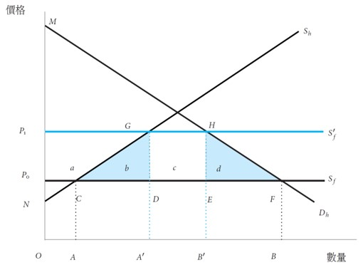
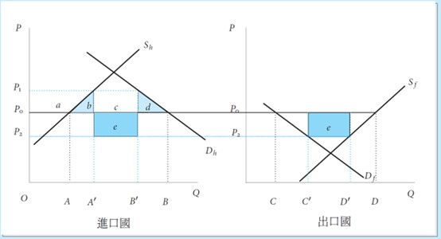
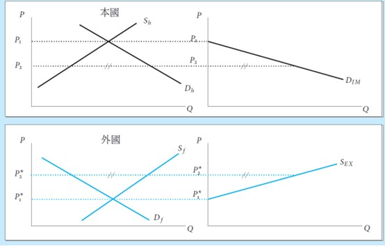
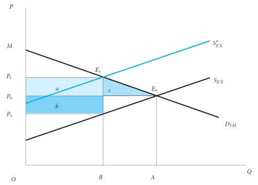
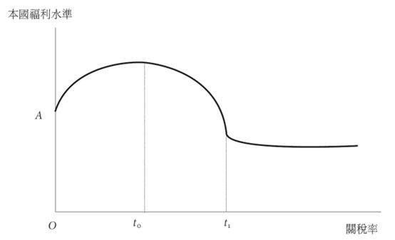

<!-- _class: lead -->

## Trade Policy  I： Tariff

**Wen-Bin Chuang**
**2026-09-14**

-----

#### 1. Main Objectives of Trade Policy

Governments use `trade policy` for:

- Protecting domestic industries and jobs
- Raising government revenue
- Improving terms of trade (especially large countries)
- National security / strategic industries
- Correcting market failures (infant industry argument, externalities)
- Bargaining power in international negotiations

------

#### 2. Major Trade Policy Instruments

| Instrument                           | Definition                       | Effect on Price       | Effect on Quantity | Government Revenue    |
| ------------------------------------ | -------------------------------- | --------------------- | ------------------ | --------------------- |
| **Tariff**                           | Tax on imports                   | ↑ Domestic price      | ↓ Imports          | Yes (tariff revenue)  |
| **Import Quota**                     | Quantity limit on imports        | ↑ Domestic price      | ↓ Imports          | No (unless auctioned) |
| **Export Subsidy**                   | Payment to exporters             | ↓ Export price abroad | ↑ Exports          | Cost to government    |
| **Voluntary Export Restraint (VER)** | Exporting country limits exports | ↑ Domestic price      | ↓ Imports          | Rents to foreigners   |
| **Local Content Requirement**        | Minimum domestic input share     | —                     | —                  | —                     |

-----

#### Protectionism

`Protectionism` refers to government policies designed to `restrict imports` and bolster domestic industries. While the core objective of shielding domestic markets remains consistent, the methods and justifications have evolved significantly over time.

----

#### Traditional Protectionist Policies

`Traditional protectionism` relies on overt, border-focused measures that are relatively transparent and easy to quantify.

- `Tariffs`: These are `taxes` levied on imported goods to make them more expensive and less competitive against domestic products .
- `Import Quotas`: These set strict numerical limits on the `quantity` of a specific good that can be imported over a given period .
- `Embargoes`: This represents a `total ban` on trade with a specific country or on particular goods, typically enacted for political reasons .
- **Direct Subsidies**: Governments provide `financial assistance`, such as cash payments, preferential loans, or tax breaks, to local producers to artificially lower their production costs

The `primary characteristic` of traditional protectionism is its focus on protecting the `domestic market` from excessive foreign competition using blunt, easily identifiable economic instruments

-----

#### New Protectionist Policies (Neo-Protectionism)

`Contemporary protectionism`, often termed `neo-protectionism,` takes a more subtle, complex, and strategic form.

- **Non-Tariff Barriers (NTBs)**: These include **technical barriers to trade (TBT)** and **sanitary/phytosanitary (SPS) measures**, which impose complex administrative procedures or unique product standards that are difficult for foreign goods to meet. 
- **Local Content Requirements (LCRs)**: These policies mandate that companies must source a certain percentage of the final value of a good or service from `domestic firms` (e.g., "Buy National" initiatives).
- **Digital Protectionism**: This emerging frontier includes `data localization laws`, restrictions on cross-border data flows, and digital services taxes that act as modern non-tariff trade barriers.
- **"Friend-Shoring" and Strategic Industrial Policy**: `Supply chains` are being restructured to favor geopolitical allies, accompanied by massive state support framed as "strategic autonomy" or supply chain resilience rather than pure market protection.

Unlike traditional measures, `neo-protectionism` is frequently connected with implementing measures that are `more difficult to detect` and `less actionable` under World Trade Organization (WTO) rules.

----

| **Aspect**            | **Traditional Protectionism**      | **New Protectionism**                    |
| --------------------- | ---------------------------------- | ---------------------------------------- |
| **Main Tools**        | Tariffs, quotas, embargoes         | Regulations, standards, digital barriers |
| **Visibility**        | Obvious and easy to see            | Hidden or hard to detect                 |
| **Justification**     | Economic (protect jobs/industries) | National security, health, environment   |
| **WTO Compatibility** | Often violates trade rules         | Exploits loopholes/exceptions            |
| **Target**            | `Broad, general` imports           | `Specific` sectors or countries          |
| **Examples**          | 25% tariff on steel, import limits | Data localization, "Buy Local" laws      |

------

#### 3. Effects of a Tariff (Small Country Case)

**Assumptions**: Country is **small** (cannot affect `world price` $P^W$).

- Domestic price after tariff: $P_d = P^W + t$ ($P_1-P_0=t$), 
  - $t$  = specific tariff (or $t = \tau \cdot P^W$ for ad valorem tariff).

- Effects:
  - Consumer surplus **decreases**
  - Producer surplus **increases**
  - Government gains **tariff revenue**
  - **Deadweight Loss** (net national loss)

----

---

#### Welfare Effects (Partial Equilibrium)

| Component                | Change        | Area in Diagram | Welfare Impact      |
| ------------------------ | ------------- | --------------- | ------------------- |
| Consumer Surplus         | Decreases     | -(a+b+c+d)      | Loss                |
| Producer Surplus         | Increases     | +a              | Gain                |
| Government Revenue       | Increases     | +c              | Gain                |
| **Net National Welfare** | **Decreases** | **-(b+d)**      | **Deadweight Loss** |

-----

#### Formulas (Partial Equilibrium):

- Change in Consumer Surplus = $-\ (a + b + c + d)$
- Change in Producer Surplus = $+a$
- Government Revenue = $+c$ 
- Net Welfare Loss = $\boxed{-(b + d)}$

Where:

-  b = `Production distortion` (inefficient domestic overproduction)
- d = `Consumption distortion` (under-consumption)

Conclusion for `Small Country`: A tariff always causes a `net welfare loss`. There is no terms of trade gain.

------

#### 4. Large Country Case (Terms of Trade Effect)

`Large countries can influence world prices`. Its import demand affects the world market.

- Tariff reduces import demand → World price falls

  - #### Key Effects

    - Tariff reduces import demand → World price **falls** from $P^W$ to $P^{W'}$ ($P_0 \rightarrow P_2$).
    - Domestic price = New world price + tariff $P_d = P^{W'} + t$ ($P_1-P_2=t$)

- **Terms of Trade Gain** = Area **e** (part of rectangle c)

- Net welfare effect = **Terms of Trade Gain** – **Deadweight Loss** $(b + d)$

----

----

#### Welfare Effects

| Component                | Change        | Area in Diagram | Welfare Impact              |
| ------------------------ | ------------- | --------------- | --------------------------- |
| Consumer Surplus         | Decreases     | -(a+b+c+d+e+f)  | Loss                        |
| Producer Surplus         | Increases     | +a              | Gain                        |
| Government Revenue       | Increases     | +(c + e)        | Gain                        |
| **Terms of Trade Gain**  | Positive      | **+e**          | **Gain**                    |
| **Net National Welfare** | **Ambiguous** | **e - (b + d)** | Can be positive or negative |

**Key Insight**:

- **e** = Terms of Trade Gain (the country pays less for its imports on the world market)
- **b + d** = Deadweight Loss (same as small country)
- Net Welfare Change = Terms of Trade Gain − Deadweight Loss

-----

---

----

#### Optimal Tariff  (for Large Country):

The **optimal tariff** is a `fundamental concept` in international trade policy theory. It refers to the specific rate of `import tax (tariff)` that maximizes a country's overall national economic welfare. While free trade is generally considered the most efficient system globally, the `optimal tariff theory` demonstrates that, under specific conditions, a country can actually increase its own domestic well-being by restricting trade just enough to exploit its market power. The optimal tariff balances two opposing forces:

- **The Terms-of-Trade Gain (The Benefit):** By imposing a tariff, the importing country reduces its demand for foreign goods. If the country is large enough, this drop in demand forces foreign exporters to lower their pre-tax prices to maintain sales. This means the importing country gets to buy goods cheaper on the global market, effectively shifting some of the tariff's burden onto foreign producers.
- **The Deadweight Loss (The Cost):** Tariffs distort the market. They cause domestic consumers to pay higher prices (reducing consumer surplus) and protect inefficient domestic producers (creating production distortions). This reduces the overall volume of trade and creates economic inefficiency.

-----

-----

In economic models, the optimal tariff rate ($t^∗$) is mathematically determined by the **elasticity of foreign export supply** ($\varepsilon^*$). The formula is:
$$
t^* = \frac{1}{\varepsilon^*_X}
$$
where $\varepsilon^*_X$​ = elasticity of foreign export supply. (how responsive foreign exporters are to price changes).

- If `foreign supply is inelastic` → optimal tariff is high.
- As $\varepsilon^*_X \to \infty$ (perfectly elastic, foreign producers can easily sell their goods elsewhere), optimal tariff → 0 (small country case).

----

#### Mathematical Derivation for Optimal Tariff

###### 1. Setup

- Home country is **large** → can influence world prices.
- It imports good X. $P^W$ = world price of X. $t$ = specific import tariff.
- Domestic price in Home: $P_d = P^W + t$

Let
- $M(P^W)$ = Home’s import demand function (decreasing in $P^W$)
- $X^*(P^W)$ = Foreign’s export supply function (increasing in $P^W$)

Market clearing requires:
$$
M(P^W) = X^*(P^W)
$$

----

###### National Welfare

Home’s welfare (W) is the sum of:

- `Consumer Surplus (CS)` and `Producer Surplus (PS)` as well as `Tariff Revenue`

In terms of import volume, we can express welfare as:
$$
W = \underbrace{\text{Consumer + Producer Surplus}}_{\text{Depends on } P_d = P^W + t} + t \cdot M
$$

----

More conveniently, the **change in welfare** due to a small change in tariff can be derived using the **expenditure function or directly**:
$$
dW = -M \cdot dP_d + M \cdot dt + t \cdot dM
$$

Since $P_d = P^W + t$, then $dP_d = dP^W + dt$. Substitute:

$$
dW = -M (dP^W + dt) + M \cdot dt + t \cdot dM
$$

Simplify:
$$
dW = -M \cdot dP^W + t \cdot dM
$$

------

###### 3. Relationship between $dP^W$ and $dM$

From **market clearing**: $M(P^W) = X^*(P^W)$. Differentiate both sides:

$$
dM = \frac{dX^*}{dP^W} dP^W
$$
Define the **elasticity of foreign export supply** ($\varepsilon^*$):
$$
\varepsilon^* = \frac{dX^*}{dP^W} \cdot \frac{P^W}{X^*} = \frac{dX^*}{dP^W} \cdot \frac{P^W}{M}
$$
So:
$$
\frac{dX^*}{dP^W} = \frac{\varepsilon^* M}{P^W}
$$

---
Therefore:
$$
dM = \left( \frac{\varepsilon^* M}{P^W} \right) dP^W \quad \Rightarrow \quad dP^W = \frac{P^W}{\varepsilon^* M} dM
$$

#### 4. Substitute back into Welfare

$$
dW = -M \left( \frac{P^W}{\varepsilon^* M} dM \right) + t \cdot dM, \quad
dW = -\frac{P^W}{\varepsilon^*} dM + t \cdot dM,\quad
dW = \left( t - \frac{P^W}{\varepsilon^*} \right) dM
$$

------

#### 5. Optimal Tariff Condition

To **maximize welfare**, set $dW = 0$ for a small change in imports:
$$
t - \frac{P^W}{\varepsilon^*} = 0, \quad 
\boxed{t^* = \frac{P^W}{\varepsilon^*}}
$$
Or, in **ad valorem** terms (tariff rate $\tau = t / P^W$):
$$
\boxed{\tau^* = \frac{1}{\varepsilon^*}}
$$
This is the famous **Optimal Tariff Formula**.

----

#### Effective Rate of Protection(ERP)

While the `nominal rate` tells you what is happening at the border, the `effective rate` tells you what is actually happening inside the domestic factory. In particular, the **Effective Rate of Protection (ERP)** measures the `percentage increase` in domestic value-added due to the tariff structure, rather than just the nominal tariff on the final product. It is a much better indicator of the actual level of protection provided to domestic industries, especially in the presence of **Global Value Chains** where imported intermediate inputs are common.

- The **nominal tariff rate** is the direct, stated percentage tax applied to the price of an imported good at the border. It is the `headline` number you see in trade agreements or customs schedules.
  - **What it measures:** It measures the percentage by which the price paid by the domestic consumer is increased due to the tariff. 
  - **How it works:** If the nominal tariff on imported cars is **10%**, and a foreign car costs **\$20,000**, the consumer pays a **\$2,000 tax**, bringing the total price to **\$22,000**.

- The **effective tariff rate** (or Effective Rate of Protection) measures the **true percentage** increase in **domestic value-added** per unit of output that the tariff structure provides to a domestic industry.
  - **What it measures:** It measures the percentage by which the profit margin (value added) of the domestic producer is increased due to the tariff structure.

----

The `Effective Rate of Protection (ERP)` is calculated using the following formula:
$$
ERP=\frac{t_f -a\cdot t_i}{1-a}
$$
Where:

- $t_f$ = The nominal tariff rate on the **final** imported good.
- $t_i$ = The nominal tariff rate on the imported **intermediate inputs** (raw materials/parts).
- $a$ = The **cost share (Input share)** of the imported inputs in the free-trade price of the final good (i.e., Input Cost / Final Free-Trade Price).

---

###### Example 1: Simple Case (No Input Tariffs)

- `Final good` (Car) price = \$10,000, `Tariff` on car = 20% ($t_f = 0.20$). `No tariffs` on inputs
  $$
  ERP = \frac{0.20 - 0}{1 - 0} = 20\%
  $$

→ ERP = Nominal tariff

---

###### Example 2: With Imported Inputs (Typical GVC Case)

- Cost of imported inputs (Input share) = 60% of final price → a=0.60

- Tariff on `final good` (Car) = 20%, Tariff on `imported inputs` (steel, parts) = 5%
  $$
  ERP = \frac{0.20 - (0.60 \times 0.05)}{1 - 0.60} = \frac{0.20 - 0.03}{0.40} = \frac{0.17}{0.40} = 42.5\%
  $$

→ Even though nominal tariff is 20%, **effective protection** is **42.5%** on domestic value-added.

----

###### Example 3: Negative ERP

- Tariff on `final good` = 10%, Tariff on `major input` = 25%, `Input share` = 70%
  $$
  ERP = \frac{0.10 - (0.70 \times 0.25)}{1 - 0.70} = \frac{0.10 - 0.175}{0.30} = -25\%
  $$
  → Domestic producers are actually **hurt** by the tariff structure.

-----

#### Key Insights and Implications

If tariffs on inputs ($t_i$) are **lower** than on the final good ($t_f$), the ERP is **higher** than the nominal tariff → **cascading protection**. If tariffs on inputs are **higher** than on the final good, ERP can be **negative** (anti-protection).

| Situation                               | Effect on ERP            | Interpretation                                       |
| --------------------------------------- | ------------------------ | ---------------------------------------------------- |
| Tariff escalation (common in practice)  | ERP significantly higher | Encourages assembly, discourages upstream industries |
| Tariff on inputs > Tariff on final good | ERP can be negative      | Hurts domestic producers                             |
| Uniform tariffs across all stages       | ERP ≈ Nominal tariff     | Least distorting                                     |
| Tariff on final good > Tariff on inputs | ERP > Nominal tariff     | `High` effective protection                          |

-----

#### Mathematical Derivation for ERP

###### 1. Basic Setup

Assume a producer makes one unit of a **final good** (good $f$). Under **free trade** (no tariffs):

- Price of final good = $P_f$, Cost of imported inputs $i$ required to produce one unit = $\sum a_{if} P_i$
- **Value Added** (domestic contribution) = $VA = P_f - \sum a_{if} P_i$

Where $a_{if}$ = `cost share` (or physical coefficient) of input $i$ in the cost of producing good f. We can normalize $P_f = 1$ for simplicity. Then:

$$
VA = 1 - \sum a_{if}
$$

------

##### 2. With Tariffs

Now introduce tariffs: Nominal tariff on final good = $t_f$ and Nominal tariff on each imported input $i$  = $t_i$. After tariffs:

- Domestic price of final good becomes: $P_f(1 + t_f)$
- Cost of imported inputs becomes: $\sum a_{if} P_i (1 + t_i)$

Therefore, **Value Added under protection** ($VA_t$) is:
$$
VA_t = P_f(1 + t_f) - \sum a_{if} P_i (1 + t_i)
$$
Again, setting $P_f = 1$:
$$
VA_t = (1 + t_j) - \sum a_{ij} (1 + t_i)
$$

------

#### 3. Increase in Value Added

The **absolute increase** in value added due to the tariff structure is:
$$
VA_t - VA = \left[ (1 + t_f) - \sum a_{if}(1 + t_i) \right] - \left[ 1 - \sum a_{if} \right]
$$
Simplify:
$$
VA_t - VA = t_f - \sum a_{if} t_i
$$

------

#### 4. Effective Rate of Protection (ERP)

The ERP is the **percentage increase** in domestic value added caused by the entire tariff structure:
$$
ERP_j = \frac{VA_t - VA}{VA} = \frac{t_f - \sum a_{if} t_i}{1 - \sum a_{if}}
$$

----

#### Special Cases

| Case                              | Formula                               | Interpretation                    |
| --------------------------------- | ------------------------------------- | --------------------------------- |
| No imported inputs ($a_{if}=0$)   | $ERP = t_f$                           | ERP = Nominal tariff              |
| No tariffs on inputs ($t_i=0$)    | $ERP = \frac{t_j}{1 - \sum a_{ij}}$ | ERP > Nominal tariff              |
| Uniform tariffs ($t_f = t_i = t$) | $ERP = t$                            | No change in effective protection |
| Tariff escalation                 | $ERP > t_f$                         | Strong protection for final good  |

-----

#### Economic Interpretation

- The numerator ($t_f - \sum a_{if}$) shows the **net protection** on value added.
- The denominator ($1 - \sum a_{if}$) is the **free-trade value-added share**.
- If inputs are taxed less than the final good (common policy), the ERP is **much higher** than the nominal tariff. 