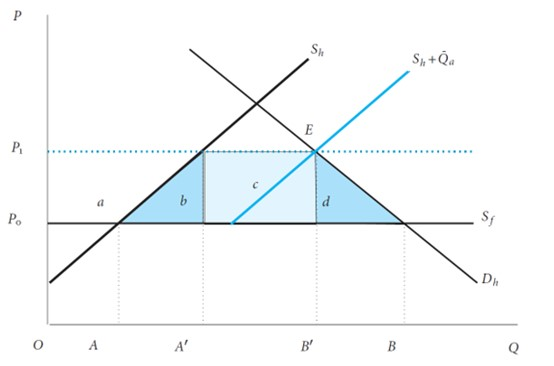
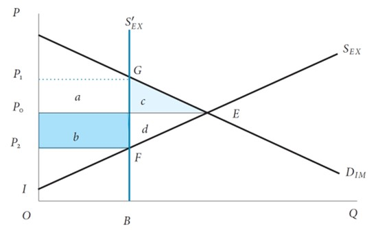
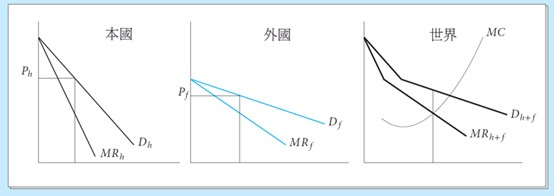
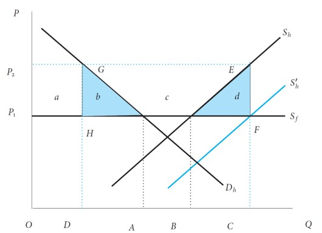
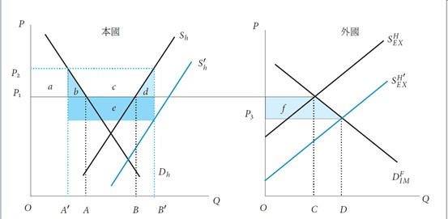
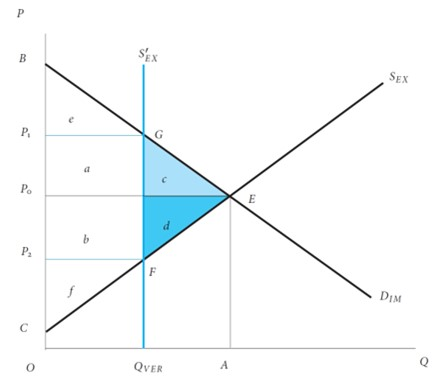

<!-- _class: lead -->

#### Trade Policy  II： Non-Tariff Measures (NTMs)

**Wen-Bin Chuang**
**2026-09-14**

-----

**Non-Tariff Measures (NTMs)** are all policy measures `other than tariffs` that can affect international trade. They are now more important than tariffs in most developed and many developing countries.

###### Main Categories: 

###### UNCTAD classification of Non-Tariff Measures (NTMs) into 16 categories

| Group                               | Chapters    | Simplified Content                                           | **Direction** |
| ----------------------------------- | ----------- | ------------------------------------------------------------ | ------------- |
| **技術性貿易措施** *(共 3 大類)*    | **A, B, C** | **A**: 衛生與植物檢疫 (`SPS`) **B**: 技術性貿易障礙 (`TBT`) **C**: 裝船前檢驗及其他手續(`PSI`) | 進口          |
| **非技術性貿易措施** *(共 12 大類)* | **D ~ O**   | **D**: 貿易救濟 (如反傾銷) **E**: 許可、配額、禁止 **F**: 價格控制 **G**: 財務措施 **H**: 競爭措施 **I**: 投資相關措施 **J**: 分銷限制 **K**: 售後服務限制 **L**: 補貼 **M**: 政府採購 **N**: 智慧財產權 **O**: 原產地規則 | 進口          |
| **與出口有關的措施** *(共 1 大類)*  | **P**       | **P**: 出口措施 (如出口稅、出口限制)                         | 出口          |

- **SPS**: Must be based on scientific risk assessment; **TBT**: Must not be more trade-restrictive than necessary. 

-----

#### Comparison Table

| Aspect                  | SPS                       | TBT                       | Standards               |
| ----------------------- | ------------------------- | ------------------------- | ----------------------- |
| Main Focus              | Health (food safety)      | Technical requirements    | Quality & compatibility |
| Basis Required          | Scientific evidence       | Legitimate objective      | Often voluntary         |
| Trade Impact            | Very high                 | High                      | Medium                  |
| Example                 | Maximum pesticide residue | Safety certification (CE) | ISO 9001, USB standards |
| Typical Compliance Cost | Very high (lab testing)   | Medium-High               | Medium                  |

---

**Market Assumptions**:

- Domestic Demand: $Q_d = 120 - 2P$, Domestic Supply: $Q_s = 20 + 2P$,  World Price ($P_w$): **$18**

#### **Step 1: Free Trade (No NTM)**

$$
\begin{align*} Q_d &= 120 - 2(18) = 84 \\ Q_s &= 20 + 2(18) = 56 \\ \text{Imports} &= 28 \end{align*}
$$

------

#### **Step 2: With Strict NTM (Compliance Cost = $6 per unit)**

Foreign exporters must spend **extra \$6/unit** to meet new SPS/TBT requirements.

**New effective import price** = 18 + 6 = \$24. Then **New Equilibrium**:
$$
\begin{align*} Q_d &= 120 - 2(24) = 72 \\ Q_s &= 20 + 2(24) = 68 \\ \text{Imports} &= 72 - 68 = \mathbf{4} \end{align*}
$$
**Results**:

- Domestic price rises to **$24**, Domestic production ↑ from 56 → 68, Domestic consumption ↓ from 84 → 72, Imports ↓ sharply from 28 → 4

------

#### **Step 3: Welfare Analysis**

| Component                | Change       | Approximate Value | Explanation                 |
| ------------------------ | ------------ | ----------------- | --------------------------- |
| Consumer Surplus         | Decrease     | -420              | Higher price                |
| Producer Surplus         | Increase     | +300              | Higher price & more output  |
| Compliance Cost (Waste)  | Loss         | -24 (6×4)         | Resources spent meeting NTM |
| **Net National Welfare** | **Net Loss** | **-144**          | DWL + compliance waste      |

**Note**: If the NTM provides real benefits (e.g., reduced health risks from contaminated food), there can be **positive social benefits** that offset some losses.

-----

## (Import) Quota

An **import quota** is a **direct quantitative restriction** on the amount (or value) of a particular good that can be imported into a country during a specified period.

### **Types of Quotas:**

1. **Absolute Quota**: A `fixed limit` on the `quantity` of imports (e.g., "only 1 million tons of sugar may be imported this year")

2. **Tariff-Rate Quota (TRQ)**:
   - A `lower tariff` is applied to imports up to a `specified quantity`
   - A `higher tariff` is applied to imports `exceeding that quantity`
     - Example: First 10,000 tons imported at 5% tariff; anything above that at 50% tariff
   
3. **Voluntary Export Restraint (VER)**: A quota imposed by the exporting country (discussed later)

------

###### Price Effect:

- The restricted supply causes the **domestic price to rise** above the world price
- The difference between domestic price ($P_1$) and world price ($P_0)$ is called the **quota rent**

###### Quantity Effect:

- **Domestic production increases** (protected producers supply more)
- **Domestic consumption decreases** (higher prices reduce demand)
- **Imports are limited** to the quota amount

###### Welfare Effects:

- **Consumer Surplus**: ↓ Decreases (consumers pay higher prices)
- **Producer Surplus**: ↑ Increases (domestic producers benefit)
- **Quota Rent**: ? Depends on who receives it (see below)
- **Net National Welfare**: ↓ Decreases (deadweight loss)

-----

#### The Small Country Case

Imagine a `standard supply and demand` graph where the world price is $P_0$. When the `quota` is applied, the domestic price rises to a higher price, $P_1$. The areas between these two price lines are divided into four sections: **a, b, c, and d**.

| Group                                   | Change in Surplus     | Economic Meaning                                             |
| --------------------------------------- | --------------------- | ------------------------------------------------------------ |
| **Consumers** (The Losers)              | **– (a + b + c + d)** | Pay higher prices and buy less. Total loss of consumer surplus. |
| **Domestic Producers** (The Winners)    | **+ a**               | Sell more goods at the higher protected domestic price.      |
| **Quota License Holders** (The Winners) | **+ c**               | Earn "Quota Rents" by buying at the low world price and selling at the high domestic price. |
| **Net National Welfare** (The Society)  | **– (b + d)**         | **Deadweight Loss.** • **b**: Production inefficiency (wasting resources on high-cost domestic production). • **d**: Consumption inefficiency (consumers priced out of the market). |

**Summary Equation:**
Net Welfare = (Gain to Producers) + (Gain to License Holders) – (Loss to Consumers)
Net Welfare = (+a) + (+c) – (a + b + c + d) = **– (b + d)**

----

----

###### What do the Deadweight Loss areas (b + d) actually mean?

- **Area (b) is the Production Distortion:** This is the cost of `inefficient domestic production`. The country is forcing its `own high-cost producers` to make goods that could have been bought cheaper from the rest of the world. It is a waste of national resources.
- **Area (d) is the Consumption Distortion:** This is the loss of `consumer satisfaction`. Because the price is artificially high, consumers are buying less of the good than they actually want to at the true global price.

**Summary:** In a `small country`, an import quota simply transfers wealth **from consumers to producers** (**a**) and **license holders** (**c**), but it permanently destroys national wealth in the process (**b + d**).

-----

#### The Large Country Case

When analyzing a **Big Country** using the `Import Demand` ($D_{IM}$) and `Foreign Export Supply` ($S_{EX}$) framework, we are looking specifically at the *import market* rather than the entire domestic market. Because the country is "big," its $D_{IM}$ is `large enough` that restricting imports forces foreign exporters to lower their prices.

- The `Domestic Price` ($P_1$) `rises` (moving up the $D_{IM}$  curve).
- The `World Price` ($P_2$) `falls` (moving down the $S_{EX}$  curve).

Here is the welfare analysis using the standard areas in the $D_{IM} / S_{EX}$ graph:

- **Area (a):** The rectangle between the original world price ($P_0$) and the new higher domestic price ($P_1$), up to the quota quantity.
- **Area (b):** The triangle between the $D_{IM}$  curve and the price lines ($P_0$ to $P_2$).
- **Area (c):** The rectangle between the original world price ($P_0$) and the new lower world price ($P_2$), up to the quota quantity. (Check!!!!!!!)

----

----

| Group                                             | Change in Surplus | Economic Meaning in DIM/ SEX Graph                           |
| ------------------------------------------------- | ----------------- | ------------------------------------------------------------ |
| **Domestic Consumers** *(Loss of Import Surplus)* | **– (a + b + c)** | They pay a higher domestic price ($P_d$) and import less. The total loss of their net import benefit is the entire area under the price change. |
| **Domestic Producers**                            | **+ a**           | Protected by the quota, they sell more at the higher domestic price ($P_d$). Area **a** is transferred from consumers to domestic producers. |
| **Quota License Holders** *(Quota Rent)*          | **+ c**           | They buy at the new, lower world price ($P_w$) and sell at the high domestic price ($P_d$). The difference is the Quota Rent (Area **c**). |
| **Net National Welfare**                          | **c – b**         | **Terms of Trade Gain (c)** minus **Deadweight Loss (b)**.   |

To find the net effect on the `importing country`, we add the winners and subtract the losers:

- **Net Welfare** = (Gain to Producers) + (Gain to License Holders) – (Loss to Consumers)
- **Net Welfare** = (+a) + (+c) – (a + b + c) = **c – b**

-----

#### What this means:

1. **Area (b) is the Deadweight Loss:** The `efficiency loss` from consuming less than the free-trade amount (the triangle under $D_{IM}$ ).
2. **Area (c) is the Terms of Trade Gain:** Because the `country is big`, it forced foreign exporters to lower their price from $P_0$ to $P_2$. The country is now buying its imports cheaper on the global market.

**The Final Verdict for the Big Country:**

- If **c > b** (The `Terms of Trade Gain` is larger than the Deadweight Loss), the big country actually **gains** overall national welfare from the quota! (This is the logic behind the "Optimal Tariff/Quota" argument).
- If **b > c**, the country suffers a net loss.

----

#### The Equivalence of Tariff and Quota

###### The Key Theorem:

**Under certain conditions, a tariff and a quota can be economically equivalent** — meaning they produce `identical effects` on: **Domestic price**; **Domestic production**, **Domestic consumption**, **Import volume**, Overall welfare

###### Conditions for Equivalence: A tariff and quota are equivalent when:

1. **The importing government auctions the quota licenses** to the highest bidders (rather than giving them away)
2. **Perfect competition** exists in both domestic and import markets
3. **No uncertainty** about market conditions (demand and supply are stable and known)
4. **The quota is set at the exact level** that would be imported under the tariff

------

###### How the Equivalence Works:

**Scenario**: World price = $100 per unit

###### Option A: $20 Tariff

- Domestic price = $120, Imports = 1 million units
- Government revenue = \$20 × 1 million = \$20 million

###### Option B: 1 Million Unit Quota (with auctioned licenses)

- Restricted supply drives domestic price to $120
- Imports = 1 million units (quota limit), Quota rent per unit = $120 - $100 = $20
- Government revenue from auction = \$20 × 1 million = \$20 million

**Result**: **Identical outcomes** in price, quantity, and government revenue.

-----

#### When Tariff and Quota Are NOT Equivalent

The equivalence **breaks down** under several important conditions:

#### 1. Who Gets the Quota Rent?

| Quota License Allocation             | Who Gets the Rent? | Equivalence to Tariff?                    |
| ------------------------------------ | ------------------ | ----------------------------------------- |
| **Government auctions licenses**     | Government         | ✅ **YES** (identical to tariff)           |
| **Given to domestic importers**      | Domestic importers | ❌ **NO** (importers gain, not government) |
| **Given to foreign exporters** (VER) | Foreign exporters  | ❌ **NO** (worst for importing country)    |

**Key Point**: Only when the government `captures the quota rent` through competitive auction does the quota equal a tariff.

-----

#### 2. Market Structure: Monopoly vs. Competition

**Under Monopoly:**

- **Tariff**: The monopolist still faces competition from imports at $P_w$ + tariff, limiting their pricing power
- **Quota**: The monopolist faces a fixed import quantity, giving them **more market power** to raise prices above the tariff-equivalent level

**Result**: **Quota is more restrictive** than an equivalent tariff under monopoly conditions.

------

#### 3. Uncertainty and Market Fluctuations

**Under a Tariff:**

- If domestic demand increases → **Imports increase** (price stays at $P_w$ + tariff)
- The tariff provides **price certainty** but **quantity flexibility**

**Under a Quota:**

- If domestic demand increases → **Domestic price rises** (imports stay fixed at quota)
- The quota provides **quantity certainty** but **price volatility**

**Example**:

- Demand surge: Under a quota, prices can spike dramatically because imports cannot increase
- Demand collapse: Under a quota, prices may fall less because the quota prevents import competition from increasing.

-----

#### 4. Administrative Differences

| Feature            | Tariff                       | Quota                                           |
| ------------------ | ---------------------------- | ----------------------------------------------- |
| **Administration** | Simple (collect at border)   | Complex (allocate licenses, monitor compliance) |
| **Transparency**   | Clear and visible            | Often opaque, subject to corruption             |
| **Revenue**        | Automatic government revenue | Only if licenses are auctioned                  |
| **Flexibility**    | Easy to adjust rates         | Difficult to change quota levels                |

----

#### Key Takeaways

1. **Equivalence Condition**: A tariff and quota are economically equivalent **only if** the government `auctions the quota licenses` and captures the quota rent.

2. **Quota Rent Matters**: Who receives the quota rent determines whether the quota is better or worse than a tariff for the importing country.

3. Flexibility vs. Certainty:

   - Tariffs provide **price certainty** but **quantity flexibility**
   - Quotas provide **quantity certainty** but **price volatility**

-----

4. **Market Structure**: Quotas are more restrictive than tariffs under monopoly conditions.
5. **VERs Are Worst**: When quota rents go to foreign exporters (VER), the importing country suffers the maximum welfare loss.
6. Policy Preference: Economists generally prefer tariffs over quotas  because they are:
   - More transparent, Easier to administer, Generate automatic government revenue
   - Allow market flexibility, Less prone to corruption

7. **WTO Rules**: Quotas are generally prohibited under WTO rules (except in specific circumstances), while tariffs are the preferred and legal form of protection.

------

## Dumping and Anti-Dumping

**Dumping** occurs when a company exports a product to a foreign country at a price that is **lower than its "normal value."** `Normal value` usually means either:

- The price the company charges for the same product in its own home market, `OR`
- The actual cost of producing the product.

---

#### Why do companies do it?

- **To clear inventory:** Selling off excess stock abroad without lowering prices at home.
- **To gain market share:** Offering a temporarily low price to attract foreign customers.
- **Predatory pricing (The harmful kind):** Selling below cost to drive local competitors out of business, with the intention of raising prices later once a monopoly is established.

----

---

**Anti-dumping (AD)** is the legal response by a government to `protect its domestic industries` from the harmful effects of dumping. If a country proves that dumping is happening, it can impose an **Anti-Dumping Duty**—which is essentially an extra, `punitive tariff` on that `specific` imported product. The goal is to `raise the import price` back to its **fair level**, leveling the playing field for domestic producers. Under World Trade Organization (WTO) rules, a government cannot just slap an anti-dumping tariff on a whim. It must prove **all three** of the following conditions:

1. **Proof of Dumping:** The government must calculate a `dumping margin` (the difference between the export price and the normal home-market price or cost of production).
2. **Proof of Material Injury:** The domestic industry must show it is suffering real harm (e.g., lost sales, shrinking market share, factory closures, or job losses).
3. **Causal Link:** The government must prove that the *dumping* is the direct cause of the *injury*. (If the domestic industry is failing due to bad management or a recession, anti-dumping duties are not allowed).

-----

#### The Big Controversy: Fair Defense or Disguised Protectionism?

While anti-dumping rules were designed to stop unfair corporate trade behavior, they are now the **most frequently used tool of "New Protectionism."**

- **The Criticism:** Anti-dumping investigations are complex, expensive, and easily manipulated. Domestic industries often use them as a weapon to `block foreign competition`, even when the foreign country is just naturally more efficient.
- **The Collateral Damage:** While anti-dumping duties might save jobs in one industry (e.g., domestic steel producers), they raise costs for downstream industries that rely on those materials (e.g., domestic car manufacturers or construction companies), and they force local consumers to pay higher prices.

**In short:** Dumping is a corporate pricing strategy. Anti-dumping is the government's regulatory shield against it, though that shield is often used as a sword for modern protectionism.

----

## Export-Subsidy Trade Policy

An **export subsidy** is a payment (usually $s$ per unit) given by the government to a firm for every unit of a good it `exports`. To understand the impact, we must first look at the **Arbitrage Condition**: A producer will only sell a good in the domestic market if the domestic price ($P_1$) is at least as high as the price they can get by exporting it (the World Price, $P_0$, plus the subsidy, $s$). Therefore, an export subsidy always drives the domestic price up: $P_2=P_1+s$ .

------

#### The Small Country Case

**Core Assumption:** A small country is a **"price taker."** Its production and consumption volumes are so small relative to the global market that its trade policies cannot affect the world price ($P_1$). The world price remains fixed.

###### Price Effect

- Because $P_1$ is fixed, the domestic price `rises exactly by` the amount of the subsidy.
- **Result:** $P_2=P_1+s$. Domestic consumers must now pay the `higher` world price plus the subsidy amount, because producers will simply export the goods if domestic consumers don't match that price.

###### Quantity Effect

- **Production:** Increases. Domestic producers are incentivized by the higher effective price.
- **Consumption:** Decreases. Domestic consumers are forced to pay a higher price.
- **Exports:** Increase significantly (Exports = Production - Consumption).

----

----

##### Welfare Analysis (The Economic Impact)

- **Consumer Surplus:** **Decreases**. Domestic consumers are harmed by the artificially high prices.

- **Producer Surplus:** **Increases**. Domestic producers gain from higher prices and increased sales.

- **Government Revenue:** **Decreases**. The government must pay out the subsidy for every unit exported ($s×\text{Total Exports}$).

  

---------

#### Net National Welfare: b + d

##### Decreases (Net Loss)

- The gains to producers are entirely wiped out by the losses to consumers and the massive cost to the government.
- The country suffers a `Deadweight Loss (DWL)`  consisting of two parts:
  1. **Production Distortion:** Resources are `inefficiently pulled into` the subsidized industry where the country does not have a comparative advantage.
  2. **Consumption Distortion:** Domestic consumers are priced out of the market and consume less than they optimally should.

---

#### The Large Country Case

**Core Assumption:** A large country is a **"price maker" (or price influencer).** Its economy is so large that when it alters its export volumes, it shifts the global supply curve and **changes the world price**.

###### Price Effect

- The export subsidy encourages a massive surge in the country's exports. This flood of new supply on the global market drives the **world price down** (let's call the new, lower world price $P_3$).
- The domestic price still rises, but because the world price has fallen, the domestic price rises by **less than the full amount of the subsidy**.
- **Result:** $P_2=P_3+s$. (Note: $P_2$ is higher than the original world price, but the increase is smaller than $s$).

----
###### Quantity Effect

- **Production:** Increases (though slightly less than in the small country case, because the domestic price didn't rise as much).
- **Consumption:** Decreases.
- **Exports:** Increase.

----

-----

####  Terms of Trade (ToT) Effect

- This is the crucial difference. The **Terms of Trade** is the ratio of a country's export prices to its import prices. Because the large country's subsidy pushed the world price of its exports *down*, it is now getting less money (or fewer imports) for every unit it sells abroad. Its Terms of Trade have **deteriorated**.

---

#### **Welfare Analysis (The Economic Impact)**

- **Consumer Surplus:** Decreases (domestic prices still went up).
- **Producer Surplus:** Increases (domestic prices still went up).
- **Government Revenue:** Decreases massively (the government is paying the subsidy on a huge volume of exports).
- Net National Welfare: Decreases significantly (Larger Net Loss than the Small Country).
  - The large country `suffers` the same **Deadweight Loss** (production and consumption distortions) as the small country. **PLUS**, it suffers an additional **Terms of Trade Loss**.
  - *Economic reality:* The large country is essentially taking money from its own taxpayers and using it to lower the price of goods for *foreign* consumers.

-----

#### Summary Comparison Table

| Feature                           | Small Country (Price Taker)             | Large Country (Price Maker)                               |
| :-------------------------------- | :-------------------------------------- | :-------------------------------------------------------- |
| **Impact on World Price ($P_w$)** | **No effect** ($P_w$ stays the same)    | Drives $P_w$  DOWN                                        |
| **Domestic Price ($P_d$ )**       | Rises exactly by the subsidy amount (s) | Rises, but by **less than** s                             |
| **Terms of Trade (ToT)**          | Unchanged                               | **Deteriorates** (Export prices fall globally)            |
| **Consumer Surplus**              | Decreases                               | Decreases                                                 |
| **Producer Surplus**              | Increases                               | Increases                                                 |
| **Government Cost**               | High                                    | Very High (subsidizing larger export volumes)             |
| **Net National Welfare**          | **Negative** (Deadweight Loss only)     | **More Negative** (Deadweight Loss + Terms of Trade Loss) |

-----

#### Key Takeaway

In standard trade theory, **an export subsidy is universally bad for the country that implements it.** It artificially misallocates domestic resources and forces domestic consumers to subsidize foreign buyers.

  However, for a **Large Country**, the policy is economically disastrous because it inflicts an extra penalty on itself via the **Terms of Trade effect**. Ironically, while the policy is meant to "help" domestic industries compete globally, it ends up transferring wealth from the subsidizing country's taxpayers directly to foreign consumers who get to buy the good at a discounted world price.

----

## Voluntary Export Restraint

A **Voluntary Export Restraint (VER)** is a trade restriction where an exporting country `voluntarily` agrees to **limit the quantity** of a specific good it exports to an importing country.

- **The "Voluntary" Fiction**: It is called `voluntary` only in a diplomatic sense. In reality, it is almost always imposed under the explicit or implicit threat of harsher, more damaging trade barriers (like punitive tariffs, anti-dumping duties, or strict import quotas) by the importing country. It is a political compromise to avoid a trade war.

----

#### How It Works (The Mechanism)

1. The importing country’s domestic industry complains about a surge in imports causing `material injury.`
2. The importing government threatens to impose strict tariffs or import quotas.
3. To avoid these harsher measures (and the resulting political friction), the exporting country’s government or industry association agrees to cap its export volume to that specific country.

---

---

#### Economic Impact & Welfare Analysis

To understand a VER, it is best to compare it to a standard **Import Quota**. Both restrict the quantity of goods, raise the domestic price in the importing country, and protect domestic producers. However, there is one massive economic difference: **Who gets the "Quota Rent"?**

- **Quota Rent**: The extra profit made because the restricted supply drives the price up above the free-market world price.

-----

| Feature                                 | Standard Import Quota                                        | Voluntary Export Restraint (VER)                             |
| :-------------------------------------- | :----------------------------------------------------------- | :----------------------------------------------------------- |
| **Who restricts the quantity?**         | The **importing** country's government.                      | The **exporting** country's government/firms.                |
| **Who captures the Quota Rent?**        | The **importing** country (via auctioning import licenses, or domestic importers who buy low and sell high). | The **exporting** country's firms/government. They sell fewer units, but at a much higher price, keeping the extra profit. |
| **Impact on Importing Country Welfare** | **Net Loss** (Consumer loss > Producer gain + Gov revenue).  | **Larger Net Loss** (Consumer loss > Producer gain + *Zero* Gov revenue). |
| **Impact on Exporting Country**         | Generally negative (they lose market share and get no rent). | **Potentially Positive** for exporters (they lose volume but gain massive profit margins per unit due to the higher price and captured rent). |

---

#### Summary of Welfare:

- **Importing Country Consumers**: Lose (pay higher prices).
- **Importing Country Producers**: Gain (face less competition, can raise their own prices).
- **Importing Country Government**: Gets **zero revenue** (unlike a tariff).
- **Exporting Country Producers**: Often **gain** because the higher price more than compensates for the lower volume, and they capture the quota rent.

---

###### The Classic Real-World Case Study: US-Japan Auto VER (1981–1994)

- **The Context**: In the late 1970s and early 1980s, fuel-efficient Japanese cars flooded the US market, threatening the "Big Three" US automakers (GM, Ford, Chrysler) and causing massive job losses in the US Midwest.

- **The VER**: Under pressure from the US government, Japan `voluntarily` agreed in 1981 to limit its automobile exports to the US to 1.68 million vehicles per year.

- The Unintended Consequences:

  1. **Quota Rents**: Japanese automakers (Toyota, Honda, Nissan) simply raised the prices of the cars they *did* export. They made record profits per vehicle, capturing the quota rent.
  2. **Moving Upmarket**: Since they could only sell a limited number of cars, they shifted their export mix from cheap, low-margin economy cars to expensive, high-margin luxury cars (this directly led to the creation of Acura, Lexus, and Infiniti).
  3. **Foreign Direct Investment (FDI)**: To bypass the export limit entirely, Japanese companies built massive manufacturing plants *inside* the United States (e.g., Honda in Ohio, Toyota in Kentucky), creating US jobs but permanently altering the US auto landscape.

- **The Result**: The VER failed to save the US auto industry in the long run, enriched Japanese automakers, and accelerated the globalization of car manufacturing

---

##### Key Takeaways

1. A VER is a **quantity restriction** disguised as a cooperative agreement.
2. It is economically **worse for the importing country** than a tariff, because the importing government collects no revenue; the extra profit (quota rent) is handed directly to the foreign exporter.
3. It often triggers **strategic responses** from exporters, such as upgrading product quality (moving up the value chain) or building factories inside the importing country (FDI) to bypass the restriction.
4. They are now **prohibited under WTO rules**, having been replaced by more transparent (though still controversial) safeguard mechanisms.

----

## Local Content Requirement

A **Local Content Requirement** is a trade and investment policy that mandates a specific percentage of a product’s value, weight, or components must be sourced, manufactured, or assembled **domestically** within the importing country. It is a classic form of **"New Protectionism"** and a "behind-the-border" measure. Instead of taxing imports at the border (like a tariff), it dictates *how* and *where* a product must be made to qualify for market access or government benefits.

**Example**: A government might rule that to be sold as a `domestic` vehicle, or to qualify for a government subsidy, at least 60% of the car's components (by value) must be manufactured within the country's borders.

----

Governments implement LCRs to achieve `specific industrial and political goals`:

1. **Job Creation**: Forcing foreign companies to build factories and hire local workers.
2. **Technology Transfer**: Compelling foreign firms to partner with local suppliers, theoretically helping domestic firms learn advanced manufacturing techniques.
3. **Supply Chain Resilience / National Security**: Reducing reliance on foreign suppliers for critical goods (e.g., semiconductors, pharmaceuticals, green energy tech).
4. **Infant Industry Protection**: Giving nascent domestic industries a guaranteed customer base so they can achieve economies of scale and eventually compete globally.

----

#### Economic Impact & Welfare Analysis

While LCRs benefit specific domestic industries, economists generally view them as highly inefficient. They distort global supply chains and create **Deadweight Loss (DWL)**.

- **Domestic Component Suppliers**: **Win**. They gain a guaranteed, protected market and can often charge higher prices because foreign competition is artificially restricted.
- **Downstream Domestic Industries (e.g., automakers, solar installers)**: **Lose**. They are forced to buy more expensive or lower-quality local inputs instead of cheaper, better global alternatives. This makes their final products less competitive globally.
- **Domestic Consumers**: **Lose**. They face higher prices for final goods (e.g., more expensive cars or electronics) due to the inflated cost of local inputs.
- **Foreign Exporters**: **Lose**. They lose market share unless they make the costly decision to relocate their production facilities (Foreign Direct Investment) to the host country.
- **Net National Welfare**: **Decreases**. The gains to the protected domestic suppliers are outweighed by the losses to downstream industries, consumers, and the overall efficiency of the economy.

-----

#### Case 1: The US Inflation Reduction Act (IRA) and EVs (2022–Present)

- **The Policy**: To qualify for the $7,500 federal tax credit for Electric Vehicles (EVs), the vehicle must undergo final assembly in North America, and an increasing percentage of the battery’s critical minerals and components must be extracted, processed, or manufactured in the US or a US free-trade partner.
- **The Impact**: This acts as a massive *de facto* LCR. It has triggered a boom in domestic battery plant construction (e.g., by Hyundai, LG, Panasonic). However, it has also drawn complaints from the EU and South Korea, who argue it discriminates against their established battery supply chains and violates the spirit of free trade.

----

#### Case 2: India’s Solar Power Mission

- **The Policy**: India has periodically mandated that government-backed solar power projects must use solar cells and modules manufactured domestically.
- **The Impact**: While it helped build a local solar manufacturing base, it initially slowed down India’s renewable energy deployment because domestic panels were more expensive and less efficient than imported Chinese panels. The US successfully challenged an earlier version of this policy at the WTO, arguing it violated the TRIMs agreement.

#### Case 3: "Buy American" Acts

- **The Policy**: US federal law requires that a certain percentage of the cost of components for goods purchased by the US government must be of US origin (currently phased up to 75% by 2029).
- **The Impact**: This guarantees a market for US manufacturers in public procurement (infrastructure, defense, government vehicles), but it raises the cost of public projects for taxpayers.

----

#### Key Takeaways

1. **LCRs are a tool of Industrial Policy**: They are less about "protecting" an industry from imports and more about actively "building" a domestic supply chain from scratch.
2. **They are economically inefficient**: They force companies to prioritize *geography* over *efficiency*, leading to higher costs and lower-quality goods for consumers and downstream industries.
3. **They provoke retaliation**: Because they explicitly discriminate against foreign goods, they frequently trigger WTO disputes or retaliatory subsidies from trading partners (e.g., the EU’s response to the US IRA with its own Green Deal Industrial Plan).
4. **They represent the shift to "New Protectionism"**: As traditional tariffs have fallen, LCRs and domestic subsidies have become the primary way governments shape global trade flows to serve national security and geopolitical goals.

----

## Carbon Border Adjustment Mechanism (CBAM)

The **Carbon Border Adjustment Mechanism (CBAM)** is a climate-trade policy tool introduced by the **European Union**. It puts a carbon price on imports of carbon-intensive goods to prevent **carbon leakage** — where companies move production to countries with weaker climate policies or where high-carbon imports undercut EU producers who pay for emissions under the EU Emissions Trading System (ETS).

- Transitional phase started October 2023; full implementation from 2026 onward.
- Other countries (e.g., UK, Canada, US proposals) are considering similar mechanisms.

**Rationale**: Levels the playing field for climate policy and encourages global decarbonization. 

**Criticism**: Developing countries see it as "green protectionism" that penalizes nations with lower carbon prices.

-----

#### Key Features:

- It is often described as a **"carbon border tax"**. Applies to specific sectors: cement, iron & steel, aluminum, fertilizers, electricity, hydrogen (and some downstream products).
- **Transitional phase** (2023–2025): Only reporting of embedded emissions.
- **Definitive regime**: Started **1 January 2026** — importers must buy and surrender **CBAM certificates** for the embedded greenhouse gas emissions in imported goods.

- tCO₂e (Tonnes of Carbon Dioxide Equivalent): A measure of carbon dioxide equivalent in tonnes. It includes not only carbon dioxide (CO₂) but also converts other greenhouse gases, such as methane (CH₄) and nitrous oxide (N₂O), into an equivalent weight of CO₂ based on their "Global Warming Potential (GWP)." 
  - tCO₂e (Tonnes of Carbon Dioxide Equivalent)：二氧化碳當量噸。它不僅包含二氧化碳（CO₂），還將甲烷（CH₄）、氧化亞氮（N₂O）等其他溫室氣體，根據其“全球變暖潛能值（GWP）”折算成等效的二氧化碳重量。

----

#### Main Goals:

1. Level the playing field between EU producers (who pay ETS carbon price) and foreign producers.
2. Encourage cleaner production methods globally.
3. Generate revenue for the EU (though not the primary goal).

**How it Works**: Importers report **embedded emissions** (direct + indirect) and purchase CBAM certificates at a price linked to the weekly/quarterly average **EU ETS allowance price**.

------

#### Economic Analysis & Equations

CBAM acts like a **variable import tax** based on carbon content and the gap in carbon pricing.

#### **Core Equations**

1. CBAM Cost (Payment):
   $$
   \text{CBAM Payment} = \text{Quantity} \times \left( \text{Embedded Emissions (tCO₂e/tonne)} \right)\\
   \times \left( \text{ETS Price} - \text{Foreign Carbon Price Paid} \right)
   $$

2. Effective Import Price:
   $$
   P_{\text{effective}} = P_w + \text{CBAM Cost per unit}
   $$

3. Embedded Emissions:

   - **Direct emissions** (Scope 1): From production process.
   - **Indirect emissions** (Scope 2): From electricity used in production.
   - Can use **actual emissions** (verified) or **default values** (higher, set by EU).

----

###### Market Effects (Partial Equilibrium):

- Increases cost of high-carbon imports → shifts foreign supply curve upward.
- Domestic price in EU may rise slightly.
- Encourages foreign producers to decarbonize or invest in carbon pricing to reduce CBAM liability.

###### Welfare & Trade Effects:

- **Positive**: Reduces carbon leakage, promotes global decarbonization.
- **Negative**: Increases costs for importers and downstream industries, potential trade tensions (especially with developing countries), possible retaliation.

------

###### Numerical Example: Assumptions (Steel Import):

- Product: Hot-rolled steel coil, Quantity imported: **1,000 tonnes**
- World price ($P_w$): **€600 per tonne**
- Embedded emissions: **2.2 tCO₂e per tonne** (typical for many non-EU producers)
- EU ETS carbon price: **€80 per tonne CO₂**
- Foreign carbon price paid: **€0** (no carbon pricing in exporting country)

----

###### Calculation

$\text{CBAM Cost} = 1,000 \times 2.2 \times (80 - 0) = 176,000$

**Per tonne CBAM cost** = €176, 
**New Effective Import Price** = 600 + 176 = **€776 per tonne**

**Results**:

- Import becomes **29% more expensive** due to CBAM.
- If the foreign producer reduces emissions to 1.0 t CO₂e/tonne (by cleaner technology), CBAM cost drops to €80,000 (much more competitive). If the exporting country has its own carbon tax of €30/tCO₂, the net CBAM rate becomes €50 → cost drops further.